# วิวัฒนาการของ Multitasking ในไมโครคอนโทรลเลอร์

## บทนำ

การพัฒนาระบบฝังตัว (Embedded Systems) ได้ผ่านการวิวัฒนาการมาอย่างยาวนาน ตั้งแต่ยุคแรกเริ่มที่ไมโครคอนโทรลเลอร์สามารถทำงานได้เพียงงานเดียวในเวลาหนึ่ง จนถึงปัจจุบันที่สามารถจัดการงานหลายอย่างพร้อมกันได้อย่างมีประสิทธิภาพ

---

## 1. ยุคเริ่มต้น: Single Task Real-time Systems

### 1.1 ลักษณะการทำงาน

ในยุคแรกเริ่มของไมโครคอนโทรลเลอร์ (ประมาณปี 1970-1980) ระบบส่วนใหญ่ถูกออกแบบให้ทำงานแบบ **Single Task** หรือ **Super Loop**

```c
int main() {
    initialize_system();
    
    while(1) {  // Main Loop
        read_sensors();
        process_data();
        control_actuators();
        update_display();
        // รอให้ทุกงานเสร็จก่อนเริ่มรอบใหม่
    }
}
```

#### ไดอะแกรม Single Task System

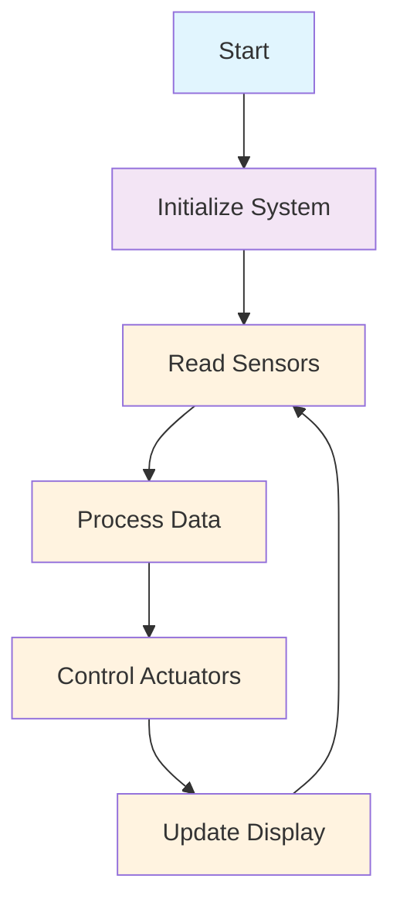

**Timeline Diagram:**
```
Time:  0ms    50ms   100ms  150ms  200ms  250ms
Task:  [Sensor][Process][Actuator][Display][Sensor]...
CPU:   [████████████████████████████████████████]
```

### 1.2 ข้อจำกัดของระบบ Single Task

1. **การตอบสนองล่าช้า (Poor Response Time)**
   - หากมีงานหนึ่งใช้เวลานาน งานอื่นจะต้องรอ
   - ไม่เหมาะสำหรับงานที่ต้องการตอบสนองเร็ว

2. **ไม่มีความยืดหยุ่น**
   - ไม่สามารถปรับเปลี่ยนลำดับความสำคัญของงานได้
   - ยากต่อการเพิ่มหรือลดงาน

3. **การใช้ทรัพยากรไม่เต็มประสิทธิภาพ**
   - CPU อาจว่างระหว่างรอข้อมูลจาก peripheral

---

## 2. การพัฒนาสู่ Time-Sharing Systems

### 2.1 แนวคิดการแบ่งเวลา

เมื่อความซับซ้อนของระบบเพิ่มขึ้น นักพัฒนาเริ่มใช้เทคนิค **Time-sharing** หรือการแบ่งเวลาให้แต่ละงาน

```c
// ตัวอย่าง Simple Time Slicing
int main() {
    initialize_system();
    unsigned int task_counter = 0;
    
    while(1) {
        switch(task_counter % 4) {
            case 0: read_sensors(); break;
            case 1: process_data(); break;
            case 2: control_actuators(); break;
            case 3: update_display(); break;
        }
        task_counter++;
        delay(10); // Time slice = 10ms
    }
}
```

#### ไดอะแกรม Time-Sharing System

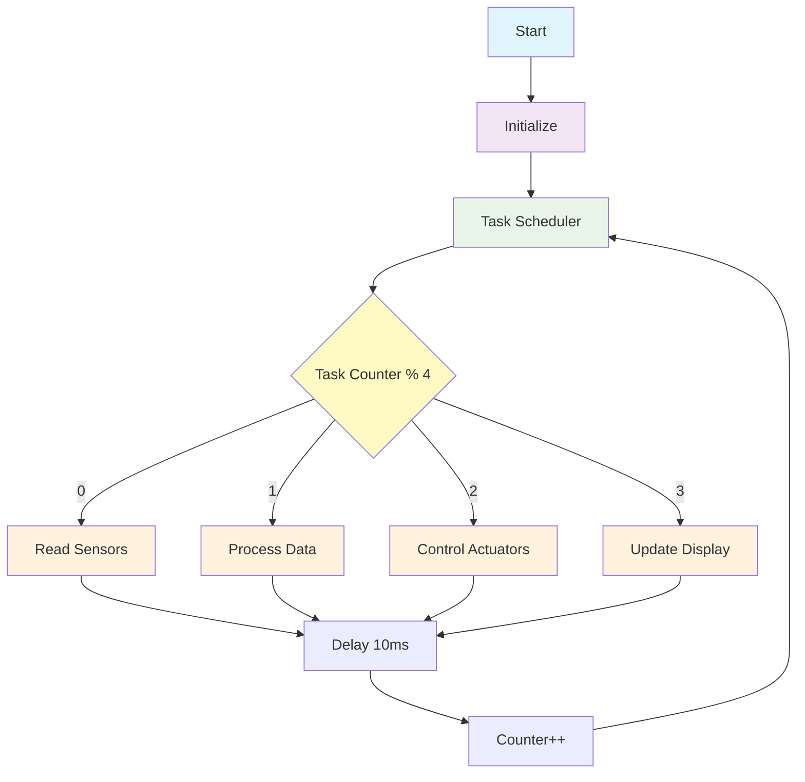

**Timeline Diagram:**
```
Time:    0    10    20    30    40    50    60    70    80ms
Task A:  [██]        [██]        [██]        [██]
Task B:       [██]        [██]        [██]        [██]
Task C:            [██]        [██]        [██]
Task D:                 [██]        [██]        [██]
CPU:     [████████████████████████████████████████]
```

### 2.2 ปัญหาที่เกิดขึ้นจากการแบ่งเวลา

1. **ความซับซ้อนในการจัดการเวลา**
   - ยากต่อการกำหนด time slice ที่เหมาะสม
   - งานบางอย่างอาจต้องการเวลามากกว่างานอื่น

2. **การสูญเสียข้อมูล (Data Loss)**
   - หากงานไม่เสร็จสิ้นใน time slice ที่กำหนด
   - ข้อมูลอาจเสียหายหรือสูญหาย

3. **ความซับซ้อนในการ Debug**
   - ยากต่อการติดตามปัญหาเมื่อมีงานหลายอย่างทำงานสลับกัน

---

## 3. ผลกระทบและข้อจำกัดของระบบแบ่งเวลา

### 3.1 ผลกระทบเชิงลบ

1. **Context Switching Overhead**
   ```c
   // เวลาที่สูญเสียในการเปลี่ยนงาน
   save_current_context();    // 50-100 CPU cycles
   load_next_context();       // 50-100 CPU cycles
   // เวลาที่สูญเสีย = 5-10% ของ CPU time
   ```

#### ไดอะแกรม Context Switching

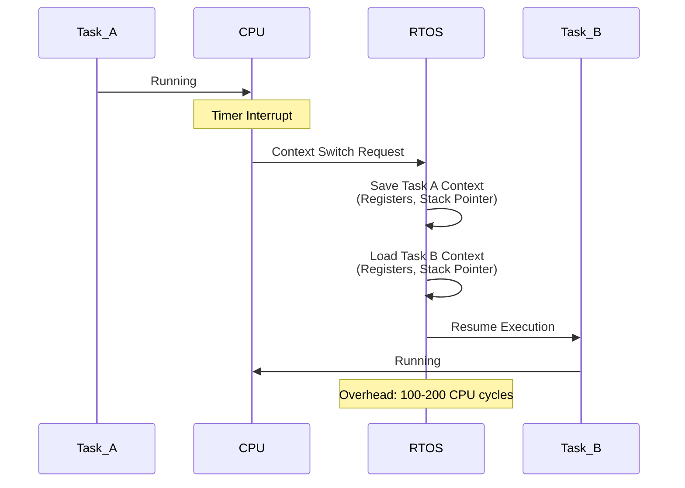

**Context Switching Timeline:**
```
Time:      0    5    10   15   20   25   30   35ms
Task A:    [████]     [████]     [████]
Context:        [░░]      [░░]      [░░]  ← Overhead
Task B:           [████]     [████]     [████]
CPU:       [████████████████████████████████]
           ^    ^ ^  ^    ^ ^  ^    ^
           |    | |  |    | |  |    |
           Run  |S|  Run  |S|  Run  Context
                |a|       |a|       Switch
                |v|       |v|       Overhead
                |e|       |e|
```

2. **Priority Inversion**
   - งานสำคัญอาจถูกหน่วงเวลาโดยงานที่สำคัญน้อยกว่า

3. **Resource Contention**
   - การแย่งชิงทรัพยากรระหว่างงานต่างๆ

### 3.2 ข้อจำกัดในการพัฒนา

1. **ความซับซ้อนของโค้ด**
2. **การจัดการ Memory แบบ Manual**
3. **ไม่มีมาตรฐานในการพัฒนา**

---

## 4. ยุคของ Real-Time Operating System (RTOS)

### 4.1 การเกิดขึ้นของ RTOS

ด้วยข้อจำกัดของระบบแบ่งเวลาแบบ manual นักพัฒนาจึงสร้าง **Real-Time Operating System** เพื่อจัดการปัญหาเหล่านี้

### 4.2 คุณสมบัติหลักของ RTOS

1. **Deterministic Response Time**
   - รับประกันเวลาตอบสนองที่แน่นอน

2. **Priority-based Scheduling**
   - จัดลำดับงานตามความสำคัญ

3. **Inter-task Communication**
   - ระบบสื่อสารระหว่างงานที่มีประสิทธิภาพ

4. **Memory Management**
   - จัดการหน่วยความจำอย่างมีระบบ

---

## 5. เทคนิคการทำ Multitasking

### 5.1 Cooperative Multitasking

**หลักการ:** แต่ละ task จะสละ CPU เมื่อทำงานเสร็จ

```c
// ตัวอย่าง Cooperative Multitasking
void task1() {
    while(1) {
        do_task1_work();
        task_yield(); // สละ CPU ให้ task อื่น
    }
}

void task2() {
    while(1) {
        do_task2_work();
        task_yield(); // สละ CPU ให้ task อื่น
    }
}
```

#### ไดอะแกรม Cooperative Multitasking

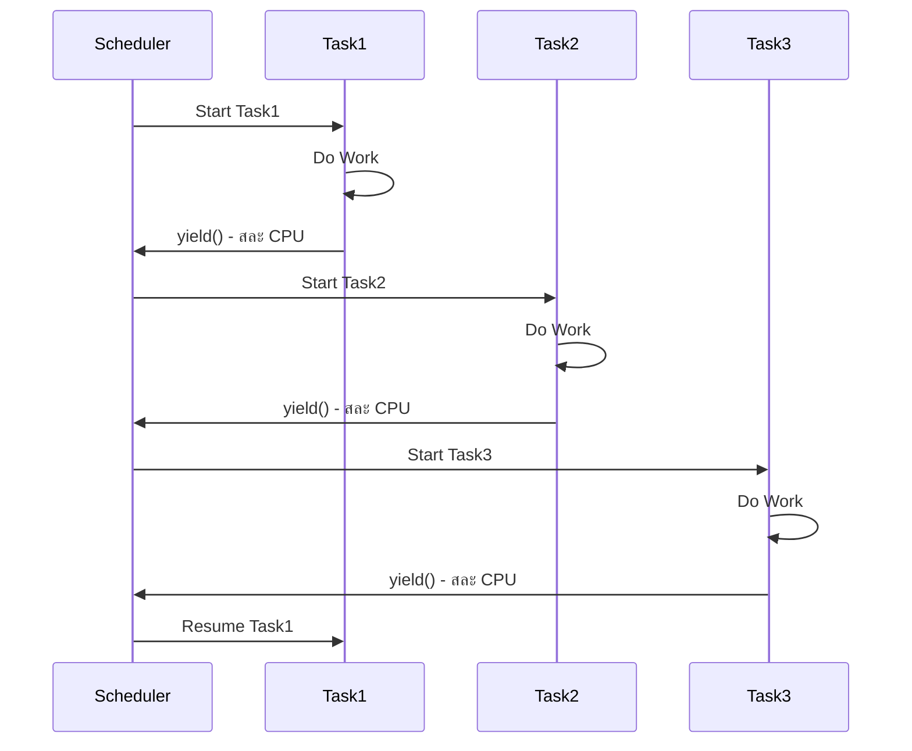

**Timeline Diagram:**
```
Time:    0    20    40    60    80    100   120   140ms
Task1:   [████████]         [████████]         [████████]
Task2:            [███████]          [███████]
Task3:                    [██████]            [██████]
CPU:     [████████████████████████████████████████████]
         ^        ^       ^        ^       ^
         yield    yield   yield    yield   yield
```

**ข้อดี:**
- ใช้ทรัพยากรน้อย
- ไม่มี context switching overhead มาก
- เหมาะสำหรับระบบที่มีทรัพยากรจำกัด

**ข้อเสีย:**
- task ที่มี bug อาจทำให้ระบบทั้งหมดหยุดทำงาน
- ไม่เหมาะสำหรับงาน real-time ที่เข้มงวด
- ขึ้นอยู่กับความร่วมมือของแต่ละ task

### 5.2 Preemptive Multitasking

**หลักการ:** RTOS จะบังคับเปลี่ยน task ตาม priority และ time slice

```c
// ตัวอย่าง Preemptive Multitasking ใน FreeRTOS
void high_priority_task(void *pvParameters) {
    while(1) {
        handle_emergency();
        vTaskDelay(pdMS_TO_TICKS(100)); // Sleep 100ms
    }
}

void low_priority_task(void *pvParameters) {
    while(1) {
        background_processing();
        vTaskDelay(pdMS_TO_TICKS(1000)); // Sleep 1s
    }
}
```

#### ไดอะแกรม Preemptive Multitasking

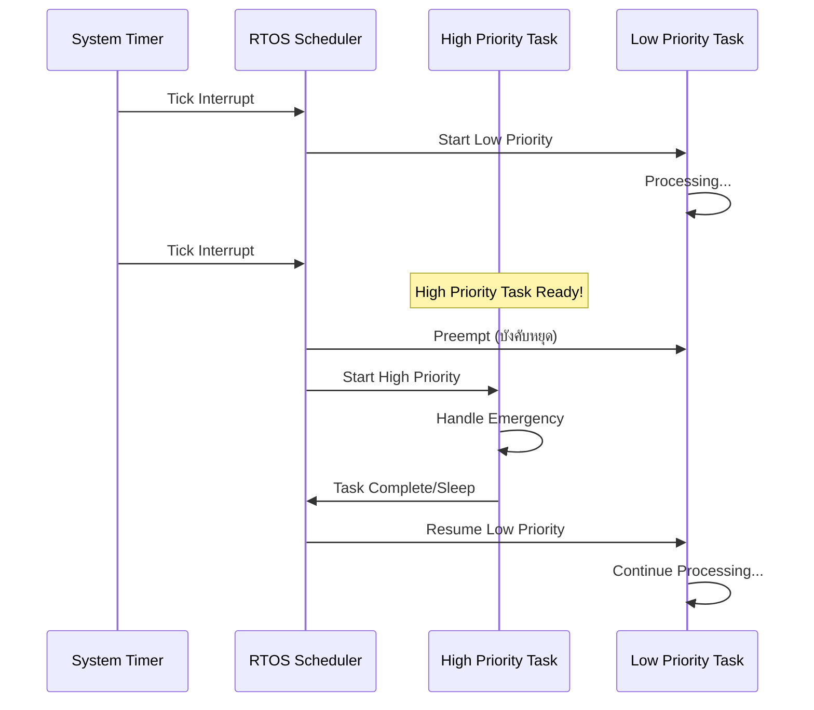

**Timeline Diagram:**
```
Time:      0    10    20    30    40    50    60    70ms
High Pri:        [██████]     [██████]     [██████]
Low Pri:   [████]      [███]       [███]       [███]
CPU:       [████████████████████████████████████████]
           ^    ^      ^   ^       ^   ^       ^
           |    |      |   |       |   |       |
        Start Preempt Resume|    Preempt|    Resume
                           Resume    Resume
```

**Priority Inversion Example:**
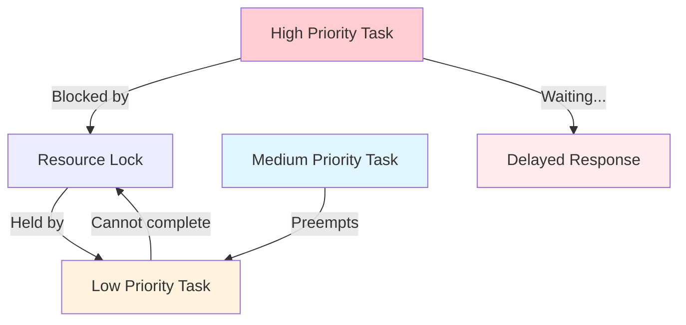

**ข้อดี:**
- รับประกันเวลาตอบสนอง
- task หนึ่งไม่สามารถครอบครอง CPU ได้ตลอด
- เหมาะสำหรับ real-time systems

**ข้อเสีย:**
- ใช้ทรัพยากรมากกว่า
- ความซับซ้อนในการ debug
- Context switching overhead

### 5.3 Round-Robin Scheduling

**หลักการ:** แต่ละ task ได้รับ time slice เท่ากัน

```c
// การกำหนด time slice ใน FreeRTOS
#define configTICK_RATE_HZ 1000        // 1ms tick
#define configTIME_SLICE_MS 10         // 10ms per task

// Task จะถูกสลับทุก 10ms
```

#### ไดอะแกรม Round-Robin Scheduling

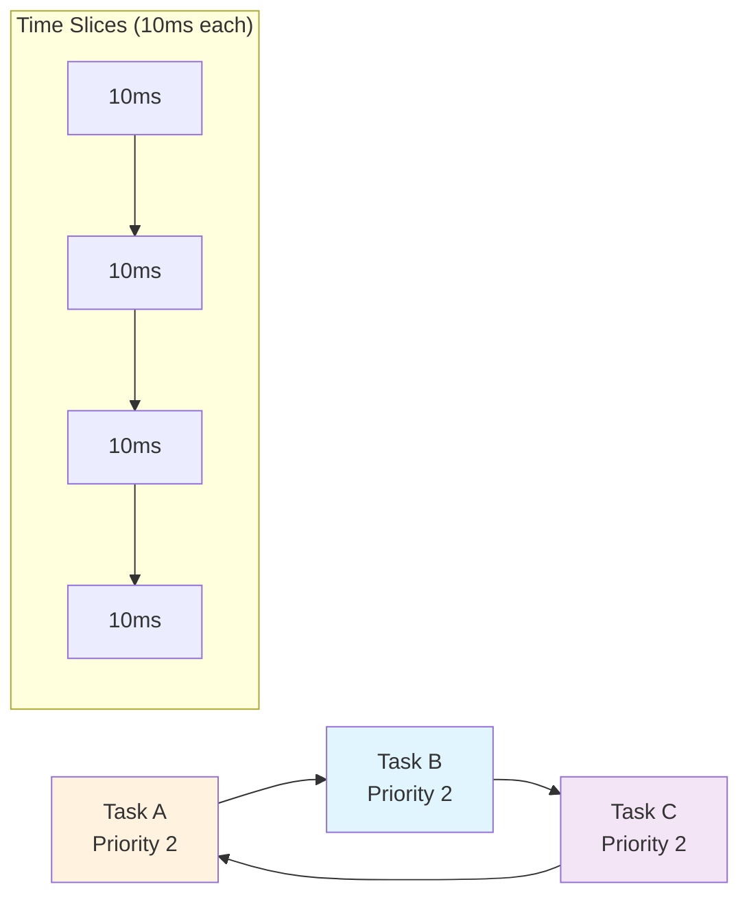

**Timeline Diagram:**
```
Time:    0    10    20    30    40    50    60    70    80ms
Task A:  [████]          [████]          [████]
Task B:       [████]          [████]          [████]
Task C:            [████]          [████]          [████]
CPU:     [████████████████████████████████████████████]
         ^    ^    ^    ^    ^    ^    ^    ^    ^
         |    |    |    |    |    |    |    |    |
      Switch every 10ms (Time Slice)
```

**Round-Robin Queue:**
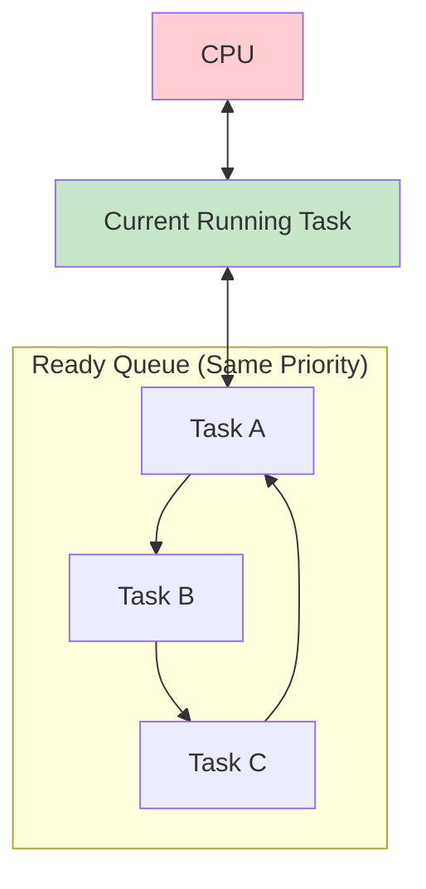

**ข้อดี:**
- ความยุติธรรมในการใช้ CPU
- เหมาะสำหรับ task ที่มีความสำคัญเท่ากัน

**ข้อเสีย:**
- ไม่เหมาะสำหรับ task ที่มี priority ต่างกัน
- อาจไม่ตอบสนองความต้องการ real-time

### 5.4 Priority-based Scheduling

**หลักการ:** Task ที่มี priority สูงกว่าจะทำงานก่อน

```c
// การสร้าง task ด้วย priority ต่างกัน
xTaskCreate(emergency_handler, "Emergency", 1024, NULL, 5, NULL);  // สูงสุด
xTaskCreate(data_logger, "Logger", 1024, NULL, 3, NULL);           // กลาง  
xTaskCreate(led_blink, "LED", 512, NULL, 1, NULL);                 // ต่ำสุด
```

#### ไดอะแกรม Priority-based Scheduling

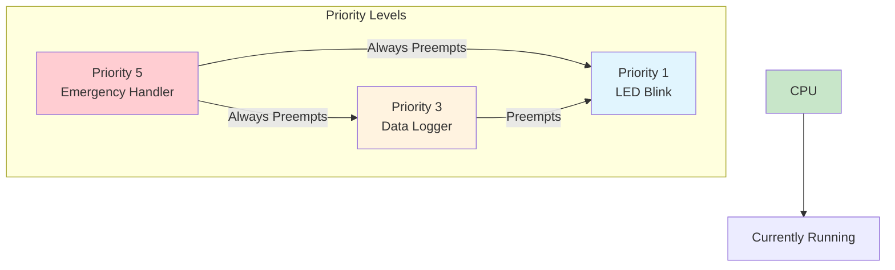

**Timeline with Priority Interruption:**
```
Time:     0    10    20    30    40    50    60    70ms
Priority 5:         [███]    [███]         [███]
Priority 3:    [██]     [██]     [███]  [██]
Priority 1:[██]                              [███]
CPU:      [████████████████████████████████████████]
          ^  ^     ^   ^    ^   ^     ^  ^   ^
          |  |     |   |    |   |     |  |   |
          |  P5    |   P5   |   P3    |  P5  P1
          P1 Pre-  P3  Pre- P3  Res-  P3 Pre-Resume
             empt     empt     ume      empt
```

**Priority Queue Structure:**
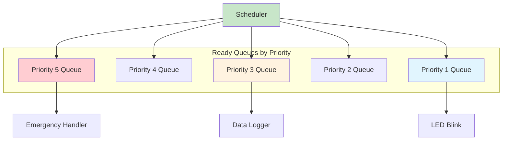

**ข้อดี:**
- เหมาะสำหรับ real-time systems
- ตอบสนองงานสำคัญได้เร็ว
- มีความยืดหยุ่นสูง

**ข้อเสีย:**
- Priority inversion
- Starvation (task priority ต่ำอาจไม่ได้ทำงาน)
- ความซับซ้อนในการออกแบบ

---

## 6. การเปรียบเทียบเทคนิคต่างๆ

| เทคนิค | Response Time | Resource Usage | Complexity | Real-time Suitability |
|---------|---------------|----------------|------------|----------------------|
| Single Task | Poor | Low | Low | Poor |
| Time Sharing | Medium | Medium | Medium | Medium |
| Cooperative | Good | Low | Medium | Medium |
| Preemptive | Excellent | High | High | Excellent |
| Round-Robin | Medium | Medium | Medium | Medium |
| Priority-based | Excellent | High | High | Excellent |

### ไดอะแกรมเปรียบเทียบการตอบสนอง

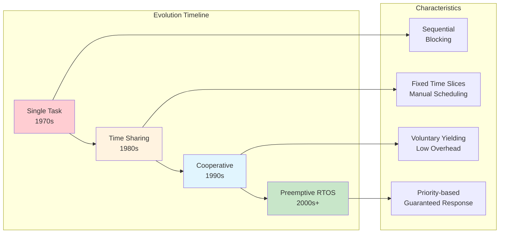

### ไดอะแกรมการใช้ทรัพยากร

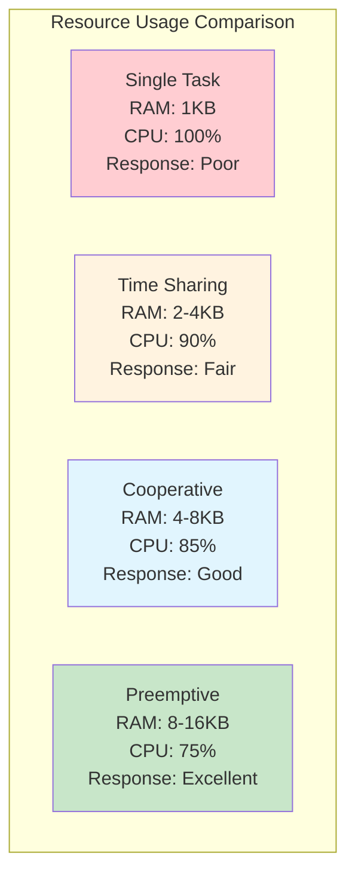

---

## 7. ข้อพิจารณาในการเลือกเทคนิค

### 7.1 สำหรับระบบ Real-time เข้มงวด
- ใช้ **Preemptive Priority-based Scheduling**
- มี RTOS ที่รับรองเวลาตอบสนอง

### 7.2 สำหรับระบบที่มีทรัพยากรจำกัด
- ใช้ **Cooperative Multitasking**
- หรือ **Simple Time Sharing**

### 7.3 สำหรับระบบที่มีความซับซ้อนปานกลาง
- ใช้ **RTOS แบบ Preemptive**
- เช่น FreeRTOS, RT-Thread

---

## 8. บทสรุป

วิวัฒนาการของ multitasking ในไมโครคอนโทรลเลอร์แสดงให้เห็นถึงการพัฒนาที่ต่อเนั่อง:

1. **Single Task** → เหมาะสำหรับงานง่ายๆ
2. **Time Sharing** → เพิ่มความสามารถแต่มีข้อจำกัด
3. **RTOS** → แก้ปัญหาและเพิ่มประสิทธิภาพ

### ไดอะแกรมสรุปวิวัฒนาการ

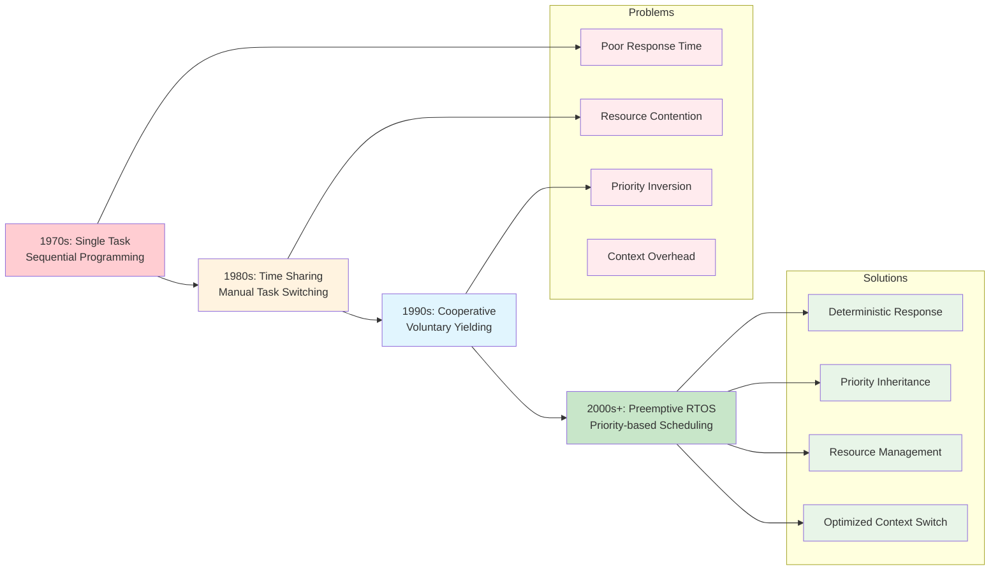

### การตัดสินใจเลือกเทคนิค

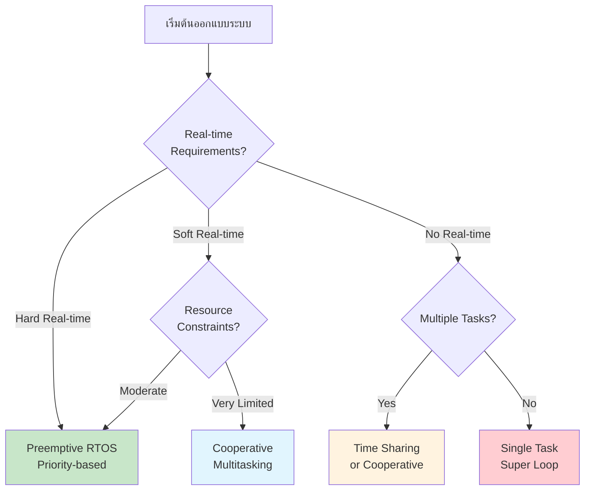

การเลือกเทคนิคที่เหมาะสมขึ้นอยู่กับ:
- **ข้อกำหนดของระบบ** (Real-time requirements)
- **ทรัพยากรที่มี** (Memory, CPU power)
- **ความซับซ้อนที่ยอมรับได้**
- **งบประมาณและเวลาในการพัฒนา**

RTOS สมัยใหม่เช่น FreeRTOS ได้นำเอาเทคนิคต่างๆ มารวมกัน ทำให้นักพัฒนาสามารถสร้างระบบที่มีประสิทธิภาพและตอบสนองความต้องการที่หลากหลายได้