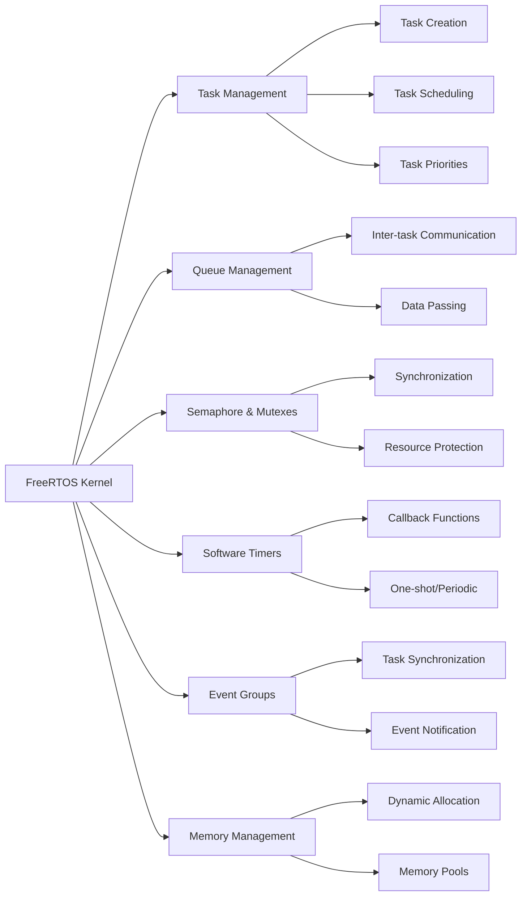
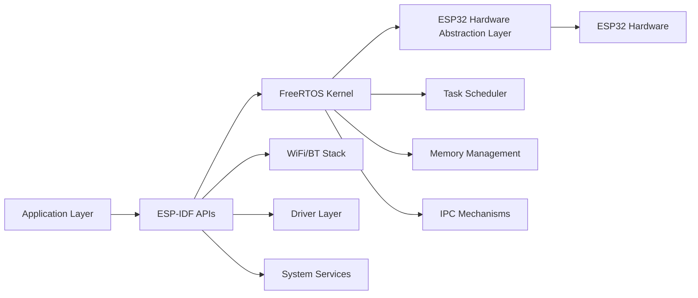
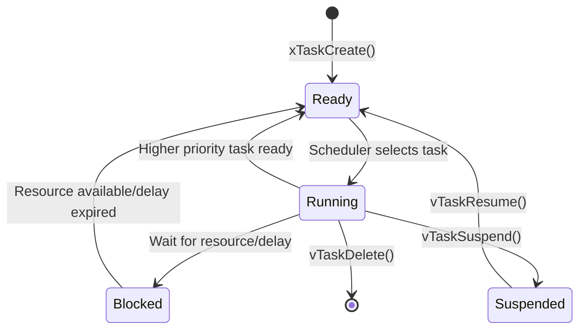
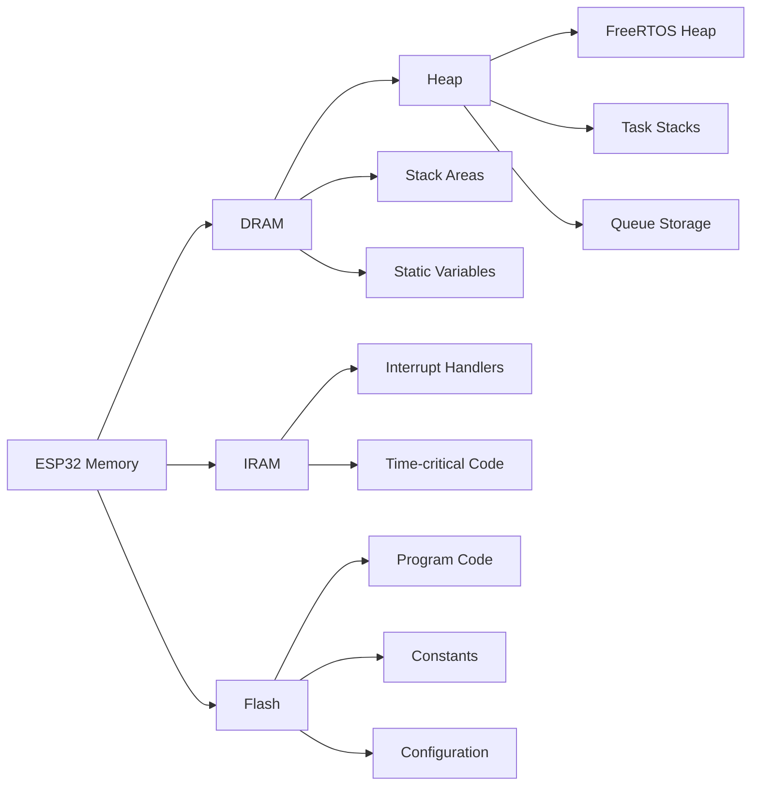

# FreeRTOS Overview - ESP-IDF Development

## Table of Contents
1. [Introduction to FreeRTOS](#introduction-to-freertos)
2. [FreeRTOS in ESP-IDF](#freertos-in-esp-idf)
3. [Development Environment Setup](#development-environment-setup)
4. [Project Structure](#project-structure)
5. [Basic idf.py Commands](#basic-idfpy-commands)
6. [FreeRTOS Architecture](#freertos-architecture)
7. [Getting Started Example](#getting-started-example)

## Introduction to FreeRTOS

FreeRTOS is a real-time operating system kernel for embedded devices that has been ported to 40+ microcontroller platforms. It is designed to be small and simple, providing the core real-time scheduling functionality, inter-task communication, timing and synchronization primitives.

### Key Features:
- **Real-time scheduling**: Preemptive, cooperative, and hybrid scheduling
- **Small footprint**: Minimal RAM and ROM usage
- **Portable**: Runs on many microcontroller architectures
- **Free and open source**: MIT license
- **Well documented**: Extensive documentation and community support

### FreeRTOS Core Components:



## FreeRTOS in ESP-IDF

ESP-IDF (Espressif IoT Development Framework) includes a customized version of FreeRTOS that is optimized for ESP32 series microcontrollers.

### ESP-IDF FreeRTOS Modifications:
- **Dual-core support**: SMP (Symmetric Multi-Processing) features
- **ESP32-specific optimizations**: Hardware-specific performance improvements
- **Additional APIs**: ESP-IDF specific extensions
- **Integration with ESP32 peripherals**: WiFi, Bluetooth, etc.

### Architecture Overview:



## Development Environment Setup

### Prerequisites:
1. **ESP-IDF Installation**: Follow official ESP-IDF installation guide
2. **VS Code**: With ESP-IDF extension (optional, we'll use terminal)
3. **Python 3.7+**: Required for ESP-IDF tools
4. **Git**: For cloning repositories

### Terminal-based Workflow:

```bash
# 1. Set up ESP-IDF environment
. $HOME/esp/esp-idf/export.sh

# 2. Create new project
idf.py create-project my_freertos_project

# 3. Navigate to project
cd my_freertos_project

# 4. Configure project
idf.py menuconfig

# 5. Build project
idf.py build

# 6. Flash to device
idf.py flash

# 7. Monitor output
idf.py monitor
```

## Project Structure

Typical ESP-IDF FreeRTOS project structure:

```
my_freertos_project/
├── CMakeLists.txt              # Main CMake file
├── sdkconfig                   # Project configuration
├── main/
│   ├── CMakeLists.txt         # Main component CMake
│   ├── main.c                 # Main application file
│   └── Kconfig.projbuild      # Project build config
├── components/                # Custom components (optional)
└── build/                     # Build output (generated)
```

## Basic idf.py Commands

### Essential Commands:

| Command | Description |
|---------|-------------|
| `idf.py create-project <name>` | Create new project |
| `idf.py build` | Build the project |
| `idf.py flash` | Flash firmware to device |
| `idf.py monitor` | Open serial monitor |
| `idf.py flash monitor` | Flash and start monitor |
| `idf.py menuconfig` | Open configuration menu |
| `idf.py clean` | Clean build files |
| `idf.py fullclean` | Full clean including config |
| `idf.py size` | Show binary size analysis |

### Configuration Commands:

```bash
# Open menuconfig GUI
idf.py menuconfig

# Set specific configuration
idf.py set-target esp32

# Save current config as default
idf.py save-defconfig
```

## FreeRTOS Architecture

### Task States:



### Memory Layout:



## Getting Started Example

### Basic FreeRTOS Task Example:

```c
#include <stdio.h>
#include "freertos/FreeRTOS.h"
#include "freertos/task.h"
#include "esp_log.h"

static const char *TAG = "FREERTOS_EXAMPLE";

// Task function prototype
void task_example(void *parameter);

void app_main(void)
{
    ESP_LOGI(TAG, "Starting FreeRTOS example");
    
    // Create a task
    xTaskCreate(
        task_example,           // Function to implement the task
        "task_example",         // Name of the task
        2048,                   // Stack size in words
        NULL,                   // Task input parameter
        5,                      // Priority of the task
        NULL                    // Task handle
    );
    
    ESP_LOGI(TAG, "Task created successfully");
}

void task_example(void *parameter)
{
    int counter = 0;
    
    while (1) {
        ESP_LOGI(TAG, "Task running, counter: %d", counter++);
        
        // Delay for 1 second
        vTaskDelay(pdMS_TO_TICKS(1000));
    }
}
```

### Build and Run:

```bash
# Create project
idf.py create-project freertos_basic_example

# Copy the code above to main/main.c

# Build
idf.py build

# Flash and monitor
idf.py flash monitor
```

## Learning Path

1. **Start Here**: Basic task creation and management
2. **Communication**: Queues for inter-task communication
3. **Synchronization**: Semaphores and mutexes
4. **Timing**: Software timers
5. **Advanced**: Event groups and notifications
6. **Memory**: Memory management strategies
7. **ESP32 Specific**: Dual-core and ESP-IDF integration

## Next Steps

Continue with the following modules:
- [02-tasks-and-scheduling.md](02-tasks-and-scheduling.md) - Task management and scheduling
- [03-queues.md](03-queues.md) - Inter-task communication
- [04-semaphores.md](04-semaphores.md) - Synchronization mechanisms
- [05-timers.md](05-timers.md) - Software timers
- [06-event-groups.md](06-event-groups.md) - Event synchronization
- [07-memory-management.md](07-memory-management.md) - Memory management
- [08-esp-idf-specific.md](08-esp-idf-specific.md) - ESP32 specific features

## Exercise

### Basic Setup Exercise:
1. Set up ESP-IDF development environment
2. Create a new project using `idf.py create-project`
3. Implement the basic task example above
4. Build, flash, and monitor the output
5. Modify the task to blink an LED instead of logging

### Expected Output:
```
I (xxx) FREERTOS_EXAMPLE: Starting FreeRTOS example
I (xxx) FREERTOS_EXAMPLE: Task created successfully
I (xxx) FREERTOS_EXAMPLE: Task running, counter: 0
I (xxx) FREERTOS_EXAMPLE: Task running, counter: 1
I (xxx) FREERTOS_EXAMPLE: Task running, counter: 2
...
```

---
**Note**: This is the foundation module. Make sure to understand these concepts before proceeding to advanced topics.