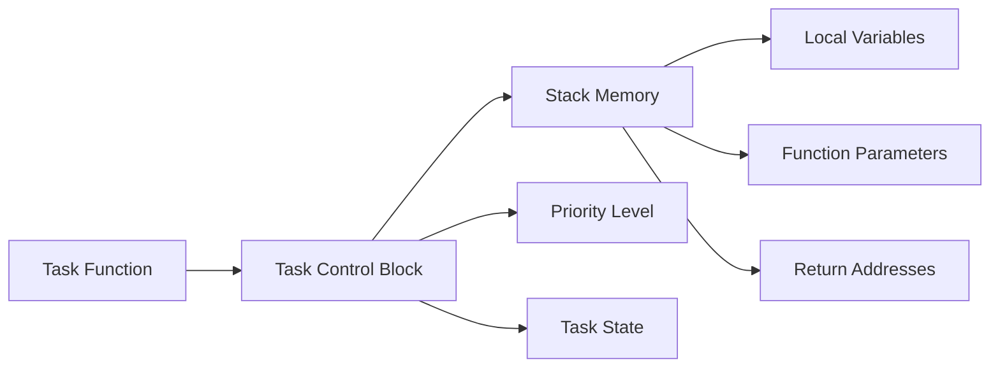
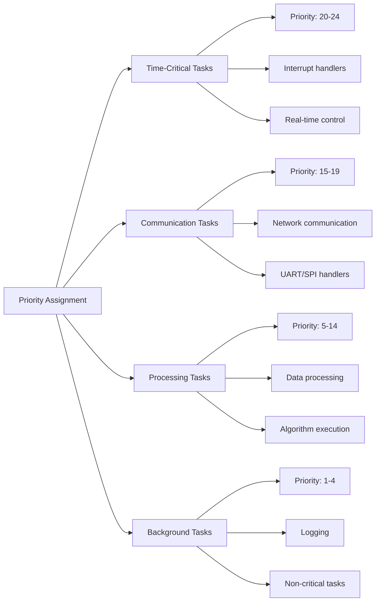
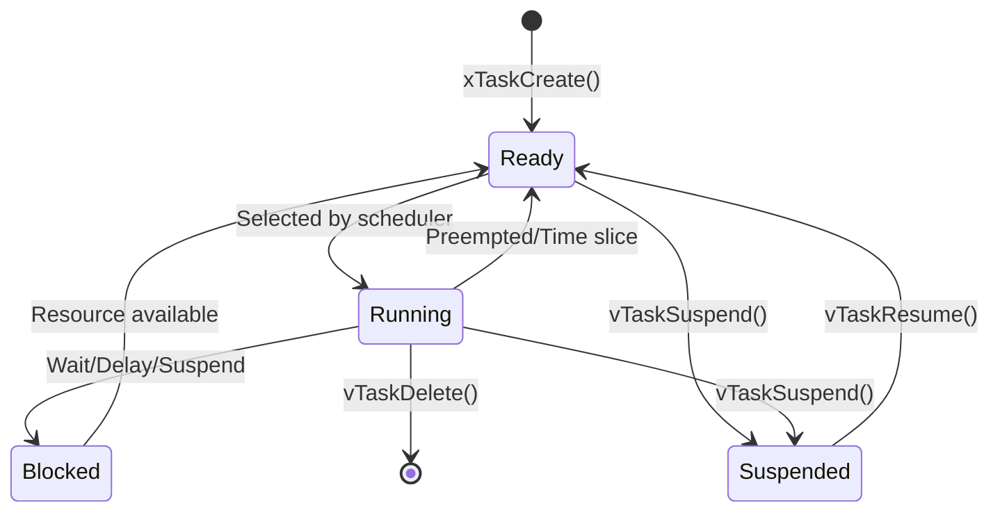
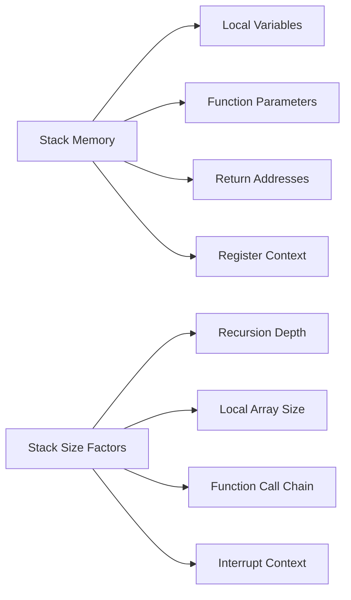

# FreeRTOS Tasks and Scheduling

## Table of Contents
1. [Task Fundamentals](#task-fundamentals)
2. [Task Creation and Management](#task-creation-and-management)
3. [Task Priorities](#task-priorities)
4. [Scheduling Algorithms](#scheduling-algorithms)
5. [Task States and Transitions](#task-states-and-transitions)
6. [Stack Management](#stack-management)
7. [Practical Examples](#practical-examples)
8. [Exercises](#exercises)

## Task Fundamentals

In FreeRTOS, a **task** is a small program that can be executed independently. Tasks are the fundamental unit of execution and can be thought of as lightweight threads.

### Key Concepts:
- **Task Function**: C function that implements the task logic
- **Task Control Block (TCB)**: Data structure containing task information
- **Stack**: Memory area for task's local variables and function calls
- **Priority**: Determines task execution order
- **State**: Current status of the task (Running, Ready, Blocked, Suspended)

### Task Anatomy:



## Task Creation and Management

### Core Task APIs:

| Function | Description |
|----------|-------------|
| `xTaskCreate()` | Create a new task with dynamic allocation |
| `xTaskCreateStatic()` | Create task with static allocation |
| `vTaskDelete()` | Delete a task |
| `vTaskSuspend()` | Suspend a task |
| `vTaskResume()` | Resume a suspended task |
| `vTaskDelay()` | Delay task for specified time |
| `vTaskDelayUntil()` | Delay task until specific time |

### Task Creation Example:

```c
#include "freertos/FreeRTOS.h"
#include "freertos/task.h"
#include "esp_log.h"

static const char *TAG = "TASK_EXAMPLE";

// Task handles for management
TaskHandle_t task1_handle = NULL;
TaskHandle_t task2_handle = NULL;

void task1_function(void *parameter)
{
    int counter = 0;
    
    while (1) {
        ESP_LOGI(TAG, "Task 1 running: %d", counter++);
        vTaskDelay(pdMS_TO_TICKS(1000)); // 1 second delay
    }
}

void task2_function(void *parameter)
{
    char *message = (char *)parameter;
    
    while (1) {
        ESP_LOGI(TAG, "Task 2: %s", message);
        vTaskDelay(pdMS_TO_TICKS(2000)); // 2 second delay
    }
}

void app_main(void)
{
    // Create Task 1
    BaseType_t result1 = xTaskCreate(
        task1_function,     // Task function
        "Task1",           // Task name
        2048,              // Stack size (bytes)
        NULL,              // Parameter
        5,                 // Priority
        &task1_handle      // Task handle
    );
    
    // Create Task 2 with parameter
    char *message = "Hello from Task 2";
    BaseType_t result2 = xTaskCreate(
        task2_function,     // Task function  
        "Task2",           // Task name
        2048,              // Stack size
        message,           // Parameter (passed to task)
        3,                 // Priority (lower than Task 1)
        &task2_handle      // Task handle
    );
    
    // Check if tasks were created successfully
    if (result1 == pdPASS && result2 == pdPASS) {
        ESP_LOGI(TAG, "Both tasks created successfully");
    } else {
        ESP_LOGE(TAG, "Failed to create tasks");
    }
}
```

## Task Priorities

FreeRTOS uses a priority-based preemptive scheduler. Higher priority tasks preempt lower priority tasks.

### Priority Levels:
- **Priority 0**: Lowest priority (Idle task)
- **Priority 1-24**: User configurable (ESP-IDF default max is 25)
- **Higher number = Higher priority**

### Priority Assignment Strategy:



### Priority Example:

```c
void app_main(void)
{
    // High priority - time critical
    xTaskCreate(sensor_task, "Sensor", 2048, NULL, 20, NULL);
    
    // Medium priority - communication
    xTaskCreate(wifi_task, "WiFi", 4096, NULL, 15, NULL);
    
    // Low priority - processing
    xTaskCreate(data_process_task, "DataProc", 3072, NULL, 5, NULL);
    
    // Background priority
    xTaskCreate(logging_task, "Logger", 2048, NULL, 2, NULL);
}
```

## Scheduling Algorithms

### Preemptive Scheduling:
- Higher priority tasks immediately preempt lower priority tasks
- Tasks of equal priority share CPU time (time slicing)
- Scheduler runs in tick interrupt

### Scheduling Behavior:

```mermaid
gantt
    title Task Scheduling Timeline
    dateFormat X
    axisFormat %s
    
    section High Priority Task
    Running    :active, h1, 0, 2
    Blocked    :h2, 2, 4
    Running    :active, h3, 4, 6
    
    section Medium Priority Task  
    Ready      :m1, 0, 2
    Running    :active, m2, 2, 4
    Ready      :m3, 4, 6
    
    section Low Priority Task
    Ready      :l1, 0, 6
```



### Time Slicing Configuration:

```c
// In menuconfig or sdkconfig
CONFIG_FREERTOS_HZ=1000                    // Tick rate (1ms per tick)
CONFIG_FREERTOS_TIME_SLICING=y             // Enable time slicing
CONFIG_FREERTOS_TASK_MAX_PRIORITIES=25     // Maximum priorities
```

## Task States and Transitions

### Four Main States:



### State Descriptions:

| State | Description |
|-------|-------------|
| **Running** | Currently executing on CPU |
| **Ready** | Ready to run, waiting for CPU |
| **Blocked** | Waiting for resource or time delay |
| **Suspended** | Explicitly suspended, not scheduled |

### State Management Example:

```c
void task_management_example(void *parameter)
{
    TaskHandle_t other_task_handle = (TaskHandle_t)parameter;
    
    while (1) {
        ESP_LOGI(TAG, "Managing other task...");
        
        // Suspend the other task
        vTaskSuspend(other_task_handle);
        ESP_LOGI(TAG, "Other task suspended");
        
        vTaskDelay(pdMS_TO_TICKS(3000));
        
        // Resume the other task
        vTaskResume(other_task_handle);
        ESP_LOGI(TAG, "Other task resumed");
        
        vTaskDelay(pdMS_TO_TICKS(5000));
    }
}
```

## Stack Management

Each task has its own stack for local variables and function calls.

### Stack Size Considerations:



### Stack Size Guidelines:

| Task Type | Typical Stack Size |
|-----------|-------------------|
| Simple tasks | 1024-2048 bytes |
| Communication tasks | 2048-4096 bytes |
| Complex processing | 4096-8192 bytes |
| Tasks with large arrays | 8192+ bytes |

### Stack Monitoring:

```c
void stack_monitor_task(void *parameter)
{
    while (1) {
        // Get remaining stack space
        UBaseType_t stack_remaining = uxTaskGetStackHighWaterMark(NULL);
        ESP_LOGI(TAG, "Stack remaining: %d bytes", stack_remaining * sizeof(StackType_t));
        
        // Check if stack is getting low
        if (stack_remaining < 200) {
            ESP_LOGW(TAG, "Stack running low!");
        }
        
        vTaskDelay(pdMS_TO_TICKS(10000));
    }
}
```

## Practical Examples

### Multi-Task LED Controller:

```c
#include "driver/gpio.h"

#define LED1_GPIO 2
#define LED2_GPIO 4
#define LED3_GPIO 5

void led_task_1(void *parameter)
{
    gpio_set_direction(LED1_GPIO, GPIO_MODE_OUTPUT);
    
    while (1) {
        gpio_set_level(LED1_GPIO, 1);
        vTaskDelay(pdMS_TO_TICKS(500));
        gpio_set_level(LED1_GPIO, 0);
        vTaskDelay(pdMS_TO_TICKS(500));
    }
}

void led_task_2(void *parameter)
{
    gpio_set_direction(LED2_GPIO, GPIO_MODE_OUTPUT);
    
    while (1) {
        gpio_set_level(LED2_GPIO, 1);
        vTaskDelay(pdMS_TO_TICKS(1000));
        gpio_set_level(LED2_GPIO, 0);
        vTaskDelay(pdMS_TO_TICKS(1000));
    }
}

void led_task_3(void *parameter)
{
    gpio_set_direction(LED3_GPIO, GPIO_MODE_OUTPUT);
    
    while (1) {
        for (int i = 0; i < 3; i++) {
            gpio_set_level(LED3_GPIO, 1);
            vTaskDelay(pdMS_TO_TICKS(200));
            gpio_set_level(LED3_GPIO, 0);
            vTaskDelay(pdMS_TO_TICKS(200));
        }
        vTaskDelay(pdMS_TO_TICKS(2000));
    }
}

void app_main(void)
{
    xTaskCreate(led_task_1, "LED1", 1024, NULL, 5, NULL);
    xTaskCreate(led_task_2, "LED2", 1024, NULL, 5, NULL);
    xTaskCreate(led_task_3, "LED3", 1024, NULL, 5, NULL);
}
```

### Task Communication Example:

```c
typedef struct {
    int sensor_id;
    float temperature;
    uint32_t timestamp;
} sensor_data_t;

void sensor_read_task(void *parameter)
{
    sensor_data_t data;
    
    while (1) {
        // Simulate sensor reading
        data.sensor_id = 1;
        data.temperature = 25.0 + (rand() % 100) / 10.0; // 25.0 to 35.0
        data.timestamp = xTaskGetTickCount();
        
        ESP_LOGI(TAG, "Sensor %d: %.1f°C at tick %d", 
                 data.sensor_id, data.temperature, data.timestamp);
        
        vTaskDelay(pdMS_TO_TICKS(2000));
    }
}

void data_process_task(void *parameter)
{
    static float temperature_sum = 0;
    static int sample_count = 0;
    
    while (1) {
        // This task would receive data through queues (covered in next module)
        ESP_LOGI(TAG, "Processing data... Average temp: %.1f°C", 
                 temperature_sum / (sample_count + 1));
        
        vTaskDelay(pdMS_TO_TICKS(5000));
    }
}
```

## Exercises

### Exercise 1: Basic Multi-Task System

**Objective**: Create a system with three tasks of different priorities.

**Requirements**:
1. **Task A (Priority 5)**: Print "Task A" every 1 second
2. **Task B (Priority 3)**: Print "Task B" every 2 seconds  
3. **Task C (Priority 1)**: Print "Task C" every 3 seconds

**Expected Behavior**: Task A should have the highest priority and preempt others.

```bash
# Create project
idf.py create-project task_priority_example

# Build and test
idf.py build flash monitor
```

### Exercise 2: Task Suspension and Resumption

**Objective**: Implement task management with suspension/resumption.

**Requirements**:
1. Create two worker tasks
2. Create a manager task that suspends/resumes workers
3. Manager suspends Task 1 for 5 seconds, then resumes it
4. Manager suspends Task 2 for 3 seconds, then resumes it
5. Cycle repeats every 10 seconds

### Exercise 3: Stack Monitoring

**Objective**: Monitor stack usage of tasks.

**Requirements**:
1. Create tasks with different stack sizes
2. Implement a monitoring task that checks stack usage
3. Log warnings when stack usage exceeds 80%
4. Test with recursive functions to see stack growth

### Exercise 4: Parameter Passing

**Objective**: Pass different parameters to multiple instances of the same task.

**Requirements**:
1. Create a generic LED blink task function
2. Create 3 instances with different parameters:
   - LED 1: Blink every 500ms
   - LED 2: Blink every 1000ms  
   - LED 3: Blink every 1500ms

### Build and Test Commands:

```bash
# For each exercise:

# 1. Create project
idf.py create-project exercise_name

# 2. Navigate to project
cd exercise_name

# 3. Edit main/main.c with exercise code

# 4. Build
idf.py build

# 5. Flash and monitor
idf.py flash monitor

# 6. To stop monitoring: Ctrl+]

# 7. Clean build if needed
idf.py clean
```

### Expected Outputs:

**Exercise 1 Output**:
```
I (1000) TASK_EXAMPLE: Task A
I (2000) TASK_EXAMPLE: Task A
I (2000) TASK_EXAMPLE: Task B
I (3000) TASK_EXAMPLE: Task A
I (3000) TASK_EXAMPLE: Task C
I (4000) TASK_EXAMPLE: Task A
I (4000) TASK_EXAMPLE: Task B
```

**Exercise 2 Output**:
```
I (1000) MANAGER: Suspending Task 1
I (2000) WORKER: Task 2 running
I (6000) MANAGER: Resuming Task 1
I (6000) WORKER: Task 1 running
I (9000) MANAGER: Suspending Task 2
```

## Advanced Topics Preview

The concepts covered here form the foundation for:
- **Inter-task Communication**: Queues and message passing
- **Synchronization**: Semaphores and mutexes
- **Event Handling**: Event groups and notifications
- **Timing**: Software timers and precise timing

## Next Module

Continue to [03-queues.md](03-queues.md) to learn about inter-task communication using FreeRTOS queues.

---
**Key Takeaways**:
- Tasks are independent units of execution
- Priority-based preemptive scheduling
- Proper stack sizing is crucial
- Task states determine scheduling behavior
- Use task handles for management operations