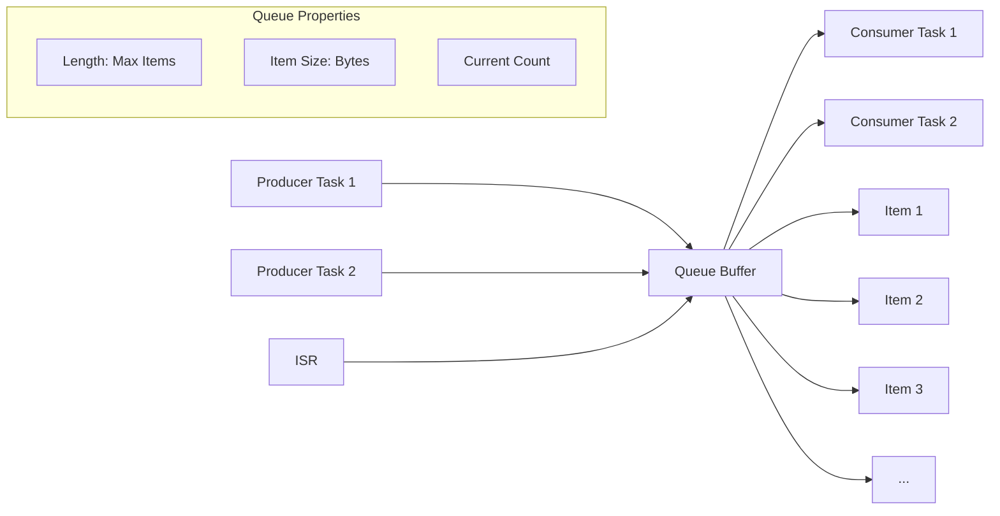
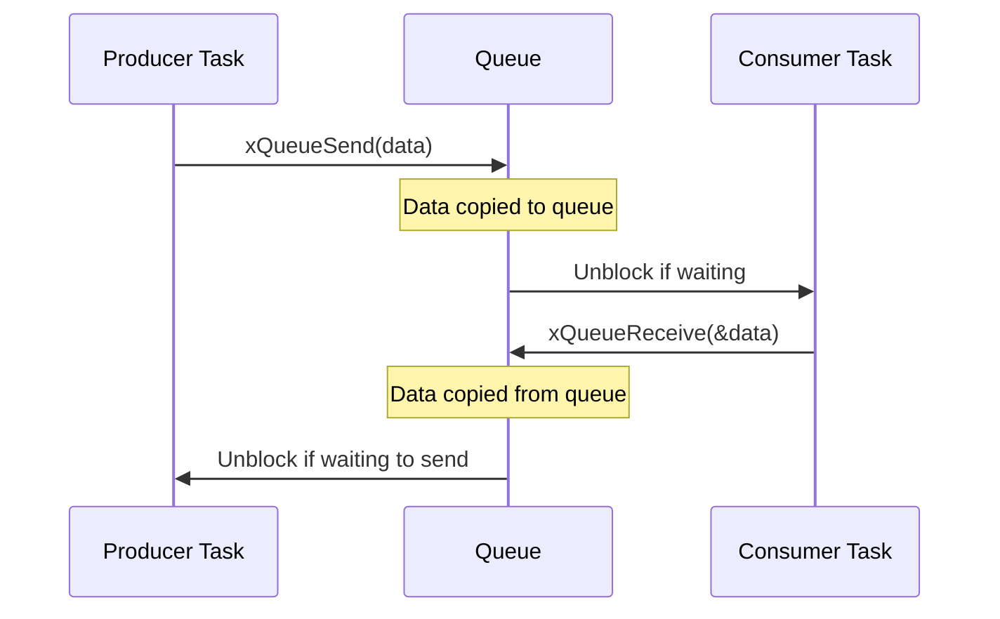
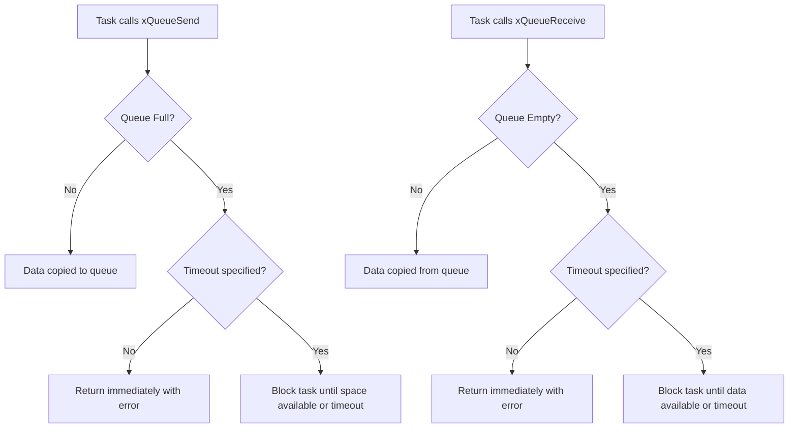

# FreeRTOS Queues - Inter-Task Communication

## Table of Contents
1. [Queue Fundamentals](#queue-fundamentals)
2. [Queue Types](#queue-types)
3. [Queue Creation and Management](#queue-creation-and-management)
4. [Sending and Receiving Data](#sending-and-receiving-data)
5. [Queue Behaviors](#queue-behaviors)
6. [Advanced Queue Features](#advanced-queue-features)
7. [Practical Examples](#practical-examples)
8. [Best Practices](#best-practices)
9. [Exercises](#exercises)

## Queue Fundamentals

**Queues** are the primary method of inter-task communication in FreeRTOS. They provide a safe way to pass data between tasks and from ISRs to tasks.

### Key Concepts:
- **FIFO Structure**: First In, First Out data structure
- **Thread-Safe**: Multiple producers and consumers
- **Blocking Operations**: Tasks can wait for data
- **Copy Semantics**: Data is copied, not referenced
- **Size Flexibility**: Configurable length and item size

### Queue Architecture:



### Benefits:
- **Decoupling**: Producers and consumers are independent
- **Buffering**: Handles different processing rates
- **Synchronization**: Built-in task synchronization
- **Safety**: No shared memory access issues

## Queue Types

### Standard Queue
- **Use Case**: General-purpose inter-task communication
- **Behavior**: FIFO order, copy semantics
- **API**: `xQueueCreate()`, `xQueueSend()`, `xQueueReceive()`

### Queue Set
- **Use Case**: Waiting on multiple queues simultaneously
- **Behavior**: Notification when any queue receives data
- **API**: `xQueueCreateSet()`, `xQueueAddToSet()`

### Mailbox (Length 1 Queue)
- **Use Case**: Simple signaling with data
- **Behavior**: Single item, overwrite semantics
- **API**: `xQueueOverwrite()`, `xQueuePeek()`

### Queue Operation Flow:



## Queue Creation and Management

### Core Queue APIs:

| Function | Description |
|----------|-------------|
| `xQueueCreate()` | Create queue with dynamic allocation |
| `xQueueCreateStatic()` | Create queue with static allocation |
| `vQueueDelete()` | Delete a queue |
| `uxQueueMessagesWaiting()` | Get number of items in queue |
| `uxQueueSpacesAvailable()` | Get available spaces in queue |

### Queue Creation Example:

```c
#include "freertos/FreeRTOS.h"
#include "freertos/task.h"
#include "freertos/queue.h"
#include "esp_log.h"

static const char *TAG = "QUEUE_EXAMPLE";

// Queue handle
QueueHandle_t data_queue;
QueueHandle_t command_queue;

// Data structures for queue communication
typedef struct {
    int sensor_id;
    float value;
    uint32_t timestamp;
} sensor_data_t;

typedef enum {
    CMD_START_SAMPLING,
    CMD_STOP_SAMPLING,
    CMD_RESET_DATA,
    CMD_GET_STATUS
} command_t;

void app_main(void)
{
    // Create data queue: 10 items of sensor_data_t
    data_queue = xQueueCreate(10, sizeof(sensor_data_t));
    if (data_queue == NULL) {
        ESP_LOGE(TAG, "Failed to create data queue");
        return;
    }
    
    // Create command queue: 5 commands
    command_queue = xQueueCreate(5, sizeof(command_t));
    if (command_queue == NULL) {
        ESP_LOGE(TAG, "Failed to create command queue");
        vQueueDelete(data_queue);
        return;
    }
    
    ESP_LOGI(TAG, "Queues created successfully");
    
    // Create tasks
    xTaskCreate(producer_task, "Producer", 2048, NULL, 5, NULL);
    xTaskCreate(consumer_task, "Consumer", 2048, NULL, 5, NULL);
    xTaskCreate(control_task, "Control", 2048, NULL, 6, NULL);
}
```

## Sending and Receiving Data

### Sending Data to Queue:

| Function | When to Use |
|----------|-------------|
| `xQueueSend()` | Send to back of queue |
| `xQueueSendToFront()` | Send to front of queue (priority) |
| `xQueueSendToBack()` | Same as xQueueSend() |
| `xQueueSendFromISR()` | Send from interrupt service routine |

### Receiving Data from Queue:

| Function | When to Use |
|----------|-------------|
| `xQueueReceive()` | Receive and remove item |
| `xQueuePeek()` | Read item without removing |
| `xQueueReceiveFromISR()` | Receive from ISR |

### Basic Send/Receive Example:

```c
void producer_task(void *parameter)
{
    sensor_data_t data;
    int counter = 0;
    
    while (1) {
        // Prepare data
        data.sensor_id = 1;
        data.value = 20.0 + (rand() % 200) / 10.0; // 20.0 to 40.0
        data.timestamp = xTaskGetTickCount();
        
        // Send to queue (wait up to 1 second if queue is full)
        if (xQueueSend(data_queue, &data, pdMS_TO_TICKS(1000)) == pdTRUE) {
            ESP_LOGI(TAG, "Sent: ID=%d, Value=%.1f, Time=%d", 
                     data.sensor_id, data.value, data.timestamp);
        } else {
            ESP_LOGW(TAG, "Failed to send data - queue full");
        }
        
        vTaskDelay(pdMS_TO_TICKS(500));
    }
}

void consumer_task(void *parameter)
{
    sensor_data_t received_data;
    
    while (1) {
        // Receive from queue (wait indefinitely)
        if (xQueueReceive(data_queue, &received_data, portMAX_DELAY) == pdTRUE) {
            ESP_LOGI(TAG, "Received: ID=%d, Value=%.1f, Time=%d", 
                     received_data.sensor_id, received_data.value, received_data.timestamp);
            
            // Process the data
            if (received_data.value > 35.0) {
                ESP_LOGW(TAG, "High temperature detected: %.1f°C", received_data.value);
            }
        }
    }
}
```

## Queue Behaviors

### Blocking Behavior:



### Timeout Options:

| Timeout Value | Behavior |
|---------------|----------|
| `0` | Non-blocking, return immediately |
| `pdMS_TO_TICKS(ms)` | Wait for specified milliseconds |
| `portMAX_DELAY` | Wait indefinitely |

### Queue State Monitoring:

```c
void queue_monitor_task(void *parameter)
{
    while (1) {
        UBaseType_t items_waiting = uxQueueMessagesWaiting(data_queue);
        UBaseType_t spaces_available = uxQueueSpacesAvailable(data_queue);
        
        ESP_LOGI(TAG, "Queue status - Items: %d, Spaces: %d", 
                 items_waiting, spaces_available);
        
        if (items_waiting == 0) {
            ESP_LOGI(TAG, "Queue is empty");
        } else if (spaces_available == 0) {
            ESP_LOGW(TAG, "Queue is full!");
        }
        
        vTaskDelay(pdMS_TO_TICKS(5000));
    }
}
```

## Advanced Queue Features

### Queue Sets

Use queue sets to wait on multiple queues simultaneously:

```c
QueueSetHandle_t queue_set;
QueueHandle_t queue1, queue2, queue3;

void setup_queue_set(void)
{
    // Create queues
    queue1 = xQueueCreate(5, sizeof(int));
    queue2 = xQueueCreate(5, sizeof(float));
    queue3 = xQueueCreate(5, sizeof(char));
    
    // Create queue set
    queue_set = xQueueCreateSet(15); // Total of all queue lengths
    
    // Add queues to set
    xQueueAddToSet(queue1, queue_set);
    xQueueAddToSet(queue2, queue_set);
    xQueueAddToSet(queue3, queue_set);
}

void queue_set_handler_task(void *parameter)
{
    QueueSetMemberHandle_t active_queue;
    
    while (1) {
        // Wait for any queue to receive data
        active_queue = xQueueSelectFromSet(queue_set, portMAX_DELAY);
        
        if (active_queue == queue1) {
            int data;
            xQueueReceive(queue1, &data, 0);
            ESP_LOGI(TAG, "Received int: %d", data);
        } else if (active_queue == queue2) {
            float data;
            xQueueReceive(queue2, &data, 0);
            ESP_LOGI(TAG, "Received float: %.2f", data);
        } else if (active_queue == queue3) {
            char data;
            xQueueReceive(queue3, &data, 0);
            ESP_LOGI(TAG, "Received char: %c", data);
        }
    }
}
```

### Mailbox Pattern:

```c
QueueHandle_t mailbox;

void setup_mailbox(void)
{
    // Create a queue with length 1 (mailbox)
    mailbox = xQueueCreate(1, sizeof(int));
}

void mailbox_sender_task(void *parameter)
{
    int message = 0;
    
    while (1) {
        message++;
        
        // Overwrite previous message if mailbox is full
        xQueueOverwrite(mailbox, &message);
        ESP_LOGI(TAG, "Mailbox updated with: %d", message);
        
        vTaskDelay(pdMS_TO_TICKS(1000));
    }
}

void mailbox_reader_task(void *parameter)
{
    int received_message;
    
    while (1) {
        // Peek at mailbox without removing message
        if (xQueuePeek(mailbox, &received_message, pdMS_TO_TICKS(2000)) == pdTRUE) {
            ESP_LOGI(TAG, "Mailbox contains: %d", received_message);
        } else {
            ESP_LOGI(TAG, "Mailbox is empty");
        }
        
        vTaskDelay(pdMS_TO_TICKS(1500));
    }
}
```

## Practical Examples

### Multi-Sensor Data Collection System:

```c
#include "freertos/FreeRTOS.h"
#include "freertos/task.h"
#include "freertos/queue.h"
#include "esp_log.h"
#include <stdlib.h>

static const char *TAG = "SENSOR_SYSTEM";

// Data structures
typedef enum {
    SENSOR_TEMPERATURE,
    SENSOR_HUMIDITY,
    SENSOR_PRESSURE,
    SENSOR_LIGHT
} sensor_type_t;

typedef struct {
    sensor_type_t type;
    float value;
    uint32_t timestamp;
    int sensor_id;
} sensor_reading_t;

typedef struct {
    float temperature_sum;
    float humidity_sum;
    float pressure_sum;
    float light_sum;
    int temperature_count;
    int humidity_count;
    int pressure_count;
    int light_count;
} sensor_statistics_t;

// Queue handles
QueueHandle_t sensor_data_queue;
QueueHandle_t statistics_queue;

void temperature_sensor_task(void *parameter)
{
    sensor_reading_t reading;
    
    while (1) {
        reading.type = SENSOR_TEMPERATURE;
        reading.sensor_id = 1;
        reading.value = 20.0 + (rand() % 300) / 10.0; // 20.0 to 50.0
        reading.timestamp = xTaskGetTickCount();
        
        xQueueSend(sensor_data_queue, &reading, pdMS_TO_TICKS(100));
        vTaskDelay(pdMS_TO_TICKS(2000));
    }
}

void humidity_sensor_task(void *parameter)
{
    sensor_reading_t reading;
    
    while (1) {
        reading.type = SENSOR_HUMIDITY;
        reading.sensor_id = 2;
        reading.value = 30.0 + (rand() % 700) / 10.0; // 30.0 to 100.0
        reading.timestamp = xTaskGetTickCount();
        
        xQueueSend(sensor_data_queue, &reading, pdMS_TO_TICKS(100));
        vTaskDelay(pdMS_TO_TICKS(1500));
    }
}

void data_processor_task(void *parameter)
{
    sensor_reading_t reading;
    static sensor_statistics_t stats = {0};
    
    while (1) {
        if (xQueueReceive(sensor_data_queue, &reading, portMAX_DELAY) == pdTRUE) {
            // Process reading based on type
            switch (reading.type) {
                case SENSOR_TEMPERATURE:
                    stats.temperature_sum += reading.value;
                    stats.temperature_count++;
                    ESP_LOGI(TAG, "Temperature: %.1f°C (Avg: %.1f)", 
                             reading.value, stats.temperature_sum / stats.temperature_count);
                    break;
                    
                case SENSOR_HUMIDITY:
                    stats.humidity_sum += reading.value;
                    stats.humidity_count++;
                    ESP_LOGI(TAG, "Humidity: %.1f%% (Avg: %.1f)", 
                             reading.value, stats.humidity_sum / stats.humidity_count);
                    break;
                    
                case SENSOR_PRESSURE:
                    stats.pressure_sum += reading.value;
                    stats.pressure_count++;
                    ESP_LOGI(TAG, "Pressure: %.1f hPa (Avg: %.1f)", 
                             reading.value, stats.pressure_sum / stats.pressure_count);
                    break;
                    
                case SENSOR_LIGHT:
                    stats.light_sum += reading.value;
                    stats.light_count++;
                    ESP_LOGI(TAG, "Light: %.1f lux (Avg: %.1f)", 
                             reading.value, stats.light_sum / stats.light_count);
                    break;
            }
            
            // Send statistics periodically
            if ((stats.temperature_count + stats.humidity_count + 
                 stats.pressure_count + stats.light_count) % 10 == 0) {
                xQueueSend(statistics_queue, &stats, 0);
            }
        }
    }
}

void statistics_task(void *parameter)
{
    sensor_statistics_t stats;
    
    while (1) {
        if (xQueueReceive(statistics_queue, &stats, portMAX_DELAY) == pdTRUE) {
            ESP_LOGI(TAG, "\n=== SENSOR STATISTICS ===");
            if (stats.temperature_count > 0) {
                ESP_LOGI(TAG, "Temperature: %.1f°C (%d samples)", 
                         stats.temperature_sum / stats.temperature_count, stats.temperature_count);
            }
            if (stats.humidity_count > 0) {
                ESP_LOGI(TAG, "Humidity: %.1f%% (%d samples)", 
                         stats.humidity_sum / stats.humidity_count, stats.humidity_count);
            }
            ESP_LOGI(TAG, "========================\n");
        }
    }
}

void app_main(void)
{
    // Create queues
    sensor_data_queue = xQueueCreate(20, sizeof(sensor_reading_t));
    statistics_queue = xQueueCreate(5, sizeof(sensor_statistics_t));
    
    if (sensor_data_queue == NULL || statistics_queue == NULL) {
        ESP_LOGE(TAG, "Failed to create queues");
        return;
    }
    
    // Create tasks
    xTaskCreate(temperature_sensor_task, "TempSensor", 2048, NULL, 5, NULL);
    xTaskCreate(humidity_sensor_task, "HumSensor", 2048, NULL, 5, NULL);
    xTaskCreate(data_processor_task, "DataProcessor", 3072, NULL, 6, NULL);
    xTaskCreate(statistics_task, "Statistics", 2048, NULL, 4, NULL);
    
    ESP_LOGI(TAG, "Sensor data collection system started");
}
```

### Command Processing System:

```c
typedef enum {
    CMD_LED_ON,
    CMD_LED_OFF,
    CMD_LED_BLINK,
    CMD_LED_PATTERN,
    CMD_SYSTEM_RESET,
    CMD_GET_STATUS
} command_type_t;

typedef struct {
    command_type_t type;
    int parameter1;
    int parameter2;
    char string_param[32];
} command_t;

QueueHandle_t command_queue;

void command_sender_task(void *parameter)
{
    command_t cmd;
    int counter = 0;
    
    while (1) {
        // Send different commands
        switch (counter % 4) {
            case 0:
                cmd.type = CMD_LED_ON;
                cmd.parameter1 = 2; // GPIO pin
                break;
            case 1:
                cmd.type = CMD_LED_BLINK;
                cmd.parameter1 = 2; // GPIO pin
                cmd.parameter2 = 500; // interval ms
                break;
            case 2:
                cmd.type = CMD_LED_PATTERN;
                cmd.parameter1 = 3; // pattern ID
                strcpy(cmd.string_param, "SOS");
                break;
            case 3:
                cmd.type = CMD_GET_STATUS;
                break;
        }
        
        if (xQueueSend(command_queue, &cmd, pdMS_TO_TICKS(500)) == pdTRUE) {
            ESP_LOGI(TAG, "Command sent: %d", cmd.type);
        } else {
            ESP_LOGW(TAG, "Command queue full");
        }
        
        counter++;
        vTaskDelay(pdMS_TO_TICKS(3000));
    }
}

void command_processor_task(void *parameter)
{
    command_t cmd;
    
    while (1) {
        if (xQueueReceive(command_queue, &cmd, portMAX_DELAY) == pdTRUE) {
            ESP_LOGI(TAG, "Processing command: %d", cmd.type);
            
            switch (cmd.type) {
                case CMD_LED_ON:
                    ESP_LOGI(TAG, "LED ON - GPIO %d", cmd.parameter1);
                    // gpio_set_level(cmd.parameter1, 1);
                    break;
                    
                case CMD_LED_OFF:
                    ESP_LOGI(TAG, "LED OFF - GPIO %d", cmd.parameter1);
                    // gpio_set_level(cmd.parameter1, 0);
                    break;
                    
                case CMD_LED_BLINK:
                    ESP_LOGI(TAG, "LED BLINK - GPIO %d, Interval %d ms", 
                             cmd.parameter1, cmd.parameter2);
                    break;
                    
                case CMD_LED_PATTERN:
                    ESP_LOGI(TAG, "LED PATTERN - Pattern %d: %s", 
                             cmd.parameter1, cmd.string_param);
                    break;
                    
                case CMD_SYSTEM_RESET:
                    ESP_LOGI(TAG, "System reset requested");
                    break;
                    
                case CMD_GET_STATUS:
                    ESP_LOGI(TAG, "Status: System running normally");
                    break;
                    
                default:
                    ESP_LOGW(TAG, "Unknown command: %d", cmd.type);
                    break;
            }
        }
    }
}
```

## Best Practices

### 1. Queue Sizing:
```c
// Consider peak load and processing differences
// Rule of thumb: 2-3x expected peak items
QueueHandle_t high_freq_queue = xQueueCreate(50, sizeof(sensor_data_t));
QueueHandle_t low_freq_queue = xQueueCreate(5, sizeof(command_t));
```

### 2. Error Handling:
```c
BaseType_t send_result = xQueueSend(queue, &data, pdMS_TO_TICKS(1000));
if (send_result != pdTRUE) {
    ESP_LOGW(TAG, "Queue send failed - queue may be full");
    // Handle error appropriately
}
```

### 3. Timeout Strategy:
```c
// Producer: Use timeout to avoid blocking indefinitely
xQueueSend(queue, &data, pdMS_TO_TICKS(100));

// Consumer: Use portMAX_DELAY for event-driven processing
xQueueReceive(queue, &data, portMAX_DELAY);
```

### 4. Queue Monitoring:
```c
void queue_health_check(QueueHandle_t queue, const char* queue_name)
{
    UBaseType_t items = uxQueueMessagesWaiting(queue);
    UBaseType_t spaces = uxQueueSpacesAvailable(queue);
    
    if (spaces == 0) {
        ESP_LOGW(TAG, "Queue %s is full!", queue_name);
    }
    
    if (items > (spaces + items) * 0.8) {  // 80% full
        ESP_LOGW(TAG, "Queue %s is getting full: %d/%d", 
                 queue_name, items, items + spaces);
    }
}
```

## Exercises

### Exercise 1: Basic Producer-Consumer

**Objective**: Implement a simple producer-consumer system.

**Requirements**:
1. Producer task generates random numbers every 500ms
2. Consumer task processes numbers and calculates running average
3. Use a queue with capacity of 10 integers
4. Log both production and consumption events

```c
// Starter code structure
QueueHandle_t number_queue;

void producer_task(void *parameter) {
    // Generate random numbers and send to queue
}

void consumer_task(void *parameter) {
    // Receive numbers and calculate average
}

void app_main(void) {
    number_queue = xQueueCreate(10, sizeof(int));
    // Create tasks
}
```

### Exercise 2: Multi-Type Message System

**Objective**: Create a system that handles different message types.

**Requirements**:
1. Define message structure with type and data
2. Create multiple producer tasks for different message types
3. Single consumer task processes all message types
4. Message types: TEXT, NUMBER, COMMAND
5. Use appropriate queue size and timeouts

### Exercise 3: Priority Message System

**Objective**: Implement a priority message system using two queues.

**Requirements**:
1. High priority queue (capacity 5)
2. Normal priority queue (capacity 15)
3. Consumer checks high priority first
4. Producer tasks send to appropriate queue based on message urgency
5. Implement queue monitoring task

### Exercise 4: Sensor Data Pipeline

**Objective**: Create a multi-stage data processing pipeline.

**Requirements**:
1. Raw sensor data queue
2. Processed data queue
3. Alert queue for threshold violations
4. Tasks: sensor_reader → data_processor → alert_handler
5. Implement data statistics and logging

### Build Instructions:

```bash
# For each exercise:

# 1. Create project
idf.py create-project queue_exercise_1

# 2. Navigate and edit
cd queue_exercise_1
# Edit main/main.c

# 3. Build and test
idf.py build flash monitor

# 4. Monitor queue behavior
# Look for queue full/empty conditions
# Verify data flow between tasks

# 5. Test edge cases
# Fill queues to capacity
# Test timeout behaviors
# Verify error handling
```

### Expected Outputs:

**Exercise 1**:
```
I (1000) PRODUCER: Generated number: 42
I (1000) CONSUMER: Received: 42, Average: 42.0
I (1500) PRODUCER: Generated number: 17
I (1500) CONSUMER: Received: 17, Average: 29.5
```

**Exercise 2**:
```
I (1000) PRODUCER_TEXT: Sent text message
I (1000) CONSUMER: Processing TEXT: "Hello World"
I (1200) PRODUCER_NUM: Sent number message
I (1200) CONSUMER: Processing NUMBER: 123
I (1400) PRODUCER_CMD: Sent command message
I (1400) CONSUMER: Processing COMMAND: RESET
```

## Debugging Tips

### 1. Queue State Inspection:
```c
void debug_queue_state(QueueHandle_t queue, const char* name)
{
    printf("Queue %s: Items=%d, Spaces=%d\n", 
           name,
           uxQueueMessagesWaiting(queue),
           uxQueueSpacesAvailable(queue));
}
```

### 2. Task Block Detection:
```c
// Add timeouts to detect blocking issues
if (xQueueReceive(queue, &data, pdMS_TO_TICKS(5000)) != pdTRUE) {
    ESP_LOGW(TAG, "Queue receive timeout - possible producer issue");
}
```

### 3. Memory Usage:
```c
// Monitor heap usage with queues
ESP_LOGI(TAG, "Free heap: %d bytes", esp_get_free_heap_size());
```

## Next Module

Continue to [04-semaphores.md](04-semaphores.md) to learn about synchronization mechanisms using semaphores and mutexes.

---
**Key Takeaways**:
- Queues provide safe inter-task communication
- FIFO ordering with copy semantics
- Blocking behavior enables task synchronization
- Proper sizing and error handling are critical
- Queue sets enable waiting on multiple queues
- Monitor queue health for system reliability