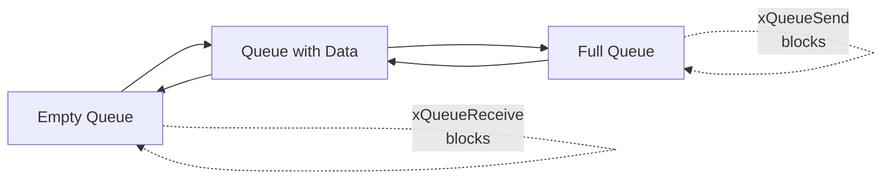

# Lab 1: Basic Queue Operations (45 นาที)

## 🎯 วัตถุประสงค์
- เข้าใจการทำงานของ Queue ในระบบ FreeRTOS
- เรียนรู้การสร้าง ส่ง และรับข้อมูลผ่าน Queue
- ฝึกใช้งาน Queue APIs พื้นฐาน
- เข้าใจการทำงานแบบ FIFO (First In, First Out)

## 📝 ความรู้เบื้องต้น
Queue เป็นโครงสร้างข้อมูลที่ทำงานแบบ FIFO ใช้สำหรับการสื่อสารระหว่าง Task หรือระหว่าง Task กับ ISR

### สถานะของ Queue


## 🛠️ การเตรียมโปรเจค

### 1. สร้างโปรเจคใหม่
```bash
idf.py create-project basic_queue
cd basic_queue
```

### 2. แก้ไข main.c

```c
#include <stdio.h>
#include <stdint.h>
#include <string.h>
#include "freertos/FreeRTOS.h"
#include "freertos/task.h"
#include "freertos/queue.h"
#include "esp_log.h"
#include "driver/gpio.h"

static const char *TAG = "QUEUE_LAB";

// LED pins
#define LED_SENDER GPIO_NUM_2
#define LED_RECEIVER GPIO_NUM_4

// Queue handle
QueueHandle_t xQueue;

// Data structure for queue messages
typedef struct {
    int id;
    char message[50];
    uint32_t timestamp;
} queue_message_t;

// Sender task
void sender_task(void *pvParameters) {
    queue_message_t message;
    int counter = 0;
    
    ESP_LOGI(TAG, "Sender task started");
    
    while (1) {
        // Prepare message
        message.id = counter++;
        snprintf(message.message, sizeof(message.message), 
                "Hello from sender #%d", message.id);
        message.timestamp = xTaskGetTickCount();
        
        // Send message to queue
        BaseType_t xStatus = xQueueSend(xQueue, &message, pdMS_TO_TICKS(1000));
        
        if (xStatus == pdPASS) {
            ESP_LOGI(TAG, "Sent: ID=%d, MSG=%s, Time=%lu", 
                    message.id, message.message, message.timestamp);
            
            // Blink sender LED
            gpio_set_level(LED_SENDER, 1);
            vTaskDelay(pdMS_TO_TICKS(100));
            gpio_set_level(LED_SENDER, 0);
        } else {
            ESP_LOGW(TAG, "Failed to send message (queue full?)");
        }
        
        vTaskDelay(pdMS_TO_TICKS(2000)); // Send every 2 seconds
    }
}

// Receiver task
void receiver_task(void *pvParameters) {
    queue_message_t received_message;
    
    ESP_LOGI(TAG, "Receiver task started");
    
    while (1) {
        // Wait for message from queue
        BaseType_t xStatus = xQueueReceive(xQueue, &received_message, 
                                          pdMS_TO_TICKS(5000));
        
        if (xStatus == pdPASS) {
            ESP_LOGI(TAG, "Received: ID=%d, MSG=%s, Time=%lu", 
                    received_message.id, received_message.message, 
                    received_message.timestamp);
            
            // Blink receiver LED
            gpio_set_level(LED_RECEIVER, 1);
            vTaskDelay(pdMS_TO_TICKS(200));
            gpio_set_level(LED_RECEIVER, 0);
            
            // Process time (simulate work)
            vTaskDelay(pdMS_TO_TICKS(1500));
        } else {
            ESP_LOGW(TAG, "No message received within timeout");
        }
    }
}

// Queue monitoring task
void queue_monitor_task(void *pvParameters) {
    UBaseType_t uxMessagesWaiting;
    UBaseType_t uxSpacesAvailable;
    
    ESP_LOGI(TAG, "Queue monitor task started");
    
    while (1) {
        uxMessagesWaiting = uxQueueMessagesWaiting(xQueue);
        uxSpacesAvailable = uxQueueSpacesAvailable(xQueue);
        
        ESP_LOGI(TAG, "Queue Status - Messages: %d, Free spaces: %d", 
                uxMessagesWaiting, uxSpacesAvailable);
        
        // Show queue fullness on console
        printf("Queue: [");
        for (int i = 0; i < 5; i++) {
            if (i < uxMessagesWaiting) {
                printf("■");
            } else {
                printf("□");
            }
        }
        printf("]\n");
        
        vTaskDelay(pdMS_TO_TICKS(3000)); // Monitor every 3 seconds
    }
}

void app_main(void) {
    ESP_LOGI(TAG, "Basic Queue Operations Lab Starting...");
    
    // Configure LED pins
    gpio_set_direction(LED_SENDER, GPIO_MODE_OUTPUT);
    gpio_set_direction(LED_RECEIVER, GPIO_MODE_OUTPUT);
    gpio_set_level(LED_SENDER, 0);
    gpio_set_level(LED_RECEIVER, 0);
    
    // Create queue (can hold 5 messages)
    xQueue = xQueueCreate(5, sizeof(queue_message_t));
    
    if (xQueue != NULL) {
        ESP_LOGI(TAG, "Queue created successfully (size: 5 messages)");
        
        // Create tasks
        xTaskCreate(sender_task, "Sender", 2048, NULL, 2, NULL);
        xTaskCreate(receiver_task, "Receiver", 2048, NULL, 1, NULL);
        xTaskCreate(queue_monitor_task, "Monitor", 2048, NULL, 1, NULL);
        
        ESP_LOGI(TAG, "All tasks created. Starting scheduler...");
    } else {
        ESP_LOGE(TAG, "Failed to create queue!");
    }
}
```

## 🧪 การทดลอง

### ทดลองที่ 1: การทำงานปกติ
1. Build และ Flash โปรแกรม
2. เปิด Serial Monitor
3. สังเกตการทำงาน:
   - Sender ส่งข้อความทุก 2 วินาที
   - Receiver รับข้อความและประมวลผล 1.5 วินาที
   - Monitor แสดงสถานะ Queue ทุก 3 วินาที

### ทดลองที่ 2: ทดสอบ Queue เต็ม
แก้ไขใน `sender_task` เพื่อส่งข้อความเร็วขึ้น:
```c
vTaskDelay(pdMS_TO_TICKS(500)); // ส่งทุก 0.5 วินาที
```

### ทดลองที่ 3: ทดสอบ Queue ว่าง
แก้ไขใน `receiver_task` เพื่อรับข้อความเร็วขึ้น:
```c
vTaskDelay(pdMS_TO_TICKS(100)); // ประมวลผลเร็วขึ้น
```

## 📊 การสังเกตและบันทึกผล

### ตารางบันทึกผล
| ทดลอง | Sender Rate | Receiver Rate | Queue Status | สังเกต |
|-------|-------------|---------------|--------------|---------|
| 1 | 2s | 1.5s | Normal | |
| 2 | 0.5s | 1.5s | Full | |
| 3 | 2s | 0.1s | Empty | |

### คำถามสำหรับการทดลอง
1. เมื่อ Queue เต็ม การเรียก `xQueueSend` จะเกิดอะไรขึ้น?
2. เมื่อ Queue ว่าง การเรียก `xQueueReceive` จะเกิดอะไรขึ้น?
3. ทำไม LED จึงกะพริบตามการส่งและรับข้อความ?

## 🔧 การปรับแต่งเพิ่มเติม

### เพิ่ม Queue Overflow Protection
```c
// ในฟังก์ชัน sender_task
if (xQueueSend(xQueue, &message, 0) != pdPASS) {
    ESP_LOGW(TAG, "Queue full! Dropping message ID=%d", message.id);
}
```

### เพิ่ม Non-blocking Receive
```c
// ในฟังก์ชัน receiver_task
if (xQueueReceive(xQueue, &received_message, 0) == pdPASS) {
    // Process immediately
} else {
    ESP_LOGI(TAG, "No message available, doing other work...");
    vTaskDelay(pdMS_TO_TICKS(1000));
}
```

## 📋 สรุปผลการทดลอง

### สิ่งที่เรียนรู้:
- [ ] การสร้างและใช้งาน Queue
- [ ] การส่งและรับข้อมูลผ่าน Queue
- [ ] การตรวจสอบสถานะ Queue
- [ ] พฤติกรรมเมื่อ Queue เต็มหรือว่าง
- [ ] การใช้ Timeout ในการส่งและรับ

### APIs ที่ใช้:
- `xQueueCreate()` - สร้าง Queue
- `xQueueSend()` - ส่งข้อมูลไป Queue
- `xQueueReceive()` - รับข้อมูลจาก Queue
- `uxQueueMessagesWaiting()` - นับข้อความใน Queue
- `uxQueueSpacesAvailable()` - นับที่ว่างใน Queue

### ข้อควรระวัง:
- ต้องตรวจสอบค่าส่งคืนของ Queue APIs เสมอ
- การตั้ง Timeout ที่เหมาะสม
- การจัดการเมื่อ Queue เต็มหรือว่าง

## 🚀 ความท้าทายเพิ่มเติม

1. **Priority Queue**: ปรับปรุงให้ข้อความมี Priority
2. **Multiple Senders**: เพิ่ม Sender หลายตัว
3. **Queue Statistics**: เพิ่มการนับ dropped messages
4. **Dynamic Queue Size**: ทดลองขนาด Queue ต่างๆ

## 📚 เอกสารอ้างอิง

- [FreeRTOS Queue Documentation](https://www.freertos.org/a00018.html)
- [ESP-IDF Queue API Reference](https://docs.espressif.com/projects/esp-idf/en/latest/esp32/api-reference/system/freertos.html#queue-api)
- [Queue Implementation Details](https://www.freertos.org/Embedded-RTOS-Queues.html)