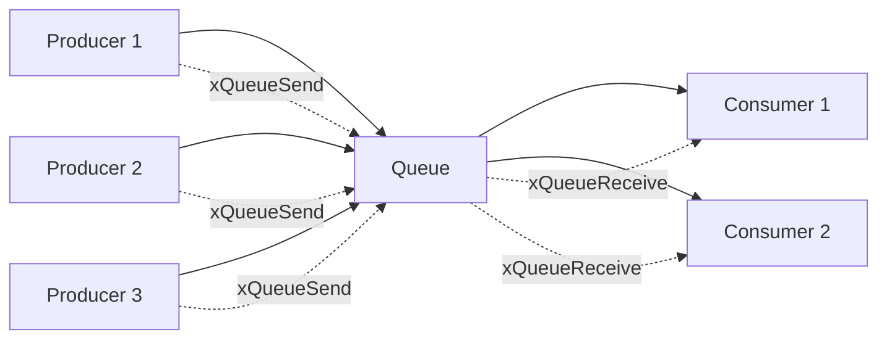

# Lab 2: Producer-Consumer System (45 นาที)

## 🎯 วัตถุประสงค์
- เข้าใจรูปแบบ Producer-Consumer Pattern
- เรียนรู้การจัดการ Multiple Producers และ Multiple Consumers
- ฝึกใช้งาน Queue ในระบบที่ซับซ้อนขึ้น
- เข้าใจปัญหา Race Condition และการป้องกัน

## 📝 ความรู้เบื้องต้น
Producer-Consumer Pattern เป็นรูปแบบการออกแบบที่ใช้ Queue เป็นตัวกลางระหว่าง:
- **Producer**: Task ที่สร้างข้อมูล
- **Consumer**: Task ที่ใช้ข้อมูล



## 🛠️ การเตรียมโปรเจค

### 1. สร้างโปรเจคใหม่
```bash
idf.py create-project producer_consumer
cd producer_consumer
```

### 2. แก้ไข main.c

```c
#include <stdio.h>
#include <stdint.h>
#include <string.h>
#include <stdlib.h>
#include "freertos/FreeRTOS.h"
#include "freertos/task.h"
#include "freertos/queue.h"
#include "freertos/semphr.h"
#include "esp_log.h"
#include "driver/gpio.h"
#include "esp_random.h"

static const char *TAG = "PROD_CONS";

// LED pins for different producers/consumers
#define LED_PRODUCER_1 GPIO_NUM_2
#define LED_PRODUCER_2 GPIO_NUM_4
#define LED_PRODUCER_3 GPIO_NUM_5
#define LED_CONSUMER_1 GPIO_NUM_18
#define LED_CONSUMER_2 GPIO_NUM_19

// Queue handle
QueueHandle_t xProductQueue;
SemaphoreHandle_t xPrintMutex; // For synchronized printing

// Statistics
typedef struct {
    uint32_t produced;
    uint32_t consumed;
    uint32_t dropped;
} stats_t;

stats_t global_stats = {0, 0, 0};

// Product data structure
typedef struct {
    int producer_id;
    int product_id;
    char product_name[30];
    uint32_t production_time;
    int processing_time_ms;
} product_t;

// Safe printing function
void safe_printf(const char* format, ...) {
    va_list args;
    va_start(args, format);
    
    if (xSemaphoreTake(xPrintMutex, pdMS_TO_TICKS(1000)) == pdTRUE) {
        vprintf(format, args);
        xSemaphoreGive(xPrintMutex);
    }
    
    va_end(args);
}

// Producer task
void producer_task(void *pvParameters) {
    int producer_id = *((int*)pvParameters);
    product_t product;
    int product_counter = 0;
    gpio_num_t led_pin;
    
    // Assign LED pin based on producer ID
    switch (producer_id) {
        case 1: led_pin = LED_PRODUCER_1; break;
        case 2: led_pin = LED_PRODUCER_2; break;
        case 3: led_pin = LED_PRODUCER_3; break;
        default: led_pin = LED_PRODUCER_1;
    }
    
    safe_printf("Producer %d started\n", producer_id);
    
    while (1) {
        // Create product
        product.producer_id = producer_id;
        product.product_id = product_counter++;
        snprintf(product.product_name, sizeof(product.product_name), 
                "Product-P%d-#%d", producer_id, product.product_id);
        product.production_time = xTaskGetTickCount();
        product.processing_time_ms = 500 + (esp_random() % 2000); // 0.5-2.5 seconds
        
        // Try to send product to queue
        BaseType_t xStatus = xQueueSend(xProductQueue, &product, pdMS_TO_TICKS(100));
        
        if (xStatus == pdPASS) {
            global_stats.produced++;
            safe_printf("✓ Producer %d: Created %s (processing: %dms)\n", 
                       producer_id, product.product_name, product.processing_time_ms);
            
            // Blink producer LED
            gpio_set_level(led_pin, 1);
            vTaskDelay(pdMS_TO_TICKS(50));
            gpio_set_level(led_pin, 0);
        } else {
            global_stats.dropped++;
            safe_printf("✗ Producer %d: Queue full! Dropped %s\n", 
                       producer_id, product.product_name);
        }
        
        // Random production rate (1-3 seconds)
        int delay = 1000 + (esp_random() % 2000);
        vTaskDelay(pdMS_TO_TICKS(delay));
    }
}

// Consumer task
void consumer_task(void *pvParameters) {
    int consumer_id = *((int*)pvParameters);
    product_t product;
    gpio_num_t led_pin;
    
    // Assign LED pin based on consumer ID
    switch (consumer_id) {
        case 1: led_pin = LED_CONSUMER_1; break;
        case 2: led_pin = LED_CONSUMER_2; break;
        default: led_pin = LED_CONSUMER_1;
    }
    
    safe_printf("Consumer %d started\n", consumer_id);
    
    while (1) {
        // Wait for product from queue
        BaseType_t xStatus = xQueueReceive(xProductQueue, &product, pdMS_TO_TICKS(5000));
        
        if (xStatus == pdPASS) {
            global_stats.consumed++;
            uint32_t queue_time = xTaskGetTickCount() - product.production_time;
            
            safe_printf("→ Consumer %d: Processing %s (queue time: %lums)\n", 
                       consumer_id, product.product_name, queue_time * portTICK_PERIOD_MS);
            
            // Turn on consumer LED during processing
            gpio_set_level(led_pin, 1);
            
            // Simulate processing time
            vTaskDelay(pdMS_TO_TICKS(product.processing_time_ms));
            
            // Turn off consumer LED
            gpio_set_level(led_pin, 0);
            
            safe_printf("✓ Consumer %d: Finished %s\n", consumer_id, product.product_name);
        } else {
            safe_printf("⏰ Consumer %d: No products to process (timeout)\n", consumer_id);
        }
    }
}

// Statistics task
void statistics_task(void *pvParameters) {
    UBaseType_t queue_items;
    
    safe_printf("Statistics task started\n");
    
    while (1) {
        queue_items = uxQueueMessagesWaiting(xProductQueue);
        
        safe_printf("\n═══ SYSTEM STATISTICS ═══\n");
        safe_printf("Products Produced: %lu\n", global_stats.produced);
        safe_printf("Products Consumed: %lu\n", global_stats.consumed);
        safe_printf("Products Dropped:  %lu\n", global_stats.dropped);
        safe_printf("Queue Backlog:     %d\n", queue_items);
        safe_printf("System Efficiency: %.1f%%\n", 
                   global_stats.produced > 0 ? 
                   (float)global_stats.consumed / global_stats.produced * 100 : 0);
        
        // Visual queue representation
        printf("Queue: [");
        for (int i = 0; i < 10; i++) {
            if (i < queue_items) {
                printf("■");
            } else {
                printf("□");
            }
        }
        printf("]\n");
        safe_printf("═══════════════════════════\n\n");
        
        vTaskDelay(pdMS_TO_TICKS(5000)); // Report every 5 seconds
    }
}

// Load balancer task (advanced feature)
void load_balancer_task(void *pvParameters) {
    const int MAX_QUEUE_SIZE = 8; // Threshold for load balancing
    
    safe_printf("Load balancer started\n");
    
    while (1) {
        UBaseType_t queue_items = uxQueueMessagesWaiting(xProductQueue);
        
        if (queue_items > MAX_QUEUE_SIZE) {
            safe_printf("⚠️  HIGH LOAD DETECTED! Queue size: %d\n", queue_items);
            safe_printf("💡 Suggestion: Add more consumers or optimize processing\n");
            
            // Flash all LEDs as warning
            gpio_set_level(LED_PRODUCER_1, 1);
            gpio_set_level(LED_PRODUCER_2, 1);
            gpio_set_level(LED_PRODUCER_3, 1);
            gpio_set_level(LED_CONSUMER_1, 1);
            gpio_set_level(LED_CONSUMER_2, 1);
            
            vTaskDelay(pdMS_TO_TICKS(200));
            
            gpio_set_level(LED_PRODUCER_1, 0);
            gpio_set_level(LED_PRODUCER_2, 0);
            gpio_set_level(LED_PRODUCER_3, 0);
            gpio_set_level(LED_CONSUMER_1, 0);
            gpio_set_level(LED_CONSUMER_2, 0);
        }
        
        vTaskDelay(pdMS_TO_TICKS(1000)); // Check every second
    }
}

void app_main(void) {
    ESP_LOGI(TAG, "Producer-Consumer System Lab Starting...");
    
    // Configure LED pins
    gpio_set_direction(LED_PRODUCER_1, GPIO_MODE_OUTPUT);
    gpio_set_direction(LED_PRODUCER_2, GPIO_MODE_OUTPUT);
    gpio_set_direction(LED_PRODUCER_3, GPIO_MODE_OUTPUT);
    gpio_set_direction(LED_CONSUMER_1, GPIO_MODE_OUTPUT);
    gpio_set_direction(LED_CONSUMER_2, GPIO_MODE_OUTPUT);
    
    // Turn off all LEDs
    gpio_set_level(LED_PRODUCER_1, 0);
    gpio_set_level(LED_PRODUCER_2, 0);
    gpio_set_level(LED_PRODUCER_3, 0);
    gpio_set_level(LED_CONSUMER_1, 0);
    gpio_set_level(LED_CONSUMER_2, 0);
    
    // Create queue (buffer for 10 products)
    xProductQueue = xQueueCreate(10, sizeof(product_t));
    
    // Create mutex for synchronized printing
    xPrintMutex = xSemaphoreCreateMutex();
    
    if (xProductQueue != NULL && xPrintMutex != NULL) {
        ESP_LOGI(TAG, "Queue and mutex created successfully");
        
        // Producer IDs (must be static or global for task parameters)
        static int producer1_id = 1, producer2_id = 2, producer3_id = 3;
        static int consumer1_id = 1, consumer2_id = 2;
        
        // Create producer tasks
        xTaskCreate(producer_task, "Producer1", 3072, &producer1_id, 3, NULL);
        xTaskCreate(producer_task, "Producer2", 3072, &producer2_id, 3, NULL);
        xTaskCreate(producer_task, "Producer3", 3072, &producer3_id, 3, NULL);
        
        // Create consumer tasks
        xTaskCreate(consumer_task, "Consumer1", 3072, &consumer1_id, 2, NULL);
        xTaskCreate(consumer_task, "Consumer2", 3072, &consumer2_id, 2, NULL);
        
        // Create monitoring tasks
        xTaskCreate(statistics_task, "Statistics", 3072, NULL, 1, NULL);
        xTaskCreate(load_balancer_task, "LoadBalancer", 2048, NULL, 1, NULL);
        
        ESP_LOGI(TAG, "All tasks created. System operational.");
    } else {
        ESP_LOGE(TAG, "Failed to create queue or mutex!");
    }
}
```

## 🧪 การทดลอง

### ทดลองที่ 1: ระบบสมดุล (Balanced System)
1. รันโปรแกรมและสังเกต 10 นาที
2. บันทึกสถิติ:
   - จำนวนสินค้าที่ผลิต
   - จำนวนสินค้าที่บริโภค
   - จำนวนสินค้าที่ drop
   - ประสิทธิภาพระบบ

### ทดลองที่ 2: เพิ่มผู้ผลิต (More Producers)
เพิ่มผู้ผลิตคนที่ 4:
```c
static int producer4_id = 4;
xTaskCreate(producer_task, "Producer4", 3072, &producer4_id, 3, NULL);
```

### ทดลองที่ 3: ลดผู้บริโภค (Fewer Consumers)
ปิดการใช้งาน Consumer 2 (comment out):
```c
// xTaskCreate(consumer_task, "Consumer2", 3072, &consumer2_id, 2, NULL);
```

## 📊 การสังเกตและบันทึกผล

### ตารางผลการทดลอง
| ทดลอง | Producers | Consumers | Produced | Consumed | Dropped | Efficiency |
|-------|-----------|-----------|----------|----------|---------|------------|
| 1 | 3 | 2 | | | | |
| 2 | 4 | 2 | | | | |
| 3 | 3 | 1 | | | | |

### คำถามสำหรับการทดลอง
1. ในทดลองที่ 2 เกิดอะไรขึ้นกับ Queue?
2. ในทดลองที่ 3 ระบบทำงานเป็นอย่างไร?
3. Load Balancer แจ้งเตือนเมื่อไหร่?

## 🔧 การปรับแต่งเพิ่มเติม

### เพิ่ม Priority Products
```c
typedef struct {
    int producer_id;
    int product_id;
    char product_name[30];
    uint32_t production_time;
    int processing_time_ms;
    int priority; // เพิ่ม priority field
} product_t;
```

### เพิ่ม Graceful Shutdown
```c
// Global shutdown flag
bool system_shutdown = false;

// ใน producer_task
while (!system_shutdown) {
    // production logic
}
```

### เพิ่ม Performance Monitoring
```c
typedef struct {
    uint32_t avg_processing_time;
    uint32_t max_queue_size;
    uint32_t throughput_per_minute;
} performance_t;
```

## 📋 สรุปผลการทดลอง

### สิ่งที่เรียนรู้:
- [ ] Producer-Consumer Pattern
- [ ] การจัดการ Multiple Producers/Consumers
- [ ] การใช้ Mutex สำหรับ Synchronized Output
- [ ] การวิเคราะห์ประสิทธิภาพระบบ
- [ ] การตรวจจับ Bottleneck

### APIs ที่ใช้:
- `xQueueCreate()` - สร้าง Queue
- `xQueueSend()` - ส่งข้อมูล (non-blocking)
- `xQueueReceive()` - รับข้อมูล
- `xSemaphoreCreateMutex()` - สร้าง Mutex
- `xSemaphoreTake()/Give()` - ล็อค/ปลดล็อค

### ปัญหาที่พบ:
1. **Queue Overflow**: เมื่อ Producer เร็วกว่า Consumer
2. **Resource Starvation**: เมื่อ Consumer ไม่เพียงพอ
3. **Race Condition**: การเข้าถึง shared resources

## 🚀 ความท้าทายเพิ่มเติม

1. **Dynamic Load Balancing**: เพิ่ม/ลด Consumer ตามโหลด
2. **Product Categories**: แยก Queue ตามประเภทสินค้า
3. **Quality Control**: เพิ่ม Inspection Task
4. **Batch Processing**: ประมวลผลเป็น batch
5. **Network Integration**: ส่งข้อมูลผ่าน WiFi

## 📚 เอกสารอ้างอิง

- [Producer-Consumer Problem](https://en.wikipedia.org/wiki/Producer%E2%80%93consumer_problem)
- [FreeRTOS Synchronization](https://www.freertos.org/Real-time-embedded-RTOS-mutexes.html)
- [Queue Design Patterns](https://www.freertos.org/Embedded-RTOS-Queues.html)