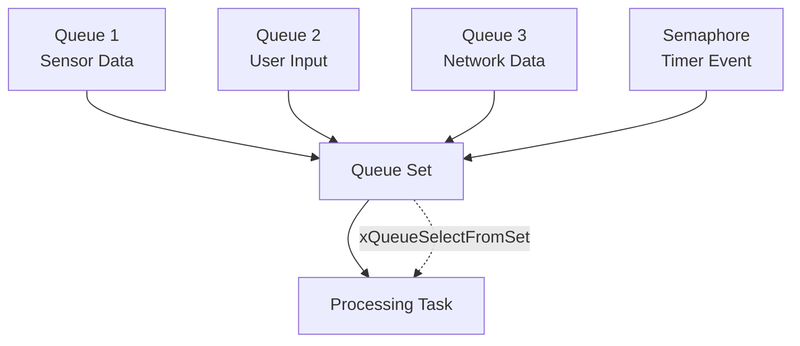

# Lab 3: Queue Sets Implementation (30 นาที)

## 🎯 วัตถุประสงค์
- เข้าใจการใช้งาน Queue Sets ใน FreeRTOS
- เรียนรู้การรอข้อมูลจากหลาย Queue พร้อมกัน
- ฝึกการจัดการ Multiple Input Sources
- เข้าใจ Event-driven Programming Pattern

## 📝 ความรู้เบื้องต้น
Queue Sets ช่วยให้ Task สามารถรอข้อมูลจากหลาย Queue หรือ Semaphore พร้อมกันได้ เหมือนกับ `select()` ใน Linux



## 🛠️ การเตรียมโปรเจค

### 1. สร้างโปรเจคใหม่
```bash
idf.py create-project queue_sets
cd queue_sets
```

### 2. แก้ไข main.c

```c
#include <stdio.h>
#include <stdint.h>
#include <string.h>
#include "freertos/FreeRTOS.h"
#include "freertos/task.h"
#include "freertos/queue.h"
#include "freertos/semphr.h"
#include "esp_log.h"
#include "driver/gpio.h"
#include "esp_random.h"

static const char *TAG = "QUEUE_SETS";

// LED indicators
#define LED_SENSOR GPIO_NUM_2
#define LED_USER GPIO_NUM_4
#define LED_NETWORK GPIO_NUM_5
#define LED_TIMER GPIO_NUM_18
#define LED_PROCESSOR GPIO_NUM_19

// Queue handles
QueueHandle_t xSensorQueue;
QueueHandle_t xUserQueue;
QueueHandle_t xNetworkQueue;
SemaphoreHandle_t xTimerSemaphore;

// Queue Set handle
QueueSetHandle_t xQueueSet;

// Data structures for different message types
typedef struct {
    int sensor_id;
    float temperature;
    float humidity;
    uint32_t timestamp;
} sensor_data_t;

typedef struct {
    int button_id;
    bool pressed;
    uint32_t duration_ms;
} user_input_t;

typedef struct {
    char source[20];
    char message[100];
    int priority;
} network_message_t;

// Message type identifier
typedef enum {
    MSG_SENSOR,
    MSG_USER,
    MSG_NETWORK,
    MSG_TIMER
} message_type_t;

// Statistics
typedef struct {
    uint32_t sensor_count;
    uint32_t user_count;
    uint32_t network_count;
    uint32_t timer_count;
} message_stats_t;

message_stats_t stats = {0, 0, 0, 0};

// Sensor simulation task
void sensor_task(void *pvParameters) {
    sensor_data_t sensor_data;
    int sensor_id = 1;
    
    ESP_LOGI(TAG, "Sensor task started");
    
    while (1) {
        // Simulate sensor reading
        sensor_data.sensor_id = sensor_id;
        sensor_data.temperature = 20.0 + (esp_random() % 200) / 10.0; // 20-40°C
        sensor_data.humidity = 30.0 + (esp_random() % 400) / 10.0;    // 30-70%
        sensor_data.timestamp = xTaskGetTickCount();
        
        if (xQueueSend(xSensorQueue, &sensor_data, pdMS_TO_TICKS(100)) == pdPASS) {
            ESP_LOGI(TAG, "📊 Sensor: T=%.1f°C, H=%.1f%%, ID=%d", 
                    sensor_data.temperature, sensor_data.humidity, sensor_id);
            
            // Blink sensor LED
            gpio_set_level(LED_SENSOR, 1);
            vTaskDelay(pdMS_TO_TICKS(50));
            gpio_set_level(LED_SENSOR, 0);
        }
        
        // Random sensor reading interval (2-5 seconds)
        vTaskDelay(pdMS_TO_TICKS(2000 + (esp_random() % 3000)));
    }
}

// User input simulation task
void user_input_task(void *pvParameters) {
    user_input_t user_input;
    
    ESP_LOGI(TAG, "User input task started");
    
    while (1) {
        // Simulate user button press
        user_input.button_id = 1 + (esp_random() % 3); // Button 1-3
        user_input.pressed = true;
        user_input.duration_ms = 100 + (esp_random() % 1000); // 100-1100ms
        
        if (xQueueSend(xUserQueue, &user_input, pdMS_TO_TICKS(100)) == pdPASS) {
            ESP_LOGI(TAG, "🔘 User: Button %d pressed for %dms", 
                    user_input.button_id, user_input.duration_ms);
            
            // Blink user LED
            gpio_set_level(LED_USER, 1);
            vTaskDelay(pdMS_TO_TICKS(100));
            gpio_set_level(LED_USER, 0);
        }
        
        // Random user input (3-8 seconds)
        vTaskDelay(pdMS_TO_TICKS(3000 + (esp_random() % 5000)));
    }
}

// Network simulation task
void network_task(void *pvParameters) {
    network_message_t network_msg;
    const char* sources[] = {"WiFi", "Bluetooth", "LoRa", "Ethernet"};
    const char* messages[] = {
        "Status update received",
        "Configuration changed",
        "Alert notification",
        "Data synchronization",
        "Heartbeat signal"
    };
    
    ESP_LOGI(TAG, "Network task started");
    
    while (1) {
        // Simulate network message
        strcpy(network_msg.source, sources[esp_random() % 4]);
        strcpy(network_msg.message, messages[esp_random() % 5]);
        network_msg.priority = 1 + (esp_random() % 5); // Priority 1-5
        
        if (xQueueSend(xNetworkQueue, &network_msg, pdMS_TO_TICKS(100)) == pdPASS) {
            ESP_LOGI(TAG, "🌐 Network [%s]: %s (P:%d)", 
                    network_msg.source, network_msg.message, network_msg.priority);
            
            // Blink network LED
            gpio_set_level(LED_NETWORK, 1);
            vTaskDelay(pdMS_TO_TICKS(50));
            gpio_set_level(LED_NETWORK, 0);
        }
        
        // Random network activity (1-4 seconds)
        vTaskDelay(pdMS_TO_TICKS(1000 + (esp_random() % 3000)));
    }
}

// Timer task (gives semaphore periodically)
void timer_task(void *pvParameters) {
    ESP_LOGI(TAG, "Timer task started");
    
    while (1) {
        vTaskDelay(pdMS_TO_TICKS(10000)); // Every 10 seconds
        
        if (xSemaphoreGive(xTimerSemaphore) == pdPASS) {
            ESP_LOGI(TAG, "⏰ Timer: Periodic timer fired");
            
            // Blink timer LED
            gpio_set_level(LED_TIMER, 1);
            vTaskDelay(pdMS_TO_TICKS(100));
            gpio_set_level(LED_TIMER, 0);
        }
    }
}

// Main processing task using Queue Sets
void processor_task(void *pvParameters) {
    QueueSetMemberHandle_t xActivatedMember;
    sensor_data_t sensor_data;
    user_input_t user_input;
    network_message_t network_msg;
    
    ESP_LOGI(TAG, "Processor task started - waiting for events...");
    
    while (1) {
        // Wait for any queue or semaphore to have data
        xActivatedMember = xQueueSelectFromSet(xQueueSet, portMAX_DELAY);
        
        if (xActivatedMember != NULL) {
            // Turn on processor LED
            gpio_set_level(LED_PROCESSOR, 1);
            
            // Determine which queue/semaphore was activated
            if (xActivatedMember == xSensorQueue) {
                if (xQueueReceive(xSensorQueue, &sensor_data, 0) == pdPASS) {
                    stats.sensor_count++;
                    ESP_LOGI(TAG, "→ Processing SENSOR data: T=%.1f°C, H=%.1f%%", 
                            sensor_data.temperature, sensor_data.humidity);
                    
                    // Simulate sensor data processing
                    if (sensor_data.temperature > 35.0) {
                        ESP_LOGW(TAG, "⚠️  High temperature alert!");
                    }
                    if (sensor_data.humidity > 60.0) {
                        ESP_LOGW(TAG, "⚠️  High humidity alert!");
                    }
                }
            }
            else if (xActivatedMember == xUserQueue) {
                if (xQueueReceive(xUserQueue, &user_input, 0) == pdPASS) {
                    stats.user_count++;
                    ESP_LOGI(TAG, "→ Processing USER input: Button %d (%dms)", 
                            user_input.button_id, user_input.duration_ms);
                    
                    // Simulate user input processing
                    switch (user_input.button_id) {
                        case 1:
                            ESP_LOGI(TAG, "💡 Action: Toggle LED");
                            break;
                        case 2:
                            ESP_LOGI(TAG, "📊 Action: Show status");
                            break;
                        case 3:
                            ESP_LOGI(TAG, "⚙️  Action: Settings menu");
                            break;
                    }
                }
            }
            else if (xActivatedMember == xNetworkQueue) {
                if (xQueueReceive(xNetworkQueue, &network_msg, 0) == pdPASS) {
                    stats.network_count++;
                    ESP_LOGI(TAG, "→ Processing NETWORK msg: [%s] %s", 
                            network_msg.source, network_msg.message);
                    
                    // Simulate network message processing
                    if (network_msg.priority >= 4) {
                        ESP_LOGW(TAG, "🚨 High priority network message!");
                    }
                }
            }
            else if (xActivatedMember == xTimerSemaphore) {
                if (xSemaphoreTake(xTimerSemaphore, 0) == pdPASS) {
                    stats.timer_count++;
                    ESP_LOGI(TAG, "→ Processing TIMER event: Periodic maintenance");
                    
                    // Show system statistics
                    ESP_LOGI(TAG, "📈 Stats - Sensor:%lu, User:%lu, Network:%lu, Timer:%lu", 
                            stats.sensor_count, stats.user_count, 
                            stats.network_count, stats.timer_count);
                }
            }
            
            // Simulate processing time
            vTaskDelay(pdMS_TO_TICKS(200));
            
            // Turn off processor LED
            gpio_set_level(LED_PROCESSOR, 0);
        }
    }
}

// System monitor task
void monitor_task(void *pvParameters) {
    ESP_LOGI(TAG, "System monitor started");
    
    while (1) {
        vTaskDelay(pdMS_TO_TICKS(15000)); // Every 15 seconds
        
        ESP_LOGI(TAG, "\n═══ SYSTEM MONITOR ═══");
        ESP_LOGI(TAG, "Queue States:");
        ESP_LOGI(TAG, "  Sensor Queue:  %d/%d", 
                uxQueueMessagesWaiting(xSensorQueue), 5);
        ESP_LOGI(TAG, "  User Queue:    %d/%d", 
                uxQueueMessagesWaiting(xUserQueue), 3);
        ESP_LOGI(TAG, "  Network Queue: %d/%d", 
                uxQueueMessagesWaiting(xNetworkQueue), 8);
        
        ESP_LOGI(TAG, "Message Statistics:");
        ESP_LOGI(TAG, "  Sensor:  %lu messages", stats.sensor_count);
        ESP_LOGI(TAG, "  User:    %lu messages", stats.user_count);
        ESP_LOGI(TAG, "  Network: %lu messages", stats.network_count);
        ESP_LOGI(TAG, "  Timer:   %lu events", stats.timer_count);
        ESP_LOGI(TAG, "═══════════════════════\n");
    }
}

void app_main(void) {
    ESP_LOGI(TAG, "Queue Sets Implementation Lab Starting...");
    
    // Configure LED pins
    gpio_set_direction(LED_SENSOR, GPIO_MODE_OUTPUT);
    gpio_set_direction(LED_USER, GPIO_MODE_OUTPUT);
    gpio_set_direction(LED_NETWORK, GPIO_MODE_OUTPUT);
    gpio_set_direction(LED_TIMER, GPIO_MODE_OUTPUT);
    gpio_set_direction(LED_PROCESSOR, GPIO_MODE_OUTPUT);
    
    // Turn off all LEDs
    gpio_set_level(LED_SENSOR, 0);
    gpio_set_level(LED_USER, 0);
    gpio_set_level(LED_NETWORK, 0);
    gpio_set_level(LED_TIMER, 0);
    gpio_set_level(LED_PROCESSOR, 0);
    
    // Create individual queues
    xSensorQueue = xQueueCreate(5, sizeof(sensor_data_t));
    xUserQueue = xQueueCreate(3, sizeof(user_input_t));
    xNetworkQueue = xQueueCreate(8, sizeof(network_message_t));
    xTimerSemaphore = xSemaphoreCreateBinary();
    
    // Create queue set (can hold references to all queues + semaphore)
    xQueueSet = xQueueCreateSet(5 + 3 + 8 + 1); // Total capacity
    
    if (xSensorQueue && xUserQueue && xNetworkQueue && 
        xTimerSemaphore && xQueueSet) {
        
        // Add queues and semaphore to the queue set
        if (xQueueAddToSet(xSensorQueue, xQueueSet) != pdPASS ||
            xQueueAddToSet(xUserQueue, xQueueSet) != pdPASS ||
            xQueueAddToSet(xNetworkQueue, xQueueSet) != pdPASS ||
            xQueueAddToSet(xTimerSemaphore, xQueueSet) != pdPASS) {
            
            ESP_LOGE(TAG, "Failed to add queues to queue set!");
            return;
        }
        
        ESP_LOGI(TAG, "Queue set created and configured successfully");
        
        // Create producer tasks
        xTaskCreate(sensor_task, "Sensor", 2048, NULL, 3, NULL);
        xTaskCreate(user_input_task, "UserInput", 2048, NULL, 3, NULL);
        xTaskCreate(network_task, "Network", 2048, NULL, 3, NULL);
        xTaskCreate(timer_task, "Timer", 2048, NULL, 2, NULL);
        
        // Create main processor task
        xTaskCreate(processor_task, "Processor", 3072, NULL, 4, NULL);
        
        // Create monitor task
        xTaskCreate(monitor_task, "Monitor", 2048, NULL, 1, NULL);
        
        ESP_LOGI(TAG, "All tasks created. System operational.");
        
        // LED startup sequence
        for (int i = 0; i < 3; i++) {
            gpio_set_level(LED_SENSOR, 1);
            vTaskDelay(pdMS_TO_TICKS(100));
            gpio_set_level(LED_SENSOR, 0);
            gpio_set_level(LED_USER, 1);
            vTaskDelay(pdMS_TO_TICKS(100));
            gpio_set_level(LED_USER, 0);
            gpio_set_level(LED_NETWORK, 1);
            vTaskDelay(pdMS_TO_TICKS(100));
            gpio_set_level(LED_NETWORK, 0);
            gpio_set_level(LED_TIMER, 1);
            vTaskDelay(pdMS_TO_TICKS(100));
            gpio_set_level(LED_TIMER, 0);
            gpio_set_level(LED_PROCESSOR, 1);
            vTaskDelay(pdMS_TO_TICKS(100));
            gpio_set_level(LED_PROCESSOR, 0);
            vTaskDelay(pdMS_TO_TICKS(200));
        }
        
    } else {
        ESP_LOGE(TAG, "Failed to create queues or queue set!");
    }
}
```

## 🧪 การทดลอง

### ทดลองที่ 1: สังเกตการทำงานปกติ
1. รันโปรแกรมและสังเกต 5 นาที
2. ดู LED กะพริบตามแหล่งข้อมูล
3. บันทึกสถิติจาก System Monitor

### ทดลองที่ 2: ปิดใช้งานแหล่งข้อมูล
Comment out sensor task:
```c
// xTaskCreate(sensor_task, "Sensor", 2048, NULL, 3, NULL);
```

### ทดลองที่ 3: เพิ่มความถี่ข้อความ
ลดช่วงเวลาใน network_task:
```c
vTaskDelay(pdMS_TO_TICKS(500)); // ส่งทุก 0.5 วินาที
```

## 📊 การสังเกตและบันทึกผล

### ตารางผลการทดลอง
| ทดลอง | Sensor | User | Network | Timer | Total | สังเกต |
|-------|--------|------|---------|-------|-------|---------|
| 1 (ปกติ) | | | | | | |
| 2 (ไม่มี Sensor) | | | | | | |
| 3 (Network เร็ว) | | | | | | |

### คำถามสำหรับการทดลอง
1. Processor Task รู้ได้อย่างไรว่าข้อมูลมาจาก Queue ไหน?
2. เมื่อหลาย Queue มีข้อมูลพร้อมกัน เลือกประมวลผลอันไหนก่อน?
3. Queue Sets ช่วยประหยัด CPU อย่างไร?

## 📋 สรุปผลการทดลอง

### สิ่งที่เรียนรู้:
- [ ] การใช้งาน Queue Sets
- [ ] Event-driven Programming
- [ ] การจัดการ Multiple Input Sources
- [ ] การ Multiplex ข้อมูลจากหลาย Queue
- [ ] การประหยัด CPU ในการรอข้อมูล

### APIs ที่ใช้:
- `xQueueCreateSet()` - สร้าง Queue Set
- `xQueueAddToSet()` - เพิ่ม Queue/Semaphore เข้า Set
- `xQueueSelectFromSet()` - รอข้อมูลจาก Set
- `xQueueRemoveFromSet()` - ลบ Queue/Semaphore จาก Set

### ข้อดีของ Queue Sets:
1. **Efficiency**: ประหยัด CPU ไม่ต้อง polling
2. **Scalability**: เพิ่ม/ลด input source ได้ง่าย
3. **Simplicity**: Code structure ชัดเจน
4. **Responsiveness**: ตอบสนองเหตุการณ์ทันที

## 🚀 ความท้าทายเพิ่มเติม

1. **Priority Handling**: จัดการ priority ของ input sources
2. **Dynamic Queue Management**: เพิ่ม/ลด Queue ระหว่างทำงาน
3. **Load Balancing**: กระจายงานไปหลาย Processor
4. **Event Filtering**: กรองเหตุการณ์ตามเงื่อนไข
5. **Performance Metrics**: วัดเวลาตอบสนองของระบบ

## 📚 เอกสารอ้างอิง

- [FreeRTOS Queue Sets](https://www.freertos.org/RTOS-queue-sets.html)
- [Event-Driven Programming](https://en.wikipedia.org/wiki/Event-driven_programming)
- [ESP-IDF Queue Set Example](https://github.com/espressif/esp-idf/tree/master/examples/system/freertos)