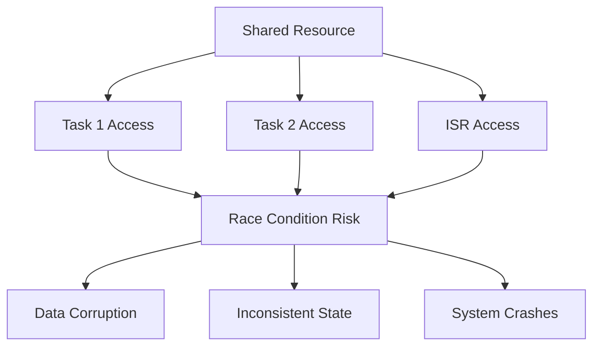
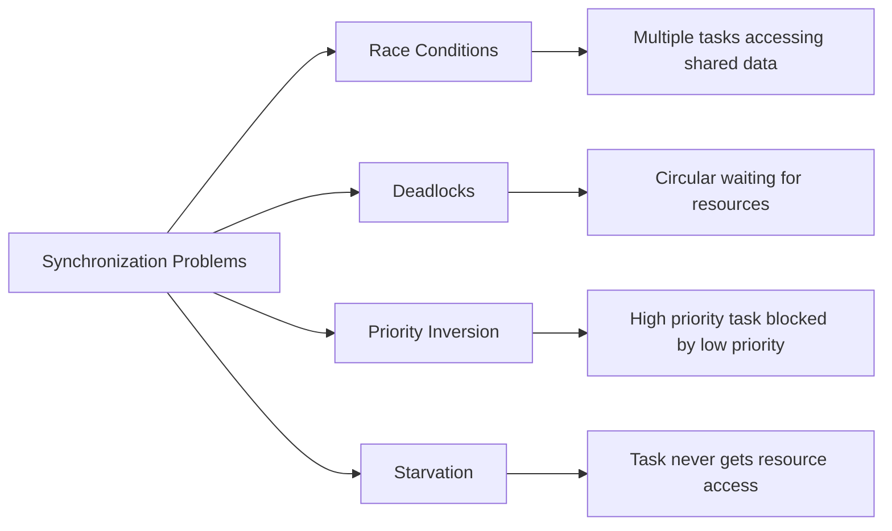
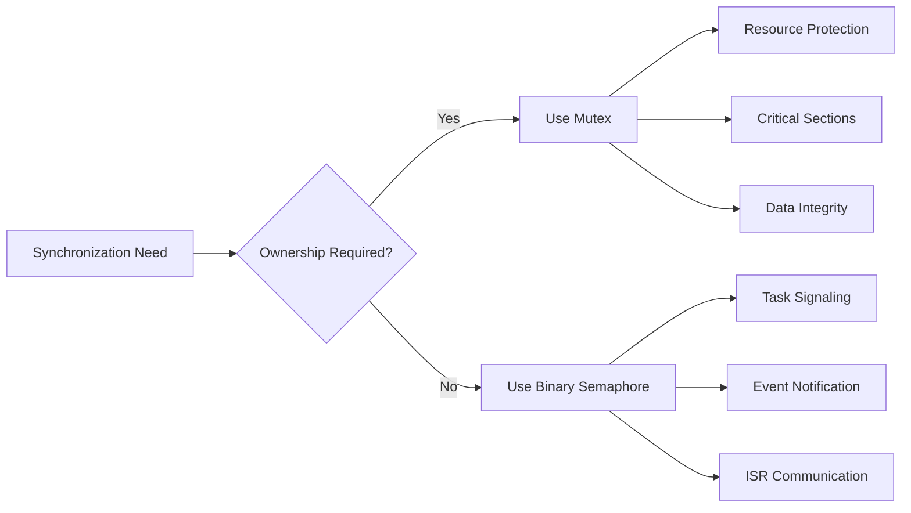

# FreeRTOS Semaphores and Mutexes - Synchronization

## Table of Contents
1. [Synchronization Fundamentals](#synchronization-fundamentals)
2. [Binary Semaphores](#binary-semaphores)
3. [Counting Semaphores](#counting-semaphores)
4. [Mutexes (Mutual Exclusion)](#mutexes-mutual-exclusion)
5. [Recursive Mutexes](#recursive-mutexes)
6. [Priority Inheritance](#priority-inheritance)
7. [Practical Examples](#practical-examples)
8. [Best Practices](#best-practices)
9. [Exercises](#exercises)

## Synchronization Fundamentals

**Synchronization** is essential in multi-tasking systems to coordinate access to shared resources and ensure data integrity. FreeRTOS provides several synchronization primitives.

### Why Synchronization is Needed:



### Types of Synchronization Primitives:

| Type | Use Case | Key Feature |
|------|----------|-------------|
| **Binary Semaphore** | Task synchronization, signaling | 0 or 1 state |
| **Counting Semaphore** | Resource counting, throttling | Multiple counts |
| **Mutex** | Mutual exclusion, resource protection | Ownership concept |
| **Recursive Mutex** | Nested locking | Same task can lock multiple times |

### Synchronization Problems:



## Binary Semaphores

**Binary Semaphores** are used for task synchronization and signaling. They have two states: available (1) or unavailable (0).

### Use Cases:
- **Task synchronization**: One task signals another
- **ISR to task communication**: ISR signals task
- **Event notification**: Signal when event occurs
- **Resource availability**: Single resource protection

### Binary Semaphore APIs:

| Function | Description |
|----------|-------------|
| `xSemaphoreCreateBinary()` | Create binary semaphore |
| `xSemaphoreGive()` | Give (signal) semaphore |
| `xSemaphoreTake()` | Take (wait for) semaphore |
| `xSemaphoreGiveFromISR()` | Give from ISR |
| `xSemaphoreTakeFromISR()` | Take from ISR |

### Basic Binary Semaphore Example:

```c
#include "freertos/FreeRTOS.h"
#include "freertos/task.h"
#include "freertos/semphr.h"
#include "esp_log.h"

static const char *TAG = "BINARY_SEM";

// Semaphore handle
SemaphoreHandle_t binary_semaphore;

void producer_task(void *parameter)
{
    int counter = 0;
    
    while (1) {
        // Do some work
        ESP_LOGI(TAG, "Producer working... %d", counter++);
        vTaskDelay(pdMS_TO_TICKS(2000));
        
        // Signal consumer that work is done
        if (xSemaphoreGive(binary_semaphore) == pdTRUE) {
            ESP_LOGI(TAG, "Producer: Work completed, signaling consumer");
        } else {
            ESP_LOGW(TAG, "Producer: Failed to give semaphore");
        }
    }
}

void consumer_task(void *parameter)
{
    while (1) {
        ESP_LOGI(TAG, "Consumer: Waiting for signal...");
        
        // Wait for producer signal (block indefinitely)
        if (xSemaphoreTake(binary_semaphore, portMAX_DELAY) == pdTRUE) {
            ESP_LOGI(TAG, "Consumer: Received signal, processing...");
            
            // Process the work
            vTaskDelay(pdMS_TO_TICKS(1000));
            ESP_LOGI(TAG, "Consumer: Processing completed");
        }
    }
}

void app_main(void)
{
    // Create binary semaphore
    binary_semaphore = xSemaphoreCreateBinary();
    if (binary_semaphore == NULL) {
        ESP_LOGE(TAG, "Failed to create binary semaphore");
        return;
    }
    
    // Create tasks
    xTaskCreate(producer_task, "Producer", 2048, NULL, 5, NULL);
    xTaskCreate(consumer_task, "Consumer", 2048, NULL, 5, NULL);
    
    ESP_LOGI(TAG, "Binary semaphore example started");
}
```

### ISR to Task Communication:

```c
#include "driver/gpio.h"
#include "esp_intr_alloc.h"

#define BUTTON_GPIO 0

SemaphoreHandle_t button_semaphore;

// ISR handler
void IRAM_ATTR button_isr_handler(void *arg)
{
    BaseType_t higher_priority_task_woken = pdFALSE;
    
    // Give semaphore from ISR
    xSemaphoreGiveFromISR(button_semaphore, &higher_priority_task_woken);
    
    // Request context switch if higher priority task was woken
    if (higher_priority_task_woken == pdTRUE) {
        portYIELD_FROM_ISR();
    }
}

void button_handler_task(void *parameter)
{
    while (1) {
        // Wait for button press
        if (xSemaphoreTake(button_semaphore, portMAX_DELAY) == pdTRUE) {
            ESP_LOGI(TAG, "Button pressed! Handling event...");
            
            // Handle button press
            vTaskDelay(pdMS_TO_TICKS(50)); // Debounce delay
            ESP_LOGI(TAG, "Button event processed");
        }
    }
}

void setup_button_interrupt(void)
{
    // Configure GPIO
    gpio_config_t io_conf = {
        .pin_bit_mask = (1ULL << BUTTON_GPIO),
        .mode = GPIO_MODE_INPUT,
        .pull_up_en = GPIO_PULLUP_ENABLE,
        .pull_down_en = GPIO_PULLDOWN_DISABLE,
        .intr_type = GPIO_INTR_NEGEDGE
    };
    gpio_config(&io_conf);
    
    // Install ISR service
    gpio_install_isr_service(ESP_INTR_FLAG_DEFAULT);
    gpio_isr_handler_add(BUTTON_GPIO, button_isr_handler, NULL);
    
    // Create semaphore and task
    button_semaphore = xSemaphoreCreateBinary();
    xTaskCreate(button_handler_task, "ButtonHandler", 2048, NULL, 10, NULL);
}
```

## Counting Semaphores

**Counting Semaphores** maintain a count that represents the number of available resources or events.

### Use Cases:
- **Resource pools**: Multiple instances of same resource
- **Producer-consumer buffering**: Track available slots
- **Event counting**: Count multiple occurrences
- **Rate limiting**: Limit concurrent operations

### Counting Semaphore APIs:

| Function | Description |
|----------|-------------|
| `xSemaphoreCreateCounting()` | Create counting semaphore |
| `uxSemaphoreGetCount()` | Get current count |
| `xSemaphoreGive()` | Increment count |
| `xSemaphoreTake()` | Decrement count (block if 0) |

### Resource Pool Example:

```c
#include "freertos/semphr.h"

static const char *TAG = "COUNTING_SEM";

// Simulate a connection pool with 3 connections
#define MAX_CONNECTIONS 3
SemaphoreHandle_t connection_pool_semaphore;

typedef struct {
    int connection_id;
    bool in_use;
} connection_t;

connection_t connections[MAX_CONNECTIONS] = {
    {1, false}, {2, false}, {3, false}
};

connection_t* acquire_connection(void)
{
    // Try to acquire a connection (wait up to 5 seconds)
    if (xSemaphoreTake(connection_pool_semaphore, pdMS_TO_TICKS(5000)) == pdTRUE) {
        // Find available connection
        for (int i = 0; i < MAX_CONNECTIONS; i++) {
            if (!connections[i].in_use) {
                connections[i].in_use = true;
                ESP_LOGI(TAG, "Acquired connection %d", connections[i].connection_id);
                return &connections[i];
            }
        }
    }
    
    ESP_LOGW(TAG, "Failed to acquire connection - pool exhausted");
    return NULL;
}

void release_connection(connection_t *conn)
{
    if (conn && conn->in_use) {
        conn->in_use = false;
        ESP_LOGI(TAG, "Released connection %d", conn->connection_id);
        
        // Return connection to pool
        xSemaphoreGive(connection_pool_semaphore);
    }
}

void client_task(void *parameter)
{
    int client_id = (int)parameter;
    
    while (1) {
        ESP_LOGI(TAG, "Client %d requesting connection...", client_id);
        
        connection_t *conn = acquire_connection();
        if (conn) {
            // Use connection
            ESP_LOGI(TAG, "Client %d using connection %d", client_id, conn->connection_id);
            vTaskDelay(pdMS_TO_TICKS(2000 + (rand() % 3000))); // Simulate work
            
            // Release connection
            release_connection(conn);
        } else {
            ESP_LOGW(TAG, "Client %d couldn't get connection", client_id);
        }
        
        vTaskDelay(pdMS_TO_TICKS(1000));
    }
}

void setup_connection_pool(void)
{
    // Create counting semaphore with initial count = max connections
    connection_pool_semaphore = xSemaphoreCreateCounting(MAX_CONNECTIONS, MAX_CONNECTIONS);
    
    if (connection_pool_semaphore == NULL) {
        ESP_LOGE(TAG, "Failed to create connection pool semaphore");
        return;
    }
    
    // Create multiple client tasks
    for (int i = 1; i <= 5; i++) {
        xTaskCreate(client_task, "Client", 2048, (void*)i, 5, NULL);
    }
    
    ESP_LOGI(TAG, "Connection pool with %d connections created", MAX_CONNECTIONS);
}
```

### Event Counting Example:

```c
#define MAX_EVENTS 10
SemaphoreHandle_t event_counter_semaphore;

void event_generator_task(void *parameter)
{
    int event_number = 0;
    
    while (1) {
        event_number++;
        
        // Generate event
        ESP_LOGI(TAG, "Generated event #%d", event_number);
        
        // Signal event (increment counter)
        if (xSemaphoreGive(event_counter_semaphore) != pdTRUE) {
            ESP_LOGW(TAG, "Event counter full, event #%d lost", event_number);
        }
        
        // Random event generation interval
        vTaskDelay(pdMS_TO_TICKS(500 + (rand() % 1500)));
    }
}

void event_processor_task(void *parameter)
{
    int processed_count = 0;
    
    while (1) {
        // Wait for events
        if (xSemaphoreTake(event_counter_semaphore, pdMS_TO_TICKS(2000)) == pdTRUE) {
            processed_count++;
            ESP_LOGI(TAG, "Processing event (total processed: %d)", processed_count);
            
            // Check remaining events
            UBaseType_t remaining_events = uxSemaphoreGetCount(event_counter_semaphore);
            if (remaining_events > 0) {
                ESP_LOGI(TAG, "Events pending: %d", remaining_events);
            }
            
            // Simulate processing time
            vTaskDelay(pdMS_TO_TICKS(800));
        } else {
            ESP_LOGI(TAG, "No events to process, waiting...");
        }
    }
}

void setup_event_counter(void)
{
    // Create counting semaphore for event counting
    event_counter_semaphore = xSemaphoreCreateCounting(MAX_EVENTS, 0);
    
    xTaskCreate(event_generator_task, "EventGen", 2048, NULL, 6, NULL);
    xTaskCreate(event_processor_task, "EventProc", 2048, NULL, 5, NULL);
}
```

## Mutexes (Mutual Exclusion)

**Mutexes** provide mutual exclusion for shared resources. Unlike semaphores, mutexes have ownership - only the task that takes a mutex can give it back.

### Key Features:
- **Ownership**: Only owning task can release
- **Priority Inheritance**: Prevents priority inversion
- **Deadlock Detection**: Can detect some deadlock scenarios
- **Binary State**: Either locked or unlocked

### Mutex vs Binary Semaphore:



### Basic Mutex Example:

```c
#include "freertos/semphr.h"

static const char *TAG = "MUTEX_EXAMPLE";

// Shared resource and protection
SemaphoreHandle_t resource_mutex;
int shared_counter = 0;

void increment_task(void *parameter)
{
    int task_id = (int)parameter;
    
    while (1) {
        ESP_LOGI(TAG, "Task %d trying to access shared resource...", task_id);
        
        // Acquire mutex (wait up to 1 second)
        if (xSemaphoreTake(resource_mutex, pdMS_TO_TICKS(1000)) == pdTRUE) {
            ESP_LOGI(TAG, "Task %d acquired mutex", task_id);
            
            // Critical section - access shared resource
            int current_value = shared_counter;
            ESP_LOGI(TAG, "Task %d: Current counter = %d", task_id, current_value);
            
            // Simulate processing time
            vTaskDelay(pdMS_TO_TICKS(500));
            
            shared_counter = current_value + 1;
            ESP_LOGI(TAG, "Task %d: Updated counter to %d", task_id, shared_counter);
            
            // Release mutex
            xSemaphoreGive(resource_mutex);
            ESP_LOGI(TAG, "Task %d released mutex", task_id);
        } else {
            ESP_LOGW(TAG, "Task %d failed to acquire mutex", task_id);
        }
        
        vTaskDelay(pdMS_TO_TICKS(2000));
    }
}

void setup_mutex_example(void)
{
    // Create mutex
    resource_mutex = xSemaphoreCreateMutex();
    if (resource_mutex == NULL) {
        ESP_LOGE(TAG, "Failed to create mutex");
        return;
    }
    
    // Create multiple tasks accessing shared resource
    xTaskCreate(increment_task, "Task1", 2048, (void*)1, 5, NULL);
    xTaskCreate(increment_task, "Task2", 2048, (void*)2, 5, NULL);
    xTaskCreate(increment_task, "Task3", 2048, (void*)3, 5, NULL);
    
    ESP_LOGI(TAG, "Mutex example with shared counter started");
}
```

### Protected Data Structure Example:

```c
typedef struct {
    SemaphoreHandle_t mutex;
    int data[10];
    size_t count;
} protected_array_t;

protected_array_t* create_protected_array(void)
{
    protected_array_t *array = malloc(sizeof(protected_array_t));
    if (array) {
        array->mutex = xSemaphoreCreateMutex();
        array->count = 0;
        memset(array->data, 0, sizeof(array->data));
    }
    return array;
}

bool add_to_array(protected_array_t *array, int value)
{
    if (!array) return false;
    
    if (xSemaphoreTake(array->mutex, pdMS_TO_TICKS(1000)) == pdTRUE) {
        if (array->count < 10) {
            array->data[array->count++] = value;
            ESP_LOGI(TAG, "Added %d to array, count: %d", value, array->count);
            xSemaphoreGive(array->mutex);
            return true;
        } else {
            ESP_LOGW(TAG, "Array is full");
            xSemaphoreGive(array->mutex);
            return false;
        }
    }
    
    ESP_LOGW(TAG, "Failed to acquire array mutex");
    return false;
}

int get_from_array(protected_array_t *array, size_t index)
{
    if (!array) return -1;
    
    int value = -1;
    if (xSemaphoreTake(array->mutex, pdMS_TO_TICKS(1000)) == pdTRUE) {
        if (index < array->count) {
            value = array->data[index];
            ESP_LOGI(TAG, "Retrieved value %d from index %d", value, index);
        } else {
            ESP_LOGW(TAG, "Index %d out of bounds (count: %d)", index, array->count);
        }
        xSemaphoreGive(array->mutex);
    }
    
    return value;
}

size_t get_array_count(protected_array_t *array)
{
    if (!array) return 0;
    
    size_t count = 0;
    if (xSemaphoreTake(array->mutex, pdMS_TO_TICKS(1000)) == pdTRUE) {
        count = array->count;
        xSemaphoreGive(array->mutex);
    }
    
    return count;
}
```

## Recursive Mutexes

**Recursive Mutexes** allow the same task to take the mutex multiple times. Useful for nested function calls.

### Use Cases:
- **Nested function calls**: Function calls another that needs same mutex
- **Recursive algorithms**: Recursive functions accessing shared data
- **API consistency**: APIs that might be called from multiple levels

### Recursive Mutex Example:

```c
SemaphoreHandle_t recursive_mutex;
int shared_resource = 0;

void nested_function_level_2(int task_id)
{
    ESP_LOGI(TAG, "Task %d: nested_function_level_2 acquiring mutex", task_id);
    
    if (xSemaphoreTake(recursive_mutex, pdMS_TO_TICKS(1000)) == pdTRUE) {
        ESP_LOGI(TAG, "Task %d: Level 2 has mutex, accessing resource", task_id);
        shared_resource += 10;
        ESP_LOGI(TAG, "Task %d: Level 2 updated resource to %d", task_id, shared_resource);
        
        vTaskDelay(pdMS_TO_TICKS(200));
        
        xSemaphoreGive(recursive_mutex);
        ESP_LOGI(TAG, "Task %d: Level 2 released mutex", task_id);
    }
}

void nested_function_level_1(int task_id)
{
    ESP_LOGI(TAG, "Task %d: nested_function_level_1 acquiring mutex", task_id);
    
    if (xSemaphoreTake(recursive_mutex, pdMS_TO_TICKS(1000)) == pdTRUE) {
        ESP_LOGI(TAG, "Task %d: Level 1 has mutex, accessing resource", task_id);
        shared_resource += 1;
        ESP_LOGI(TAG, "Task %d: Level 1 updated resource to %d", task_id, shared_resource);
        
        // Call nested function that also needs the mutex
        nested_function_level_2(task_id);
        
        ESP_LOGI(TAG, "Task %d: Back in Level 1, resource is %d", task_id, shared_resource);
        
        xSemaphoreGive(recursive_mutex);
        ESP_LOGI(TAG, "Task %d: Level 1 released mutex", task_id);
    }
}

void recursive_task(void *parameter)
{
    int task_id = (int)parameter;
    
    while (1) {
        ESP_LOGI(TAG, "Task %d starting nested operations", task_id);
        nested_function_level_1(task_id);
        ESP_LOGI(TAG, "Task %d completed nested operations", task_id);
        
        vTaskDelay(pdMS_TO_TICKS(3000));
    }
}

void setup_recursive_mutex(void)
{
    // Create recursive mutex
    recursive_mutex = xSemaphoreCreateRecursiveMutex();
    if (recursive_mutex == NULL) {
        ESP_LOGE(TAG, "Failed to create recursive mutex");
        return;
    }
    
    xTaskCreate(recursive_task, "RecTask1", 2048, (void*)1, 5, NULL);
    xTaskCreate(recursive_task, "RecTask2", 2048, (void*)2, 5, NULL);
}
```

## Priority Inheritance

**Priority Inheritance** prevents priority inversion by temporarily raising the priority of a mutex holder.

### Priority Inversion Problem:

```mermaid
gantt
    title Priority Inversion Without Priority Inheritance
    dateFormat X
    axisFormat %s
    
    section High Priority Task
    Blocked    :b1, 0, 4
    Running    :active, r1, 4, 6
    
    section Medium Priority Task
    Running    :active, r2, 1, 4
    
    section Low Priority Task
    Has Mutex  :active, m1, 0, 1
    Blocked    :b2, 1, 4
    Has Mutex  :active, m2, 4, 5
```



### With Priority Inheritance:

```mermaid
gantt
    title Priority Inheritance Solution
    dateFormat X
    axisFormat %s
    
    section High Priority Task
    Blocked    :b1, 0, 2
    Running    :active, r1, 2, 4
    
    section Medium Priority Task
    Ready      :r2, 0, 4
    
    section Low Priority Task (Inherited High Priority)
    Has Mutex  :active, m1, 0, 2
    Released   :m2, 2, 4
```



### Priority Inheritance Example:

```c
// High priority task
void high_priority_task(void *parameter)
{
    while (1) {
        ESP_LOGI(TAG, "High priority task running");
        vTaskDelay(pdMS_TO_TICKS(5000));
        
        ESP_LOGI(TAG, "High priority task needs mutex...");
        if (xSemaphoreTake(resource_mutex, portMAX_DELAY) == pdTRUE) {
            ESP_LOGI(TAG, "High priority task got mutex");
            vTaskDelay(pdMS_TO_TICKS(1000));
            xSemaphoreGive(resource_mutex);
            ESP_LOGI(TAG, "High priority task released mutex");
        }
    }
}

// Medium priority task (CPU intensive)
void medium_priority_task(void *parameter)
{
    while (1) {
        ESP_LOGI(TAG, "Medium priority task doing CPU work...");
        // Simulate CPU-intensive work
        for (volatile int i = 0; i < 1000000; i++);
        vTaskDelay(pdMS_TO_TICKS(100));
    }
}

// Low priority task
void low_priority_task(void *parameter)
{
    while (1) {
        ESP_LOGI(TAG, "Low priority task acquiring mutex...");
        if (xSemaphoreTake(resource_mutex, portMAX_DELAY) == pdTRUE) {
            ESP_LOGI(TAG, "Low priority task has mutex, doing work...");
            vTaskDelay(pdMS_TO_TICKS(3000)); // Hold mutex for 3 seconds
            xSemaphoreGive(resource_mutex);
            ESP_LOGI(TAG, "Low priority task released mutex");
        }
        
        vTaskDelay(pdMS_TO_TICKS(10000));
    }
}

void setup_priority_inheritance_demo(void)
{
    resource_mutex = xSemaphoreCreateMutex(); // Mutex supports priority inheritance
    
    xTaskCreate(high_priority_task, "HighPri", 2048, NULL, 15, NULL);
    xTaskCreate(medium_priority_task, "MedPri", 2048, NULL, 10, NULL);
    xTaskCreate(low_priority_task, "LowPri", 2048, NULL, 5, NULL);
}
```

## Practical Examples

### Thread-Safe Logger:

```c
typedef struct {
    SemaphoreHandle_t mutex;
    char buffer[1024];
    size_t buffer_pos;
    bool buffer_full;
} thread_safe_logger_t;

thread_safe_logger_t logger = {0};

void init_logger(void)
{
    logger.mutex = xSemaphoreCreateMutex();
    logger.buffer_pos = 0;
    logger.buffer_full = false;
}

void safe_log(const char* format, ...)
{
    if (xSemaphoreTake(logger.mutex, pdMS_TO_TICKS(100)) == pdTRUE) {
        va_list args;
        va_start(args, format);
        
        // Check buffer space
        if (logger.buffer_pos < sizeof(logger.buffer) - 100) {
            int written = vsnprintf(logger.buffer + logger.buffer_pos, 
                                  sizeof(logger.buffer) - logger.buffer_pos, 
                                  format, args);
            if (written > 0) {
                logger.buffer_pos += written;
            }
        } else {
            logger.buffer_full = true;
        }
        
        va_end(args);
        xSemaphoreGive(logger.mutex);
    }
}

void flush_logger(void)
{
    if (xSemaphoreTake(logger.mutex, pdMS_TO_TICKS(1000)) == pdTRUE) {
        if (logger.buffer_pos > 0) {
            printf("=== LOG FLUSH ===\n%s\n=================\n", logger.buffer);
            logger.buffer_pos = 0;
            logger.buffer_full = false;
        }
        xSemaphoreGive(logger.mutex);
    }
}
```

### Producer-Consumer with Synchronization:

```c
#define BUFFER_SIZE 5

typedef struct {
    int buffer[BUFFER_SIZE];
    int write_index;
    int read_index;
    int count;
    SemaphoreHandle_t mutex;
    SemaphoreHandle_t not_full;   // Counting semaphore
    SemaphoreHandle_t not_empty;  // Counting semaphore
} sync_buffer_t;

sync_buffer_t sync_buffer;

void init_sync_buffer(void)
{
    sync_buffer.write_index = 0;
    sync_buffer.read_index = 0;
    sync_buffer.count = 0;
    
    sync_buffer.mutex = xSemaphoreCreateMutex();
    sync_buffer.not_full = xSemaphoreCreateCounting(BUFFER_SIZE, BUFFER_SIZE);
    sync_buffer.not_empty = xSemaphoreCreateCounting(BUFFER_SIZE, 0);
}

bool buffer_put(int data)
{
    // Wait for space
    if (xSemaphoreTake(sync_buffer.not_full, pdMS_TO_TICKS(1000)) == pdTRUE) {
        // Get exclusive access to buffer
        if (xSemaphoreTake(sync_buffer.mutex, pdMS_TO_TICKS(1000)) == pdTRUE) {
            sync_buffer.buffer[sync_buffer.write_index] = data;
            sync_buffer.write_index = (sync_buffer.write_index + 1) % BUFFER_SIZE;
            sync_buffer.count++;
            
            ESP_LOGI(TAG, "Put %d in buffer (count: %d)", data, sync_buffer.count);
            
            xSemaphoreGive(sync_buffer.mutex);
            
            // Signal that buffer is not empty
            xSemaphoreGive(sync_buffer.not_empty);
            return true;
        } else {
            // Failed to get mutex, give back not_full semaphore
            xSemaphoreGive(sync_buffer.not_full);
        }
    }
    return false;
}

bool buffer_get(int *data)
{
    // Wait for data
    if (xSemaphoreTake(sync_buffer.not_empty, pdMS_TO_TICKS(1000)) == pdTRUE) {
        // Get exclusive access to buffer
        if (xSemaphoreTake(sync_buffer.mutex, pdMS_TO_TICKS(1000)) == pdTRUE) {
            *data = sync_buffer.buffer[sync_buffer.read_index];
            sync_buffer.read_index = (sync_buffer.read_index + 1) % BUFFER_SIZE;
            sync_buffer.count--;
            
            ESP_LOGI(TAG, "Got %d from buffer (count: %d)", *data, sync_buffer.count);
            
            xSemaphoreGive(sync_buffer.mutex);
            
            // Signal that buffer is not full
            xSemaphoreGive(sync_buffer.not_full);
            return true;
        } else {
            // Failed to get mutex, give back not_empty semaphore
            xSemaphoreGive(sync_buffer.not_empty);
        }
    }
    return false;
}
```

## Best Practices

### 1. Choose the Right Primitive:

```c
// Use mutex for resource protection
SemaphoreHandle_t data_mutex = xSemaphoreCreateMutex();

// Use binary semaphore for signaling
SemaphoreHandle_t event_signal = xSemaphoreCreateBinary();

// Use counting semaphore for resource pools
SemaphoreHandle_t resource_pool = xSemaphoreCreateCounting(MAX_RESOURCES, MAX_RESOURCES);
```

### 2. Always Handle Timeouts:

```c
if (xSemaphoreTake(mutex, pdMS_TO_TICKS(1000)) == pdTRUE) {
    // Success - do work
    critical_section_work();
    xSemaphoreGive(mutex);
} else {
    // Timeout - handle error appropriately
    ESP_LOGW(TAG, "Failed to acquire mutex within timeout");
    return ERROR_TIMEOUT;
}
```

### 3. Keep Critical Sections Short:

```c
// Good - short critical section
if (xSemaphoreTake(mutex, timeout) == pdTRUE) {
    shared_data = new_value;  // Quick operation
    xSemaphoreGive(mutex);
}

// Process data outside critical section
process_data(new_value);

// Bad - long critical section
if (xSemaphoreTake(mutex, timeout) == pdTRUE) {
    shared_data = new_value;
    complex_processing(shared_data);  // Long operation
    network_operation();              // Very long operation
    xSemaphoreGive(mutex);
}
```

### 4. Avoid Deadlocks:

```c
// Establish lock ordering to prevent deadlocks
void safe_transfer(account_t *from, account_t *to, int amount)
{
    // Always acquire locks in same order (by address)
    SemaphoreHandle_t first_lock = (from < to) ? from->mutex : to->mutex;
    SemaphoreHandle_t second_lock = (from < to) ? to->mutex : from->mutex;
    
    if (xSemaphoreTake(first_lock, pdMS_TO_TICKS(1000)) == pdTRUE) {
        if (xSemaphoreTake(second_lock, pdMS_TO_TICKS(1000)) == pdTRUE) {
            // Perform transfer
            from->balance -= amount;
            to->balance += amount;
            
            xSemaphoreGive(second_lock);
        }
        xSemaphoreGive(first_lock);
    }
}
```

## Exercises

### Exercise 1: Resource Protection

**Objective**: Protect a shared counter with mutex.

**Requirements**:
1. Create shared counter variable
2. Multiple tasks increment counter
3. Each task reads, waits, then increments
4. Use mutex to prevent race conditions
5. Compare with and without mutex protection

### Exercise 2: Producer-Consumer Buffer

**Objective**: Implement synchronized circular buffer.

**Requirements**:
1. Fixed-size circular buffer
2. Producer task adds items
3. Consumer task removes items
4. Use semaphores for synchronization
5. Handle buffer full/empty conditions

### Exercise 3: Connection Pool Manager

**Objective**: Manage limited resource pool with counting semaphore.

**Requirements**:
1. Pool of 3 "database connections"
2. Multiple client tasks request connections
3. Simulate connection usage time
4. Properly release connections back to pool
5. Log pool statistics

### Exercise 4: Priority Inheritance Demo

**Objective**: Demonstrate priority inheritance with mutexes.

**Requirements**:
1. High, medium, and low priority tasks
2. Low priority task holds mutex for extended time
3. High priority task needs same mutex
4. Medium priority task does CPU-intensive work
5. Observe priority inheritance behavior

### Build and Test Commands:

```bash
# For each exercise:

# 1. Create project
idf.py create-project semaphore_exercise_1

# 2. Edit main/main.c with exercise code

# 3. Build and test
idf.py build flash monitor

# 4. Test scenarios:
# - Normal operation
# - Resource contention
# - Timeout conditions
# - Priority scenarios

# 5. Monitor behavior:
# - Task blocking/unblocking
# - Resource acquisition patterns
# - Priority inheritance effects
```

### Expected Outputs:

**Exercise 1 (Without Mutex)**:
```
I (1000) TASK1: Read counter: 5, incrementing...
I (1100) TASK2: Read counter: 5, incrementing...  // Race condition!
I (1500) TASK1: Updated counter to 6
I (1600) TASK2: Updated counter to 6  // Lost increment!
```

**Exercise 1 (With Mutex)**:
```
I (1000) TASK1: Acquired mutex, counter: 5
I (1500) TASK1: Released mutex, counter: 6
I (1600) TASK2: Acquired mutex, counter: 6
I (2100) TASK2: Released mutex, counter: 7
```

## Next Module

Continue to [05-timers.md](05-timers.md) to learn about FreeRTOS software timers for time-based operations.

---
**Key Takeaways**:
- Binary semaphores for signaling and synchronization
- Counting semaphores for resource management
- Mutexes for mutual exclusion with ownership
- Priority inheritance prevents priority inversion
- Choose appropriate primitive for each use case
- Keep critical sections short and handle timeouts