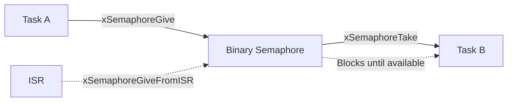

# Lab 1: Binary Semaphores (45 นาที)

## 🎯 วัตถุประสงค์
- เข้าใจหลักการทำงานของ Binary Semaphore
- เรียนรู้การใช้ Semaphore สำหรับ Task Synchronization
- ฝึกการใช้งาน Semaphore ในการสื่สารระหว่าง Task และ ISR
- เข้าใจความแตกต่างระหว่าง Queue และ Semaphore

## 📝 ความรู้เบื้องต้น
Binary Semaphore มีค่าได้เพียง 0 หรือ 1 ใช้สำหรับ:
- **Task Synchronization**: รอให้เหตุการณ์เกิดขึ้น
- **ISR to Task Communication**: ส่งสัญญาณจาก ISR ไปยัง Task
- **Resource Signaling**: แจ้งให้ทราบว่าทรัพยากรพร้อมใช้งาน



## 🛠️ การเตรียมโปรเจค

### 1. สร้างโปรเจคใหม่
```bash
idf.py create-project binary_semaphores
cd binary_semaphores
```

### 2. แก้ไข main.c

```c
#include <stdio.h>
#include <stdint.h>
#include <string.h>
#include "freertos/FreeRTOS.h"
#include "freertos/task.h"
#include "freertos/semphr.h"
#include "esp_log.h"
#include "driver/gpio.h"
#include "driver/gptimer.h"
#include "esp_random.h"

static const char *TAG = "BINARY_SEM";

// LED pins
#define LED_PRODUCER GPIO_NUM_2
#define LED_CONSUMER GPIO_NUM_4
#define LED_TIMER GPIO_NUM_5
#define BUTTON_PIN GPIO_NUM_0

// Semaphore handles
SemaphoreHandle_t xBinarySemaphore;
SemaphoreHandle_t xTimerSemaphore;
SemaphoreHandle_t xButtonSemaphore;

// Timer handle
gptimer_handle_t gptimer = NULL;

// Statistics
typedef struct {
    uint32_t signals_sent;
    uint32_t signals_received;
    uint32_t timer_events;
    uint32_t button_presses;
} semaphore_stats_t;

semaphore_stats_t stats = {0, 0, 0, 0};

// Timer callback function (ISR context)
static bool IRAM_ATTR timer_callback(gptimer_handle_t timer, 
                                    const gptimer_alarm_event_data_t *edata, 
                                    void *user_data) {
    BaseType_t xHigherPriorityTaskWoken = pdFALSE;
    
    // Give semaphore from ISR
    xSemaphoreGiveFromISR(xTimerSemaphore, &xHigherPriorityTaskWoken);
    
    // Return whether a higher priority task was unblocked
    return xHigherPriorityTaskWoken == pdTRUE;
}

// Button interrupt handler (ISR context)
static void IRAM_ATTR button_isr_handler(void* arg) {
    BaseType_t xHigherPriorityTaskWoken = pdFALSE;
    
    // Give semaphore from ISR
    xSemaphoreGiveFromISR(xButtonSemaphore, &xHigherPriorityTaskWoken);
    
    // Wake up higher priority task if needed
    portYIELD_FROM_ISR(xHigherPriorityTaskWoken);
}

// Producer task - generates events periodically
void producer_task(void *pvParameters) {
    int event_counter = 0;
    
    ESP_LOGI(TAG, "Producer task started");
    
    while (1) {
        // Simulate work/event generation
        vTaskDelay(pdMS_TO_TICKS(2000 + (esp_random() % 3000))); // 2-5 seconds
        
        event_counter++;
        ESP_LOGI(TAG, "🔥 Producer: Generating event #%d", event_counter);
        
        // Give binary semaphore (signal the event)
        if (xSemaphoreGive(xBinarySemaphore) == pdTRUE) {
            stats.signals_sent++;
            ESP_LOGI(TAG, "✓ Producer: Event signaled successfully");
            
            // Blink producer LED
            gpio_set_level(LED_PRODUCER, 1);
            vTaskDelay(pdMS_TO_TICKS(100));
            gpio_set_level(LED_PRODUCER, 0);
        } else {
            ESP_LOGW(TAG, "✗ Producer: Failed to signal (semaphore already given?)");
        }
    }
}

// Consumer task - waits for events
void consumer_task(void *pvParameters) {
    ESP_LOGI(TAG, "Consumer task started - waiting for events...");
    
    while (1) {
        // Wait for binary semaphore (wait for event)
        ESP_LOGI(TAG, "🔍 Consumer: Waiting for event...");
        
        if (xSemaphoreTake(xBinarySemaphore, pdMS_TO_TICKS(10000)) == pdTRUE) {
            stats.signals_received++;
            ESP_LOGI(TAG, "⚡ Consumer: Event received! Processing...");
            
            // Turn on consumer LED during processing
            gpio_set_level(LED_CONSUMER, 1);
            
            // Simulate event processing
            vTaskDelay(pdMS_TO_TICKS(1000 + (esp_random() % 2000))); // 1-3 seconds
            
            gpio_set_level(LED_CONSUMER, 0);
            ESP_LOGI(TAG, "✓ Consumer: Event processed successfully");
            
        } else {
            ESP_LOGW(TAG, "⏰ Consumer: Timeout waiting for event");
        }
    }
}

// Timer event handler task
void timer_event_task(void *pvParameters) {
    ESP_LOGI(TAG, "Timer event task started");
    
    while (1) {
        // Wait for timer semaphore from ISR
        if (xSemaphoreTake(xTimerSemaphore, portMAX_DELAY) == pdTRUE) {
            stats.timer_events++;
            ESP_LOGI(TAG, "⏱️  Timer: Periodic timer event #%lu", stats.timer_events);
            
            // Blink timer LED
            gpio_set_level(LED_TIMER, 1);
            vTaskDelay(pdMS_TO_TICKS(200));
            gpio_set_level(LED_TIMER, 0);
            
            // Show statistics every 5 timer events
            if (stats.timer_events % 5 == 0) {
                ESP_LOGI(TAG, "📊 Stats - Sent:%lu, Received:%lu, Timer:%lu, Button:%lu", 
                        stats.signals_sent, stats.signals_received, 
                        stats.timer_events, stats.button_presses);
            }
        }
    }
}

// Button event handler task
void button_event_task(void *pvParameters) {
    ESP_LOGI(TAG, "Button event task started");
    
    while (1) {
        // Wait for button semaphore from ISR
        if (xSemaphoreTake(xButtonSemaphore, portMAX_DELAY) == pdTRUE) {
            stats.button_presses++;
            ESP_LOGI(TAG, "🔘 Button: Press detected #%lu", stats.button_presses);
            
            // Debounce delay
            vTaskDelay(pdMS_TO_TICKS(300));
            
            // Trigger immediate event to producer
            ESP_LOGI(TAG, "🚀 Button: Triggering immediate producer event");
            xSemaphoreGive(xBinarySemaphore);
            stats.signals_sent++;
        }
    }
}

// System monitor task
void monitor_task(void *pvParameters) {
    ESP_LOGI(TAG, "System monitor started");
    
    while (1) {
        vTaskDelay(pdMS_TO_TICKS(15000)); // Every 15 seconds
        
        ESP_LOGI(TAG, "\n═══ SEMAPHORE SYSTEM MONITOR ═══");
        ESP_LOGI(TAG, "Binary Semaphore Available: %s", 
                uxSemaphoreGetCount(xBinarySemaphore) ? "YES" : "NO");
        ESP_LOGI(TAG, "Timer Semaphore Count: %d", 
                uxSemaphoreGetCount(xTimerSemaphore));
        ESP_LOGI(TAG, "Button Semaphore Count: %d", 
                uxSemaphoreGetCount(xButtonSemaphore));
        
        ESP_LOGI(TAG, "Event Statistics:");
        ESP_LOGI(TAG, "  Producer Events: %lu", stats.signals_sent);
        ESP_LOGI(TAG, "  Consumer Events: %lu", stats.signals_received);
        ESP_LOGI(TAG, "  Timer Events:    %lu", stats.timer_events);
        ESP_LOGI(TAG, "  Button Presses:  %lu", stats.button_presses);
        
        float efficiency = stats.signals_sent > 0 ? 
                          (float)stats.signals_received / stats.signals_sent * 100 : 0;
        ESP_LOGI(TAG, "  System Efficiency: %.1f%%", efficiency);
        ESP_LOGI(TAG, "══════════════════════════════\n");
    }
}

void app_main(void) {
    ESP_LOGI(TAG, "Binary Semaphores Lab Starting...");
    
    // Configure LED pins
    gpio_set_direction(LED_PRODUCER, GPIO_MODE_OUTPUT);
    gpio_set_direction(LED_CONSUMER, GPIO_MODE_OUTPUT);
    gpio_set_direction(LED_TIMER, GPIO_MODE_OUTPUT);
    
    // Configure button pin
    gpio_set_direction(BUTTON_PIN, GPIO_MODE_INPUT);
    gpio_set_pull_mode(BUTTON_PIN, GPIO_PULLUP_ONLY);
    gpio_set_intr_type(BUTTON_PIN, GPIO_INTR_NEGEDGE);
    
    // Turn off all LEDs
    gpio_set_level(LED_PRODUCER, 0);
    gpio_set_level(LED_CONSUMER, 0);
    gpio_set_level(LED_TIMER, 0);
    
    // Create binary semaphores
    xBinarySemaphore = xSemaphoreCreateBinary();
    xTimerSemaphore = xSemaphoreCreateBinary();
    xButtonSemaphore = xSemaphoreCreateBinary();
    
    if (xBinarySemaphore && xTimerSemaphore && xButtonSemaphore) {
        ESP_LOGI(TAG, "All semaphores created successfully");
        
        // Install GPIO ISR service
        gpio_install_isr_service(0);
        gpio_isr_handler_add(BUTTON_PIN, button_isr_handler, NULL);
        
        // Create and configure timer
        gptimer_config_t timer_config = {
            .clk_src = GPTIMER_CLK_SRC_DEFAULT,
            .direction = GPTIMER_COUNT_UP,
            .resolution_hz = 1000000, // 1MHz, 1 tick=1us
        };
        ESP_ERROR_CHECK(gptimer_new_timer(&timer_config, &gptimer));
        
        gptimer_event_callbacks_t cbs = {
            .on_alarm = timer_callback,
        };
        ESP_ERROR_CHECK(gptimer_register_event_callbacks(gptimer, &cbs, NULL));
        ESP_ERROR_CHECK(gptimer_enable(gptimer));
        
        // Set timer alarm (every 8 seconds)
        gptimer_alarm_config_t alarm_config = {
            .alarm_count = 8000000, // 8 seconds
            .reload_count = 0,
            .flags.auto_reload_on_alarm = true,
        };
        ESP_ERROR_CHECK(gptimer_set_alarm_action(gptimer, &alarm_config));
        ESP_ERROR_CHECK(gptimer_start(gptimer));
        
        ESP_LOGI(TAG, "Timer configured for 8-second intervals");
        
        // Create tasks
        xTaskCreate(producer_task, "Producer", 2048, NULL, 3, NULL);
        xTaskCreate(consumer_task, "Consumer", 2048, NULL, 2, NULL);
        xTaskCreate(timer_event_task, "TimerEvent", 2048, NULL, 2, NULL);
        xTaskCreate(button_event_task, "ButtonEvent", 2048, NULL, 4, NULL);
        xTaskCreate(monitor_task, "Monitor", 2048, NULL, 1, NULL);
        
        ESP_LOGI(TAG, "All tasks created. System operational.");
        ESP_LOGI(TAG, "💡 Press the BOOT button (GPIO0) to trigger immediate events!");
        
    } else {
        ESP_LOGE(TAG, "Failed to create semaphores!");
    }
}
```

## 🧪 การทดลอง

### ทดลองที่ 1: การทำงานปกติ
1. Build และ Flash โปรแกรม
2. เปิด Serial Monitor
3. สังเกตการทำงาน:
   - Producer สร้าง event ทุก 2-5 วินาที
   - Consumer รอและประมวลผล event
   - Timer event ทุก 8 วินาที
   - กด BOOT button เพื่อสร้าง event ทันที

### ทดลองที่ 2: การทดสอบ Multiple Give
แก้ไขใน `producer_task` เพื่อ give หลายครั้ง:
```c
for (int i = 0; i < 3; i++) {
    xSemaphoreGive(xBinarySemaphore);
    vTaskDelay(pdMS_TO_TICKS(100));
}
```

### ทดลองที่ 3: การทดสอบ Timeout
แก้ไขใน `consumer_task` เพื่อใช้ timeout สั้น:
```c
if (xSemaphoreTake(xBinarySemaphore, pdMS_TO_TICKS(3000)) == pdTRUE) {
```

## 📊 การสังเกตและบันทึกผล

### ตารางบันทึกผล
| ทดลอง | Events Sent | Events Received | Timer Events | Button Presses | Efficiency |
|-------|-------------|-----------------|--------------|----------------|------------|
| 1 (Normal) | | | | | |
| 2 (Multiple Give) | | | | | |
| 3 (Short Timeout) | | | | | |

### คำถามสำหรับการทดลоง
1. เมื่อ give semaphore หลายครั้งติดต่อกัน จะเกิดอะไรขึ้น?
2. ISR สามารถใช้ `xSemaphoreGive` หรือต้องใช้ `xSemaphoreGiveFromISR`?
3. Binary Semaphore แตกต่างจาก Queue อย่างไร?

## 📋 สรุปผลการทดลอง

### สิ่งที่เรียนรู้:
- [ ] หลักการทำงานของ Binary Semaphore
- [ ] การใช้ Semaphore สำหรับ Task Synchronization
- [ ] การสื่สารระหว่าง ISR และ Task
- [ ] การใช้ Timer interrupt กับ Semaphore
- [ ] การจัดการ Button interrupt

### APIs ที่ใช้:
- `xSemaphoreCreateBinary()` - สร้าง Binary Semaphore
- `xSemaphoreGive()` - ให้ semaphore (signal)
- `xSemaphoreTake()` - รับ semaphore (wait)
- `xSemaphoreGiveFromISR()` - ให้ semaphore จาก ISR
- `uxSemaphoreGetCount()` - ตรวจสอบสถานะ semaphore

### ข้อสำคัญ:
- Binary Semaphore มีค่าได้เพียง 0 หรือ 1
- การ Give หลายครั้งไม่เพิ่มค่า count
- ใช้ ISR-safe functions ใน interrupt handlers
- เหมาะสำหรับ event notification และ synchronization

## 🚀 ความท้าทายเพิ่มเติม

1. **Multiple Consumers**: เพิ่ม Consumer task หลายตัว
2. **Priority Testing**: ทดสอบ task priorities ต่างกัน
3. **Timeout Handling**: จัดการ timeout อย่างสมเหตุผล
4. **Performance Analysis**: วัดเวลาตอบสนองของระบบ
5. **Error Recovery**: จัดการเมื่อ semaphore ล้มเหลว

## 📚 เอกสารอ้างอิง

- [FreeRTOS Binary Semaphores](https://www.freertos.org/Embedded-RTOS-Binary-Semaphores.html)
- [ESP-IDF Semaphore API](https://docs.espressif.com/projects/esp-idf/en/latest/esp32/api-reference/system/freertos.html#semaphores)
- [Task Synchronization Patterns](https://www.freertos.org/RTOS-task-synchronisation.html)