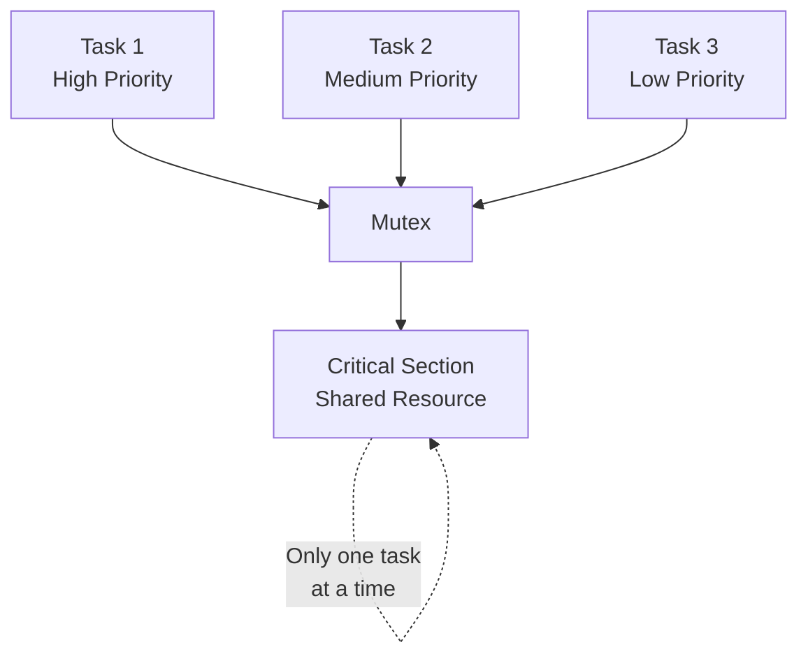

# Lab 2: Mutex and Critical Sections (45 นาที)

## 🎯 วัตถุประสงค์
- เข้าใจปัญหา Race Condition และ Critical Section
- เรียนรู้การใช้ Mutex สำหรับป้องกัน Shared Resources
- ทำความเข้าใจ Priority Inheritance Mechanism
- ฝึกการ Debug และแก้ไขปัญหา Data Corruption

## 📝 ความรู้เบื้องต้น
**Mutex (Mutual Exclusion)** ใช้สำหรับป้องกันการเข้าถึง shared resources พร้อมกัน:
- เฉพาะ Task เดียวที่สามารถถือ Mutex ได้ในแต่ละเวลา
- มี Priority Inheritance เพื่อป้องกัน Priority Inversion
- ใช้สำหรับป้องกัน Critical Sections



## 🛠️ การเตรียมโปรเจค

### 1. สร้างโปรเจคใหม่
```bash
idf.py create-project mutex_critical_sections
cd mutex_critical_sections
```

### 2. แก้ไข main.c

```c
#include <stdio.h>
#include <stdint.h>
#include <string.h>
#include "freertos/FreeRTOS.h"
#include "freertos/task.h"
#include "freertos/semphr.h"
#include "esp_log.h"
#include "driver/gpio.h"
#include "esp_random.h"

static const char *TAG = "MUTEX_LAB";

// LED pins for different tasks
#define LED_TASK1 GPIO_NUM_2
#define LED_TASK2 GPIO_NUM_4
#define LED_TASK3 GPIO_NUM_5
#define LED_CRITICAL GPIO_NUM_18

// Mutex handle
SemaphoreHandle_t xMutex;

// Shared resources (these need protection!)
typedef struct {
    uint32_t counter;
    char shared_buffer[100];
    uint32_t checksum;
    uint32_t access_count;
} shared_resource_t;

shared_resource_t shared_data = {0, "", 0, 0};

// Statistics for race condition detection
typedef struct {
    uint32_t successful_access;
    uint32_t failed_access;
    uint32_t corruption_detected;
    uint32_t priority_inversions;
} access_stats_t;

access_stats_t stats = {0, 0, 0, 0};

// Function to calculate simple checksum
uint32_t calculate_checksum(const char* data, uint32_t counter) {
    uint32_t sum = counter;
    for (int i = 0; data[i] != '\0'; i++) {
        sum += (uint32_t)data[i] * (i + 1);
    }
    return sum;
}

// Critical section function (simulates accessing shared resource)
void access_shared_resource(int task_id, const char* task_name, gpio_num_t led_pin) {
    char temp_buffer[100];
    uint32_t temp_counter;
    uint32_t expected_checksum;
    
    ESP_LOGI(TAG, "[%s] Requesting access to shared resource...", task_name);
    
    // Try to take mutex with timeout
    if (xSemaphoreTake(xMutex, pdMS_TO_TICKS(5000)) == pdTRUE) {
        ESP_LOGI(TAG, "[%s] ✓ Mutex acquired - entering critical section", task_name);
        stats.successful_access++;
        
        // Turn on LED to show critical section access
        gpio_set_level(led_pin, 1);
        gpio_set_level(LED_CRITICAL, 1);
        
        // === CRITICAL SECTION BEGINS ===
        
        // Read current state
        temp_counter = shared_data.counter;
        strcpy(temp_buffer, shared_data.shared_buffer);
        expected_checksum = shared_data.checksum;
        
        // Verify data integrity before modification
        uint32_t calculated_checksum = calculate_checksum(temp_buffer, temp_counter);
        if (calculated_checksum != expected_checksum && shared_data.access_count > 0) {
            ESP_LOGE(TAG, "[%s] ⚠️  DATA CORRUPTION DETECTED!", task_name);
            ESP_LOGE(TAG, "Expected checksum: %lu, Calculated: %lu", 
                    expected_checksum, calculated_checksum);
            stats.corruption_detected++;
        }
        
        ESP_LOGI(TAG, "[%s] Current state - Counter: %lu, Buffer: '%s'", 
                task_name, temp_counter, temp_buffer);
        
        // Simulate some processing time (this makes race conditions more likely)
        vTaskDelay(pdMS_TO_TICKS(500 + (esp_random() % 1000)));
        
        // Modify shared data
        shared_data.counter = temp_counter + 1;
        snprintf(shared_data.shared_buffer, sizeof(shared_data.shared_buffer), 
                "Modified by %s #%lu", task_name, shared_data.counter);
        shared_data.checksum = calculate_checksum(shared_data.shared_buffer, shared_data.counter);
        shared_data.access_count++;
        
        ESP_LOGI(TAG, "[%s] ✓ Modified - Counter: %lu, Buffer: '%s'", 
                task_name, shared_data.counter, shared_data.shared_buffer);
        
        // More processing time
        vTaskDelay(pdMS_TO_TICKS(200 + (esp_random() % 500)));
        
        // === CRITICAL SECTION ENDS ===
        
        // Turn off LEDs
        gpio_set_level(led_pin, 0);
        gpio_set_level(LED_CRITICAL, 0);
        
        // Release mutex
        xSemaphoreGive(xMutex);
        ESP_LOGI(TAG, "[%s] Mutex released", task_name);
        
    } else {
        ESP_LOGW(TAG, "[%s] ✗ Failed to acquire mutex (timeout)", task_name);
        stats.failed_access++;
        
        // Flash LED to indicate failed access
        for (int i = 0; i < 3; i++) {
            gpio_set_level(led_pin, 1);
            vTaskDelay(pdMS_TO_TICKS(100));
            gpio_set_level(led_pin, 0);
            vTaskDelay(pdMS_TO_TICKS(100));
        }
    }
}

// High priority task
void high_priority_task(void *pvParameters) {
    ESP_LOGI(TAG, "High Priority Task started (Priority: %d)", uxTaskPriorityGet(NULL));
    
    while (1) {
        access_shared_resource(1, "HIGH_PRI", LED_TASK1);
        
        // This task runs less frequently but has higher priority
        vTaskDelay(pdMS_TO_TICKS(5000 + (esp_random() % 3000))); // 5-8 seconds
    }
}

// Medium priority task
void medium_priority_task(void *pvParameters) {
    ESP_LOGI(TAG, "Medium Priority Task started (Priority: %d)", uxTaskPriorityGet(NULL));
    
    while (1) {
        access_shared_resource(2, "MED_PRI", LED_TASK2);
        
        // Medium frequency
        vTaskDelay(pdMS_TO_TICKS(3000 + (esp_random() % 2000))); // 3-5 seconds
    }
}

// Low priority task  
void low_priority_task(void *pvParameters) {
    ESP_LOGI(TAG, "Low Priority Task started (Priority: %d)", uxTaskPriorityGet(NULL));
    
    while (1) {
        access_shared_resource(3, "LOW_PRI", LED_TASK3);
        
        // High frequency (runs most often)
        vTaskDelay(pdMS_TO_TICKS(2000 + (esp_random() % 1000))); // 2-3 seconds
    }
}

// Priority inversion simulation task
void priority_inversion_task(void *pvParameters) {
    ESP_LOGI(TAG, "Priority Inversion Monitor started");
    
    while (1) {
        vTaskDelay(pdMS_TO_TICKS(10000)); // Check every 10 seconds
        
        // Simulate CPU-intensive work that could cause priority inversion
        ESP_LOGI(TAG, "🔄 Simulating CPU-intensive background work...");
        
        // This simulates a scenario where a low-priority task holds the mutex
        // and a medium-priority CPU-intensive task prevents it from releasing
        uint32_t start_time = xTaskGetTickCount();
        for (volatile int i = 0; i < 1000000; i++) {
            // Busy wait to consume CPU
        }
        uint32_t end_time = xTaskGetTickCount();
        
        ESP_LOGI(TAG, "Background work completed in %lu ms", 
                (end_time - start_time) * portTICK_PERIOD_MS);
    }
}

// System monitor and statistics task
void monitor_task(void *pvParameters) {
    ESP_LOGI(TAG, "System monitor started");
    
    while (1) {
        vTaskDelay(pdMS_TO_TICKS(15000)); // Every 15 seconds
        
        ESP_LOGI(TAG, "\n═══ MUTEX SYSTEM MONITOR ═══");
        ESP_LOGI(TAG, "Mutex Available: %s", 
                uxSemaphoreGetCount(xMutex) ? "YES" : "NO (Held by task)");
        ESP_LOGI(TAG, "Shared Resource State:");
        ESP_LOGI(TAG, "  Counter: %lu", shared_data.counter);
        ESP_LOGI(TAG, "  Buffer: '%s'", shared_data.shared_buffer);
        ESP_LOGI(TAG, "  Access Count: %lu", shared_data.access_count);
        ESP_LOGI(TAG, "  Checksum: %lu", shared_data.checksum);
        
        // Verify current data integrity
        uint32_t current_checksum = calculate_checksum(shared_data.shared_buffer, 
                                                      shared_data.counter);
        if (current_checksum != shared_data.checksum && shared_data.access_count > 0) {
            ESP_LOGE(TAG, "⚠️  CURRENT DATA CORRUPTION DETECTED!");
            stats.corruption_detected++;
        }
        
        ESP_LOGI(TAG, "Access Statistics:");
        ESP_LOGI(TAG, "  Successful: %lu", stats.successful_access);
        ESP_LOGI(TAG, "  Failed:     %lu", stats.failed_access);
        ESP_LOGI(TAG, "  Corrupted:  %lu", stats.corruption_detected);
        ESP_LOGI(TAG, "  Success Rate: %.1f%%", 
                stats.successful_access + stats.failed_access > 0 ?
                (float)stats.successful_access / 
                (stats.successful_access + stats.failed_access) * 100 : 0);
        ESP_LOGI(TAG, "══════════════════════════\n");
    }
}

// Race condition demonstration task (for educational purposes)
void race_condition_demo_task(void *pvParameters) {
    static bool demo_enabled = false;
    
    ESP_LOGI(TAG, "Race Condition Demo task started (initially disabled)");
    
    while (1) {
        vTaskDelay(pdMS_TO_TICKS(30000)); // Every 30 seconds
        
        if (!demo_enabled) {
            ESP_LOGW(TAG, "\n🎭 DEMONSTRATION: Simulating race condition...");
            ESP_LOGW(TAG, "Temporarily bypassing mutex for educational purposes");
            demo_enabled = true;
            
            // Simulate unsafe access without mutex (DON'T DO THIS IN REAL CODE!)
            ESP_LOGW(TAG, "⚠️  UNSAFE ACCESS - NO MUTEX PROTECTION");
            
            // This would normally cause data corruption
            uint32_t temp = shared_data.counter;
            vTaskDelay(pdMS_TO_TICKS(100)); // Context switch opportunity
            shared_data.counter = temp + 100; // Potentially corrupted increment
            strcpy(shared_data.shared_buffer, "UNSAFE ACCESS - DEMO ONLY");
            
            ESP_LOGW(TAG, "Demo complete - race condition may have occurred");
            ESP_LOGW(TAG, "In real applications, ALWAYS use proper synchronization!\n");
            
            vTaskDelay(pdMS_TO_TICKS(5000));
            demo_enabled = false;
        }
    }
}

void app_main(void) {
    ESP_LOGI(TAG, "Mutex and Critical Sections Lab Starting...");
    
    // Configure LED pins
    gpio_set_direction(LED_TASK1, GPIO_MODE_OUTPUT);
    gpio_set_direction(LED_TASK2, GPIO_MODE_OUTPUT);
    gpio_set_direction(LED_TASK3, GPIO_MODE_OUTPUT);
    gpio_set_direction(LED_CRITICAL, GPIO_MODE_OUTPUT);
    
    // Turn off all LEDs
    gpio_set_level(LED_TASK1, 0);
    gpio_set_level(LED_TASK2, 0);
    gpio_set_level(LED_TASK3, 0);
    gpio_set_level(LED_CRITICAL, 0);
    
    // Create mutex
    xMutex = xSemaphoreCreateMutex();
    
    if (xMutex != NULL) {
        ESP_LOGI(TAG, "Mutex created successfully");
        
        // Initialize shared resource
        shared_data.counter = 0;
        strcpy(shared_data.shared_buffer, "Initial state");
        shared_data.checksum = calculate_checksum(shared_data.shared_buffer, shared_data.counter);
        shared_data.access_count = 0;
        
        // Create tasks with different priorities
        xTaskCreate(high_priority_task, "HighPri", 3072, NULL, 5, NULL);
        xTaskCreate(medium_priority_task, "MedPri", 3072, NULL, 3, NULL);
        xTaskCreate(low_priority_task, "LowPri", 3072, NULL, 2, NULL);
        xTaskCreate(priority_inversion_task, "PrioInv", 2048, NULL, 4, NULL);
        xTaskCreate(monitor_task, "Monitor", 3072, NULL, 1, NULL);
        xTaskCreate(race_condition_demo_task, "RaceDemo", 2048, NULL, 1, NULL);
        
        ESP_LOGI(TAG, "All tasks created with priorities:");
        ESP_LOGI(TAG, "  High Priority Task: 5");
        ESP_LOGI(TAG, "  Priority Inversion: 4"); 
        ESP_LOGI(TAG, "  Medium Priority:    3");
        ESP_LOGI(TAG, "  Low Priority:       2");
        ESP_LOGI(TAG, "  Monitor & Demo:     1");
        ESP_LOGI(TAG, "\nSystem operational - watch for mutex contention!");
        
        // LED startup sequence
        for (int i = 0; i < 2; i++) {
            gpio_set_level(LED_TASK1, 1);
            vTaskDelay(pdMS_TO_TICKS(200));
            gpio_set_level(LED_TASK1, 0);
            gpio_set_level(LED_TASK2, 1);
            vTaskDelay(pdMS_TO_TICKS(200));
            gpio_set_level(LED_TASK2, 0);
            gpio_set_level(LED_TASK3, 1);
            vTaskDelay(pdMS_TO_TICKS(200));
            gpio_set_level(LED_TASK3, 0);
            gpio_set_level(LED_CRITICAL, 1);
            vTaskDelay(pdMS_TO_TICKS(200));
            gpio_set_level(LED_CRITICAL, 0);
            vTaskDelay(pdMS_TO_TICKS(300));
        }
        
    } else {
        ESP_LOGE(TAG, "Failed to create mutex!");
    }
}
```

## 🧪 การทดลอง

### ทดลองที่ 1: การทำงานกับ Mutex
1. รันโปรแกรมและสังเกต 10 นาที
2. สังเกต LED กะพริบ:
   - LED แต่ละตัว = Task ที่เข้าถึง shared resource
   - LED_CRITICAL = มีการเข้าถึง critical section
3. ตรวจสอบ corruption detection

### ทดลองที่ 2: ปิด Mutex (เพื่อดู Race Condition)
Comment out mutex operations:
```c
// if (xSemaphoreTake(xMutex, pdMS_TO_TICKS(5000)) == pdTRUE) {
    // ... critical section code ...
// xSemaphoreGive(xMutex);
// }
```

### ทดลองที่ 3: ปรับ Priority
เปลี่ยน priority ของ tasks:
```c
xTaskCreate(high_priority_task, "HighPri", 3072, NULL, 2, NULL); // ลด priority
xTaskCreate(low_priority_task, "LowPri", 3072, NULL, 5, NULL);   // เพิ่ม priority
```

## 📊 การสังเกตและบันทึกผล

### ตารางผลการทดลอง
| ทดลอง | Successful | Failed | Corrupted | Success Rate | สังเกต |
|-------|------------|--------|-----------|-------------|---------|
| 1 (With Mutex) | | | | | |
| 2 (No Mutex) | | | | | |
| 3 (Changed Priority) | | | | | |

### คำถามสำหรับการทดลอง
1. เมื่อไม่ใช้ Mutex จะเกิด data corruption หรือไม่?
2. Priority Inheritance ทำงานอย่างไร?
3. Task priority มีผลต่อการเข้าถึง shared resource อย่างไร?

## 📋 สรุปผลการทดลอง

### สิ่งที่เรียนรู้:
- [ ] หลักการทำงานของ Mutex
- [ ] การป้องกัน Race Condition
- [ ] Priority Inheritance Mechanism
- [ ] การตรวจจับ Data Corruption
- [ ] Critical Section Management

### APIs ที่ใช้:
- `xSemaphoreCreateMutex()` - สร้าง Mutex
- `xSemaphoreTake()` - ขอ Mutex (เข้า critical section)
- `xSemaphoreGive()` - คืน Mutex (ออกจาก critical section)
- `uxSemaphoreGetCount()` - ตรวจสอบสถานะ Mutex

### ความแตกต่าง Mutex vs Binary Semaphore:
| คุณสมบัติ | Mutex | Binary Semaphore |
|-----------|--------|------------------|
| Owner | มี (task ที่ถือ) | ไม่มี |
| Priority Inheritance | มี | ไม่มี |
| Recursive | สามารถ | ไม่สามารถ |
| การใช้งาน | Mutual Exclusion | Signaling |

## 🚀 ความท้าทายเพิ่มเติม

1. **Recursive Mutex**: ทดลองใช้ `xSemaphoreCreateRecursiveMutex()`
2. **Deadlock Prevention**: สร้างสถานการณ์ deadlock และแก้ไข
3. **Performance Impact**: วัดผลกระทบของ mutex ต่อประสิทธิภาพ
4. **Multiple Resources**: ใช้หลาย mutex สำหรับ resources ต่างกัน
5. **Lock-free Programming**: เปรียบเทียบกับ atomic operations

## 📚 เอกสารอ้างอิง

- [FreeRTOS Mutexes](https://www.freertos.org/Real-time-embedded-RTOS-mutexes.html)
- [Priority Inheritance](https://www.freertos.org/RTOS-mutex-priority-inheritance.html)
- [Critical Sections](https://en.wikipedia.org/wiki/Critical_section)