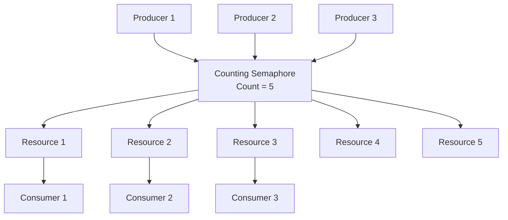

# Lab 3: Counting Semaphores (30 นาที)

## 🎯 วัตถุประสงค์
- เข้าใจหลักการทำงานของ Counting Semaphore
- เรียนรู้การใช้ Counting Semaphore สำหรับจัดการ Resource Pool
- ฝึกการออกแบบ Resource Management System
- เข้าใจความแตกต่างระหว่าง Binary และ Counting Semaphore

## 📝 ความรู้เบื้องต้น
**Counting Semaphore** สามารถมีค่าได้มากกว่า 1 ใช้สำหรับ:
- **Resource Pool Management**: จัดการทรัพยากรที่มีจำนวนจำกัด
- **Rate Limiting**: จำกัดจำนวนการทำงานพร้อมกัน
- **Buffer Management**: ควบคุมพื้นที่ buffer



## 🛠️ การเตรียมโปรเจค

### 1. สร้างโปรเจคใหม่
```bash
idf.py create-project counting_semaphores
cd counting_semaphores
```

### 2. แก้ไข main.c

```c
#include <stdio.h>
#include <stdint.h>
#include <string.h>
#include "freertos/FreeRTOS.h"
#include "freertos/task.h"
#include "freertos/semphr.h"
#include "esp_log.h"
#include "driver/gpio.h"
#include "esp_random.h"

static const char *TAG = "COUNTING_SEM";

// LED pins for visualization
#define LED_RESOURCE_1 GPIO_NUM_2
#define LED_RESOURCE_2 GPIO_NUM_4
#define LED_RESOURCE_3 GPIO_NUM_5
#define LED_PRODUCER GPIO_NUM_18
#define LED_SYSTEM GPIO_NUM_19

// Configuration
#define MAX_RESOURCES 3  // Maximum number of resources available
#define NUM_PRODUCERS 5  // Number of producer tasks
#define NUM_CONSUMERS 3  // Number of consumer tasks

// Semaphore handle
SemaphoreHandle_t xCountingSemaphore;

// Resource management
typedef struct {
    int resource_id;
    bool in_use;
    char current_user[20];
    uint32_t usage_count;
    uint32_t total_usage_time;
} resource_t;

resource_t resources[MAX_RESOURCES] = {
    {1, false, "", 0, 0},
    {2, false, "", 0, 0},
    {3, false, "", 0, 0}
};

// System statistics
typedef struct {
    uint32_t total_requests;
    uint32_t successful_acquisitions;
    uint32_t failed_acquisitions;
    uint32_t resources_in_use;
    uint32_t average_wait_time;
} system_stats_t;

system_stats_t stats = {0, 0, 0, 0, 0};

// Find available resource and mark as in use
int acquire_resource(const char* user_name) {
    for (int i = 0; i < MAX_RESOURCES; i++) {
        if (!resources[i].in_use) {
            resources[i].in_use = true;
            strcpy(resources[i].current_user, user_name);
            resources[i].usage_count++;
            
            // Turn on corresponding LED
            switch (i) {
                case 0: gpio_set_level(LED_RESOURCE_1, 1); break;
                case 1: gpio_set_level(LED_RESOURCE_2, 1); break;
                case 2: gpio_set_level(LED_RESOURCE_3, 1); break;
            }
            
            stats.resources_in_use++;
            return i; // Return resource index
        }
    }
    return -1; // No resource available
}

// Release resource and mark as available
void release_resource(int resource_index, uint32_t usage_time) {
    if (resource_index >= 0 && resource_index < MAX_RESOURCES) {
        resources[resource_index].in_use = false;
        strcpy(resources[resource_index].current_user, "");
        resources[resource_index].total_usage_time += usage_time;
        
        // Turn off corresponding LED
        switch (resource_index) {
            case 0: gpio_set_level(LED_RESOURCE_1, 0); break;
            case 1: gpio_set_level(LED_RESOURCE_2, 0); break;
            case 2: gpio_set_level(LED_RESOURCE_3, 0); break;
        }
        
        stats.resources_in_use--;
    }
}

// Producer task - requests resources
void producer_task(void *pvParameters) {
    int producer_id = *((int*)pvParameters);
    char task_name[20];
    snprintf(task_name, sizeof(task_name), "Producer%d", producer_id);
    
    ESP_LOGI(TAG, "%s started", task_name);
    
    while (1) {
        stats.total_requests++;
        
        ESP_LOGI(TAG, "🏭 %s: Requesting resource...", task_name);
        
        // Blink producer LED
        gpio_set_level(LED_PRODUCER, 1);
        vTaskDelay(pdMS_TO_TICKS(50));
        gpio_set_level(LED_PRODUCER, 0);
        
        uint32_t start_time = xTaskGetTickCount();
        
        // Try to acquire counting semaphore (resource from pool)
        if (xSemaphoreTake(xCountingSemaphore, pdMS_TO_TICKS(8000)) == pdTRUE) {
            uint32_t wait_time = (xTaskGetTickCount() - start_time) * portTICK_PERIOD_MS;
            stats.successful_acquisitions++;
            
            // Acquire actual resource
            int resource_idx = acquire_resource(task_name);
            
            if (resource_idx >= 0) {
                ESP_LOGI(TAG, "✓ %s: Acquired resource %d (wait: %lums)", 
                        task_name, resource_idx + 1, wait_time);
                
                // Simulate resource usage
                uint32_t usage_time = 1000 + (esp_random() % 3000); // 1-4 seconds
                ESP_LOGI(TAG, "🔧 %s: Using resource %d for %lums", 
                        task_name, resource_idx + 1, usage_time);
                
                vTaskDelay(pdMS_TO_TICKS(usage_time));
                
                // Release resource
                release_resource(resource_idx, usage_time);
                ESP_LOGI(TAG, "✓ %s: Released resource %d", task_name, resource_idx + 1);
                
                // Give back semaphore
                xSemaphoreGive(xCountingSemaphore);
                
            } else {
                ESP_LOGE(TAG, "✗ %s: Semaphore acquired but no resource available!", task_name);
                xSemaphoreGive(xCountingSemaphore); // Give back immediately
            }
            
        } else {
            stats.failed_acquisitions++;
            ESP_LOGW(TAG, "⏰ %s: Timeout waiting for resource", task_name);
        }
        
        // Wait before next request
        vTaskDelay(pdMS_TO_TICKS(2000 + (esp_random() % 3000))); // 2-5 seconds
    }
}

// Resource monitor task
void resource_monitor_task(void *pvParameters) {
    ESP_LOGI(TAG, "Resource monitor started");
    
    while (1) {
        vTaskDelay(pdMS_TO_TICKS(5000)); // Every 5 seconds
        
        int available_count = uxSemaphoreGetCount(xCountingSemaphore);
        int used_count = MAX_RESOURCES - available_count;
        
        ESP_LOGI(TAG, "\n📊 RESOURCE POOL STATUS");
        ESP_LOGI(TAG, "Available resources: %d/%d", available_count, MAX_RESOURCES);
        ESP_LOGI(TAG, "Resources in use: %d", used_count);
        
        // Show individual resource status
        for (int i = 0; i < MAX_RESOURCES; i++) {
            if (resources[i].in_use) {
                ESP_LOGI(TAG, "  Resource %d: BUSY (User: %s, Usage: %lu times)", 
                        i + 1, resources[i].current_user, resources[i].usage_count);
            } else {
                ESP_LOGI(TAG, "  Resource %d: FREE (Total usage: %lu times)", 
                        i + 1, resources[i].usage_count);
            }
        }
        
        // Visual representation
        printf("Pool: [");
        for (int i = 0; i < MAX_RESOURCES; i++) {
            printf(resources[i].in_use ? "■" : "□");
        }
        printf("] Available: %d\n", available_count);
        
        ESP_LOGI(TAG, "═══════════════════════════\n");
    }
}

// System statistics task
void statistics_task(void *pvParameters) {
    ESP_LOGI(TAG, "Statistics task started");
    
    while (1) {
        vTaskDelay(pdMS_TO_TICKS(12000)); // Every 12 seconds
        
        ESP_LOGI(TAG, "\n📈 SYSTEM STATISTICS");
        ESP_LOGI(TAG, "Total requests: %lu", stats.total_requests);
        ESP_LOGI(TAG, "Successful acquisitions: %lu", stats.successful_acquisitions);
        ESP_LOGI(TAG, "Failed acquisitions: %lu", stats.failed_acquisitions);
        ESP_LOGI(TAG, "Current resources in use: %lu", stats.resources_in_use);
        
        if (stats.total_requests > 0) {
            float success_rate = (float)stats.successful_acquisitions / stats.total_requests * 100;
            ESP_LOGI(TAG, "Success rate: %.1f%%", success_rate);
        }
        
        // Resource utilization statistics
        ESP_LOGI(TAG, "Resource utilization:");
        uint32_t total_usage = 0;
        for (int i = 0; i < MAX_RESOURCES; i++) {
            total_usage += resources[i].usage_count;
            ESP_LOGI(TAG, "  Resource %d: %lu uses, %lu total time", 
                    i + 1, resources[i].usage_count, resources[i].total_usage_time);
        }
        ESP_LOGI(TAG, "Total resource usage events: %lu", total_usage);
        ESP_LOGI(TAG, "════════════════════════════\n");
    }
}

// Load generator task (creates bursts of requests)
void load_generator_task(void *pvParameters) {
    ESP_LOGI(TAG, "Load generator started");
    
    while (1) {
        vTaskDelay(pdMS_TO_TICKS(20000)); // Every 20 seconds
        
        ESP_LOGW(TAG, "🚀 LOAD GENERATOR: Creating burst of requests...");
        
        // Flash system LED during load burst
        gpio_set_level(LED_SYSTEM, 1);
        
        // Create temporary high-demand scenario
        for (int burst = 0; burst < 3; burst++) {
            ESP_LOGI(TAG, "Load burst %d/3", burst + 1);
            
            // Try to acquire all resources quickly
            for (int i = 0; i < MAX_RESOURCES + 2; i++) {
                if (xSemaphoreTake(xCountingSemaphore, pdMS_TO_TICKS(100)) == pdTRUE) {
                    int res_idx = acquire_resource("LoadGen");
                    if (res_idx >= 0) {
                        ESP_LOGI(TAG, "LoadGen: Acquired resource %d", res_idx + 1);
                        vTaskDelay(pdMS_TO_TICKS(500)); // Hold briefly
                        release_resource(res_idx, 500);
                        ESP_LOGI(TAG, "LoadGen: Released resource %d", res_idx + 1);
                    }
                    xSemaphoreGive(xCountingSemaphore);
                } else {
                    ESP_LOGW(TAG, "LoadGen: Resource pool exhausted");
                }
                vTaskDelay(pdMS_TO_TICKS(200));
            }
            vTaskDelay(pdMS_TO_TICKS(1000));
        }
        
        gpio_set_level(LED_SYSTEM, 0);
        ESP_LOGI(TAG, "Load burst completed\n");
    }
}

void app_main(void) {
    ESP_LOGI(TAG, "Counting Semaphores Lab Starting...");
    
    // Configure LED pins
    gpio_set_direction(LED_RESOURCE_1, GPIO_MODE_OUTPUT);
    gpio_set_direction(LED_RESOURCE_2, GPIO_MODE_OUTPUT);
    gpio_set_direction(LED_RESOURCE_3, GPIO_MODE_OUTPUT);
    gpio_set_direction(LED_PRODUCER, GPIO_MODE_OUTPUT);
    gpio_set_direction(LED_SYSTEM, GPIO_MODE_OUTPUT);
    
    // Turn off all LEDs
    gpio_set_level(LED_RESOURCE_1, 0);
    gpio_set_level(LED_RESOURCE_2, 0);
    gpio_set_level(LED_RESOURCE_3, 0);
    gpio_set_level(LED_PRODUCER, 0);
    gpio_set_level(LED_SYSTEM, 0);
    
    // Create counting semaphore (initial count = max resources)
    xCountingSemaphore = xSemaphoreCreateCounting(MAX_RESOURCES, MAX_RESOURCES);
    
    if (xCountingSemaphore != NULL) {
        ESP_LOGI(TAG, "Counting semaphore created (max count: %d)", MAX_RESOURCES);
        
        // Producer task IDs (must be static for task parameters)
        static int producer_ids[NUM_PRODUCERS] = {1, 2, 3, 4, 5};
        
        // Create producer tasks
        for (int i = 0; i < NUM_PRODUCERS; i++) {
            char task_name[20];
            snprintf(task_name, sizeof(task_name), "Producer%d", i + 1);
            xTaskCreate(producer_task, task_name, 3072, &producer_ids[i], 3, NULL);
        }
        
        // Create monitoring tasks
        xTaskCreate(resource_monitor_task, "ResMonitor", 3072, NULL, 2, NULL);
        xTaskCreate(statistics_task, "Statistics", 3072, NULL, 1, NULL);
        xTaskCreate(load_generator_task, "LoadGen", 2048, NULL, 4, NULL);
        
        ESP_LOGI(TAG, "System created with:");
        ESP_LOGI(TAG, "  Resources: %d", MAX_RESOURCES);
        ESP_LOGI(TAG, "  Producers: %d", NUM_PRODUCERS);
        ESP_LOGI(TAG, "  Initial semaphore count: %d", MAX_RESOURCES);
        ESP_LOGI(TAG, "\nSystem operational - monitoring resource pool usage!");
        
        // LED startup sequence
        for (int cycle = 0; cycle < 2; cycle++) {
            gpio_set_level(LED_RESOURCE_1, 1);
            vTaskDelay(pdMS_TO_TICKS(150));
            gpio_set_level(LED_RESOURCE_2, 1);
            vTaskDelay(pdMS_TO_TICKS(150));
            gpio_set_level(LED_RESOURCE_3, 1);
            vTaskDelay(pdMS_TO_TICKS(150));
            gpio_set_level(LED_PRODUCER, 1);
            gpio_set_level(LED_SYSTEM, 1);
            vTaskDelay(pdMS_TO_TICKS(300));
            
            // Turn off all
            gpio_set_level(LED_RESOURCE_1, 0);
            gpio_set_level(LED_RESOURCE_2, 0);
            gpio_set_level(LED_RESOURCE_3, 0);
            gpio_set_level(LED_PRODUCER, 0);
            gpio_set_level(LED_SYSTEM, 0);
            vTaskDelay(pdMS_TO_TICKS(200));
        }
        
    } else {
        ESP_LOGE(TAG, "Failed to create counting semaphore!");
    }
}
```

## 🧪 การทดลอง

### ทดลองที่ 1: การทำงานปกติ
1. รันโปรแกรมและสังเกต 8 นาที
2. สังเกต LED:
   - LED_RESOURCE_x = ทรัพยากรกำลังถูกใช้งาน
   - LED_PRODUCER = มีการร้องขอทรัพยากร
   - LED_SYSTEM = Load burst กำลังทำงาน
3. บันทึกสถิติจาก Resource Monitor

### ทดลองที่ 2: เพิ่มจำนวน Resources
แก้ไขค่าคงที่:
```c
#define MAX_RESOURCES 5  // เพิ่มเป็น 5
```

### ทดลองที่ 3: เพิ่ม Producers
แก้ไขค่าคงที่:
```c
#define NUM_PRODUCERS 8  // เพิ่มเป็น 8
```

## 📊 การสังเกตและบันทึกผล

### ตารางผลการทดลอง
| ทดลอง | Resources | Producers | Success Rate | Avg Wait | Resource Utilization |
|-------|-----------|-----------|--------------|----------|---------------------|
| 1 (3R, 5P) | 3 | 5 | | | |
| 2 (5R, 5P) | 5 | 5 | | | |
| 3 (3R, 8P) | 3 | 8 | | | |

### คำถามสำหรับการทดลอง
1. เมื่อ Producers มากกว่า Resources จะเกิดอะไรขึ้น?
2. Load Generator มีผลต่อ Success Rate อย่างไร?
3. Counting Semaphore จัดการ Resource Pool อย่างไร?

## 📋 สรุปผลการทดลอง

### สิ่งที่เรียนรู้:
- [ ] หลักการทำงานของ Counting Semaphore
- [ ] การจัดการ Resource Pool
- [ ] Load Balancing และ Resource Contention
- [ ] Performance Monitoring และ Statistics
- [ ] Rate Limiting Applications

### APIs ที่ใช้:
- `xSemaphoreCreateCounting()` - สร้าง Counting Semaphore
- `xSemaphoreTake()` - ขอ resource จาก pool
- `xSemaphoreGive()` - คืน resource เข้า pool
- `uxSemaphoreGetCount()` - ตรวจสอบจำนวน available resources

### การประยุกต์ใช้:
1. **Database Connection Pool**: จำกัดจำนวน connections
2. **Network Bandwidth**: ควบคุม concurrent transfers
3. **Memory Buffer Pool**: จัดการ memory blocks
4. **Hardware Resource**: จำกัดการเข้าถึง peripherals
5. **Rate Limiting**: ควบคุม API call rates

## 🚀 ความท้าทายเพิ่มเติม

1. **Priority Resource Allocation**: จัดสรรตาม priority
2. **Resource Health Monitoring**: ตรวจสอบสถานะ resources
3. **Dynamic Pool Sizing**: ปรับขนาด pool ตามโหลด
4. **Resource Reservation**: จองทรัพยากรไว้ล่วงหน้า
5. **Fair Scheduling**: จัดสรรอย่างยุติธรรม

## 📚 เอกสารอ้างอิง

- [FreeRTOS Counting Semaphores](https://www.freertos.org/CreateCountingSemaphore.html)
- [Resource Pool Pattern](https://en.wikipedia.org/wiki/Object_pool_pattern)
- [Semaphore vs Mutex](https://www.freertos.org/Embedded-RTOS-Binary-Semaphores.html)