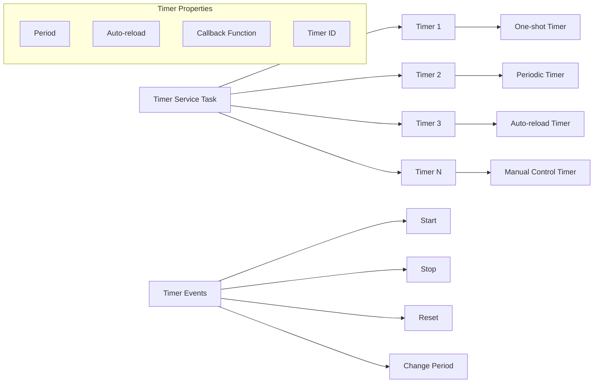
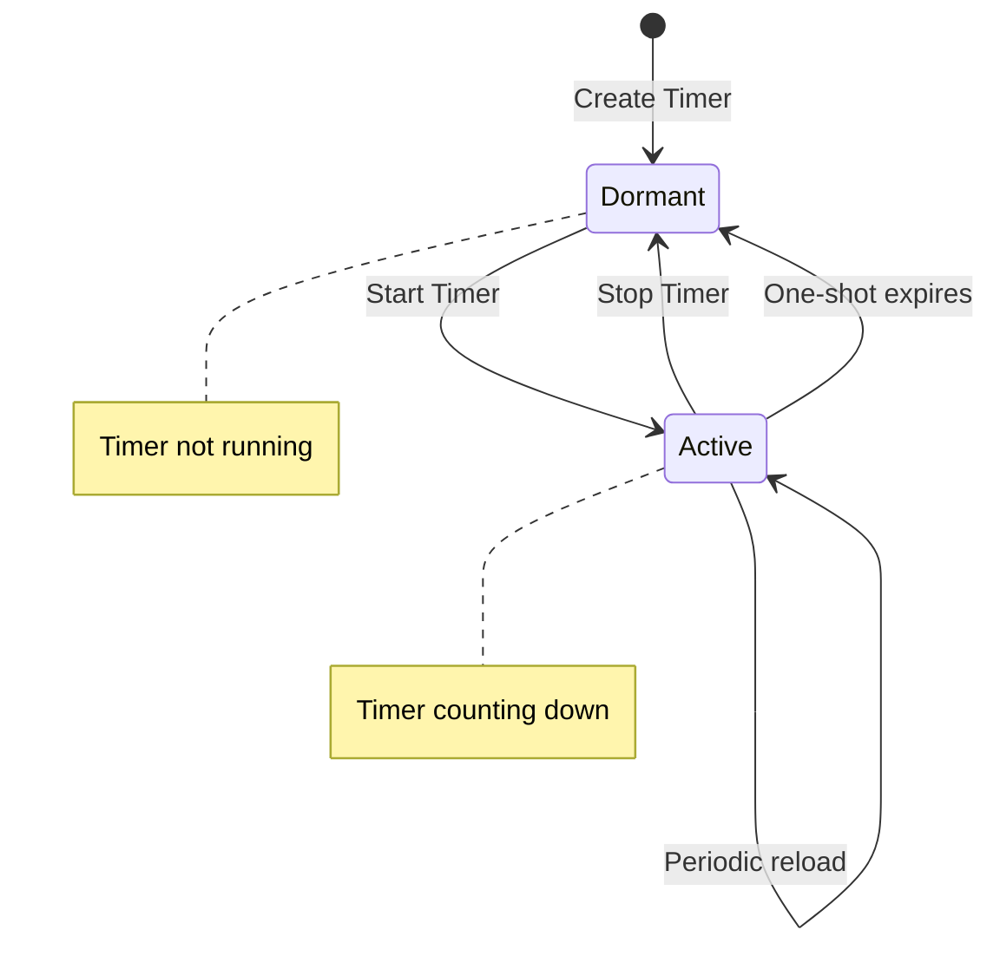
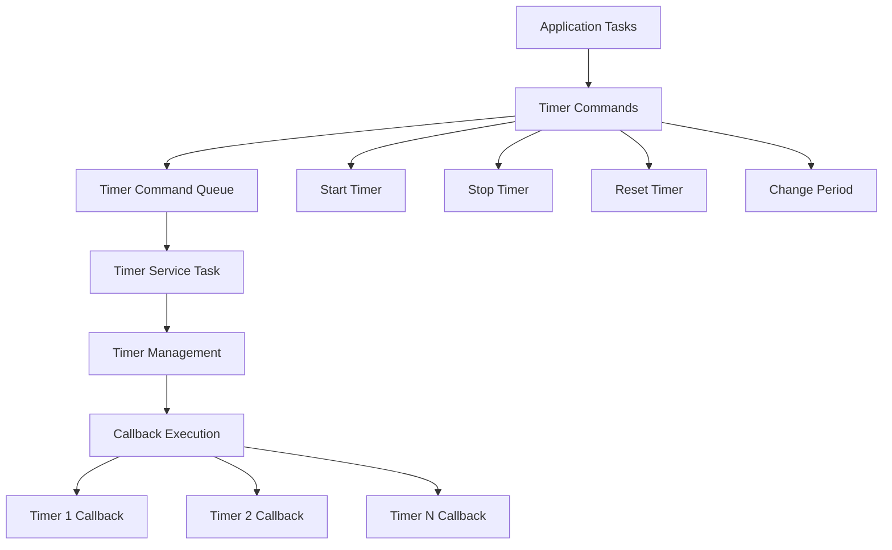

# FreeRTOS Software Timers

## Table of Contents
1. [Timer Fundamentals](#timer-fundamentals)
2. [Timer Types](#timer-types)
3. [Timer Creation and Management](#timer-creation-and-management)
4. [Timer Callback Functions](#timer-callback-functions)
5. [Timer Control Operations](#timer-control-operations)
6. [Timer Service Task](#timer-service-task)
7. [Practical Examples](#practical-examples)
8. [Best Practices](#best-practices)
9. [Exercises](#exercises)

## Timer Fundamentals

**Software Timers** in FreeRTOS provide a way to execute callback functions at specified time intervals without creating dedicated tasks. They are managed by a single timer service task.

### Key Concepts:
- **Callback Execution**: Functions executed when timer expires
- **Timer Service Task**: Single task manages all timers
- **Non-blocking**: Don't block other tasks
- **Precision**: Limited by tick rate and system load
- **Memory Efficient**: No individual task stacks needed

### Timer Architecture:



### Benefits:
- **Resource Efficient**: No individual task overhead
- **Centralized Management**: Single service task
- **Easy to Use**: Simple API
- **Flexible**: One-shot or periodic operation

### Limitations:
- **Callback Restrictions**: Keep callbacks short
- **Precision**: Limited by tick rate
- **Service Task Priority**: Affects timer accuracy
- **Queue Size**: Limited command queue

## Timer Types

### One-Shot Timers
- **Behavior**: Execute once after specified delay
- **Use Cases**: Timeouts, delayed actions, cleanup
- **Auto-reload**: Disabled

### Periodic Timers
- **Behavior**: Execute repeatedly at regular intervals
- **Use Cases**: Polling, periodic maintenance, heartbeats
- **Auto-reload**: Enabled

### Timer State Machine:



## Timer Creation and Management

### Core Timer APIs:

| Function | Description |
|----------|-------------|
| `xTimerCreate()` | Create a software timer |
| `xTimerCreateStatic()` | Create timer with static allocation |
| `xTimerStart()` | Start or restart a timer |
| `xTimerStop()` | Stop a running timer |
| `xTimerReset()` | Reset timer period |
| `xTimerChangePeriod()` | Change timer period |
| `xTimerDelete()` | Delete a timer |
| `xTimerIsTimerActive()` | Check if timer is active |

### Basic Timer Creation:

```c
#include "freertos/FreeRTOS.h"
#include "freertos/task.h"
#include "freertos/timers.h"
#include "esp_log.h"

static const char *TAG = "TIMER_EXAMPLE";

// Timer handles
TimerHandle_t one_shot_timer;
TimerHandle_t periodic_timer;

// Timer callback functions
void one_shot_callback(TimerHandle_t timer)
{
    ESP_LOGI(TAG, "One-shot timer expired!");
    
    // Get timer ID to identify which timer
    uint32_t timer_id = (uint32_t)pvTimerGetTimerID(timer);
    ESP_LOGI(TAG, "Timer ID: %d", timer_id);
}

void periodic_callback(TimerHandle_t timer)
{
    static int call_count = 0;
    call_count++;
    
    ESP_LOGI(TAG, "Periodic timer callback #%d", call_count);
    
    // Stop timer after 10 calls
    if (call_count >= 10) {
        ESP_LOGI(TAG, "Stopping periodic timer after 10 calls");
        xTimerStop(timer, 0);
    }
}

void app_main(void)
{
    ESP_LOGI(TAG, "Creating software timers...");
    
    // Create one-shot timer (5 seconds)
    one_shot_timer = xTimerCreate(
        "OneShot",              // Timer name
        pdMS_TO_TICKS(5000),    // Period (5 seconds)
        pdFALSE,                // Auto-reload (false = one-shot)
        (void*)1,               // Timer ID
        one_shot_callback       // Callback function
    );
    
    // Create periodic timer (1 second intervals)
    periodic_timer = xTimerCreate(
        "Periodic",             // Timer name
        pdMS_TO_TICKS(1000),    // Period (1 second)
        pdTRUE,                 // Auto-reload (true = periodic)
        (void*)2,               // Timer ID
        periodic_callback       // Callback function
    );
    
    if (one_shot_timer == NULL || periodic_timer == NULL) {
        ESP_LOGE(TAG, "Failed to create timers");
        return;
    }
    
    ESP_LOGI(TAG, "Timers created successfully");
    
    // Start timers
    if (xTimerStart(one_shot_timer, 0) != pdPASS) {
        ESP_LOGE(TAG, "Failed to start one-shot timer");
    }
    
    if (xTimerStart(periodic_timer, 0) != pdPASS) {
        ESP_LOGE(TAG, "Failed to start periodic timer");
    }
    
    ESP_LOGI(TAG, "Timers started");
    
    // Create a task to demonstrate timer control
    xTaskCreate(timer_control_task, "TimerControl", 2048, NULL, 5, NULL);
}

void timer_control_task(void *parameter)
{
    while (1) {
        vTaskDelay(pdMS_TO_TICKS(15000)); // Wait 15 seconds
        
        ESP_LOGI(TAG, "Restarting one-shot timer...");
        xTimerReset(one_shot_timer, 0);
        
        ESP_LOGI(TAG, "Restarting periodic timer...");
        xTimerStart(periodic_timer, 0);
    }
}
```

## Timer Callback Functions

### Callback Function Rules:
1. **Keep callbacks short**: Don't block for long periods
2. **No blocking calls**: Don't use `vTaskDelay()` or blocking APIs
3. **ISR-safe only**: Use FromISR versions of FreeRTOS APIs
4. **Return quickly**: Other timers are waiting

### Timer Callback Examples:

```c
// Good callback - short and simple
void led_blink_callback(TimerHandle_t timer)
{
    static bool led_state = false;
    led_state = !led_state;
    
    // gpio_set_level(LED_GPIO, led_state);
    ESP_LOGI(TAG, "LED: %s", led_state ? "ON" : "OFF");
}

// Good callback - sends data to queue
void sensor_read_callback(TimerHandle_t timer)
{
    static BaseType_t higher_priority_task_woken = pdFALSE;
    sensor_data_t data;
    
    // Quick sensor reading simulation
    data.temperature = 25.0 + (rand() % 100) / 10.0;
    data.timestamp = xTaskGetTickCountFromISR();
    
    // Send to queue (non-blocking)
    xQueueSendFromISR(sensor_queue, &data, &higher_priority_task_woken);
    
    portYIELD_FROM_ISR(higher_priority_task_woken);
}

// Bad callback - blocks for too long
void bad_callback(TimerHandle_t timer)
{
    ESP_LOGI(TAG, "Starting long operation...");
    
    // BAD: This blocks other timers
    vTaskDelay(pdMS_TO_TICKS(1000));
    
    // BAD: Complex processing in callback
    for (volatile int i = 0; i < 1000000; i++);
    
    ESP_LOGI(TAG, "Long operation complete");
}

// Better approach - use callback to signal task
QueueHandle_t timer_task_queue;

void signal_callback(TimerHandle_t timer)
{
    timer_event_t event = {
        .type = TIMER_EVENT_PROCESS,
        .timer_id = (uint32_t)pvTimerGetTimerID(timer)
    };
    
    BaseType_t higher_priority_task_woken = pdFALSE;
    xQueueSendFromISR(timer_task_queue, &event, &higher_priority_task_woken);
    portYIELD_FROM_ISR(higher_priority_task_woken);
}

void timer_processing_task(void *parameter)
{
    timer_event_t event;
    
    while (1) {
        if (xQueueReceive(timer_task_queue, &event, portMAX_DELAY) == pdTRUE) {
            // Do complex processing here
            ESP_LOGI(TAG, "Processing timer event from timer %d", event.timer_id);
            
            // Complex operations are OK here
            complex_processing();
            network_operation();
        }
    }
}
```

### Timer ID Usage:

```c
// Use timer ID to distinguish between multiple timers
void multi_timer_callback(TimerHandle_t timer)
{
    uint32_t timer_id = (uint32_t)pvTimerGetTimerID(timer);
    
    switch (timer_id) {
        case HEARTBEAT_TIMER_ID:
            ESP_LOGI(TAG, "Heartbeat - system alive");
            break;
            
        case SENSOR_TIMER_ID:
            read_sensors();
            break;
            
        case WATCHDOG_TIMER_ID:
            feed_watchdog();
            break;
            
        case LED_TIMER_ID:
            toggle_status_led();
            break;
            
        default:
            ESP_LOGW(TAG, "Unknown timer ID: %d", timer_id);
            break;
    }
}
```

## Timer Control Operations

### Starting and Stopping Timers:

```c
void timer_control_examples(void)
{
    // Start timer (block for up to 100ms if command queue full)
    if (xTimerStart(my_timer, pdMS_TO_TICKS(100)) != pdPASS) {
        ESP_LOGW(TAG, "Failed to start timer");
    }
    
    // Stop timer
    if (xTimerStop(my_timer, pdMS_TO_TICKS(100)) != pdPASS) {
        ESP_LOGW(TAG, "Failed to stop timer");
    }
    
    // Reset timer (restart with original period)
    xTimerReset(my_timer, 0);
    
    // Check if timer is active
    if (xTimerIsTimerActive(my_timer) == pdTRUE) {
        ESP_LOGI(TAG, "Timer is currently running");
    } else {
        ESP_LOGI(TAG, "Timer is stopped");
    }
}
```

### Changing Timer Properties:

```c
void dynamic_timer_control(void)
{
    TimerHandle_t dynamic_timer;
    
    // Create timer with initial period
    dynamic_timer = xTimerCreate("Dynamic", pdMS_TO_TICKS(1000), 
                                pdTRUE, (void*)0, periodic_callback);
    
    // Start timer
    xTimerStart(dynamic_timer, 0);
    
    // After some time, change period to 500ms
    vTaskDelay(pdMS_TO_TICKS(5000));
    ESP_LOGI(TAG, "Changing timer period to 500ms");
    xTimerChangePeriod(dynamic_timer, pdMS_TO_TICKS(500), 0);
    
    // After more time, change to 2 seconds
    vTaskDelay(pdMS_TO_TICKS(10000));
    ESP_LOGI(TAG, "Changing timer period to 2 seconds");
    xTimerChangePeriod(dynamic_timer, pdMS_TO_TICKS(2000), 0);
    
    // Get current period
    TickType_t current_period = xTimerGetPeriod(dynamic_timer);
    ESP_LOGI(TAG, "Current timer period: %d ticks", current_period);
}
```

### Timer Information Queries:

```c
void timer_info_example(TimerHandle_t timer)
{
    // Get timer name
    const char *timer_name = pcTimerGetName(timer);
    ESP_LOGI(TAG, "Timer name: %s", timer_name);
    
    // Get timer period
    TickType_t period = xTimerGetPeriod(timer);
    ESP_LOGI(TAG, "Timer period: %d ms", pdTICKS_TO_MS(period));
    
    // Get timer ID
    uint32_t timer_id = (uint32_t)pvTimerGetTimerID(timer);
    ESP_LOGI(TAG, "Timer ID: %d", timer_id);
    
    // Get time remaining until expiry
    TickType_t remaining = xTimerGetExpiryTime(timer) - xTaskGetTickCount();
    ESP_LOGI(TAG, "Time remaining: %d ms", pdTICKS_TO_MS(remaining));
    
    // Check if auto-reload is enabled
    UBaseType_t auto_reload = uxTimerGetReloadMode(timer);
    ESP_LOGI(TAG, "Auto-reload: %s", auto_reload ? "Enabled" : "Disabled");
}
```

## Timer Service Task

The timer service task manages all software timers. Its configuration affects timer behavior.

### Timer Service Configuration:

```c
// In menuconfig or sdkconfig:
CONFIG_FREERTOS_USE_TIMERS=y                    // Enable timers
CONFIG_FREERTOS_TIMER_TASK_PRIORITY=1           // Service task priority
CONFIG_FREERTOS_TIMER_TASK_STACK_DEPTH=2048     // Service task stack size
CONFIG_FREERTOS_TIMER_QUEUE_LENGTH=10           // Command queue length
```

### Understanding Timer Service Task:



### Timer Service Task Priority Considerations:

```c
void timer_priority_demo(void)
{
    // High priority task
    xTaskCreate(high_priority_task, "HighPri", 2048, NULL, 20, NULL);
    
    // Timer service task priority should be appropriate
    // If too low: Timer callbacks may be delayed
    // If too high: May interfere with critical tasks
    
    // Medium priority works well for most applications
    // CONFIG_FREERTOS_TIMER_TASK_PRIORITY=10
}
```

## Practical Examples

### Watchdog Timer System:

```c
#define WATCHDOG_TIMEOUT_MS 5000
#define FEED_INTERVAL_MS 2000

TimerHandle_t watchdog_timer;
TimerHandle_t feed_timer;

void watchdog_callback(TimerHandle_t timer)
{
    ESP_LOGE(TAG, "WATCHDOG TIMEOUT! System not responding properly");
    
    // In real system, this would reset the system
    ESP_LOGE(TAG, "System would be reset here!");
    
    // For demo, just restart the watchdog
    xTimerReset(watchdog_timer, 0);
}

void feed_callback(TimerHandle_t timer)
{
    static int feed_count = 0;
    feed_count++;
    
    ESP_LOGI(TAG, "Feeding watchdog #%d", feed_count);
    
    // Reset watchdog timer (feed the watchdog)
    xTimerReset(watchdog_timer, 0);
    
    // Simulate occasional feeding failure
    if (feed_count == 8) {
        ESP_LOGW(TAG, "Simulating system hang - stopping watchdog feeds");
        xTimerStop(feed_timer, 0);
    }
}

void setup_watchdog_system(void)
{
    // Create watchdog timer (one-shot, will trigger if not fed)
    watchdog_timer = xTimerCreate("Watchdog", 
                                 pdMS_TO_TICKS(WATCHDOG_TIMEOUT_MS),
                                 pdFALSE, // One-shot
                                 (void*)1,
                                 watchdog_callback);
    
    // Create feed timer (periodic)
    feed_timer = xTimerCreate("Feed", 
                             pdMS_TO_TICKS(FEED_INTERVAL_MS),
                             pdTRUE, // Periodic
                             (void*)2,
                             feed_callback);
    
    // Start both timers
    xTimerStart(watchdog_timer, 0);
    xTimerStart(feed_timer, 0);
    
    ESP_LOGI(TAG, "Watchdog system started - timeout: %d ms, feed: %d ms",
             WATCHDOG_TIMEOUT_MS, FEED_INTERVAL_MS);
}
```

### Multi-Stage LED Pattern Controller:

```c
typedef enum {
    LED_PATTERN_OFF,
    LED_PATTERN_SLOW_BLINK,
    LED_PATTERN_FAST_BLINK,
    LED_PATTERN_FADE,
    LED_PATTERN_SOS
} led_pattern_t;

typedef struct {
    led_pattern_t current_pattern;
    int step;
    int brightness;
    bool led_state;
} led_controller_t;

led_controller_t led_controller = {LED_PATTERN_OFF, 0, 0, false};
TimerHandle_t led_timer;

void led_pattern_callback(TimerHandle_t timer)
{
    switch (led_controller.current_pattern) {
        case LED_PATTERN_OFF:
            // gpio_set_level(LED_GPIO, 0);
            ESP_LOGI(TAG, "LED: OFF");
            break;
            
        case LED_PATTERN_SLOW_BLINK:
            led_controller.led_state = !led_controller.led_state;
            ESP_LOGI(TAG, "LED: %s (Slow)", led_controller.led_state ? "ON" : "OFF");
            xTimerChangePeriod(timer, pdMS_TO_TICKS(1000), 0);
            break;
            
        case LED_PATTERN_FAST_BLINK:
            led_controller.led_state = !led_controller.led_state;
            ESP_LOGI(TAG, "LED: %s (Fast)", led_controller.led_state ? "ON" : "OFF");
            xTimerChangePeriod(timer, pdMS_TO_TICKS(200), 0);
            break;
            
        case LED_PATTERN_FADE:
            led_controller.brightness += (led_controller.step == 0) ? 10 : -10;
            if (led_controller.brightness >= 100) {
                led_controller.brightness = 100;
                led_controller.step = 1; // Start fading down
            } else if (led_controller.brightness <= 0) {
                led_controller.brightness = 0;
                led_controller.step = 0; // Start fading up
            }
            ESP_LOGI(TAG, "LED: Brightness %d%%", led_controller.brightness);
            xTimerChangePeriod(timer, pdMS_TO_TICKS(50), 0);
            break;
            
        case LED_PATTERN_SOS: {
            // SOS pattern: ... --- ...
            static const int sos_pattern[] = {1,0,1,0,1,0, 1,1,1,0,1,1,1,0,1,1,1,0, 1,0,1,0,1,0,0};
            static int sos_index = 0;
            
            if (sos_pattern[sos_index] == 1) {
                ESP_LOGI(TAG, "LED: ON (SOS)");
            } else {
                ESP_LOGI(TAG, "LED: OFF (SOS)");
            }
            
            sos_index = (sos_index + 1) % (sizeof(sos_pattern)/sizeof(sos_pattern[0]));
            xTimerChangePeriod(timer, pdMS_TO_TICKS(300), 0);
            break;
        }
    }
}

void set_led_pattern(led_pattern_t pattern)
{
    led_controller.current_pattern = pattern;
    led_controller.step = 0;
    led_controller.brightness = 0;
    
    ESP_LOGI(TAG, "Changing LED pattern to: %d", pattern);
    
    if (pattern == LED_PATTERN_OFF) {
        xTimerStop(led_timer, 0);
    } else {
        xTimerReset(led_timer, 0);
    }
}

void led_controller_task(void *parameter)
{
    led_pattern_t patterns[] = {
        LED_PATTERN_SLOW_BLINK,
        LED_PATTERN_FAST_BLINK,
        LED_PATTERN_FADE,
        LED_PATTERN_SOS,
        LED_PATTERN_OFF
    };
    
    int pattern_index = 0;
    
    while (1) {
        set_led_pattern(patterns[pattern_index]);
        pattern_index = (pattern_index + 1) % (sizeof(patterns)/sizeof(patterns[0]));
        
        vTaskDelay(pdMS_TO_TICKS(10000)); // Change pattern every 10 seconds
    }
}

void setup_led_controller(void)
{
    // Create LED timer
    led_timer = xTimerCreate("LEDTimer", pdMS_TO_TICKS(1000), pdTRUE, 
                            (void*)0, led_pattern_callback);
    
    // Create control task
    xTaskCreate(led_controller_task, "LEDController", 2048, NULL, 5, NULL);
    
    ESP_LOGI(TAG, "LED pattern controller started");
}
```

### Sensor Data Collection with Adaptive Timing:

```c
typedef struct {
    float temperature;
    float humidity;
    uint32_t timestamp;
} sensor_reading_t;

QueueHandle_t sensor_data_queue;
TimerHandle_t sensor_timer;

// Adaptive timing based on sensor values
void sensor_timer_callback(TimerHandle_t timer)
{
    static BaseType_t higher_priority_task_woken = pdFALSE;
    sensor_reading_t reading;
    
    // Quick sensor reading (simulated)
    reading.temperature = 20.0 + (rand() % 300) / 10.0; // 20.0 to 50.0
    reading.humidity = 30.0 + (rand() % 700) / 10.0;    // 30.0 to 100.0
    reading.timestamp = xTaskGetTickCountFromISR();
    
    // Send to processing queue
    xQueueSendFromISR(sensor_data_queue, &reading, &higher_priority_task_woken);
    
    // Adaptive timing based on temperature
    TickType_t new_interval;
    if (reading.temperature > 40.0) {
        new_interval = pdMS_TO_TICKS(500);  // High temp - sample faster
    } else if (reading.temperature > 30.0) {
        new_interval = pdMS_TO_TICKS(1000); // Medium temp - normal rate
    } else {
        new_interval = pdMS_TO_TICKS(2000); // Low temp - sample slower
    }
    
    // Change timer period for next reading
    xTimerChangePeriodFromISR(timer, new_interval, &higher_priority_task_woken);
    
    portYIELD_FROM_ISR(higher_priority_task_woken);
}

void sensor_processing_task(void *parameter)
{
    sensor_reading_t reading;
    
    while (1) {
        if (xQueueReceive(sensor_data_queue, &reading, portMAX_DELAY) == pdTRUE) {
            ESP_LOGI(TAG, "Sensor: %.1f°C, %.1f%% at %d", 
                     reading.temperature, reading.humidity, reading.timestamp);
            
            // Process sensor data
            if (reading.temperature > 45.0) {
                ESP_LOGW(TAG, "High temperature warning!");
            }
            
            if (reading.humidity > 90.0) {
                ESP_LOGW(TAG, "High humidity warning!");
            }
        }
    }
}

void setup_adaptive_sensor_system(void)
{
    // Create sensor data queue
    sensor_data_queue = xQueueCreate(10, sizeof(sensor_reading_t));
    
    // Create sensor timer (initial 1 second interval)
    sensor_timer = xTimerCreate("SensorTimer", pdMS_TO_TICKS(1000), pdTRUE,
                               (void*)0, sensor_timer_callback);
    
    // Create processing task
    xTaskCreate(sensor_processing_task, "SensorProc", 2048, NULL, 6, NULL);
    
    // Start sensor timer
    xTimerStart(sensor_timer, 0);
    
    ESP_LOGI(TAG, "Adaptive sensor system started");
}
```

## Best Practices

### 1. Keep Callbacks Short and Simple:

```c
// Good - simple callback
void good_timer_callback(TimerHandle_t timer)
{
    sensor_data_t data = {
        .value = read_sensor_quick(),
        .timestamp = xTaskGetTickCountFromISR()
    };
    
    BaseType_t higher_priority_task_woken = pdFALSE;
    xQueueSendFromISR(data_queue, &data, &higher_priority_task_woken);
    portYIELD_FROM_ISR(higher_priority_task_woken);
}

// Bad - complex callback
void bad_timer_callback(TimerHandle_t timer)
{
    // BAD: Long delay in callback
    vTaskDelay(pdMS_TO_TICKS(100));
    
    // BAD: Complex processing
    for (int i = 0; i < 1000; i++) {
        complex_calculation();
    }
    
    // BAD: Blocking I/O operation
    write_to_file("sensor.log", data);
}
```

### 2. Use Appropriate Timer Service Task Priority:

```c
// Configure timer service task priority
// Too low: Timer callbacks delayed
// Too high: May interfere with critical tasks
// Rule of thumb: Medium priority (5-15)

// In menuconfig:
CONFIG_FREERTOS_TIMER_TASK_PRIORITY=10
CONFIG_FREERTOS_TIMER_TASK_STACK_DEPTH=2048
CONFIG_FREERTOS_TIMER_QUEUE_LENGTH=10
```

### 3. Handle Timer Command Failures:

```c
void robust_timer_control(TimerHandle_t timer)
{
    // Use reasonable timeout for timer commands
    BaseType_t result = xTimerStart(timer, pdMS_TO_TICKS(100));
    
    if (result != pdPASS) {
        ESP_LOGW(TAG, "Failed to start timer - command queue may be full");
        
        // Implement retry or alternative logic
        for (int retry = 0; retry < 3; retry++) {
            vTaskDelay(pdMS_TO_TICKS(10));
            result = xTimerStart(timer, pdMS_TO_TICKS(50));
            if (result == pdPASS) {
                ESP_LOGI(TAG, "Timer started on retry %d", retry + 1);
                break;
            }
        }
        
        if (result != pdPASS) {
            ESP_LOGE(TAG, "Failed to start timer after retries");
        }
    }
}
```

### 4. Monitor Timer Health:

```c
void timer_health_monitor_task(void *parameter)
{
    TickType_t last_check = xTaskGetTickCount();
    
    while (1) {
        vTaskDelay(pdMS_TO_TICKS(30000)); // Check every 30 seconds
        
        // Check if timers are still active
        if (xTimerIsTimerActive(critical_timer) != pdTRUE) {
            ESP_LOGW(TAG, "Critical timer is not active!");
            xTimerStart(critical_timer, 0);
        }
        
        // Check system responsiveness
        TickType_t current_time = xTaskGetTickCount();
        TickType_t elapsed = current_time - last_check;
        
        if (elapsed > pdMS_TO_TICKS(35000)) { // Should be ~30 seconds
            ESP_LOGW(TAG, "Timer service task may be overloaded");
        }
        
        last_check = current_time;
    }
}
```

## Exercises

### Exercise 1: Basic Timer Operations

**Objective**: Create and control different types of timers.

**Requirements**:
1. Create one-shot timer (3 seconds)
2. Create periodic timer (1 second)
3. Create control task that stops/starts/resets timers
4. Log all timer events with timestamps
5. Demonstrate timer period changes

### Exercise 2: LED Blink Patterns

**Objective**: Implement complex LED patterns using timers.

**Requirements**:
1. Multiple LED blink patterns (slow, fast, SOS, heartbeat)
2. Pattern switching every 10 seconds
3. Use single timer with dynamic period changes
4. Implement pattern state machine in callback
5. Add pattern intensity control

### Exercise 3: Sensor Sampling System

**Objective**: Build adaptive sensor sampling with timers.

**Requirements**:
1. Timer-based sensor reading
2. Adaptive sampling rate based on sensor values
3. Queue-based data processing
4. Temperature/humidity threshold monitoring
5. Data logging with timestamps

### Exercise 4: System Health Monitor

**Objective**: Create comprehensive system monitoring.

**Requirements**:
1. Heartbeat timer (system alive signal)
2. Watchdog timer (system reset if not fed)
3. Performance monitor (task execution times)
4. Resource monitor (memory, queue status)
5. Alert system for abnormal conditions

### Build and Test Commands:

```bash
# For each exercise:

# 1. Create project
idf.py create-project timer_exercise_1

# 2. Edit code and configure timers
# In menuconfig: Component config -> FreeRTOS -> Software timers

# 3. Build and test
idf.py build flash monitor

# 4. Test scenarios:
# - Normal timer operation
# - Timer period changes
# - System under load
# - Timer command queue full

# 5. Monitor behavior:
# - Timer accuracy under load
# - Callback execution times
# - System responsiveness
```

### Expected Outputs:

**Exercise 1**:
```
I (3000) TIMER: One-shot timer expired!
I (1000) TIMER: Periodic timer #1
I (2000) TIMER: Periodic timer #2
I (10000) CONTROL: Changing timer periods...
I (500) TIMER: Periodic timer #3 (faster)
```

**Exercise 2**:
```
I (1000) LED: Slow blink ON
I (2000) LED: Slow blink OFF
I (10000) LED: Switching to fast blink pattern
I (200) LED: Fast blink ON
I (400) LED: Fast blink OFF
```

## Next Module

Continue to [06-event-groups.md](06-event-groups.md) to learn about event groups for task synchronization and coordination.

---
**Key Takeaways**:
- Software timers provide time-based functionality without dedicated tasks
- Keep timer callbacks short and simple
- Use timer service task priority appropriately
- One-shot vs periodic timers serve different purposes
- Timer commands may fail if service task is busy
- Monitor timer health in production systems