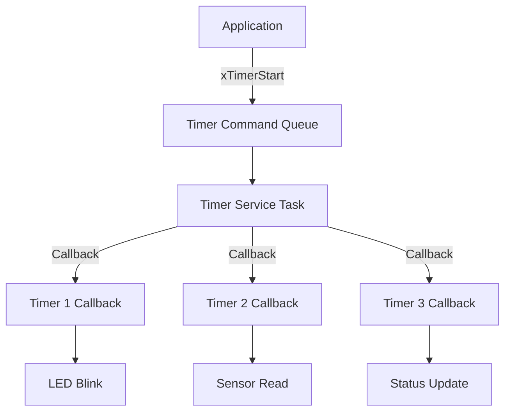

# Lab 1: Basic Software Timers (45 นาที)

## 🎯 วัตถุประสงค์
- เข้าใจหลักการทำงานของ FreeRTOS Software Timers
- เรียนรู้การสร้างและจัดการ One-shot และ Auto-reload Timers
- ฝึกการใช้ Timer Callbacks และ Timer Command Queue
- เข้าใจความแตกต่างระหว่าง Hardware Timers และ Software Timers

## 📝 ความรู้เบื้องต้น
**Software Timers** ใน FreeRTOS:
- ทำงานใน Timer Service Task (daemon task)
- ไม่ใช้ hardware timer resources
- เหมาะสำหรับงานที่ไม่ต้องการความแม่นยำสูง
- รองรับ One-shot และ Auto-reload modes



## 🛠️ การเตรียมโปรเจค

### 1. เปิดใช้งาน Software Timers
แก้ไข `sdkconfig` หรือใช้ `idf.py menuconfig`:
```
CONFIG_FREERTOS_USE_TIMERS=y
CONFIG_FREERTOS_TIMER_TASK_PRIORITY=3
CONFIG_FREERTOS_TIMER_TASK_STACK_SIZE=2048
CONFIG_FREERTOS_TIMER_QUEUE_LENGTH=10
```

### 2. สร้างโปรเจคใหม่
```bash
idf.py create-project software_timers
cd software_timers
```

### 3. แก้ไข main.c

```c
#include <stdio.h>
#include <stdint.h>
#include <string.h>
#include "freertos/FreeRTOS.h"
#include "freertos/task.h"
#include "freertos/timers.h"
#include "esp_log.h"
#include "driver/gpio.h"
#include "esp_random.h"

static const char *TAG = "SW_TIMERS";

// LED pins for different timers
#define LED_BLINK GPIO_NUM_2      // Fast blink timer
#define LED_HEARTBEAT GPIO_NUM_4  // Heartbeat timer
#define LED_STATUS GPIO_NUM_5     // Status timer
#define LED_ONESHOT GPIO_NUM_18   // One-shot timer

// Timer handles
TimerHandle_t xBlinkTimer;
TimerHandle_t xHeartbeatTimer;
TimerHandle_t xStatusTimer;
TimerHandle_t xOneShotTimer;
TimerHandle_t xDynamicTimer;

// Timer periods (in milliseconds)
#define BLINK_PERIOD     500
#define HEARTBEAT_PERIOD 2000
#define STATUS_PERIOD    5000
#define ONESHOT_DELAY    3000

// Statistics
typedef struct {
    uint32_t blink_count;
    uint32_t heartbeat_count;
    uint32_t status_count;
    uint32_t oneshot_count;
    uint32_t dynamic_count;
} timer_stats_t;

timer_stats_t stats = {0, 0, 0, 0, 0};

// LED states
bool led_blink_state = false;
bool led_heartbeat_state = false;

// Blink timer callback (auto-reload)
void blink_timer_callback(TimerHandle_t xTimer) {
    stats.blink_count++;
    
    // Toggle LED state
    led_blink_state = !led_blink_state;
    gpio_set_level(LED_BLINK, led_blink_state);
    
    ESP_LOGI(TAG, "💫 Blink Timer: Toggle #%lu (LED: %s)", 
            stats.blink_count, led_blink_state ? "ON" : "OFF");
    
    // Every 20 blinks, create a one-shot timer
    if (stats.blink_count % 20 == 0) {
        ESP_LOGI(TAG, "🚀 Creating one-shot timer (3 second delay)");
        if (xTimerStart(xOneShotTimer, 0) != pdPASS) {
            ESP_LOGW(TAG, "Failed to start one-shot timer");
        }
    }
}

// Heartbeat timer callback (auto-reload)
void heartbeat_timer_callback(TimerHandle_t xTimer) {
    stats.heartbeat_count++;
    
    ESP_LOGI(TAG, "💓 Heartbeat Timer: Beat #%lu", stats.heartbeat_count);
    
    // Double blink for heartbeat
    gpio_set_level(LED_HEARTBEAT, 1);
    vTaskDelay(pdMS_TO_TICKS(100));
    gpio_set_level(LED_HEARTBEAT, 0);
    vTaskDelay(pdMS_TO_TICKS(100));
    gpio_set_level(LED_HEARTBEAT, 1);
    vTaskDelay(pdMS_TO_TICKS(100));
    gpio_set_level(LED_HEARTBEAT, 0);
    
    // Randomly adjust blink timer period
    if (esp_random() % 4 == 0) { // 25% chance
        uint32_t new_period = 300 + (esp_random() % 400); // 300-700ms
        ESP_LOGI(TAG, "🔧 Adjusting blink period to %lums", new_period);
        
        if (xTimerChangePeriod(xBlinkTimer, pdMS_TO_TICKS(new_period), 100) != pdPASS) {
            ESP_LOGW(TAG, "Failed to change blink timer period");
        }
    }
}

// Status timer callback (auto-reload)
void status_timer_callback(TimerHandle_t xTimer) {
    stats.status_count++;
    
    ESP_LOGI(TAG, "📊 Status Timer: Update #%lu", stats.status_count);
    
    // Flash status LED
    gpio_set_level(LED_STATUS, 1);
    vTaskDelay(pdMS_TO_TICKS(200));
    gpio_set_level(LED_STATUS, 0);
    
    // Print system statistics
    ESP_LOGI(TAG, "═══ TIMER STATISTICS ═══");
    ESP_LOGI(TAG, "Blink events:     %lu", stats.blink_count);
    ESP_LOGI(TAG, "Heartbeat events: %lu", stats.heartbeat_count);
    ESP_LOGI(TAG, "Status updates:   %lu", stats.status_count);
    ESP_LOGI(TAG, "One-shot events:  %lu", stats.oneshot_count);
    ESP_LOGI(TAG, "Dynamic events:   %lu", stats.dynamic_count);
    ESP_LOGI(TAG, "═══════════════════════");
    
    // Show timer states
    ESP_LOGI(TAG, "Timer States:");
    ESP_LOGI(TAG, "  Blink:     %s (Period: %lums)", 
            xTimerIsTimerActive(xBlinkTimer) ? "ACTIVE" : "INACTIVE",
            xTimerGetPeriod(xBlinkTimer) * portTICK_PERIOD_MS);
    ESP_LOGI(TAG, "  Heartbeat: %s (Period: %lums)", 
            xTimerIsTimerActive(xHeartbeatTimer) ? "ACTIVE" : "INACTIVE",
            xTimerGetPeriod(xHeartbeatTimer) * portTICK_PERIOD_MS);
    ESP_LOGI(TAG, "  Status:    %s (Period: %lums)", 
            xTimerIsTimerActive(xStatusTimer) ? "ACTIVE" : "INACTIVE",
            xTimerGetPeriod(xStatusTimer) * portTICK_PERIOD_MS);
    ESP_LOGI(TAG, "  One-shot:  %s", 
            xTimerIsTimerActive(xOneShotTimer) ? "ACTIVE" : "INACTIVE");
}

// One-shot timer callback
void oneshot_timer_callback(TimerHandle_t xTimer) {
    stats.oneshot_count++;
    
    ESP_LOGI(TAG, "⚡ One-shot Timer: Event #%lu", stats.oneshot_count);
    
    // Flash one-shot LED pattern
    for (int i = 0; i < 5; i++) {
        gpio_set_level(LED_ONESHOT, 1);
        vTaskDelay(pdMS_TO_TICKS(50));
        gpio_set_level(LED_ONESHOT, 0);
        vTaskDelay(pdMS_TO_TICKS(50));
    }
    
    // Create a dynamic timer with random period
    uint32_t random_period = 1000 + (esp_random() % 3000); // 1-4 seconds
    ESP_LOGI(TAG, "🎲 Creating dynamic timer (period: %lums)", random_period);
    
    xDynamicTimer = xTimerCreate("DynamicTimer",
                                pdMS_TO_TICKS(random_period),
                                pdFALSE, // One-shot
                                (void*)0,
                                dynamic_timer_callback);
    
    if (xDynamicTimer != NULL) {
        if (xTimerStart(xDynamicTimer, 0) != pdPASS) {
            ESP_LOGW(TAG, "Failed to start dynamic timer");
        }
    }
}

// Dynamic timer callback (created at runtime)
void dynamic_timer_callback(TimerHandle_t xTimer) {
    stats.dynamic_count++;
    
    ESP_LOGI(TAG, "🌟 Dynamic Timer: Event #%lu", stats.dynamic_count);
    
    // Flash all LEDs briefly
    gpio_set_level(LED_BLINK, 1);
    gpio_set_level(LED_HEARTBEAT, 1);
    gpio_set_level(LED_STATUS, 1);
    gpio_set_level(LED_ONESHOT, 1);
    
    vTaskDelay(pdMS_TO_TICKS(300));
    
    gpio_set_level(LED_BLINK, led_blink_state); // Restore blink state
    gpio_set_level(LED_HEARTBEAT, 0);
    gpio_set_level(LED_STATUS, 0);
    gpio_set_level(LED_ONESHOT, 0);
    
    // Delete the dynamic timer
    if (xTimerDelete(xTimer, 100) != pdPASS) {
        ESP_LOGW(TAG, "Failed to delete dynamic timer");
    } else {
        ESP_LOGI(TAG, "Dynamic timer deleted");
    }
    
    xDynamicTimer = NULL;
}

// Control task for timer management
void timer_control_task(void *pvParameters) {
    ESP_LOGI(TAG, "Timer control task started");
    
    while (1) {
        vTaskDelay(pdMS_TO_TICKS(15000)); // Every 15 seconds
        
        ESP_LOGI(TAG, "\n🎛️  TIMER CONTROL: Performing maintenance...");
        
        // Randomly stop and restart timers for demonstration
        int action = esp_random() % 3;
        
        switch (action) {
            case 0:
                ESP_LOGI(TAG, "⏸️  Stopping heartbeat timer for 5 seconds");
                xTimerStop(xHeartbeatTimer, 100);
                vTaskDelay(pdMS_TO_TICKS(5000));
                ESP_LOGI(TAG, "▶️  Restarting heartbeat timer");
                xTimerStart(xHeartbeatTimer, 100);
                break;
                
            case 1:
                ESP_LOGI(TAG, "🔄 Reset status timer");
                xTimerReset(xStatusTimer, 100);
                break;
                
            case 2:
                ESP_LOGI(TAG, "⚙️  Changing blink timer period");
                uint32_t new_period = 200 + (esp_random() % 600); // 200-800ms
                xTimerChangePeriod(xBlinkTimer, pdMS_TO_TICKS(new_period), 100);
                ESP_LOGI(TAG, "New blink period: %lums", new_period);
                break;
        }
        
        ESP_LOGI(TAG, "Maintenance completed\n");
    }
}

void app_main(void) {
    ESP_LOGI(TAG, "Software Timers Lab Starting...");
    
    // Configure LED pins
    gpio_set_direction(LED_BLINK, GPIO_MODE_OUTPUT);
    gpio_set_direction(LED_HEARTBEAT, GPIO_MODE_OUTPUT);
    gpio_set_direction(LED_STATUS, GPIO_MODE_OUTPUT);
    gpio_set_direction(LED_ONESHOT, GPIO_MODE_OUTPUT);
    
    // Turn off all LEDs
    gpio_set_level(LED_BLINK, 0);
    gpio_set_level(LED_HEARTBEAT, 0);
    gpio_set_level(LED_STATUS, 0);
    gpio_set_level(LED_ONESHOT, 0);
    
    ESP_LOGI(TAG, "Creating software timers...");
    
    // Create blink timer (auto-reload)
    xBlinkTimer = xTimerCreate("BlinkTimer",
                              pdMS_TO_TICKS(BLINK_PERIOD),
                              pdTRUE, // Auto-reload
                              (void*)1, // Timer ID
                              blink_timer_callback);
    
    // Create heartbeat timer (auto-reload)
    xHeartbeatTimer = xTimerCreate("HeartbeatTimer",
                                  pdMS_TO_TICKS(HEARTBEAT_PERIOD),
                                  pdTRUE, // Auto-reload
                                  (void*)2, // Timer ID
                                  heartbeat_timer_callback);
    
    // Create status timer (auto-reload)
    xStatusTimer = xTimerCreate("StatusTimer",
                               pdMS_TO_TICKS(STATUS_PERIOD),
                               pdTRUE, // Auto-reload
                               (void*)3, // Timer ID
                               status_timer_callback);
    
    // Create one-shot timer (initially stopped)
    xOneShotTimer = xTimerCreate("OneShotTimer",
                                pdMS_TO_TICKS(ONESHOT_DELAY),
                                pdFALSE, // One-shot
                                (void*)4, // Timer ID
                                oneshot_timer_callback);
    
    // Check if all timers were created successfully
    if (xBlinkTimer && xHeartbeatTimer && xStatusTimer && xOneShotTimer) {
        ESP_LOGI(TAG, "All timers created successfully");
        
        // Start the auto-reload timers
        ESP_LOGI(TAG, "Starting timers...");
        xTimerStart(xBlinkTimer, 0);
        xTimerStart(xHeartbeatTimer, 0);
        xTimerStart(xStatusTimer, 0);
        // Note: One-shot timer will be started by blink timer callback
        
        // Create control task
        xTaskCreate(timer_control_task, "TimerControl", 2048, NULL, 2, NULL);
        
        ESP_LOGI(TAG, "Timer system operational!");
        ESP_LOGI(TAG, "LEDs indicate different timer activities:");
        ESP_LOGI(TAG, "  GPIO2  - Blink Timer (toggles every 500ms)");
        ESP_LOGI(TAG, "  GPIO4  - Heartbeat Timer (double blink every 2s)");
        ESP_LOGI(TAG, "  GPIO5  - Status Timer (flash every 5s)");
        ESP_LOGI(TAG, "  GPIO18 - One-shot Timer (5 quick flashes)");
        
    } else {
        ESP_LOGE(TAG, "Failed to create one or more timers");
        ESP_LOGE(TAG, "Check CONFIG_FREERTOS_USE_TIMERS=y in sdkconfig");
    }
}
```

## 🧪 การทดลอง

### ทดลองที่ 1: การทำงานปกติ
1. Build และ Flash โปรแกรม
2. สังเกต LED patterns:
   - LED_BLINK: กะพริบเร็ว
   - LED_HEARTBEAT: กะพริบคู่ทุก 2 วินาที
   - LED_STATUS: กะพริบยาวทุก 5 วินาที
   - LED_ONESHOT: กะพริบ 5 ครั้งเร็วเมื่อ one-shot timer ทำงาน

### ทดลองที่ 2: ปรับ Timer Configuration
แก้ไขใน `menuconfig`:
```
CONFIG_FREERTOS_TIMER_TASK_PRIORITY=1  // ลด priority
CONFIG_FREERTOS_TIMER_QUEUE_LENGTH=5   // ลดขนาด queue
```

### ทดลองที่ 3: เพิ่ม Timer Load
เพิ่ม timers เพิ่มเติม:
```c
for (int i = 0; i < 10; i++) {
    TimerHandle_t extra_timer = xTimerCreate("ExtraTimer", 
                                           pdMS_TO_TICKS(100 + i * 50),
                                           pdTRUE, (void*)i, extra_callback);
    xTimerStart(extra_timer, 0);
}
```

## 📋 สรุปผลการทดลอง

### สิ่งที่เรียนรู้:
- [ ] การสร้างและจัดการ Software Timers
- [ ] One-shot vs Auto-reload timers
- [ ] Timer callbacks และ context
- [ ] Dynamic timer creation/deletion
- [ ] Timer Service Task behavior

### APIs ที่ใช้:
- `xTimerCreate()` - สร้าง timer
- `xTimerStart()` - เริ่ม timer
- `xTimerStop()` - หยุด timer
- `xTimerChangePeriod()` - เปลี่ยน period
- `xTimerDelete()` - ลบ timer
- `xTimerReset()` - reset timer

## 🚀 ความท้าทายเพิ่มเติม

1. **Timer Synchronization**: ซิงค์หลาย timers
2. **Performance Analysis**: วัด timer accuracy
3. **Error Handling**: จัดการ timer failures
4. **Complex Scheduling**: สร้าง scheduling patterns
5. **Resource Management**: จัดการ timer resources

## 📚 เอกสารอ้างอิง

- [FreeRTOS Software Timers](https://www.freertos.org/RTOS-software-timer.html)
- [Timer Service Task](https://www.freertos.org/RTOS-software-timer-service-task.html)