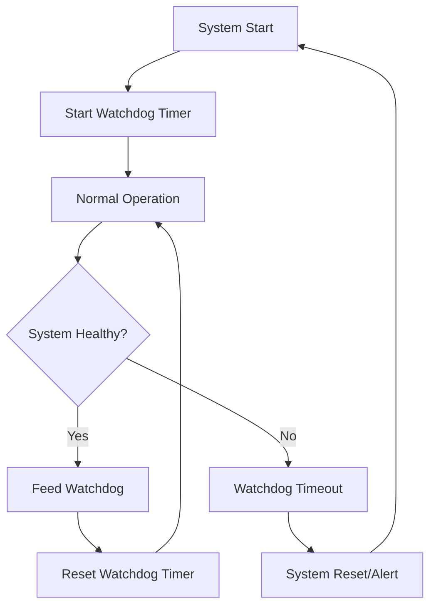
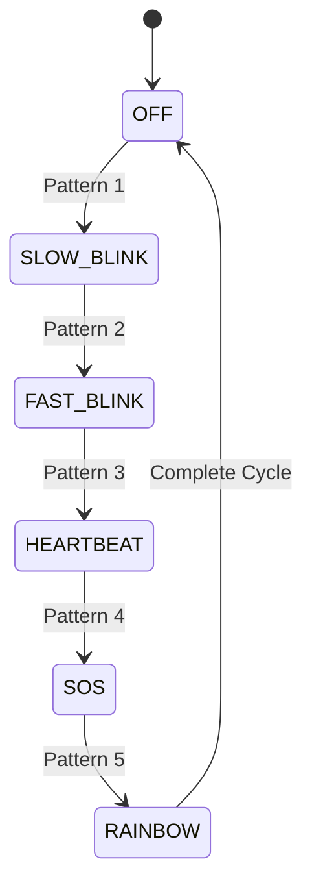

# Lab 2: Timer Applications - Watchdog & LED Patterns (60 นาที)

## 🎯 วัตถุประสงค์
- สร้างระบบ Watchdog Timer สำหรับ System Monitoring
- ออกแบบ LED Pattern Controller ที่ซับซ้อน
- เรียนรู้การใช้ Timer สำหรับ Sensor Sampling
- เข้าใจการประสานงานระหว่าง Multiple Timers

## 📝 ความรู้เบื้องต้น

### Watchdog Timer Concept


### LED Pattern State Machine


## 🛠️ การเตรียมโปรเจค

### Hardware Setup
```
ESP32 Pin Connections:
├── GPIO2  - Status LED (สีเขียว)
├── GPIO4  - Watchdog LED (สีแดง)
├── GPIO5  - Pattern LED 1 (สีน้ำเงิน)
├── GPIO18 - Pattern LED 2 (สีเหลือง)
├── GPIO19 - Pattern LED 3 (สีขาว)
├── GPIO21 - Sensor Power Control
└── GPIO22 - Sensor Data (ADC/Digital)
```

### Project Setup
```bash
cd ~/esp
idf.py create-project timer_applications
cd timer_applications
```

### Main Application Code

```c
#include <stdio.h>
#include <stdint.h>
#include <string.h>
#include <math.h>
#include "freertos/FreeRTOS.h"
#include "freertos/task.h"
#include "freertos/timers.h"
#include "freertos/queue.h"
#include "esp_log.h"
#include "driver/gpio.h"
#include "driver/adc.h"
#include "esp_adc_cal.h"
#include "esp_random.h"
#include "esp_system.h"

static const char *TAG = "TIMER_APPS";

// Pin Definitions
#define STATUS_LED       GPIO_NUM_2
#define WATCHDOG_LED     GPIO_NUM_4
#define PATTERN_LED_1    GPIO_NUM_5
#define PATTERN_LED_2    GPIO_NUM_18
#define PATTERN_LED_3    GPIO_NUM_19
#define SENSOR_POWER     GPIO_NUM_21
#define SENSOR_PIN       GPIO_NUM_22

// Timer Periods
#define WATCHDOG_TIMEOUT_MS     5000    // 5 seconds
#define WATCHDOG_FEED_MS        2000    // Feed every 2 seconds
#define PATTERN_BASE_MS         500     // Base pattern timing
#define SENSOR_SAMPLE_MS        1000    // Sensor sampling rate
#define STATUS_UPDATE_MS        3000    // Status update interval

// Pattern Types
typedef enum {
    PATTERN_OFF = 0,
    PATTERN_SLOW_BLINK,
    PATTERN_FAST_BLINK,
    PATTERN_HEARTBEAT,
    PATTERN_SOS,
    PATTERN_RAINBOW,
    PATTERN_MAX
} led_pattern_t;

// Sensor Data Structure
typedef struct {
    float value;
    uint32_t timestamp;
    bool valid;
} sensor_data_t;

// System Health Structure
typedef struct {
    uint32_t watchdog_feeds;
    uint32_t watchdog_timeouts;
    uint32_t pattern_changes;
    uint32_t sensor_readings;
    uint32_t system_uptime_sec;
    bool system_healthy;
} system_health_t;

// Global Variables
TimerHandle_t watchdog_timer;
TimerHandle_t feed_timer;
TimerHandle_t pattern_timer;
TimerHandle_t sensor_timer;
TimerHandle_t status_timer;

QueueHandle_t sensor_queue;
QueueHandle_t pattern_queue;

led_pattern_t current_pattern = PATTERN_OFF;
int pattern_step = 0;
system_health_t health_stats = {0, 0, 0, 0, 0, true};

// Pattern state for complex patterns
typedef struct {
    int step;
    int direction;
    int intensity;
    bool state;
} pattern_state_t;

pattern_state_t pattern_state = {0, 1, 0, false};

// ADC calibration
esp_adc_cal_characteristics_t *adc_chars;

// ================ WATCHDOG SYSTEM ================

void watchdog_timeout_callback(TimerHandle_t timer) {
    health_stats.watchdog_timeouts++;
    health_stats.system_healthy = false;
    
    ESP_LOGE(TAG, "🚨 WATCHDOG TIMEOUT! System may be hung!");
    ESP_LOGE(TAG, "System stats: Feeds=%lu, Timeouts=%lu", 
             health_stats.watchdog_feeds, health_stats.watchdog_timeouts);
    
    // Flash watchdog LED rapidly
    for (int i = 0; i < 10; i++) {
        gpio_set_level(WATCHDOG_LED, 1);
        vTaskDelay(pdMS_TO_TICKS(50));
        gpio_set_level(WATCHDOG_LED, 0);
        vTaskDelay(pdMS_TO_TICKS(50));
    }
    
    // In production, this would trigger system reset
    ESP_LOGW(TAG, "In production: esp_restart() would be called here");
    
    // Reset watchdog for continued operation
    xTimerReset(watchdog_timer, 0);
    health_stats.system_healthy = true;
}

void feed_watchdog_callback(TimerHandle_t timer) {
    static int feed_count = 0;
    feed_count++;
    
    // Simulate occasional system issues
    if (feed_count == 15) {
        ESP_LOGW(TAG, "🐛 Simulating system hang - stopping watchdog feeds for 8 seconds");
        xTimerStop(feed_timer, 0);
        
        // Create recovery timer
        TimerHandle_t recovery_timer = xTimerCreate("Recovery", 
                                                   pdMS_TO_TICKS(8000),
                                                   pdFALSE, // One-shot
                                                   (void*)0,
                                                   recovery_callback);
        xTimerStart(recovery_timer, 0);
        return;
    }
    
    health_stats.watchdog_feeds++;
    ESP_LOGI(TAG, "🍖 Feeding watchdog (feed #%lu)", health_stats.watchdog_feeds);
    
    // Reset watchdog timer
    xTimerReset(watchdog_timer, 0);
    
    // Flash status LED briefly
    gpio_set_level(STATUS_LED, 1);
    vTaskDelay(pdMS_TO_TICKS(50));
    gpio_set_level(STATUS_LED, 0);
}

void recovery_callback(TimerHandle_t timer) {
    ESP_LOGI(TAG, "🔄 System recovered - resuming watchdog feeds");
    xTimerStart(feed_timer, 0);
    xTimerDelete(timer, 0);
}

// ================ LED PATTERN SYSTEM ================

void set_pattern_leds(bool led1, bool led2, bool led3) {
    gpio_set_level(PATTERN_LED_1, led1);
    gpio_set_level(PATTERN_LED_2, led2);
    gpio_set_level(PATTERN_LED_3, led3);
}

void pattern_timer_callback(TimerHandle_t timer) {
    static uint32_t pattern_cycle = 0;
    pattern_cycle++;
    
    switch (current_pattern) {
        case PATTERN_OFF:
            set_pattern_leds(0, 0, 0);
            xTimerChangePeriod(timer, pdMS_TO_TICKS(1000), 0);
            break;
            
        case PATTERN_SLOW_BLINK:
            pattern_state.state = !pattern_state.state;
            set_pattern_leds(pattern_state.state, 0, 0);
            xTimerChangePeriod(timer, pdMS_TO_TICKS(1000), 0);
            ESP_LOGI(TAG, "💡 Slow Blink: %s", pattern_state.state ? "ON" : "OFF");
            break;
            
        case PATTERN_FAST_BLINK:
            pattern_state.state = !pattern_state.state;
            set_pattern_leds(0, pattern_state.state, 0);
            xTimerChangePeriod(timer, pdMS_TO_TICKS(200), 0);
            break;
            
        case PATTERN_HEARTBEAT: {
            // Double pulse pattern
            int step = pattern_step % 10;
            bool pulse = (step < 2) || (step >= 3 && step < 5);
            set_pattern_leds(0, 0, pulse);
            pattern_step++;
            xTimerChangePeriod(timer, pdMS_TO_TICKS(100), 0);
            if (step == 9) ESP_LOGI(TAG, "💓 Heartbeat pulse");
            break;
        }
        
        case PATTERN_SOS: {
            // SOS: ... --- ... (dots and dashes)
            static const char* sos = "...---...";
            static int sos_pos = 0;
            
            bool on = (sos[sos_pos] == '.');
            int duration = on ? 200 : 600; // Dot: 200ms, Dash: 600ms
            
            set_pattern_leds(on, on, on);
            
            sos_pos = (sos_pos + 1) % strlen(sos);
            if (sos_pos == 0) {
                ESP_LOGI(TAG, "🆘 SOS Pattern Complete");
                vTaskDelay(pdMS_TO_TICKS(1000)); // Pause between repeats
            }
            
            xTimerChangePeriod(timer, pdMS_TO_TICKS(duration), 0);
            break;
        }
        
        case PATTERN_RAINBOW: {
            // Cycle through LED combinations
            int rainbow_step = pattern_step % 8;
            bool led1 = (rainbow_step & 1) != 0;
            bool led2 = (rainbow_step & 2) != 0;
            bool led3 = (rainbow_step & 4) != 0;
            
            set_pattern_leds(led1, led2, led3);
            pattern_step++;
            
            if (rainbow_step == 7) ESP_LOGI(TAG, "🌈 Rainbow cycle complete");
            xTimerChangePeriod(timer, pdMS_TO_TICKS(300), 0);
            break;
        }
        
        default:
            set_pattern_leds(0, 0, 0);
            break;
    }
    
    // Change pattern every 50 cycles
    if (pattern_cycle % 50 == 0) {
        led_pattern_t new_pattern = (current_pattern + 1) % PATTERN_MAX;
        change_led_pattern(new_pattern);
    }
}

void change_led_pattern(led_pattern_t new_pattern) {
    const char* pattern_names[] = {
        "OFF", "SLOW_BLINK", "FAST_BLINK", 
        "HEARTBEAT", "SOS", "RAINBOW"
    };
    
    ESP_LOGI(TAG, "🎨 Changing pattern: %s -> %s", 
             pattern_names[current_pattern], pattern_names[new_pattern]);
    
    current_pattern = new_pattern;
    pattern_step = 0;
    pattern_state.step = 0;
    pattern_state.state = false;
    health_stats.pattern_changes++;
    
    // Reset timer with new pattern
    xTimerReset(pattern_timer, 0);
}

// ================ SENSOR SYSTEM ================

float read_sensor_value(void) {
    // Enable sensor power
    gpio_set_level(SENSOR_POWER, 1);
    vTaskDelay(pdMS_TO_TICKS(10)); // Power stabilization
    
    // Read ADC value (simulated sensor)
    uint32_t adc_reading = adc1_get_raw(ADC1_CHANNEL_0);
    uint32_t voltage = esp_adc_cal_raw_to_voltage(adc_reading, adc_chars);
    
    // Convert to meaningful sensor value (e.g., temperature)
    float sensor_value = (voltage / 1000.0) * 50.0; // 0-50°C range
    
    // Add some noise/variation
    sensor_value += (esp_random() % 100 - 50) / 100.0;
    
    // Disable sensor power to save energy
    gpio_set_level(SENSOR_POWER, 0);
    
    return sensor_value;
}

void sensor_timer_callback(TimerHandle_t timer) {
    sensor_data_t sensor_data;
    
    sensor_data.value = read_sensor_value();
    sensor_data.timestamp = xTaskGetTickCount();
    sensor_data.valid = (sensor_data.value >= 0 && sensor_data.value <= 50);
    
    health_stats.sensor_readings++;
    
    // Send to processing queue
    BaseType_t higher_priority_task_woken = pdFALSE;
    if (xQueueSendFromISR(sensor_queue, &sensor_data, &higher_priority_task_woken) != pdTRUE) {
        ESP_LOGW(TAG, "Sensor queue full - dropping sample");
    }
    
    // Adaptive sampling based on sensor value
    TickType_t new_period;
    if (sensor_data.value > 40.0) {
        new_period = pdMS_TO_TICKS(500);  // High temp - sample faster
    } else if (sensor_data.value > 25.0) {
        new_period = pdMS_TO_TICKS(1000); // Normal temp
    } else {
        new_period = pdMS_TO_TICKS(2000); // Low temp - sample slower
    }
    
    xTimerChangePeriodFromISR(timer, new_period, &higher_priority_task_woken);
    portYIELD_FROM_ISR(higher_priority_task_woken);
}

// ================ STATUS SYSTEM ================

void status_timer_callback(TimerHandle_t timer) {
    health_stats.system_uptime_sec = pdTICKS_TO_MS(xTaskGetTickCount()) / 1000;
    
    ESP_LOGI(TAG, "\n═══════ SYSTEM STATUS ═══════");
    ESP_LOGI(TAG, "Uptime: %lu seconds", health_stats.system_uptime_sec);
    ESP_LOGI(TAG, "System Health: %s", health_stats.system_healthy ? "✅ HEALTHY" : "❌ ISSUES");
    ESP_LOGI(TAG, "Watchdog Feeds: %lu", health_stats.watchdog_feeds);
    ESP_LOGI(TAG, "Watchdog Timeouts: %lu", health_stats.watchdog_timeouts);
    ESP_LOGI(TAG, "Pattern Changes: %lu", health_stats.pattern_changes);
    ESP_LOGI(TAG, "Sensor Readings: %lu", health_stats.sensor_readings);
    ESP_LOGI(TAG, "Current Pattern: %d", current_pattern);
    
    // Check timer states
    ESP_LOGI(TAG, "Timer States:");
    ESP_LOGI(TAG, "  Watchdog: %s", xTimerIsTimerActive(watchdog_timer) ? "ACTIVE" : "INACTIVE");
    ESP_LOGI(TAG, "  Feed: %s", xTimerIsTimerActive(feed_timer) ? "ACTIVE" : "INACTIVE");
    ESP_LOGI(TAG, "  Pattern: %s", xTimerIsTimerActive(pattern_timer) ? "ACTIVE" : "INACTIVE");
    ESP_LOGI(TAG, "  Sensor: %s", xTimerIsTimerActive(sensor_timer) ? "ACTIVE" : "INACTIVE");
    ESP_LOGI(TAG, "════════════════════════════\n");
    
    // Flash status LED
    gpio_set_level(STATUS_LED, 1);
    vTaskDelay(pdMS_TO_TICKS(200));
    gpio_set_level(STATUS_LED, 0);
}

// ================ PROCESSING TASKS ================

void sensor_processing_task(void *parameter) {
    sensor_data_t sensor_data;
    float temp_sum = 0;
    int sample_count = 0;
    
    ESP_LOGI(TAG, "Sensor processing task started");
    
    while (1) {
        if (xQueueReceive(sensor_queue, &sensor_data, portMAX_DELAY) == pdTRUE) {
            if (sensor_data.valid) {
                temp_sum += sensor_data.value;
                sample_count++;
                
                ESP_LOGI(TAG, "🌡️ Sensor: %.2f°C at %lu ms", 
                         sensor_data.value, sensor_data.timestamp);
                
                // Calculate moving average every 10 samples
                if (sample_count >= 10) {
                    float average = temp_sum / sample_count;
                    ESP_LOGI(TAG, "📊 Temperature Average: %.2f°C", average);
                    
                    // Trigger warnings
                    if (average > 35.0) {
                        ESP_LOGW(TAG, "🔥 High temperature warning!");
                        change_led_pattern(PATTERN_FAST_BLINK);
                    } else if (average < 15.0) {
                        ESP_LOGW(TAG, "🧊 Low temperature warning!");
                        change_led_pattern(PATTERN_SOS);
                    }
                    
                    // Reset counters
                    temp_sum = 0;
                    sample_count = 0;
                }
            } else {
                ESP_LOGW(TAG, "Invalid sensor reading: %.2f", sensor_data.value);
            }
        }
    }
}

void system_monitor_task(void *parameter) {
    ESP_LOGI(TAG, "System monitor task started");
    
    while (1) {
        vTaskDelay(pdMS_TO_TICKS(60000)); // Every minute
        
        // Check system health
        if (health_stats.watchdog_timeouts > 5) {
            ESP_LOGE(TAG, "🚨 Too many watchdog timeouts - system unstable!");
            health_stats.system_healthy = false;
        }
        
        // Check sensor health
        static uint32_t last_sensor_count = 0;
        if (health_stats.sensor_readings == last_sensor_count) {
            ESP_LOGW(TAG, "⚠️ Sensor readings stopped - checking sensor system");
            // Could restart sensor timer here
        }
        last_sensor_count = health_stats.sensor_readings;
        
        // Memory health check (example)
        size_t free_heap = esp_get_free_heap_size();
        ESP_LOGI(TAG, "💾 Free heap: %d bytes", free_heap);
        
        if (free_heap < 10000) {
            ESP_LOGW(TAG, "⚠️ Low memory warning!");
        }
    }
}

// ================ INITIALIZATION ================

void init_hardware(void) {
    // Configure LED pins
    gpio_set_direction(STATUS_LED, GPIO_MODE_OUTPUT);
    gpio_set_direction(WATCHDOG_LED, GPIO_MODE_OUTPUT);
    gpio_set_direction(PATTERN_LED_1, GPIO_MODE_OUTPUT);
    gpio_set_direction(PATTERN_LED_2, GPIO_MODE_OUTPUT);
    gpio_set_direction(PATTERN_LED_3, GPIO_MODE_OUTPUT);
    gpio_set_direction(SENSOR_POWER, GPIO_MODE_OUTPUT);
    
    // Turn off all LEDs initially
    gpio_set_level(STATUS_LED, 0);
    gpio_set_level(WATCHDOG_LED, 0);
    gpio_set_level(PATTERN_LED_1, 0);
    gpio_set_level(PATTERN_LED_2, 0);
    gpio_set_level(PATTERN_LED_3, 0);
    gpio_set_level(SENSOR_POWER, 0);
    
    // Configure ADC
    adc1_config_width(ADC_WIDTH_BIT_12);
    adc1_config_channel_atten(ADC1_CHANNEL_0, ADC_ATTEN_DB_11);
    
    // Characterize ADC
    adc_chars = calloc(1, sizeof(esp_adc_cal_characteristics_t));
    esp_adc_cal_characterize(ADC_UNIT_1, ADC_ATTEN_DB_11, ADC_WIDTH_BIT_12, 1100, adc_chars);
    
    ESP_LOGI(TAG, "Hardware initialization complete");
}

void create_timers(void) {
    // Create watchdog timer (one-shot)
    watchdog_timer = xTimerCreate("WatchdogTimer",
                                 pdMS_TO_TICKS(WATCHDOG_TIMEOUT_MS),
                                 pdFALSE, // One-shot
                                 (void*)1,
                                 watchdog_timeout_callback);
    
    // Create feed timer (auto-reload)
    feed_timer = xTimerCreate("FeedTimer",
                             pdMS_TO_TICKS(WATCHDOG_FEED_MS),
                             pdTRUE, // Auto-reload
                             (void*)2,
                             feed_watchdog_callback);
    
    // Create pattern timer (auto-reload)
    pattern_timer = xTimerCreate("PatternTimer",
                                pdMS_TO_TICKS(PATTERN_BASE_MS),
                                pdTRUE, // Auto-reload
                                (void*)3,
                                pattern_timer_callback);
    
    // Create sensor timer (auto-reload)
    sensor_timer = xTimerCreate("SensorTimer",
                               pdMS_TO_TICKS(SENSOR_SAMPLE_MS),
                               pdTRUE, // Auto-reload
                               (void*)4,
                               sensor_timer_callback);
    
    // Create status timer (auto-reload)
    status_timer = xTimerCreate("StatusTimer",
                               pdMS_TO_TICKS(STATUS_UPDATE_MS),
                               pdTRUE, // Auto-reload
                               (void*)5,
                               status_timer_callback);
    
    if (!watchdog_timer || !feed_timer || !pattern_timer || !sensor_timer || !status_timer) {
        ESP_LOGE(TAG, "Failed to create one or more timers");
        return;
    }
    
    ESP_LOGI(TAG, "All timers created successfully");
}

void create_queues(void) {
    sensor_queue = xQueueCreate(20, sizeof(sensor_data_t));
    pattern_queue = xQueueCreate(10, sizeof(led_pattern_t));
    
    if (!sensor_queue || !pattern_queue) {
        ESP_LOGE(TAG, "Failed to create queues");
        return;
    }
    
    ESP_LOGI(TAG, "Queues created successfully");
}

void start_system(void) {
    // Start all timers
    ESP_LOGI(TAG, "Starting timer system...");
    
    xTimerStart(watchdog_timer, 0);
    xTimerStart(feed_timer, 0);
    xTimerStart(pattern_timer, 0);
    xTimerStart(sensor_timer, 0);
    xTimerStart(status_timer, 0);
    
    // Create processing tasks
    xTaskCreate(sensor_processing_task, "SensorProc", 2048, NULL, 6, NULL);
    xTaskCreate(system_monitor_task, "SysMonitor", 2048, NULL, 3, NULL);
    
    ESP_LOGI(TAG, "🚀 Timer Applications System Started!");
    ESP_LOGI(TAG, "Watch the LEDs for different patterns and system status");
}

void app_main(void) {
    ESP_LOGI(TAG, "Timer Applications Lab Starting...");
    
    // Initialize components
    init_hardware();
    create_queues();
    create_timers();
    
    // Start the system
    start_system();
    
    // Start with slow blink pattern
    change_led_pattern(PATTERN_SLOW_BLINK);
    
    ESP_LOGI(TAG, "System operational - monitoring started");
}
```

## 🧪 การทดลอง

### ทดลองที่ 1: Watchdog System
1. สังเกตการทำงานปกติของ Watchdog
2. รอให้เกิด Simulated System Hang (รอบที่ 15)
3. สังเกต Watchdog Timeout และ Recovery

### ทดลองที่ 2: LED Pattern Evolution
1. สังเกต Pattern ที่เปลี่ยนแปลงอัตโนมัติ
2. ทดสอบ Pattern Response กับ Sensor Values
3. วิเคราะห์ Pattern Timing และ Accuracy

### ทดลองที่ 3: Sensor Adaptive Sampling
1. เปลี่ยนค่า Sensor Input (แตะ ADC pin)
2. สังเกต Sampling Rate ที่เปลี่ยนแปลง
3. ตรวจสอบ Temperature Warnings

### ทดลองที่ 4: System Health Monitoring
1. สังเกต Status Reports ทุก 3 วินาที
2. ตรวจสอบ System Health Indicators
3. วิเคราะห์ Performance Metrics

## 📊 การวิเคราะห์ผล

### Performance Metrics
```
Expected Results:
├── Watchdog Feeds: ~30 feeds/minute
├── Pattern Changes: ~6 changes/minute
├── Sensor Readings: 60-120 readings/minute (adaptive)
└── System Uptime: Continuous operation
```

### Pattern Analysis
```
Pattern Sequence (50 cycles each):
OFF → SLOW_BLINK → FAST_BLINK → HEARTBEAT → SOS → RAINBOW → (repeat)
```

## 📋 Post-Lab Questions

1. **Watchdog Design**: เหตุใดต้องใช้ separate timer สำหรับ feeding watchdog?
2. **Pattern Timing**: อธิบายการเลือก Timer Period สำหรับแต่ละ pattern
3. **Sensor Adaptation**: ประโยชน์ของ Adaptive Sampling Rate คืออะไร?
4. **System Health**: metrics ใดบ้างที่ควรติดตามในระบบจริง?

## 🚀 ความท้าทายเพิ่มเติม

1. **Advanced Patterns**: สร้าง pattern ที่ซับซ้อนมากขึ้น
2. **Multi-Sensor**: เพิ่ม sensor หลายตัวพร้อม priority
3. **Network Watchdog**: ส่ง heartbeat ผ่าน network
4. **Pattern Learning**: บันทึกและเรียนรู้ pattern ที่นิยม

## 📚 Key Learning Points

- ✅ Watchdog Timer Implementation
- ✅ Complex LED Pattern Control  
- ✅ Adaptive Timer Periods
- ✅ Multi-Timer Coordination
- ✅ System Health Monitoring
- ✅ Real-world Timer Applications

---
**หมายเหตุ**: Lab นี้จำลองการใช้งาน Timer ในระบบจริง ให้สังเกตความสัมพันธ์ระหว่าง Timer ต่างๆ และผลกระทบต่อ System Performance