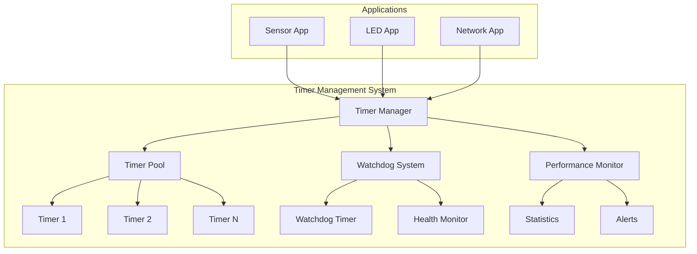

# Lab 2: Timer Management System (45 นาที)

## 🎯 วัตถุประสงค์
- พัฒนาระบบจัดการ Timer แบบซับซ้อน
- เรียนรู้การใช้ Timer ID และ Context Data
- ฝึกการสร้าง Timer Pool และ Dynamic Management
- เข้าใจ Timer Service Task Priority และ Performance
- สร้างระบบ Watchdog และ Health Monitoring

## 📝 ความรู้เบื้องต้น

**Advanced Timer Concepts**:
- Timer Pool Management
- Context Data และ Timer IDs
- Timer Service Task Load Balancing
- Watchdog Timer Patterns
- Performance Monitoring



## 🛠️ การเตรียมโปรเจค

### 1. สร้างโปรเจคใหม่
```bash
idf.py create-project timer_management
cd timer_management
```

### 2. แก้ไข sdkconfig
```
CONFIG_FREERTOS_USE_TIMERS=y
CONFIG_FREERTOS_TIMER_TASK_PRIORITY=5
CONFIG_FREERTOS_TIMER_TASK_STACK_SIZE=3072
CONFIG_FREERTOS_TIMER_QUEUE_LENGTH=20
CONFIG_FREERTOS_USE_TRACE_FACILITY=y
CONFIG_FREERTOS_GENERATE_RUN_TIME_STATS=y
```

### 3. แก้ไข main.c

```c
#include <stdio.h>
#include <stdint.h>
#include <string.h>
#include "freertos/FreeRTOS.h"
#include "freertos/task.h"
#include "freertos/timers.h"
#include "freertos/semphr.h"
#include "freertos/queue.h"
#include "esp_log.h"
#include "esp_random.h"
#include "esp_timer.h"
#include "driver/gpio.h"

static const char *TAG = "TIMER_MGR";

// Configuration
#define MAX_MANAGED_TIMERS 15
#define WATCHDOG_TIMEOUT_MS 10000
#define HEALTH_CHECK_PERIOD_MS 2000
#define STATS_REPORT_PERIOD_MS 15000

// GPIO definitions
#define LED_SYSTEM_OK GPIO_NUM_2
#define LED_WARNING GPIO_NUM_4
#define LED_ERROR GPIO_NUM_5
#define LED_ACTIVITY GPIO_NUM_18

// Timer types
typedef enum {
    TIMER_TYPE_PERIODIC,
    TIMER_TYPE_ONESHOT,
    TIMER_TYPE_WATCHDOG,
    TIMER_TYPE_MONITORING
} timer_type_t;

// Timer context structure
typedef struct {
    uint32_t timer_id;
    timer_type_t type;
    uint32_t period_ms;
    uint32_t call_count;
    uint64_t last_execution;
    uint64_t total_execution_time;
    bool is_active;
    const char* name;
    void* user_data;
} timer_context_t;

// System statistics
typedef struct {
    uint32_t total_timers_created;
    uint32_t active_timers;
    uint32_t timer_overruns;
    uint32_t watchdog_feeds;
    uint32_t health_checks;
    uint64_t system_uptime;
    uint32_t max_callback_time_us;
    uint32_t avg_callback_time_us;
} system_stats_t;

// Global variables
static timer_context_t timer_pool[MAX_MANAGED_TIMERS];
static system_stats_t system_stats = {0};
static SemaphoreHandle_t timer_mutex;
static QueueHandle_t watchdog_queue;
static TimerHandle_t health_monitor_timer;
static TimerHandle_t stats_reporter_timer;
static TimerHandle_t watchdog_timer;
static bool system_healthy = true;

// Function prototypes
void timer_manager_init(void);
TimerHandle_t create_managed_timer(const char* name, uint32_t period_ms, 
                                  timer_type_t type, TimerCallbackFunction_t callback, 
                                  void* user_data);
void destroy_managed_timer(TimerHandle_t timer);
void watchdog_feed(uint32_t source_id);

// Generic timer callback wrapper
void managed_timer_callback(TimerHandle_t xTimer) {
    uint64_t start_time = esp_timer_get_time();
    
    timer_context_t* ctx = (timer_context_t*)pvTimerGetTimerID(xTimer);
    if (ctx == NULL) {
        ESP_LOGW(TAG, "Timer callback: NULL context!");
        return;
    }
    
    ctx->call_count++;
    ctx->last_execution = start_time;
    
    ESP_LOGI(TAG, "🔄 Timer [%s] execution #%lu (Type: %d)", 
             ctx->name, ctx->call_count, ctx->type);
    
    // Simulate different workloads based on timer type
    switch (ctx->type) {
        case TIMER_TYPE_PERIODIC:
            // Simulate sensor reading or regular task
            gpio_set_level(LED_ACTIVITY, 1);
            vTaskDelay(pdMS_TO_TICKS(10 + (esp_random() % 20))); // 10-30ms work
            gpio_set_level(LED_ACTIVITY, 0);
            break;
            
        case TIMER_TYPE_ONESHOT:
            // Simulate one-time processing
            for (int i = 0; i < 3; i++) {
                gpio_set_level(LED_ACTIVITY, 1);
                vTaskDelay(pdMS_TO_TICKS(50));
                gpio_set_level(LED_ACTIVITY, 0);
                vTaskDelay(pdMS_TO_TICKS(50));
            }
            
            // Schedule destruction after use
            ESP_LOGI(TAG, "One-shot timer [%s] completed, scheduling destruction", ctx->name);
            destroy_managed_timer(xTimer);
            break;
            
        case TIMER_TYPE_MONITORING:
            // Perform health checks
            system_stats.health_checks++;
            
            // Check system health indicators
            bool current_health = true;
            
            // Check timer service task queue
            if (system_stats.timer_overruns > 10) {
                current_health = false;
                ESP_LOGW(TAG, "⚠️ Timer overruns detected: %lu", system_stats.timer_overruns);
            }
            
            // Check callback execution times
            if (system_stats.max_callback_time_us > 50000) { // 50ms threshold
                current_health = false;
                ESP_LOGW(TAG, "⚠️ Long callback execution: %lu µs", system_stats.max_callback_time_us);
            }
            
            // Update system health
            if (current_health != system_healthy) {
                system_healthy = current_health;
                gpio_set_level(LED_SYSTEM_OK, system_healthy);
                gpio_set_level(LED_WARNING, !system_healthy);
                
                ESP_LOGI(TAG, "System health changed: %s", system_healthy ? "HEALTHY" : "WARNING");
            }
            break;
            
        default:
            break;
    }
    
    // Calculate execution time
    uint64_t end_time = esp_timer_get_time();
    uint32_t execution_time = (uint32_t)(end_time - start_time);
    
    ctx->total_execution_time += execution_time;
    
    // Update statistics
    if (execution_time > system_stats.max_callback_time_us) {
        system_stats.max_callback_time_us = execution_time;
    }
    
    // Simple moving average for callback time
    system_stats.avg_callback_time_us = 
        (system_stats.avg_callback_time_us * 7 + execution_time) / 8;
    
    // Feed watchdog for active timers
    if (ctx->type != TIMER_TYPE_ONESHOT) {
        watchdog_feed(ctx->timer_id);
    }
    
    ESP_LOGI(TAG, "Timer [%s] completed in %lu µs", ctx->name, execution_time);
}

// Watchdog timer callback
void watchdog_timer_callback(TimerHandle_t xTimer) {
    ESP_LOGE(TAG, "🚨 WATCHDOG TIMEOUT! System may be unresponsive!");
    
    // Flash error LED
    for (int i = 0; i < 10; i++) {
        gpio_set_level(LED_ERROR, 1);
        vTaskDelay(pdMS_TO_TICKS(100));
        gpio_set_level(LED_ERROR, 0);
        vTaskDelay(pdMS_TO_TICKS(100));
    }
    
    // Reset watchdog (in real system, might reset MCU)
    ESP_LOGW(TAG, "Watchdog reset (simulated)");
    system_stats.watchdog_feeds = 0;
}

// Health monitor callback
void health_monitor_callback(TimerHandle_t xTimer) {
    ESP_LOGI(TAG, "💓 Health Monitor: Checking system status...");
    
    // Update system uptime
    system_stats.system_uptime = esp_timer_get_time() / 1000; // Convert to ms
    
    // Count active timers
    uint32_t active_count = 0;
    if (xSemaphoreTake(timer_mutex, pdMS_TO_TICKS(100)) == pdTRUE) {
        for (int i = 0; i < MAX_MANAGED_TIMERS; i++) {
            if (timer_pool[i].is_active) {
                active_count++;
            }
        }
        system_stats.active_timers = active_count;
        xSemaphoreGive(timer_mutex);
    }
    
    ESP_LOGI(TAG, "Active timers: %lu / %d", active_count, MAX_MANAGED_TIMERS);
    
    // Check memory usage
    size_t free_heap = esp_get_free_heap_size();
    if (free_heap < 10000) { // Less than 10KB
        ESP_LOGW(TAG, "⚠️ Low memory: %d bytes free", free_heap);
        system_healthy = false;
    }
    
    // Visual health indicator
    if (system_healthy) {
        gpio_set_level(LED_SYSTEM_OK, 1);
        vTaskDelay(pdMS_TO_TICKS(100));
        gpio_set_level(LED_SYSTEM_OK, 0);
    }
}

// Statistics reporter callback
void stats_reporter_callback(TimerHandle_t xTimer) {
    ESP_LOGI(TAG, "\n📊 ═══ SYSTEM STATISTICS REPORT ═══");
    ESP_LOGI(TAG, "Uptime:           %llu ms", system_stats.system_uptime);
    ESP_LOGI(TAG, "Timers created:   %lu", system_stats.total_timers_created);
    ESP_LOGI(TAG, "Active timers:    %lu", system_stats.active_timers);
    ESP_LOGI(TAG, "Timer overruns:   %lu", system_stats.timer_overruns);
    ESP_LOGI(TAG, "Watchdog feeds:   %lu", system_stats.watchdog_feeds);
    ESP_LOGI(TAG, "Health checks:    %lu", system_stats.health_checks);
    ESP_LOGI(TAG, "Max callback:     %lu µs", system_stats.max_callback_time_us);
    ESP_LOGI(TAG, "Avg callback:     %lu µs", system_stats.avg_callback_time_us);
    ESP_LOGI(TAG, "System health:    %s", system_healthy ? "HEALTHY" : "WARNING");
    ESP_LOGI(TAG, "Free heap:        %d bytes", esp_get_free_heap_size());
    
    // Detailed timer information
    ESP_LOGI(TAG, "\n📋 Active Timers Detail:");
    
    if (xSemaphoreTake(timer_mutex, pdMS_TO_TICKS(100)) == pdTRUE) {
        for (int i = 0; i < MAX_MANAGED_TIMERS; i++) {
            if (timer_pool[i].is_active) {
                timer_context_t* ctx = &timer_pool[i];
                uint32_t avg_exec_time = ctx->call_count > 0 ? 
                    (uint32_t)(ctx->total_execution_time / ctx->call_count) : 0;
                
                ESP_LOGI(TAG, "  [%02d] %s: %lu calls, avg %lu µs, period %lu ms", 
                         ctx->timer_id, ctx->name, ctx->call_count, 
                         avg_exec_time, ctx->period_ms);
            }
        }
        xSemaphoreGive(timer_mutex);
    }
    
    ESP_LOGI(TAG, "═══════════════════════════════════\n");
}

// Timer manager initialization
void timer_manager_init(void) {
    ESP_LOGI(TAG, "Initializing Timer Management System...");
    
    // Initialize timer pool
    memset(timer_pool, 0, sizeof(timer_pool));
    
    // Create mutex for thread safety
    timer_mutex = xSemaphoreCreateMutex();
    if (timer_mutex == NULL) {
        ESP_LOGE(TAG, "Failed to create timer mutex!");
        return;
    }
    
    // Create watchdog queue
    watchdog_queue = xQueueCreate(10, sizeof(uint32_t));
    
    // Configure GPIO
    gpio_set_direction(LED_SYSTEM_OK, GPIO_MODE_OUTPUT);
    gpio_set_direction(LED_WARNING, GPIO_MODE_OUTPUT);
    gpio_set_direction(LED_ERROR, GPIO_MODE_OUTPUT);
    gpio_set_direction(LED_ACTIVITY, GPIO_MODE_OUTPUT);
    
    gpio_set_level(LED_SYSTEM_OK, 1); // Start healthy
    gpio_set_level(LED_WARNING, 0);
    gpio_set_level(LED_ERROR, 0);
    gpio_set_level(LED_ACTIVITY, 0);
    
    // Create system timers
    watchdog_timer = xTimerCreate("SystemWatchdog",
                                 pdMS_TO_TICKS(WATCHDOG_TIMEOUT_MS),
                                 pdFALSE, // One-shot
                                 NULL,
                                 watchdog_timer_callback);
    
    health_monitor_timer = xTimerCreate("HealthMonitor",
                                       pdMS_TO_TICKS(HEALTH_CHECK_PERIOD_MS),
                                       pdTRUE, // Auto-reload
                                       NULL,
                                       health_monitor_callback);
    
    stats_reporter_timer = xTimerCreate("StatsReporter",
                                       pdMS_TO_TICKS(STATS_REPORT_PERIOD_MS),
                                       pdTRUE, // Auto-reload
                                       NULL,
                                       stats_reporter_callback);
    
    // Start system timers
    if (watchdog_timer && health_monitor_timer && stats_reporter_timer) {
        xTimerStart(watchdog_timer, 0);
        xTimerStart(health_monitor_timer, 0);
        xTimerStart(stats_reporter_timer, 0);
        ESP_LOGI(TAG, "System timers started successfully");
    } else {
        ESP_LOGE(TAG, "Failed to create system timers!");
    }
    
    ESP_LOGI(TAG, "Timer Management System initialized");
}

// Create managed timer
TimerHandle_t create_managed_timer(const char* name, uint32_t period_ms, 
                                  timer_type_t type, TimerCallbackFunction_t callback, 
                                  void* user_data) {
    
    if (xSemaphoreTake(timer_mutex, pdMS_TO_TICKS(1000)) != pdTRUE) {
        ESP_LOGE(TAG, "Failed to acquire timer mutex");
        return NULL;
    }
    
    // Find free slot
    int free_slot = -1;
    for (int i = 0; i < MAX_MANAGED_TIMERS; i++) {
        if (!timer_pool[i].is_active) {
            free_slot = i;
            break;
        }
    }
    
    if (free_slot == -1) {
        ESP_LOGE(TAG, "Timer pool full! Cannot create timer: %s", name);
        xSemaphoreGive(timer_mutex);
        return NULL;
    }
    
    // Initialize context
    timer_context_t* ctx = &timer_pool[free_slot];
    ctx->timer_id = free_slot;
    ctx->type = type;
    ctx->period_ms = period_ms;
    ctx->call_count = 0;
    ctx->last_execution = 0;
    ctx->total_execution_time = 0;
    ctx->is_active = true;
    ctx->name = name;
    ctx->user_data = user_data;
    
    // Create FreeRTOS timer
    TimerHandle_t timer = xTimerCreate(
        name,
        pdMS_TO_TICKS(period_ms),
        (type == TIMER_TYPE_PERIODIC || type == TIMER_TYPE_MONITORING) ? pdTRUE : pdFALSE,
        ctx, // Use context as timer ID
        callback ? callback : managed_timer_callback
    );
    
    if (timer) {
        system_stats.total_timers_created++;
        ESP_LOGI(TAG, "✅ Created timer [%s] in slot %d (Period: %lu ms, Type: %d)", 
                 name, free_slot, period_ms, type);
    } else {
        ctx->is_active = false;
        ESP_LOGE(TAG, "❌ Failed to create timer: %s", name);
    }
    
    xSemaphoreGive(timer_mutex);
    return timer;
}

// Destroy managed timer
void destroy_managed_timer(TimerHandle_t timer) {
    if (timer == NULL) return;
    
    timer_context_t* ctx = (timer_context_t*)pvTimerGetTimerID(timer);
    if (ctx == NULL) return;
    
    if (xSemaphoreTake(timer_mutex, pdMS_TO_TICKS(1000)) == pdTRUE) {
        ESP_LOGI(TAG, "🗑️ Destroying timer [%s] from slot %lu", ctx->name, ctx->timer_id);
        
        // Stop and delete timer
        xTimerStop(timer, 100);
        xTimerDelete(timer, 100);
        
        // Mark slot as free
        ctx->is_active = false;
        
        xSemaphoreGive(timer_mutex);
    }
}

// Watchdog feed function
void watchdog_feed(uint32_t source_id) {
    system_stats.watchdog_feeds++;
    
    // Reset watchdog timer
    if (xTimerReset(watchdog_timer, 0) != pdPASS) {
        ESP_LOGW(TAG, "Failed to reset watchdog timer");
    }
}

// Application simulation task
void application_simulation_task(void* pvParameters) {
    ESP_LOGI(TAG, "Application simulation started");
    
    vTaskDelay(pdMS_TO_TICKS(2000)); // Wait for system to initialize
    
    while (1) {
        // Randomly create different types of timers
        int action = esp_random() % 4;
        
        switch (action) {
            case 0: {
                // Create periodic sensor timer
                char name[20];
                sprintf(name, "Sensor_%lu", system_stats.total_timers_created);
                uint32_t period = 1000 + (esp_random() % 3000); // 1-4 seconds
                
                TimerHandle_t sensor_timer = create_managed_timer(
                    name, period, TIMER_TYPE_PERIODIC, NULL, NULL);
                
                if (sensor_timer) {
                    xTimerStart(sensor_timer, 100);
                    ESP_LOGI(TAG, "🌡️ Started sensor timer: %s", name);
                }
                break;
            }
            
            case 1: {
                // Create one-shot processing timer
                char name[20];
                sprintf(name, "Process_%lu", system_stats.total_timers_created);
                uint32_t delay = 500 + (esp_random() % 2000); // 0.5-2.5 seconds
                
                TimerHandle_t process_timer = create_managed_timer(
                    name, delay, TIMER_TYPE_ONESHOT, NULL, NULL);
                
                if (process_timer) {
                    xTimerStart(process_timer, 100);
                    ESP_LOGI(TAG, "⚡ Started process timer: %s", name);
                }
                break;
            }
            
            case 2: {
                // Create monitoring timer
                char name[20];
                sprintf(name, "Monitor_%lu", system_stats.total_timers_created);
                uint32_t period = 3000 + (esp_random() % 4000); // 3-7 seconds
                
                TimerHandle_t monitor_timer = create_managed_timer(
                    name, period, TIMER_TYPE_MONITORING, NULL, NULL);
                
                if (monitor_timer) {
                    xTimerStart(monitor_timer, 100);
                    ESP_LOGI(TAG, "👁️ Started monitor timer: %s", name);
                }
                break;
            }
            
            case 3: {
                // Simulate timer service task overload
                ESP_LOGI(TAG, "⚡ Simulating heavy timer load...");
                for (int i = 0; i < 5; i++) {
                    char name[20];
                    sprintf(name, "Load_%d", i);
                    
                    TimerHandle_t load_timer = create_managed_timer(
                        name, 100, TIMER_TYPE_PERIODIC, NULL, NULL);
                    
                    if (load_timer) {
                        xTimerStart(load_timer, 0);
                    }
                }
                system_stats.timer_overruns++;
                break;
            }
        }
        
        // Wait before next action
        uint32_t wait_time = 5000 + (esp_random() % 10000); // 5-15 seconds
        vTaskDelay(pdMS_TO_TICKS(wait_time));
    }
}

void app_main(void) {
    ESP_LOGI(TAG, "🚀 Timer Management System Lab Starting...");
    
    // Initialize timer management system
    timer_manager_init();
    
    // Create application simulation task
    xTaskCreate(application_simulation_task, "AppSim", 3072, NULL, 3, NULL);
    
    ESP_LOGI(TAG, "System operational! Monitor LEDs:");
    ESP_LOGI(TAG, "  GPIO2  - System OK (heartbeat)");
    ESP_LOGI(TAG, "  GPIO4  - Warning indicator");
    ESP_LOGI(TAG, "  GPIO5  - Error indicator");
    ESP_LOGI(TAG, "  GPIO18 - Activity indicator");
    
    ESP_LOGI(TAG, "Timer Management System ready!");
}
```

## 🧪 การทดลอง

### ทดลองที่ 1: ระบบการจัดการ Timer
1. Build และ Flash โปรแกรม
2. สังเกต LED indicators:
   - LED_SYSTEM_OK: กะพริบเมื่อระบบสุขภาพดี
   - LED_WARNING: เปิดเมื่อมีการเตือน
   - LED_ERROR: กะพริบเมื่อ watchdog timeout
   - LED_ACTIVITY: กะพริบเมื่อมี timer callback

### ทดลองที่ 2: การจัดการ Timer Pool
ใน Serial Monitor สังเกต:
- การสร้างและลบ timers แบบ dynamic
- สถิติการใช้งาน timer pool
- การจัดการ memory และ performance

### ทดลองที่ 3: Watchdog System
1. สังเกต watchdog feeding
2. ทดสอบ watchdog timeout (ปิด watchdog feed)
3. สังเกตการ recovery ของระบบ

### ทดลองที่ 4: Performance Monitoring
แก้ไขใน callback เพื่อทดสอบ performance:
```c
// เพิ่ม delay ใน callback เพื่อทดสอบ performance warning
vTaskDelay(pdMS_TO_TICKS(60)); // 60ms delay - จะทำให้เกิด warning
```

## 📊 การวิเคราะห์ Performance

### คำสั่งใน menuconfig สำหรับ profiling:
```
CONFIG_FREERTOS_USE_TRACE_FACILITY=y
CONFIG_FREERTOS_GENERATE_RUN_TIME_STATS=y
CONFIG_FREERTOS_USE_STATS_FORMATTING_FUNCTIONS=y
```

### เพิ่ม function สำหรับ runtime stats:
```c
void print_runtime_stats(void) {
    char* buffer = malloc(2048);
    if (buffer) {
        vTaskGetRunTimeStats(buffer);
        ESP_LOGI(TAG, "Runtime Stats:\n%s", buffer);
        free(buffer);
    }
}
```

## 📋 สรุปผลการทดลอง

### Advanced Features ที่เรียนรู้:
- [ ] Timer Pool Management
- [ ] Dynamic Timer Creation/Destruction
- [ ] Performance Monitoring และ Statistics
- [ ] Watchdog System Implementation
- [ ] Health Monitoring System
- [ ] Resource Management

### System Design Patterns:
- [ ] Timer Factory Pattern
- [ ] Observer Pattern for Monitoring
- [ ] Resource Pool Pattern
- [ ] Watchdog Pattern

## 🚀 ความท้าทายเพิ่มเติม

1. **Load Balancing**: กระจาย timer load across multiple service tasks
2. **Priority Management**: จัดการ timer priorities
3. **Fault Recovery**: ระบบ recovery เมื่อเกิด error
4. **Performance Optimization**: ปรับแต่ง timer service task
5. **Resource Prediction**: ทำนาย resource usage

## 🔧 Advanced Configuration

### Timer Service Task Optimization:
```c
// ใน menuconfig หรือ sdkconfig:
CONFIG_FREERTOS_TIMER_TASK_PRIORITY=6        // เพิ่ม priority
CONFIG_FREERTOS_TIMER_TASK_STACK_SIZE=4096   // เพิ่ม stack
CONFIG_FREERTOS_TIMER_QUEUE_LENGTH=30        // เพิ่ม queue size
```

### Memory Pool for Timers:
```c
// สร้าง memory pool สำหรับ timer contexts
#define TIMER_POOL_SIZE 20
static timer_context_t timer_memory_pool[TIMER_POOL_SIZE];
static bool pool_allocation_map[TIMER_POOL_SIZE];
```

## 📚 เอกสารอ้างอิง

- [FreeRTOS Timer Management](https://www.freertos.org/RTOS-software-timer.html)
- [Performance Monitoring](https://www.freertos.org/rtos-run-time-stats.html)
- [Watchdog Patterns](https://www.freertos.org/RTOS-software-timer-service-task.html)