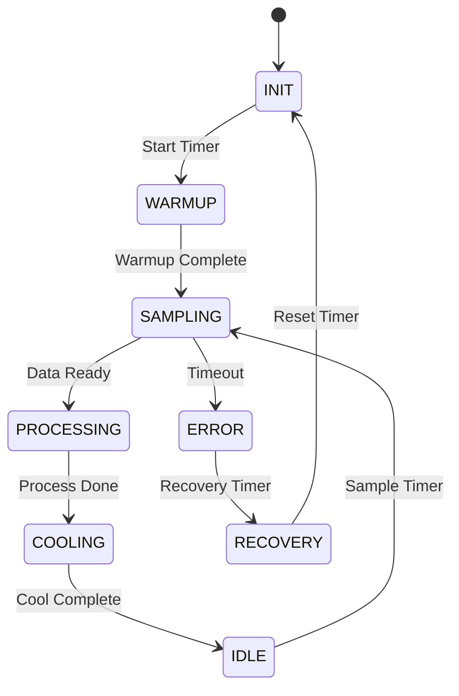

# Lab 3: Advanced Timer Scheduling (30 นาที)

## 🎯 วัตถุประสงค์
- พัฒนาระบบ Scheduling ขั้นสูงด้วย Software Timers
- เรียนรู้ Cascading Timers และ Timer Chains
- ฝึกการสร้าง State Machine ด้วย Timers
- เข้าใจ Adaptive Timing และ Self-Adjusting Systems
- สร้าง Complex Timing Patterns

## 📝 ความรู้เบื้องต้น

**Advanced Scheduling Concepts**:
- Timer Cascading และ Chaining
- State-Driven Timer Management
- Adaptive และ Self-Adjusting Timers
- Complex Timing Patterns
- Event-Driven Timer Scheduling



## 🛠️ การเตรียมโปรเจค

### 1. สร้างโปรเจคใหม่
```bash
idf.py create-project advanced_timer_scheduling
cd advanced_timer_scheduling
```

### 2. แก้ไข sdkconfig
```
CONFIG_FREERTOS_USE_TIMERS=y
CONFIG_FREERTOS_TIMER_TASK_PRIORITY=8
CONFIG_FREERTOS_TIMER_TASK_STACK_SIZE=4096
CONFIG_FREERTOS_TIMER_QUEUE_LENGTH=25
CONFIG_FREERTOS_USE_TRACE_FACILITY=y
```

### 3. แก้ไข main.c

```c
#include <stdio.h>
#include <stdint.h>
#include <string.h>
#include <math.h>
#include "freertos/FreeRTOS.h"
#include "freertos/task.h"
#include "freertos/timers.h"
#include "freertos/queue.h"
#include "freertos/event_groups.h"
#include "esp_log.h"
#include "esp_random.h"
#include "esp_timer.h"
#include "driver/gpio.h"

static const char *TAG = "ADV_SCHED";

// GPIO definitions
#define LED_STATE_INIT     GPIO_NUM_2
#define LED_STATE_ACTIVE   GPIO_NUM_4
#define LED_STATE_PROCESS  GPIO_NUM_5
#define LED_STATE_ERROR    GPIO_NUM_18
#define LED_HEARTBEAT      GPIO_NUM_19

// System states
typedef enum {
    STATE_INIT,
    STATE_WARMUP,
    STATE_SAMPLING,
    STATE_PROCESSING,
    STATE_COOLING,
    STATE_IDLE,
    STATE_ERROR,
    STATE_RECOVERY
} system_state_t;

// Timer chain IDs
typedef enum {
    TIMER_CHAIN_INIT,
    TIMER_CHAIN_WARMUP,
    TIMER_CHAIN_SAMPLING,
    TIMER_CHAIN_PROCESSING,
    TIMER_CHAIN_COOLING,
    TIMER_CHAIN_IDLE,
    TIMER_CHAIN_ERROR,
    TIMER_CHAIN_RECOVERY,
    TIMER_CHAIN_HEARTBEAT,
    TIMER_ADAPTIVE,
    TIMER_CHAIN_MAX
} timer_chain_id_t;

// Adaptive timing structure
typedef struct {
    uint32_t base_period;
    uint32_t current_period;
    uint32_t min_period;
    uint32_t max_period;
    float adjustment_factor;
    uint32_t performance_metric;
    uint32_t target_metric;
} adaptive_timer_t;

// System context
typedef struct {
    system_state_t current_state;
    system_state_t previous_state;
    uint32_t state_duration;
    uint32_t state_transitions;
    uint32_t error_count;
    uint32_t recovery_count;
    bool system_active;
    uint64_t uptime;
    adaptive_timer_t adaptive_sampling;
} system_context_t;

// Global variables
static system_context_t system_ctx = {0};
static TimerHandle_t timer_chain[TIMER_CHAIN_MAX];
static QueueHandle_t state_event_queue;
static EventGroupHandle_t system_events;

// Event bits
#define EVENT_SYSTEM_READY    BIT0
#define EVENT_DATA_AVAILABLE  BIT1
#define EVENT_PROCESSING_DONE BIT2
#define EVENT_ERROR_OCCURRED  BIT3
#define EVENT_RECOVERY_DONE   BIT4

// Function prototypes
void transition_to_state(system_state_t new_state);
void start_timer_chain(timer_chain_id_t timer_id, uint32_t period_ms);
void stop_timer_chain(timer_chain_id_t timer_id);
void update_adaptive_timing(adaptive_timer_t* adaptive, uint32_t performance);

// State transition function
void transition_to_state(system_state_t new_state) {
    if (system_ctx.current_state == new_state) return;
    
    ESP_LOGI(TAG, "🔄 State transition: %d -> %d", system_ctx.current_state, new_state);
    
    // Stop current state timer
    if (system_ctx.current_state < TIMER_CHAIN_MAX) {
        stop_timer_chain(system_ctx.current_state);
    }
    
    // Update state context
    system_ctx.previous_state = system_ctx.current_state;
    system_ctx.current_state = new_state;
    system_ctx.state_transitions++;
    system_ctx.state_duration = 0;
    
    // Update LED indicators
    gpio_set_level(LED_STATE_INIT, new_state == STATE_INIT);
    gpio_set_level(LED_STATE_ACTIVE, 
                  new_state == STATE_SAMPLING || new_state == STATE_WARMUP);
    gpio_set_level(LED_STATE_PROCESS, new_state == STATE_PROCESSING);
    gpio_set_level(LED_STATE_ERROR, new_state == STATE_ERROR);
    
    // Start appropriate timer for new state
    switch (new_state) {
        case STATE_INIT:
            ESP_LOGI(TAG, "🚀 INIT: System initializing...");
            start_timer_chain(TIMER_CHAIN_INIT, 1000);
            break;
            
        case STATE_WARMUP:
            ESP_LOGI(TAG, "🔥 WARMUP: System warming up...");
            start_timer_chain(TIMER_CHAIN_WARMUP, 3000);
            break;
            
        case STATE_SAMPLING:
            ESP_LOGI(TAG, "📊 SAMPLING: Data sampling active...");
            start_timer_chain(TIMER_CHAIN_SAMPLING, system_ctx.adaptive_sampling.current_period);
            break;
            
        case STATE_PROCESSING:
            ESP_LOGI(TAG, "⚙️ PROCESSING: Data processing...");
            start_timer_chain(TIMER_CHAIN_PROCESSING, 2000);
            break;
            
        case STATE_COOLING:
            ESP_LOGI(TAG, "❄️ COOLING: System cooling down...");
            start_timer_chain(TIMER_CHAIN_COOLING, 1500);
            break;
            
        case STATE_IDLE:
            ESP_LOGI(TAG, "😴 IDLE: System idle, waiting...");
            start_timer_chain(TIMER_CHAIN_IDLE, 5000);
            break;
            
        case STATE_ERROR:
            ESP_LOGI(TAG, "🚨 ERROR: System error detected!");
            system_ctx.error_count++;
            start_timer_chain(TIMER_CHAIN_ERROR, 1000);
            xEventGroupSetBits(system_events, EVENT_ERROR_OCCURRED);
            break;
            
        case STATE_RECOVERY:
            ESP_LOGI(TAG, "🔧 RECOVERY: System recovery...");
            system_ctx.recovery_count++;
            start_timer_chain(TIMER_CHAIN_RECOVERY, 2500);
            break;
    }
}

// Generic timer callback for state machine
void state_timer_callback(TimerHandle_t xTimer) {
    timer_chain_id_t timer_id = (timer_chain_id_t)pvTimerGetTimerID(xTimer);
    system_ctx.state_duration += xTimerGetPeriod(xTimer) * portTICK_PERIOD_MS;
    
    ESP_LOGI(TAG, "⏰ Timer [%d] fired in state [%d] (duration: %lu ms)", 
             timer_id, system_ctx.current_state, system_ctx.state_duration);
    
    switch (timer_id) {
        case TIMER_CHAIN_INIT:
            // Initialization complete, move to warmup
            xEventGroupSetBits(system_events, EVENT_SYSTEM_READY);
            transition_to_state(STATE_WARMUP);
            break;
            
        case TIMER_CHAIN_WARMUP:
            // Warmup complete, start sampling
            transition_to_state(STATE_SAMPLING);
            break;
            
        case TIMER_CHAIN_SAMPLING: {
            // Simulate sampling performance
            uint32_t sample_quality = 70 + (esp_random() % 30); // 70-100%
            
            ESP_LOGI(TAG, "📈 Sample quality: %lu%%", sample_quality);
            
            // Update adaptive timing based on performance
            update_adaptive_timing(&system_ctx.adaptive_sampling, sample_quality);
            
            // Check if we have enough data
            if (sample_quality > 85) {
                ESP_LOGI(TAG, "✅ Sufficient data collected");
                xEventGroupSetBits(system_events, EVENT_DATA_AVAILABLE);
                transition_to_state(STATE_PROCESSING);
            } else if (sample_quality < 60) {
                ESP_LOGI(TAG, "⚠️ Poor sampling quality, entering error state");
                transition_to_state(STATE_ERROR);
            } else {
                // Continue sampling with adjusted timing
                ESP_LOGI(TAG, "🔄 Continue sampling (adjusted period: %lu ms)", 
                         system_ctx.adaptive_sampling.current_period);
                start_timer_chain(TIMER_CHAIN_SAMPLING, 
                                system_ctx.adaptive_sampling.current_period);
            }
            break;
        }
        
        case TIMER_CHAIN_PROCESSING: {
            // Simulate processing result
            bool processing_success = (esp_random() % 100) > 15; // 85% success rate
            
            if (processing_success) {
                ESP_LOGI(TAG, "✅ Processing completed successfully");
                xEventGroupSetBits(system_events, EVENT_PROCESSING_DONE);
                transition_to_state(STATE_COOLING);
            } else {
                ESP_LOGI(TAG, "❌ Processing failed");
                transition_to_state(STATE_ERROR);
            }
            break;
        }
        
        case TIMER_CHAIN_COOLING:
            // Cooling complete, go to idle
            ESP_LOGI(TAG, "✅ Cooling complete");
            transition_to_state(STATE_IDLE);
            break;
            
        case TIMER_CHAIN_IDLE:
            // Idle period over, start new cycle
            ESP_LOGI(TAG, "🔄 Starting new sampling cycle");
            transition_to_state(STATE_SAMPLING);
            break;
            
        case TIMER_CHAIN_ERROR:
            // Error handling period, try recovery
            ESP_LOGI(TAG, "🔧 Starting error recovery");
            transition_to_state(STATE_RECOVERY);
            break;
            
        case TIMER_CHAIN_RECOVERY:
            // Recovery complete
            ESP_LOGI(TAG, "✅ Recovery completed");
            xEventGroupSetBits(system_events, EVENT_RECOVERY_DONE);
            
            // Decide next state based on error count
            if (system_ctx.error_count < 3) {
                ESP_LOGI(TAG, "↩️ Returning to sampling");
                transition_to_state(STATE_SAMPLING);
            } else {
                ESP_LOGI(TAG, "🔄 Too many errors, reinitializing");
                system_ctx.error_count = 0;
                transition_to_state(STATE_INIT);
            }
            break;
            
        default:
            ESP_LOGW(TAG, "Unknown timer ID: %d", timer_id);
            break;
    }
}

// Heartbeat timer callback
void heartbeat_timer_callback(TimerHandle_t xTimer) {
    static uint32_t heartbeat_count = 0;
    heartbeat_count++;
    
    // Update system uptime
    system_ctx.uptime = esp_timer_get_time() / 1000;
    
    // Heartbeat LED pattern
    gpio_set_level(LED_HEARTBEAT, 1);
    vTaskDelay(pdMS_TO_TICKS(50));
    gpio_set_level(LED_HEARTBEAT, 0);
    
    // Log system status every 10 heartbeats
    if (heartbeat_count % 10 == 0) {
        ESP_LOGI(TAG, "\n💓 ═══ SYSTEM HEARTBEAT #%lu ═══", heartbeat_count);
        ESP_LOGI(TAG, "Current State:     %d", system_ctx.current_state);
        ESP_LOGI(TAG, "State Duration:    %lu ms", system_ctx.state_duration);
        ESP_LOGI(TAG, "State Transitions: %lu", system_ctx.state_transitions);
        ESP_LOGI(TAG, "Error Count:       %lu", system_ctx.error_count);
        ESP_LOGI(TAG, "Recovery Count:    %lu", system_ctx.recovery_count);
        ESP_LOGI(TAG, "System Uptime:     %llu ms", system_ctx.uptime);
        ESP_LOGI(TAG, "Adaptive Period:   %lu ms", system_ctx.adaptive_sampling.current_period);
        ESP_LOGI(TAG, "Free Heap:         %d bytes", esp_get_free_heap_size());
        ESP_LOGI(TAG, "═══════════════════════════════\n");
    }
}

// Adaptive timer callback
void adaptive_timer_callback(TimerHandle_t xTimer) {
    ESP_LOGI(TAG, "🎯 Adaptive timer: Optimizing system performance...");
    
    // Analyze system performance
    float state_efficiency = (float)system_ctx.state_transitions / 
                           (system_ctx.uptime / 1000.0 + 1);
    
    ESP_LOGI(TAG, "System efficiency: %.2f transitions/second", state_efficiency);
    
    // Adjust sampling parameters if needed
    if (state_efficiency < 0.1) { // Too slow
        if (system_ctx.adaptive_sampling.current_period > 
            system_ctx.adaptive_sampling.min_period) {
            system_ctx.adaptive_sampling.current_period *= 0.9;
            ESP_LOGI(TAG, "⚡ Speeding up sampling: %lu ms", 
                     system_ctx.adaptive_sampling.current_period);
        }
    } else if (state_efficiency > 0.5) { // Too fast
        if (system_ctx.adaptive_sampling.current_period < 
            system_ctx.adaptive_sampling.max_period) {
            system_ctx.adaptive_sampling.current_period *= 1.1;
            ESP_LOGI(TAG, "🐌 Slowing down sampling: %lu ms", 
                     system_ctx.adaptive_sampling.current_period);
        }
    }
    
    // Dynamic timer period adjustment
    uint32_t new_adaptive_period = 5000;
    if (system_ctx.error_count > 0) {
        new_adaptive_period = 3000; // More frequent adaptation when errors occur
    }
    
    xTimerChangePeriod(xTimer, pdMS_TO_TICKS(new_adaptive_period), 100);
}

// Start timer chain
void start_timer_chain(timer_chain_id_t timer_id, uint32_t period_ms) {
    if (timer_id >= TIMER_CHAIN_MAX) return;
    
    if (timer_chain[timer_id] != NULL) {
        if (xTimerChangePeriod(timer_chain[timer_id], pdMS_TO_TICKS(period_ms), 100) == pdPASS) {
            xTimerStart(timer_chain[timer_id], 0);
            ESP_LOGI(TAG, "🟢 Started timer chain [%d] with period %lu ms", timer_id, period_ms);
        }
    }
}

// Stop timer chain
void stop_timer_chain(timer_chain_id_t timer_id) {
    if (timer_id >= TIMER_CHAIN_MAX) return;
    
    if (timer_chain[timer_id] != NULL) {
        xTimerStop(timer_chain[timer_id], 100);
        ESP_LOGI(TAG, "🔴 Stopped timer chain [%d]", timer_id);
    }
}

// Update adaptive timing
void update_adaptive_timing(adaptive_timer_t* adaptive, uint32_t performance) {
    if (!adaptive) return;
    
    adaptive->performance_metric = performance;
    
    // Calculate adjustment based on performance vs target
    float performance_ratio = (float)performance / adaptive->target_metric;
    
    if (performance_ratio < 0.8) {
        // Poor performance, slow down
        adaptive->current_period = (uint32_t)(adaptive->current_period * 1.2);
        if (adaptive->current_period > adaptive->max_period) {
            adaptive->current_period = adaptive->max_period;
        }
        ESP_LOGI(TAG, "📉 Performance low (%lu%%), slowing to %lu ms", 
                 performance, adaptive->current_period);
    } else if (performance_ratio > 1.2) {
        // Good performance, speed up
        adaptive->current_period = (uint32_t)(adaptive->current_period * 0.9);
        if (adaptive->current_period < adaptive->min_period) {
            adaptive->current_period = adaptive->min_period;
        }
        ESP_LOGI(TAG, "📈 Performance good (%lu%%), speeding to %lu ms", 
                 performance, adaptive->current_period);
    }
}

// System monitor task
void system_monitor_task(void* pvParameters) {
    ESP_LOGI(TAG, "System monitor task started");
    
    while (1) {
        // Wait for system events
        EventBits_t events = xEventGroupWaitBits(
            system_events,
            EVENT_SYSTEM_READY | EVENT_DATA_AVAILABLE | 
            EVENT_PROCESSING_DONE | EVENT_ERROR_OCCURRED | EVENT_RECOVERY_DONE,
            pdTRUE,  // Clear bits after reading
            pdFALSE, // Wait for ANY bit
            pdMS_TO_TICKS(1000)
        );
        
        if (events & EVENT_SYSTEM_READY) {
            ESP_LOGI(TAG, "📢 Event: SYSTEM_READY");
        }
        
        if (events & EVENT_DATA_AVAILABLE) {
            ESP_LOGI(TAG, "📢 Event: DATA_AVAILABLE");
        }
        
        if (events & EVENT_PROCESSING_DONE) {
            ESP_LOGI(TAG, "📢 Event: PROCESSING_DONE");
        }
        
        if (events & EVENT_ERROR_OCCURRED) {
            ESP_LOGI(TAG, "📢 Event: ERROR_OCCURRED");
            
            // Flash error LED
            for (int i = 0; i < 3; i++) {
                gpio_set_level(LED_STATE_ERROR, 1);
                vTaskDelay(pdMS_TO_TICKS(200));
                gpio_set_level(LED_STATE_ERROR, 0);
                vTaskDelay(pdMS_TO_TICKS(200));
            }
        }
        
        if (events & EVENT_RECOVERY_DONE) {
            ESP_LOGI(TAG, "📢 Event: RECOVERY_DONE");
        }
        
        // Monitor system health
        if (system_ctx.error_count > 5) {
            ESP_LOGW(TAG, "⚠️ High error count detected: %lu", system_ctx.error_count);
        }
        
        if (system_ctx.uptime > 0 && 
            (system_ctx.state_transitions * 1000 / system_ctx.uptime) < 1) {
            ESP_LOGW(TAG, "⚠️ Low system activity detected");
        }
    }
}

void app_main(void) {
    ESP_LOGI(TAG, "🚀 Advanced Timer Scheduling Lab Starting...");
    
    // Configure GPIO
    gpio_set_direction(LED_STATE_INIT, GPIO_MODE_OUTPUT);
    gpio_set_direction(LED_STATE_ACTIVE, GPIO_MODE_OUTPUT);
    gpio_set_direction(LED_STATE_PROCESS, GPIO_MODE_OUTPUT);
    gpio_set_direction(LED_STATE_ERROR, GPIO_MODE_OUTPUT);
    gpio_set_direction(LED_HEARTBEAT, GPIO_MODE_OUTPUT);
    
    // Initialize all LEDs off
    gpio_set_level(LED_STATE_INIT, 0);
    gpio_set_level(LED_STATE_ACTIVE, 0);
    gpio_set_level(LED_STATE_PROCESS, 0);
    gpio_set_level(LED_STATE_ERROR, 0);
    gpio_set_level(LED_HEARTBEAT, 0);
    
    // Initialize system context
    system_ctx.current_state = STATE_INIT;
    system_ctx.adaptive_sampling.base_period = 1000;
    system_ctx.adaptive_sampling.current_period = 1000;
    system_ctx.adaptive_sampling.min_period = 500;
    system_ctx.adaptive_sampling.max_period = 5000;
    system_ctx.adaptive_sampling.target_metric = 80;
    
    // Create event group
    system_events = xEventGroupCreate();
    
    // Create all timer chains
    const char* timer_names[] = {
        "Init", "Warmup", "Sampling", "Processing", 
        "Cooling", "Idle", "Error", "Recovery", 
        "Heartbeat", "Adaptive"
    };
    
    for (int i = 0; i < TIMER_CHAIN_MAX; i++) {
        if (i == TIMER_CHAIN_HEARTBEAT) {
            timer_chain[i] = xTimerCreate(timer_names[i], pdMS_TO_TICKS(1000), 
                                        pdTRUE, (void*)i, heartbeat_timer_callback);
        } else if (i == TIMER_ADAPTIVE) {
            timer_chain[i] = xTimerCreate(timer_names[i], pdMS_TO_TICKS(10000), 
                                        pdTRUE, (void*)i, adaptive_timer_callback);
        } else {
            timer_chain[i] = xTimerCreate(timer_names[i], pdMS_TO_TICKS(1000), 
                                        pdFALSE, (void*)i, state_timer_callback);
        }
        
        if (timer_chain[i] == NULL) {
            ESP_LOGE(TAG, "Failed to create timer: %s", timer_names[i]);
        }
    }
    
    // Start system timers
    xTimerStart(timer_chain[TIMER_CHAIN_HEARTBEAT], 0);
    xTimerStart(timer_chain[TIMER_ADAPTIVE], 0);
    
    // Create system monitor task
    xTaskCreate(system_monitor_task, "SysMonitor", 3072, NULL, 4, NULL);
    
    // Start state machine
    transition_to_state(STATE_INIT);
    
    ESP_LOGI(TAG, "🎛️ System operational! LED indicators:");
    ESP_LOGI(TAG, "  GPIO2  - INIT state");
    ESP_LOGI(TAG, "  GPIO4  - ACTIVE states (warmup/sampling)");
    ESP_LOGI(TAG, "  GPIO5  - PROCESSING state");
    ESP_LOGI(TAG, "  GPIO18 - ERROR state");
    ESP_LOGI(TAG, "  GPIO19 - HEARTBEAT");
    
    ESP_LOGI(TAG, "Advanced Timer Scheduling System ready!");
}
```

## 🧪 การทดลอง

### ทดลองที่ 1: State Machine Operation
1. Build และ Flash โปรแกรม
2. สังเกต state transitions ใน Serial Monitor
3. สังเกต LED indicators สำหรับแต่ละ state
4. วิเคราะห์ timing patterns

### ทดลองที่ 2: Adaptive Timing
1. สังเกต adaptive sampling period adjustments
2. ทดสอบ performance-based timing changes
3. วิเคราะห์ system efficiency metrics

### ทดลองที่ 3: Error Handling และ Recovery
1. สังเกต error detection และ recovery process
2. ทดสอบ cascading error scenarios
3. วิเคราะห์ recovery patterns

### ทดลองที่ 4: Complex Timing Patterns
แก้ไขเพื่อสร้าง custom timing patterns:
```c
// เพิ่ม complex pattern timer
void pattern_timer_callback(TimerHandle_t xTimer) {
    static int pattern_step = 0;
    static uint32_t pattern_periods[] = {500, 200, 800, 300, 1000};
    
    // Execute pattern step
    ESP_LOGI(TAG, "Pattern step %d", pattern_step);
    
    // Schedule next step with different timing
    pattern_step = (pattern_step + 1) % 5;
    xTimerChangePeriod(xTimer, pdMS_TO_TICKS(pattern_periods[pattern_step]), 0);
}
```

## 📊 การวิเคราะห์ Scheduling Performance

### เพิ่ม Performance Metrics:
```c
typedef struct {
    uint32_t state_enter_time;
    uint32_t state_exit_time;
    uint32_t state_duration;
    uint32_t expected_duration;
    float timing_accuracy;
} state_timing_t;

static state_timing_t state_timings[8]; // For each state

void calculate_timing_accuracy(system_state_t state) {
    state_timing_t* timing = &state_timings[state];
    
    if (timing->expected_duration > 0) {
        timing->timing_accuracy = 
            (float)timing->state_duration / timing->expected_duration;
        
        ESP_LOGI(TAG, "State %d timing accuracy: %.2f", 
                 state, timing->timing_accuracy);
    }
}
```

## 📋 สรุปผลการทดลอง

### Advanced Scheduling Techniques:
- [ ] State Machine-driven Timer Management
- [ ] Cascading และ Chaining Timers
- [ ] Adaptive และ Self-adjusting Timing
- [ ] Event-driven Timer Scheduling
- [ ] Complex Timing Pattern Generation
- [ ] Performance-based Timer Optimization

### Design Patterns ที่เรียนรู้:
- [ ] State Machine Pattern
- [ ] Chain of Responsibility Pattern
- [ ] Observer Pattern for Events
- [ ] Adaptive Strategy Pattern

## 🚀 ความท้าทายเพิ่มเติม

1. **Multi-level State Machines**: ซ้อน state machines
2. **Predictive Timing**: ใช้ ML สำหรับ timing prediction
3. **Real-time Constraints**: เพิ่ม hard real-time requirements
4. **Resource-aware Scheduling**: จัดการ resources แบบ dynamic
5. **Distributed Timing**: coordinate timers across multiple devices

## 🔧 Advanced Features

### Predictive Adaptation:
```c
typedef struct {
    uint32_t history[10];
    uint8_t history_index;
    uint32_t predicted_next;
    float trend_factor;
} predictive_timer_t;

void update_prediction(predictive_timer_t* pred, uint32_t current_value) {
    pred->history[pred->history_index] = current_value;
    pred->history_index = (pred->history_index + 1) % 10;
    
    // Simple trend calculation
    // ... implementation
}
```

### Timer Synchronization:
```c
void synchronize_timer_group(TimerHandle_t* timers, int count, uint32_t sync_period) {
    // Stop all timers
    for (int i = 0; i < count; i++) {
        xTimerStop(timers[i], 100);
    }
    
    // Start all timers simultaneously
    for (int i = 0; i < count; i++) {
        xTimerChangePeriod(timers[i], pdMS_TO_TICKS(sync_period), 0);
        xTimerStart(timers[i], 0);
    }
}
```

## 📚 เอกสารอ้างอิง

- [FreeRTOS State Machines](https://www.freertos.org/RTOS-software-timer.html)
- [Adaptive Systems Design](https://www.freertos.org/RTOS-software-timer-service-task.html)
- [Real-time Scheduling Theory](https://www.freertos.org/Real-time-embedded-RTOS-task-priorities.html)