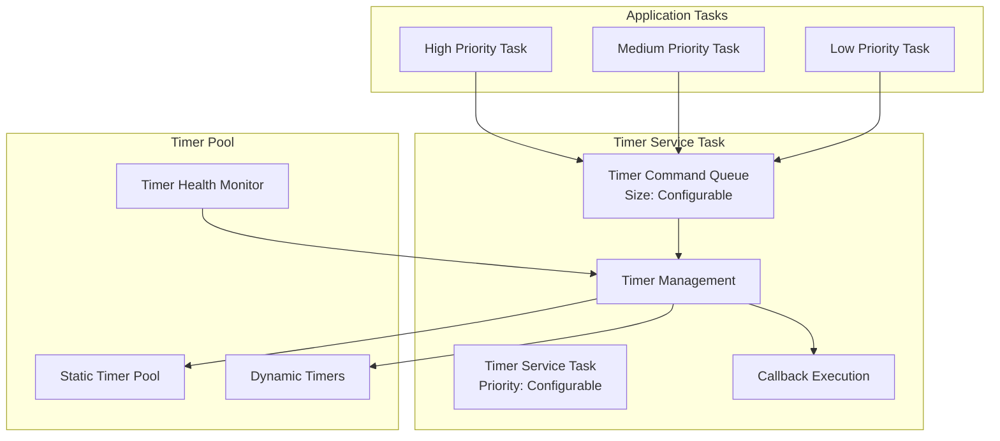
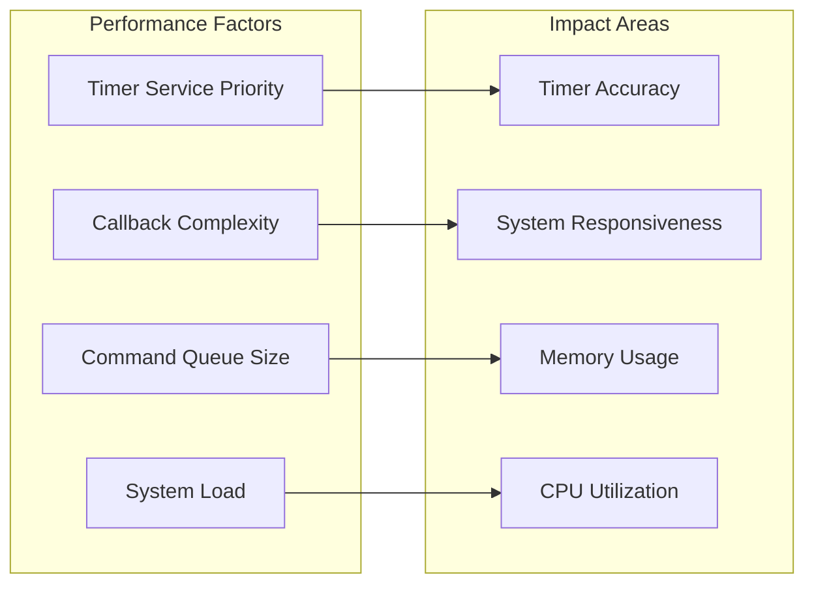

# Lab 3: Advanced Timer Management & Performance (75 นาที)

## 🎯 วัตถุประสงค์
- เรียนรู้ Timer Pool Management และ Dynamic Allocation
- เพิ่มประสิทธิภาพ Timer Service Task
- สร้างระบบ Timer Health Monitoring
- ออกแบบ Production-Ready Timer System

## 📝 ความรู้ขั้นสูง

### Timer Service Task Architecture


### Performance Considerations


## 🛠️ การเตรียมโปรเจค

### Advanced Configuration
```c
// Custom Timer Configuration
#define TIMER_POOL_SIZE              20
#define DYNAMIC_TIMER_MAX            10
#define PERFORMANCE_MONITOR_INTERVAL 5000
#define HEALTH_CHECK_INTERVAL        1000
#define STRESS_TEST_TIMERS          50

// Performance Thresholds
#define MAX_CALLBACK_TIME_US        1000
#define MAX_COMMAND_WAIT_MS         100
#define MIN_TIMER_ACCURACY_PERCENT  95
#define MAX_SERVICE_TASK_LOAD       80
```

### Project Setup
```bash
cd ~/esp
idf.py create-project advanced_timer_management
cd advanced_timer_management

# Configure for high performance
idf.py menuconfig
# Component config → FreeRTOS → Software timers
# Set TIMER_TASK_PRIORITY=15 (high priority)
# Set TIMER_QUEUE_LENGTH=20
# Set TIMER_TASK_STACK_SIZE=4096
```

### Advanced Timer Management Code

```c
#include <stdio.h>
#include <stdint.h>
#include <string.h>
#include <math.h>
#include "freertos/FreeRTOS.h"
#include "freertos/task.h"
#include "freertos/timers.h"
#include "freertos/semphr.h"
#include "freertos/queue.h"
#include "esp_log.h"
#include "esp_timer.h"
#include "esp_system.h"
#include "esp_random.h"
#include "driver/gpio.h"

static const char *TAG = "ADV_TIMERS";

// ================ CONFIGURATION ================
#define TIMER_POOL_SIZE              20
#define DYNAMIC_TIMER_MAX            10
#define PERFORMANCE_BUFFER_SIZE      100
#define HEALTH_CHECK_INTERVAL        1000

// LEDs for visual feedback
#define PERFORMANCE_LED     GPIO_NUM_2
#define HEALTH_LED         GPIO_NUM_4
#define STRESS_LED         GPIO_NUM_5
#define ERROR_LED          GPIO_NUM_18

// ================ DATA STRUCTURES ================

// Timer Pool Entry
typedef struct {
    TimerHandle_t handle;
    bool in_use;
    uint32_t id;
    char name[16];
    TickType_t period;
    bool auto_reload;
    TimerCallbackFunction_t callback;
    void* context;
    uint32_t creation_time;
    uint32_t start_count;
    uint32_t callback_count;
} timer_pool_entry_t;

// Performance Metrics
typedef struct {
    uint32_t callback_start_time;
    uint32_t callback_duration_us;
    uint32_t timer_id;
    BaseType_t service_task_priority;
    uint32_t queue_length;
    bool accuracy_ok;
} performance_sample_t;

// System Health Data
typedef struct {
    uint32_t total_timers_created;
    uint32_t active_timers;
    uint32_t pool_utilization;
    uint32_t dynamic_timers;
    uint32_t failed_creations;
    uint32_t callback_overruns;
    uint32_t command_failures;
    float average_accuracy;
    uint32_t service_task_load_percent;
    uint32_t free_heap_bytes;
} timer_health_t;

// ================ GLOBAL VARIABLES ================

// Timer Pool Management
timer_pool_entry_t timer_pool[TIMER_POOL_SIZE];
SemaphoreHandle_t pool_mutex;
uint32_t next_timer_id = 1000;

// Performance Monitoring
performance_sample_t perf_buffer[PERFORMANCE_BUFFER_SIZE];
uint32_t perf_buffer_index = 0;
SemaphoreHandle_t perf_mutex;

// Health Monitoring
timer_health_t health_data = {0};
TimerHandle_t health_monitor_timer;
TimerHandle_t performance_timer;

// Dynamic Timer Tracking
TimerHandle_t dynamic_timers[DYNAMIC_TIMER_MAX];
uint32_t dynamic_timer_count = 0;

// Test Infrastructure
QueueHandle_t test_result_queue;
TaskHandle_t stress_test_task_handle;

// ================ TIMER POOL MANAGEMENT ================

void init_timer_pool(void) {
    pool_mutex = xSemaphoreCreateMutex();
    
    for (int i = 0; i < TIMER_POOL_SIZE; i++) {
        timer_pool[i].handle = NULL;
        timer_pool[i].in_use = false;
        timer_pool[i].id = 0;
        memset(timer_pool[i].name, 0, sizeof(timer_pool[i].name));
        timer_pool[i].creation_time = 0;
        timer_pool[i].start_count = 0;
        timer_pool[i].callback_count = 0;
    }
    
    ESP_LOGI(TAG, "Timer pool initialized with %d slots", TIMER_POOL_SIZE);
}

timer_pool_entry_t* allocate_from_pool(const char* name, TickType_t period, 
                                      bool auto_reload, TimerCallbackFunction_t callback,
                                      void* context) {
    if (xSemaphoreTake(pool_mutex, pdMS_TO_TICKS(100)) != pdTRUE) {
        ESP_LOGW(TAG, "Failed to acquire pool mutex");
        return NULL;
    }
    
    timer_pool_entry_t* entry = NULL;
    
    // Find free slot
    for (int i = 0; i < TIMER_POOL_SIZE; i++) {
        if (!timer_pool[i].in_use) {
            entry = &timer_pool[i];
            entry->in_use = true;
            entry->id = next_timer_id++;
            strncpy(entry->name, name, sizeof(entry->name) - 1);
            entry->period = period;
            entry->auto_reload = auto_reload;
            entry->callback = callback;
            entry->context = context;
            entry->creation_time = xTaskGetTickCount();
            entry->start_count = 0;
            entry->callback_count = 0;
            
            // Create actual timer
            entry->handle = xTimerCreate(name, period, auto_reload, 
                                       (void*)entry->id, callback);
            
            if (entry->handle == NULL) {
                entry->in_use = false;
                entry = NULL;
                health_data.failed_creations++;
            } else {
                health_data.total_timers_created++;
            }
            break;
        }
    }
    
    if (entry == NULL) {
        ESP_LOGW(TAG, "Timer pool exhausted");
        health_data.failed_creations++;
    }
    
    xSemaphoreGive(pool_mutex);
    return entry;
}

void release_to_pool(uint32_t timer_id) {
    if (xSemaphoreTake(pool_mutex, pdMS_TO_TICKS(100)) != pdTRUE) {
        return;
    }
    
    for (int i = 0; i < TIMER_POOL_SIZE; i++) {
        if (timer_pool[i].in_use && timer_pool[i].id == timer_id) {
            if (timer_pool[i].handle) {
                xTimerDelete(timer_pool[i].handle, 0);
            }
            timer_pool[i].in_use = false;
            timer_pool[i].handle = NULL;
            ESP_LOGI(TAG, "Released timer %lu from pool", timer_id);
            break;
        }
    }
    
    xSemaphoreGive(pool_mutex);
}

// ================ PERFORMANCE MONITORING ================

void record_performance_sample(uint32_t timer_id, uint32_t duration_us, bool accuracy_ok) {
    if (xSemaphoreTake(perf_mutex, 0) == pdTRUE) { // Non-blocking
        performance_sample_t* sample = &perf_buffer[perf_buffer_index];
        
        sample->timer_id = timer_id;
        sample->callback_duration_us = duration_us;
        sample->accuracy_ok = accuracy_ok;
        sample->callback_start_time = esp_timer_get_time() / 1000; // Convert to ms
        sample->service_task_priority = uxTaskPriorityGet(NULL);
        sample->queue_length = 0; // Would need special access to get this
        
        perf_buffer_index = (perf_buffer_index + 1) % PERFORMANCE_BUFFER_SIZE;
        
        if (duration_us > 1000) { // > 1ms is concerning
            health_data.callback_overruns++;
        }
        
        xSemaphoreGive(perf_mutex);
    }
}

void analyze_performance(void) {
    if (xSemaphoreTake(perf_mutex, pdMS_TO_TICKS(100)) != pdTRUE) {
        return;
    }
    
    uint32_t total_duration = 0;
    uint32_t max_duration = 0;
    uint32_t min_duration = UINT32_MAX;
    uint32_t accurate_timers = 0;
    uint32_t sample_count = 0;
    
    for (int i = 0; i < PERFORMANCE_BUFFER_SIZE; i++) {
        if (perf_buffer[i].callback_duration_us > 0) {
            total_duration += perf_buffer[i].callback_duration_us;
            
            if (perf_buffer[i].callback_duration_us > max_duration) {
                max_duration = perf_buffer[i].callback_duration_us;
            }
            
            if (perf_buffer[i].callback_duration_us < min_duration) {
                min_duration = perf_buffer[i].callback_duration_us;
            }
            
            if (perf_buffer[i].accuracy_ok) {
                accurate_timers++;
            }
            
            sample_count++;
        }
    }
    
    if (sample_count > 0) {
        uint32_t avg_duration = total_duration / sample_count;
        health_data.average_accuracy = (float)accurate_timers / sample_count * 100.0;
        
        ESP_LOGI(TAG, "📊 Performance Analysis:");
        ESP_LOGI(TAG, "  Callback Duration: Avg=%luμs, Max=%luμs, Min=%luμs", 
                 avg_duration, max_duration, min_duration);
        ESP_LOGI(TAG, "  Timer Accuracy: %.1f%% (%lu/%lu)", 
                 health_data.average_accuracy, accurate_timers, sample_count);
        ESP_LOGI(TAG, "  Callback Overruns: %lu", health_data.callback_overruns);
        
        // Visual feedback
        if (avg_duration > 500) {
            gpio_set_level(PERFORMANCE_LED, 1); // Warning
        } else {
            gpio_set_level(PERFORMANCE_LED, 0);
        }
    }
    
    xSemaphoreGive(perf_mutex);
}

// ================ TIMER CALLBACKS ================

void performance_test_callback(TimerHandle_t timer) {
    uint32_t start_time = esp_timer_get_time();
    uint32_t timer_id = (uint32_t)pvTimerGetTimerID(timer);
    
    // Simulate variable processing time
    volatile uint32_t iterations = 100 + (esp_random() % 500);
    for (volatile uint32_t i = 0; i < iterations; i++) {
        // Simulate work
    }
    
    uint32_t end_time = esp_timer_get_time();
    uint32_t duration_us = end_time - start_time;
    
    // Check accuracy (simplified)
    static uint32_t last_callback_time = 0;
    uint32_t expected_interval = pdTICKS_TO_MS(xTimerGetPeriod(timer)) * 1000; // Convert to μs
    uint32_t actual_interval = start_time - last_callback_time;
    bool accuracy_ok = true;
    
    if (last_callback_time > 0) {
        uint32_t accuracy_percent = (actual_interval * 100) / expected_interval;
        accuracy_ok = (accuracy_percent >= 95 && accuracy_percent <= 105);
    }
    
    last_callback_time = start_time;
    
    record_performance_sample(timer_id, duration_us, accuracy_ok);
    
    // Update timer stats
    for (int i = 0; i < TIMER_POOL_SIZE; i++) {
        if (timer_pool[i].in_use && timer_pool[i].id == timer_id) {
            timer_pool[i].callback_count++;
            break;
        }
    }
}

void stress_test_callback(TimerHandle_t timer) {
    static uint32_t stress_counter = 0;
    stress_counter++;
    
    // Quick processing only
    if (stress_counter % 100 == 0) {
        ESP_LOGI(TAG, "💪 Stress test callback #%lu", stress_counter);
        gpio_set_level(STRESS_LED, stress_counter % 2);
    }
}

void health_monitor_callback(TimerHandle_t timer) {
    // Update health metrics
    health_data.free_heap_bytes = esp_get_free_heap_size();
    
    uint32_t active_count = 0;
    uint32_t pool_used = 0;
    
    if (xSemaphoreTake(pool_mutex, pdMS_TO_TICKS(10)) == pdTRUE) {
        for (int i = 0; i < TIMER_POOL_SIZE; i++) {
            if (timer_pool[i].in_use) {
                pool_used++;
                if (xTimerIsTimerActive(timer_pool[i].handle)) {
                    active_count++;
                }
            }
        }
        xSemaphoreGive(pool_mutex);
    }
    
    health_data.active_timers = active_count;
    health_data.pool_utilization = (pool_used * 100) / TIMER_POOL_SIZE;
    health_data.dynamic_timers = dynamic_timer_count;
    
    // Health status LED
    if (health_data.pool_utilization > 80 || health_data.callback_overruns > 10) {
        gpio_set_level(HEALTH_LED, 1); // Warning
    } else {
        gpio_set_level(HEALTH_LED, 0);
    }
    
    ESP_LOGI(TAG, "🏥 Health Monitor:");
    ESP_LOGI(TAG, "  Active Timers: %lu/%lu", active_count, pool_used);
    ESP_LOGI(TAG, "  Pool Utilization: %lu%%", health_data.pool_utilization);
    ESP_LOGI(TAG, "  Dynamic Timers: %lu/%d", health_data.dynamic_timers, DYNAMIC_TIMER_MAX);
    ESP_LOGI(TAG, "  Free Heap: %lu bytes", health_data.free_heap_bytes);
    ESP_LOGI(TAG, "  Failed Creations: %lu", health_data.failed_creations);
}

// ================ DYNAMIC TIMER MANAGEMENT ================

TimerHandle_t create_dynamic_timer(const char* name, uint32_t period_ms, 
                                  bool auto_reload, TimerCallbackFunction_t callback) {
    if (dynamic_timer_count >= DYNAMIC_TIMER_MAX) {
        ESP_LOGW(TAG, "Dynamic timer limit reached");
        return NULL;
    }
    
    TimerHandle_t timer = xTimerCreate(name, pdMS_TO_TICKS(period_ms), 
                                     auto_reload, (void*)next_timer_id++, callback);
    
    if (timer != NULL) {
        dynamic_timers[dynamic_timer_count] = timer;
        dynamic_timer_count++;
        ESP_LOGI(TAG, "Created dynamic timer: %s", name);
    }
    
    return timer;
}

void cleanup_dynamic_timers(void) {
    for (uint32_t i = 0; i < dynamic_timer_count; i++) {
        if (dynamic_timers[i] != NULL) {
            xTimerDelete(dynamic_timers[i], pdMS_TO_TICKS(100));
            dynamic_timers[i] = NULL;
        }
    }
    dynamic_timer_count = 0;
    ESP_LOGI(TAG, "Cleaned up all dynamic timers");
}

// ================ STRESS TESTING ================

void stress_test_task(void *parameter) {
    ESP_LOGI(TAG, "🔥 Starting stress test...");
    
    // Create many timers with different periods
    timer_pool_entry_t* stress_timers[10];
    
    for (int i = 0; i < 10; i++) {
        char name[16];
        snprintf(name, sizeof(name), "Stress%d", i);
        
        uint32_t period = 100 + (i * 50); // 100ms to 550ms
        stress_timers[i] = allocate_from_pool(name, pdMS_TO_TICKS(period), 
                                            true, stress_test_callback, NULL);
        
        if (stress_timers[i] != NULL) {
            xTimerStart(stress_timers[i]->handle, 0);
        }
        
        vTaskDelay(pdMS_TO_TICKS(100)); // Stagger creation
    }
    
    // Run stress test for 30 seconds
    vTaskDelay(pdMS_TO_TICKS(30000));
    
    // Clean up stress timers
    for (int i = 0; i < 10; i++) {
        if (stress_timers[i] != NULL) {
            xTimerStop(stress_timers[i]->handle, pdMS_TO_TICKS(100));
            release_to_pool(stress_timers[i]->id);
        }
    }
    
    ESP_LOGI(TAG, "Stress test completed");
    
    // Create some dynamic timers for testing
    for (int i = 0; i < 5; i++) {
        char name[16];
        snprintf(name, sizeof(name), "Dynamic%d", i);
        
        TimerHandle_t dt = create_dynamic_timer(name, 200 + (i * 100), 
                                              true, performance_test_callback);
        if (dt != NULL) {
            xTimerStart(dt, 0);
        }
    }
    
    vTaskDelete(NULL);
}

// ================ PERFORMANCE ANALYSIS TASK ================

void performance_analysis_task(void *parameter) {
    ESP_LOGI(TAG, "Performance analysis task started");
    
    while (1) {
        vTaskDelay(pdMS_TO_TICKS(10000)); // Every 10 seconds
        
        analyze_performance();
        
        // Generate performance report
        ESP_LOGI(TAG, "\n═══ PERFORMANCE REPORT ═══");
        ESP_LOGI(TAG, "Total Timers Created: %lu", health_data.total_timers_created);
        ESP_LOGI(TAG, "Current Active: %lu", health_data.active_timers);
        ESP_LOGI(TAG, "Pool Utilization: %lu%%", health_data.pool_utilization);
        ESP_LOGI(TAG, "Average Accuracy: %.1f%%", health_data.average_accuracy);
        ESP_LOGI(TAG, "Callback Overruns: %lu", health_data.callback_overruns);
        ESP_LOGI(TAG, "Command Failures: %lu", health_data.command_failures);
        ESP_LOGI(TAG, "═════════════════════════\n");
        
        // Memory usage check
        if (health_data.free_heap_bytes < 20000) {
            ESP_LOGW(TAG, "⚠️ Low memory warning: %lu bytes", health_data.free_heap_bytes);
            gpio_set_level(ERROR_LED, 1);
        } else {
            gpio_set_level(ERROR_LED, 0);
        }
    }
}

// ================ INITIALIZATION ================

void init_hardware(void) {
    gpio_set_direction(PERFORMANCE_LED, GPIO_MODE_OUTPUT);
    gpio_set_direction(HEALTH_LED, GPIO_MODE_OUTPUT);
    gpio_set_direction(STRESS_LED, GPIO_MODE_OUTPUT);
    gpio_set_direction(ERROR_LED, GPIO_MODE_OUTPUT);
    
    gpio_set_level(PERFORMANCE_LED, 0);
    gpio_set_level(HEALTH_LED, 0);
    gpio_set_level(STRESS_LED, 0);
    gpio_set_level(ERROR_LED, 0);
}

void init_monitoring(void) {
    perf_mutex = xSemaphoreCreateMutex();
    test_result_queue = xQueueCreate(20, sizeof(uint32_t));
    
    // Clear performance buffer
    memset(perf_buffer, 0, sizeof(perf_buffer));
    
    ESP_LOGI(TAG, "Monitoring systems initialized");
}

void create_system_timers(void) {
    // Health monitor timer
    health_monitor_timer = xTimerCreate("HealthMonitor",
                                       pdMS_TO_TICKS(HEALTH_CHECK_INTERVAL),
                                       pdTRUE, // Auto-reload
                                       (void*)1,
                                       health_monitor_callback);
    
    // Performance test timer
    performance_timer = xTimerCreate("PerfTest",
                                    pdMS_TO_TICKS(500),
                                    pdTRUE, // Auto-reload
                                    (void*)2,
                                    performance_test_callback);
    
    if (health_monitor_timer && performance_timer) {
        xTimerStart(health_monitor_timer, 0);
        xTimerStart(performance_timer, 0);
        ESP_LOGI(TAG, "System timers started");
    } else {
        ESP_LOGE(TAG, "Failed to create system timers");
    }
}

void app_main(void) {
    ESP_LOGI(TAG, "Advanced Timer Management Lab Starting...");
    
    // Initialize components
    init_hardware();
    init_timer_pool();
    init_monitoring();
    create_system_timers();
    
    // Create analysis task
    xTaskCreate(performance_analysis_task, "PerfAnalysis", 3072, NULL, 8, NULL);
    
    // Wait a bit then start stress test
    vTaskDelay(pdMS_TO_TICKS(5000));
    xTaskCreate(stress_test_task, "StressTest", 2048, NULL, 5, &stress_test_task_handle);
    
    ESP_LOGI(TAG, "🚀 Advanced Timer Management System Running");
    ESP_LOGI(TAG, "Monitor LEDs for system status:");
    ESP_LOGI(TAG, "  GPIO2  - Performance Warning");
    ESP_LOGI(TAG, "  GPIO4  - Health Status");
    ESP_LOGI(TAG, "  GPIO5  - Stress Test Activity");
    ESP_LOGI(TAG, "  GPIO18 - Error/Memory Warning");
}
```

## 🧪 การทดลอง

### ทดลองที่ 1: Timer Pool Management
1. สังเกตการจัดสรร Timer จาก Pool
2. ตรวจสอบ Pool Utilization
3. ทดสอบการจัดการ Dynamic Timers

### ทดลองที่ 2: Performance Analysis
1. สังเกต Callback Duration Statistics  
2. วิเคราะห์ Timer Accuracy
3. ตรวจสอบ Performance Warnings

### ทดลองที่ 3: Stress Testing
1. รัน Stress Test กับ Timer จำนวนมาก
2. สังเกต System Performance ภายใต้ Load
3. ตรวจสอบ Memory Usage และ Health Metrics

### ทดลองที่ 4: Health Monitoring
1. สังเกต Health Reports
2. ตรวจสอบ Error Conditions
3. วิเคราะห์ System Recovery

## 📊 การวิเคราะห์ผลขั้นสูง

### Performance Benchmarks
```
Expected Performance:
├── Callback Duration: < 500μs average
├── Timer Accuracy: > 95%
├── Pool Utilization: < 80%
├── Memory Usage: Stable
└── Command Success Rate: > 98%
```

### Optimization Strategies
1. **Timer Service Priority**: ปรับเพื่อให้สมดุลกับ System
2. **Callback Optimization**: ลดเวลาประมวลผลใน Callback
3. **Pool Management**: ใช้ Static Allocation เมื่อเป็นไปได้
4. **Health Monitoring**: ติดตาม Metrics สำคัญ

## 📋 Advanced Analysis Questions

1. **Service Task Priority**: ผลกระทบของ Priority ต่อ Timer Accuracy?
2. **Callback Performance**: วิธีการเพิ่มประสิทธิภาพ Callback Functions?
3. **Memory Management**: กลยุทธ์การจัดการ Memory สำหรับ Dynamic Timers?
4. **Error Recovery**: วิธีการ Handle Timer System Failures?
5. **Production Deployment**: การปรับแต่งสำหรับ Production Environment?

## 🚀 ความท้าทายระดับผู้เชี่ยวชาญ

### Challenge 1: Real-time Scheduler
สร้าง Timer-based Task Scheduler ที่รองรับ:
- Priority-based scheduling
- Deadline monitoring
- Load balancing

### Challenge 2: Distributed Timer System
ออกแบบระบบ Timer ที่รองรับ:
- Multiple ESP32 coordination
- Network-based synchronization
- Fault tolerance

### Challenge 3: Adaptive Performance
พัฒนาระบบที่:
- ปรับ Timer periods อัตโนมัติ
- เพิ่มประสิทธิภาพตาม Load
- เรียนรู้ Usage patterns

## 💡 Production Best Practices

### Memory Management
```c
// Use static allocation when possible
StaticTimer_t timer_buffer;
TimerHandle_t timer = xTimerCreateStatic(name, period, reload, 
                                        id, callback, &timer_buffer);

// Monitor memory usage
void check_memory_health(void) {
    size_t free_heap = esp_get_free_heap_size();
    if (free_heap < MEMORY_THRESHOLD) {
        cleanup_dynamic_timers();
        garbage_collect_unused_timers();
    }
}
```

### Error Handling
```c
// Robust timer command execution
BaseType_t safe_timer_start(TimerHandle_t timer) {
    BaseType_t result = pdFAIL;
    
    for (int retry = 0; retry < 3; retry++) {
        result = xTimerStart(timer, pdMS_TO_TICKS(100));
        if (result == pdPASS) break;
        
        vTaskDelay(pdMS_TO_TICKS(10));
        ESP_LOGW(TAG, "Timer start retry %d", retry + 1);
    }
    
    if (result != pdPASS) {
        health_data.command_failures++;
        ESP_LOGE(TAG, "Failed to start timer after retries");
    }
    
    return result;
}
```

### Health Monitoring
```c
// Comprehensive health check
void comprehensive_health_check(void) {
    // Check timer service task health
    TaskStatus_t task_status;
    vTaskGetInfo(xTimerGetTimerDaemonTaskHandle(), &task_status, pdTRUE, eInvalid);
    
    if (task_status.usStackHighWaterMark < 100) {
        ESP_LOGW(TAG, "Timer service task stack low: %d", task_status.usStackHighWaterMark);
    }
    
    // Check system load
    uint32_t run_time_percent = (task_status.ulRunTimeCounter * 100) / total_run_time;
    health_data.service_task_load_percent = run_time_percent;
    
    if (run_time_percent > 80) {
        ESP_LOGW(TAG, "Timer service task overloaded: %lu%%", run_time_percent);
    }
}
```

## 📚 Key Learning Outcomes

เมื่อเสร็จสิ้น Lab นี้ นักศึกษาจะเข้าใจ:

- ✅ **Advanced Timer Architecture**: Timer Service Task และ Performance
- ✅ **Pool Management**: Static vs Dynamic Timer Allocation  
- ✅ **Performance Optimization**: Callback Optimization และ System Tuning
- ✅ **Health Monitoring**: Comprehensive System Health Tracking
- ✅ **Production Practices**: Error Handling และ Resource Management
- ✅ **Debugging Techniques**: Performance Analysis และ Problem Diagnosis

## 🏆 Success Criteria

### Minimum Requirements ✅
- [ ] Timer Pool Management ทำงานได้
- [ ] Performance Monitoring แสดงผลถูกต้อง
- [ ] Health Monitoring ตรวจจับปัญหาได้
- [ ] Stress Test ผ่านได้

### Advanced Requirements ✅
- [ ] Timer Accuracy > 95%
- [ ] Callback Duration < 500μs average
- [ ] Pool Utilization จัดการได้ดี
- [ ] Error Recovery ทำงานได้

### Expert Level ✅
- [ ] Custom Optimization Strategies
- [ ] Advanced Error Handling
- [ ] Production-Ready Implementation
- [ ] Performance Benchmarking

---
**หมายเหตุ**: Lab นี้เป็นการประยุกต์ใช้ Timer ในระดับผู้เชี่ยวชาญ เหมาะสำหรับการพัฒนาระบบ Production ที่ต้องการประสิทธิภาพสูงและความเสถียร