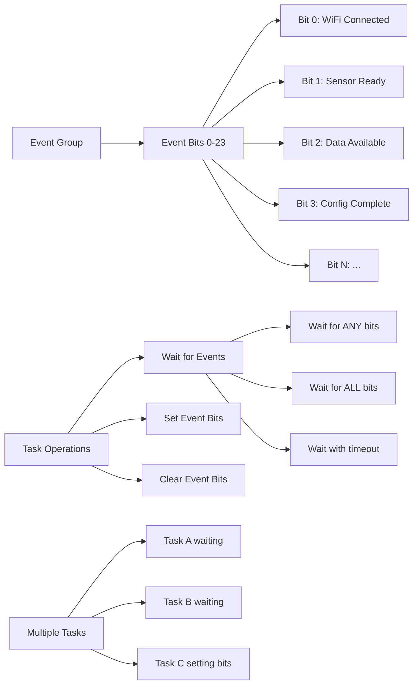
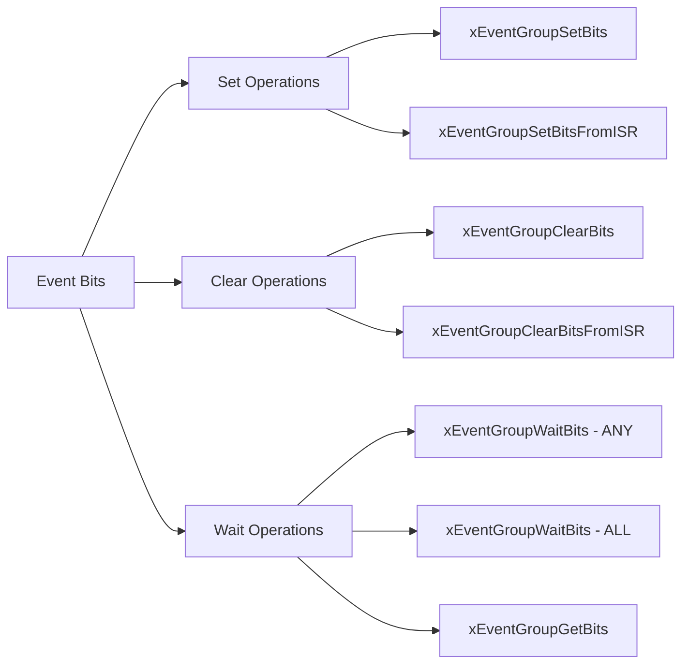

# FreeRTOS Event Groups - Task Synchronization

## Table of Contents
1. [Event Group Fundamentals](#event-group-fundamentals)
2. [Event Bits and Operations](#event-bits-and-operations)
3. [Event Group Creation and Management](#event-group-creation-and-management)
4. [Waiting for Events](#waiting-for-events)
5. [Setting and Clearing Events](#setting-and-clearing-events)
6. [Task Synchronization Patterns](#task-synchronization-patterns)
7. [Practical Examples](#practical-examples)
8. [Best Practices](#best-practices)
9. [Exercises](#exercises)

## Event Group Fundamentals

**Event Groups** provide a mechanism for tasks to wait for multiple events simultaneously. Each event group contains a set of event bits, where each bit represents a different event or condition.

### Key Concepts:
- **Event Bits**: Individual flags representing events (24 bits available)
- **Bit Patterns**: Combinations of bits representing complex conditions
- **Multiple Waiters**: Many tasks can wait on same event group
- **Atomic Operations**: Setting/clearing multiple bits atomically
- **Flexible Conditions**: Wait for ANY or ALL specified bits

### Event Group Architecture:



### Benefits:
- **Complex Synchronization**: Wait for multiple conditions
- **Efficient**: No polling required
- **Flexible**: ANY/ALL combinations
- **Broadcasting**: One event can wake multiple tasks
- **Atomic**: Multi-bit operations are atomic

### Event Groups vs Other Synchronization:

| Mechanism | Use Case | Pros | Cons |
|-----------|----------|------|------|
| **Event Groups** | Multiple conditions | Flexible combinations | Limited to 24 bits |
| **Binary Semaphore** | Simple signaling | Fast, lightweight | Single condition only |
| **Queue** | Data passing | Carries data | More memory overhead |
| **Mutex** | Resource protection | Ownership model | Single resource only |

## Event Bits and Operations

### Event Bit Definition:

```c
#include "freertos/event_groups.h"

// Define event bits using bit positions
#define WIFI_CONNECTED_BIT    BIT0   // 0x01
#define MQTT_CONNECTED_BIT    BIT1   // 0x02
#define SENSOR_READY_BIT      BIT2   // 0x04
#define CONFIG_LOADED_BIT     BIT3   // 0x08
#define DATA_READY_BIT        BIT4   // 0x10
#define ERROR_OCCURRED_BIT    BIT5   // 0x20

// Or define using shift operations
#define SYSTEM_INIT_BIT       (1 << 6)  // 0x40
#define CALIBRATION_DONE_BIT  (1 << 7)  // 0x80
#define SHUTDOWN_REQUEST_BIT  (1 << 8)  // 0x100

// Combine bits for complex conditions
#define NETWORK_READY_BITS    (WIFI_CONNECTED_BIT | MQTT_CONNECTED_BIT)
#define SYSTEM_READY_BITS     (SENSOR_READY_BIT | CONFIG_LOADED_BIT | SYSTEM_INIT_BIT)
#define ALL_READY_BITS        (NETWORK_READY_BITS | SYSTEM_READY_BITS)
```

### Bit Operations Overview:



## Event Group Creation and Management

### Core Event Group APIs:

| Function | Description |
|----------|-------------|
| `xEventGroupCreate()` | Create event group |
| `xEventGroupCreateStatic()` | Create with static allocation |
| `vEventGroupDelete()` | Delete event group |
| `xEventGroupSetBits()` | Set one or more bits |
| `xEventGroupClearBits()` | Clear one or more bits |
| `xEventGroupWaitBits()` | Wait for bit pattern |
| `xEventGroupGetBits()` | Get current bit values |

### Basic Event Group Setup:

```c
#include "freertos/FreeRTOS.h"
#include "freertos/task.h"
#include "freertos/event_groups.h"
#include "esp_log.h"

static const char *TAG = "EVENT_GROUP";

// Event group handle
EventGroupHandle_t system_event_group;

// Event bit definitions
#define WIFI_CONNECTED_BIT     BIT0
#define TIME_SYNCED_BIT        BIT1
#define SENSORS_READY_BIT      BIT2
#define CONFIG_LOADED_BIT      BIT3
#define CALIBRATION_DONE_BIT   BIT4

// Combined conditions
#define BASIC_SYSTEM_READY     (WIFI_CONNECTED_BIT | CONFIG_LOADED_BIT)
#define FULL_SYSTEM_READY      (BASIC_SYSTEM_READY | TIME_SYNCED_BIT | SENSORS_READY_BIT | CALIBRATION_DONE_BIT)

void app_main(void)
{
    ESP_LOGI(TAG, "Creating system event group...");
    
    // Create event group
    system_event_group = xEventGroupCreate();
    if (system_event_group == NULL) {
        ESP_LOGE(TAG, "Failed to create event group");
        return;
    }
    
    ESP_LOGI(TAG, "Event group created successfully");
    
    // Create system initialization tasks
    xTaskCreate(wifi_init_task, "WiFiInit", 3072, NULL, 6, NULL);
    xTaskCreate(time_sync_task, "TimeSync", 2048, NULL, 5, NULL);
    xTaskCreate(sensor_init_task, "SensorInit", 2048, NULL, 5, NULL);
    xTaskCreate(config_loader_task, "ConfigLoader", 2048, NULL, 5, NULL);
    xTaskCreate(calibration_task, "Calibration", 2048, NULL, 4, NULL);
    
    // Create main application task that waits for system ready
    xTaskCreate(main_app_task, "MainApp", 4096, NULL, 3, NULL);
    
    // Create monitoring task
    xTaskCreate(system_monitor_task, "Monitor", 2048, NULL, 2, NULL);
}
```

## Waiting for Events

### Basic Wait Operations:

```c
void main_app_task(void *parameter)
{
    ESP_LOGI(TAG, "Main application starting...");
    
    // Wait for basic system to be ready (ANY of the required bits)
    ESP_LOGI(TAG, "Waiting for basic system initialization...");
    EventBits_t bits = xEventGroupWaitBits(
        system_event_group,      // Event group handle
        BASIC_SYSTEM_READY,      // Bits to wait for
        pdFALSE,                 // Don't clear bits on exit
        pdTRUE,                  // Wait for ALL bits (AND)
        portMAX_DELAY            // Wait forever
    );
    
    if ((bits & BASIC_SYSTEM_READY) == BASIC_SYSTEM_READY) {
        ESP_LOGI(TAG, "Basic system ready - starting core functions");
        start_core_functions();
    }
    
    // Wait for full system ready
    ESP_LOGI(TAG, "Waiting for full system initialization...");
    bits = xEventGroupWaitBits(
        system_event_group,
        FULL_SYSTEM_READY,
        pdFALSE,                 // Don't clear bits
        pdTRUE,                  // Wait for ALL bits
        pdMS_TO_TICKS(30000)     // Timeout after 30 seconds
    );
    
    if ((bits & FULL_SYSTEM_READY) == FULL_SYSTEM_READY) {
        ESP_LOGI(TAG, "Full system ready - starting advanced features");
        start_advanced_features();
    } else {
        ESP_LOGW(TAG, "System initialization timeout - running with limited features");
        ESP_LOGW(TAG, "Missing bits: 0x%08x", FULL_SYSTEM_READY & ~bits);
        start_limited_mode();
    }
    
    // Main application loop
    while (1) {
        // Check for shutdown request
        bits = xEventGroupGetBits(system_event_group);
        if (bits & SHUTDOWN_REQUEST_BIT) {
            ESP_LOGI(TAG, "Shutdown requested - cleaning up...");
            cleanup_and_shutdown();
            break;
        }
        
        // Do main application work
        run_main_application();
        vTaskDelay(pdMS_TO_TICKS(1000));
    }
}
```

### Conditional Waiting Examples:

```c
void conditional_wait_examples(void)
{
    EventBits_t bits;
    
    // Wait for ANY of multiple events (OR condition)
    ESP_LOGI(TAG, "Waiting for any network connection...");
    bits = xEventGroupWaitBits(
        system_event_group,
        WIFI_CONNECTED_BIT | ETHERNET_CONNECTED_BIT | CELLULAR_CONNECTED_BIT,
        pdFALSE,     // Don't clear bits
        pdFALSE,     // Wait for ANY (OR)
        pdMS_TO_TICKS(10000)
    );
    
    if (bits & WIFI_CONNECTED_BIT) {
        ESP_LOGI(TAG, "WiFi connection established");
    } else if (bits & ETHERNET_CONNECTED_BIT) {
        ESP_LOGI(TAG, "Ethernet connection established");
    } else if (bits & CELLULAR_CONNECTED_BIT) {
        ESP_LOGI(TAG, "Cellular connection established");
    } else {
        ESP_LOGW(TAG, "No network connection within timeout");
    }
    
    // Wait for ALL required events (AND condition)
    ESP_LOGI(TAG, "Waiting for sensor subsystem ready...");
    bits = xEventGroupWaitBits(
        system_event_group,
        SENSOR_POWER_ON_BIT | SENSOR_CALIBRATED_BIT | SENSOR_SELFTEST_OK_BIT,
        pdTRUE,      // Clear bits after wait
        pdTRUE,      // Wait for ALL (AND)
        pdMS_TO_TICKS(5000)
    );
    
    if ((bits & (SENSOR_POWER_ON_BIT | SENSOR_CALIBRATED_BIT | SENSOR_SELFTEST_OK_BIT)) == 
        (SENSOR_POWER_ON_BIT | SENSOR_CALIBRATED_BIT | SENSOR_SELFTEST_OK_BIT)) {
        ESP_LOGI(TAG, "All sensor subsystems ready");
        start_sensor_operations();
    } else {
        ESP_LOGE(TAG, "Sensor initialization failed");
        handle_sensor_error();
    }
}
```

## Setting and Clearing Events

### Event Setting Examples:

```c
void wifi_init_task(void *parameter)
{
    ESP_LOGI(TAG, "WiFi initialization task starting");
    
    // Simulate WiFi initialization
    vTaskDelay(pdMS_TO_TICKS(2000));
    
    ESP_LOGI(TAG, "WiFi connecting...");
    // wifi_connect(); // Actual WiFi connection code
    
    vTaskDelay(pdMS_TO_TICKS(3000));
    
    ESP_LOGI(TAG, "WiFi connected successfully");
    
    // Set WiFi connected bit
    xEventGroupSetBits(system_event_group, WIFI_CONNECTED_BIT);
    
    // Continue monitoring WiFi status
    while (1) {
        vTaskDelay(pdMS_TO_TICKS(5000));
        
        // Check WiFi status
        // if (!wifi_is_connected()) {
        //     ESP_LOGW(TAG, "WiFi disconnected");
        //     xEventGroupClearBits(system_event_group, WIFI_CONNECTED_BIT);
        //     
        //     // Attempt reconnection
        //     wifi_reconnect();
        //     xEventGroupSetBits(system_event_group, WIFI_CONNECTED_BIT);
        // }
    }
}

void sensor_init_task(void *parameter)
{
    ESP_LOGI(TAG, "Sensor initialization starting");
    
    // Initialize sensors step by step
    ESP_LOGI(TAG, "Powering on sensors...");
    // sensor_power_on();
    vTaskDelay(pdMS_TO_TICKS(1000));
    xEventGroupSetBits(system_event_group, SENSOR_POWER_ON_BIT);
    
    ESP_LOGI(TAG, "Running sensor self-tests...");
    // bool selftest_ok = sensor_selftest();
    vTaskDelay(pdMS_TO_TICKS(2000));
    // if (selftest_ok) {
        xEventGroupSetBits(system_event_group, SENSOR_SELFTEST_OK_BIT);
        ESP_LOGI(TAG, "Sensor self-test passed");
    // } else {
    //     ESP_LOGE(TAG, "Sensor self-test failed");
    //     xEventGroupSetBits(system_event_group, SENSOR_ERROR_BIT);
    //     vTaskDelete(NULL);
    // }
    
    ESP_LOGI(TAG, "Calibrating sensors...");
    // sensor_calibrate();
    vTaskDelay(pdMS_TO_TICKS(3000));
    xEventGroupSetBits(system_event_group, SENSOR_CALIBRATED_BIT);
    
    ESP_LOGI(TAG, "Sensors ready");
    xEventGroupSetBits(system_event_group, SENSORS_READY_BIT);
    
    vTaskDelete(NULL); // Initialization complete
}
```

### Event Clearing and Atomic Operations:

```c
void config_loader_task(void *parameter)
{
    ESP_LOGI(TAG, "Loading system configuration...");
    
    // Clear any previous config status
    xEventGroupClearBits(system_event_group, CONFIG_LOADED_BIT | CONFIG_ERROR_BIT);
    
    // Load configuration files
    bool config_success = true;
    
    ESP_LOGI(TAG, "Loading network config...");
    vTaskDelay(pdMS_TO_TICKS(500));
    // config_success &= load_network_config();
    
    ESP_LOGI(TAG, "Loading sensor config...");
    vTaskDelay(pdMS_TO_TICKS(300));
    // config_success &= load_sensor_config();
    
    ESP_LOGI(TAG, "Loading application config...");
    vTaskDelay(pdMS_TO_TICKS(200));
    // config_success &= load_app_config();
    
    if (config_success) {
        ESP_LOGI(TAG, "Configuration loaded successfully");
        xEventGroupSetBits(system_event_group, CONFIG_LOADED_BIT);
    } else {
        ESP_LOGE(TAG, "Configuration loading failed");
        xEventGroupSetBits(system_event_group, CONFIG_ERROR_BIT);
    }
    
    vTaskDelete(NULL);
}

void error_handler_task(void *parameter)
{
    EventBits_t error_bits = CONFIG_ERROR_BIT | SENSOR_ERROR_BIT | NETWORK_ERROR_BIT;
    
    while (1) {
        // Wait for any error condition
        EventBits_t bits = xEventGroupWaitBits(
            system_event_group,
            error_bits,
            pdTRUE,          // Clear error bits after handling
            pdFALSE,         // Wait for ANY error
            portMAX_DELAY
        );
        
        if (bits & CONFIG_ERROR_BIT) {
            ESP_LOGE(TAG, "Handling configuration error");
            handle_config_error();
        }
        
        if (bits & SENSOR_ERROR_BIT) {
            ESP_LOGE(TAG, "Handling sensor error");
            handle_sensor_error();
        }
        
        if (bits & NETWORK_ERROR_BIT) {
            ESP_LOGE(TAG, "Handling network error");
            handle_network_error();
        }
    }
}
```

## Task Synchronization Patterns

### Barrier Synchronization:

```c
// Barrier pattern - wait for all tasks to reach a point
#define TASK_A_READY_BIT    BIT0
#define TASK_B_READY_BIT    BIT1
#define TASK_C_READY_BIT    BIT2
#define ALL_TASKS_READY     (TASK_A_READY_BIT | TASK_B_READY_BIT | TASK_C_READY_BIT)

void barrier_task_a(void *parameter)
{
    while (1) {
        // Do task-specific work
        ESP_LOGI(TAG, "Task A: Doing work phase 1");
        vTaskDelay(pdMS_TO_TICKS(1000 + rand() % 2000));
        
        // Signal ready for synchronization
        ESP_LOGI(TAG, "Task A: Ready for barrier");
        xEventGroupSetBits(system_event_group, TASK_A_READY_BIT);
        
        // Wait for all tasks to be ready
        xEventGroupWaitBits(system_event_group, ALL_TASKS_READY, pdTRUE, pdTRUE, portMAX_DELAY);
        
        ESP_LOGI(TAG, "Task A: All tasks synchronized, continuing");
        
        // Do synchronized work
        synchronized_work_phase();
    }
}

void barrier_task_b(void *parameter)
{
    while (1) {
        ESP_LOGI(TAG, "Task B: Doing work phase 1");
        vTaskDelay(pdMS_TO_TICKS(500 + rand() % 3000));
        
        ESP_LOGI(TAG, "Task B: Ready for barrier");
        xEventGroupSetBits(system_event_group, TASK_B_READY_BIT);
        
        xEventGroupWaitBits(system_event_group, ALL_TASKS_READY, pdTRUE, pdTRUE, portMAX_DELAY);
        
        ESP_LOGI(TAG, "Task B: All tasks synchronized, continuing");
        synchronized_work_phase();
    }
}

void barrier_task_c(void *parameter)
{
    while (1) {
        ESP_LOGI(TAG, "Task C: Doing work phase 1");
        vTaskDelay(pdMS_TO_TICKS(800 + rand() % 1500));
        
        ESP_LOGI(TAG, "Task C: Ready for barrier");
        xEventGroupSetBits(system_event_group, TASK_C_READY_BIT);
        
        xEventGroupWaitBits(system_event_group, ALL_TASKS_READY, pdTRUE, pdTRUE, portMAX_DELAY);
        
        ESP_LOGI(TAG, "Task C: All tasks synchronized, continuing");
        synchronized_work_phase();
    }
}
```

### Producer-Consumer with Multiple Conditions:

```c
#define DATA_AVAILABLE_BIT     BIT0
#define BUFFER_NOT_FULL_BIT    BIT1
#define PROCESSING_READY_BIT   BIT2
#define CONSUMER_READY_BIT     BIT3

void multi_condition_producer(void *parameter)
{
    int data_id = 0;
    
    while (1) {
        // Wait for buffer to have space and consumer to be ready
        EventBits_t bits = xEventGroupWaitBits(
            system_event_group,
            BUFFER_NOT_FULL_BIT | CONSUMER_READY_BIT,
            pdFALSE,     // Don't clear bits
            pdTRUE,      // Wait for ALL conditions
            portMAX_DELAY
        );
        
        if ((bits & (BUFFER_NOT_FULL_BIT | CONSUMER_READY_BIT)) == 
            (BUFFER_NOT_FULL_BIT | CONSUMER_READY_BIT)) {
            
            // Produce data
            ESP_LOGI(TAG, "Producer: Creating data item %d", data_id++);
            // add_to_buffer(data_id);
            
            // Signal data is available
            xEventGroupSetBits(system_event_group, DATA_AVAILABLE_BIT);
            
            // Check if buffer is now full
            // if (buffer_is_full()) {
            //     xEventGroupClearBits(system_event_group, BUFFER_NOT_FULL_BIT);
            // }
        }
        
        vTaskDelay(pdMS_TO_TICKS(500));
    }
}

void multi_condition_consumer(void *parameter)
{
    // Signal consumer is ready
    xEventGroupSetBits(system_event_group, CONSUMER_READY_BIT);
    
    while (1) {
        // Wait for data to be available and processing to be ready
        EventBits_t bits = xEventGroupWaitBits(
            system_event_group,
            DATA_AVAILABLE_BIT | PROCESSING_READY_BIT,
            pdFALSE,     // Don't clear bits yet
            pdTRUE,      // Wait for ALL conditions
            pdMS_TO_TICKS(5000)
        );
        
        if ((bits & (DATA_AVAILABLE_BIT | PROCESSING_READY_BIT)) == 
            (DATA_AVAILABLE_BIT | PROCESSING_READY_BIT)) {
            
            ESP_LOGI(TAG, "Consumer: Processing data");
            // int data = get_from_buffer();
            // process_data(data);
            
            // Clear data available if buffer is now empty
            // if (buffer_is_empty()) {
            //     xEventGroupClearBits(system_event_group, DATA_AVAILABLE_BIT);
            // }
            
            // Signal buffer has space
            xEventGroupSetBits(system_event_group, BUFFER_NOT_FULL_BIT);
            
            vTaskDelay(pdMS_TO_TICKS(1000)); // Processing time
        } else {
            ESP_LOGW(TAG, "Consumer: Timeout waiting for conditions");
        }
    }
}
```

## Practical Examples

### System Startup Orchestration:

```c
#include "freertos/event_groups.h"

// System startup events
#define HARDWARE_INIT_BIT      BIT0
#define DRIVERS_LOADED_BIT     BIT1
#define FILESYSTEM_READY_BIT   BIT2
#define NETWORK_STACK_BIT      BIT3
#define TIME_SYNCHRONIZED_BIT  BIT4
#define CONFIG_VALIDATED_BIT   BIT5
#define SERVICES_STARTED_BIT   BIT6
#define READY_FOR_USER_BIT     BIT7

// Startup phases
#define PHASE_1_COMPLETE    (HARDWARE_INIT_BIT | DRIVERS_LOADED_BIT)
#define PHASE_2_COMPLETE    (PHASE_1_COMPLETE | FILESYSTEM_READY_BIT | CONFIG_VALIDATED_BIT)
#define PHASE_3_COMPLETE    (PHASE_2_COMPLETE | NETWORK_STACK_BIT | TIME_SYNCHRONIZED_BIT)
#define SYSTEM_FULLY_READY  (PHASE_3_COMPLETE | SERVICES_STARTED_BIT | READY_FOR_USER_BIT)

EventGroupHandle_t startup_events;

void hardware_init_task(void *parameter)
{
    ESP_LOGI(TAG, "Hardware initialization starting...");
    
    // Initialize GPIO
    ESP_LOGI(TAG, "Configuring GPIO...");
    vTaskDelay(pdMS_TO_TICKS(200));
    
    // Initialize SPI/I2C
    ESP_LOGI(TAG, "Initializing communication interfaces...");
    vTaskDelay(pdMS_TO_TICKS(300));
    
    // Initialize ADC/PWM
    ESP_LOGI(TAG, "Configuring analog interfaces...");
    vTaskDelay(pdMS_TO_TICKS(150));
    
    ESP_LOGI(TAG, "Hardware initialization complete");
    xEventGroupSetBits(startup_events, HARDWARE_INIT_BIT);
    
    vTaskDelete(NULL);
}

void driver_loader_task(void *parameter)
{
    // Wait for hardware to be ready
    xEventGroupWaitBits(startup_events, HARDWARE_INIT_BIT, pdFALSE, pdTRUE, portMAX_DELAY);
    
    ESP_LOGI(TAG, "Loading device drivers...");
    
    // Load sensor drivers
    ESP_LOGI(TAG, "Loading sensor drivers...");
    vTaskDelay(pdMS_TO_TICKS(500));
    
    // Load display drivers
    ESP_LOGI(TAG, "Loading display drivers...");
    vTaskDelay(pdMS_TO_TICKS(300));
    
    // Load storage drivers
    ESP_LOGI(TAG, "Loading storage drivers...");
    vTaskDelay(pdMS_TO_TICKS(400));
    
    ESP_LOGI(TAG, "All drivers loaded");
    xEventGroupSetBits(startup_events, DRIVERS_LOADED_BIT);
    
    vTaskDelete(NULL);
}

void filesystem_init_task(void *parameter)
{
    // Wait for drivers
    xEventGroupWaitBits(startup_events, DRIVERS_LOADED_BIT, pdFALSE, pdTRUE, portMAX_DELAY);
    
    ESP_LOGI(TAG, "Initializing filesystem...");
    
    // Mount filesystem
    ESP_LOGI(TAG, "Mounting flash filesystem...");
    vTaskDelay(pdMS_TO_TICKS(800));
    
    // Check filesystem integrity
    ESP_LOGI(TAG, "Checking filesystem integrity...");
    vTaskDelay(pdMS_TO_TICKS(1000));
    
    ESP_LOGI(TAG, "Filesystem ready");
    xEventGroupSetBits(startup_events, FILESYSTEM_READY_BIT);
    
    vTaskDelete(NULL);
}

void network_init_task(void *parameter)
{
    // Wait for phase 2 completion
    xEventGroupWaitBits(startup_events, PHASE_2_COMPLETE, pdFALSE, pdTRUE, portMAX_DELAY);
    
    ESP_LOGI(TAG, "Initializing network stack...");
    
    // Initialize TCP/IP stack
    ESP_LOGI(TAG, "Starting TCP/IP stack...");
    vTaskDelay(pdMS_TO_TICKS(1000));
    
    // Connect to network
    ESP_LOGI(TAG, "Connecting to network...");
    vTaskDelay(pdMS_TO_TICKS(3000));
    
    ESP_LOGI(TAG, "Network stack ready");
    xEventGroupSetBits(startup_events, NETWORK_STACK_BIT);
    
    // Start time synchronization
    ESP_LOGI(TAG, "Synchronizing time...");
    vTaskDelay(pdMS_TO_TICKS(2000));
    
    ESP_LOGI(TAG, "Time synchronized");
    xEventGroupSetBits(startup_events, TIME_SYNCHRONIZED_BIT);
    
    vTaskDelete(NULL);
}

void startup_orchestrator_task(void *parameter)
{
    ESP_LOGI(TAG, "System startup orchestrator started");
    
    // Wait for each phase and log progress
    ESP_LOGI(TAG, "Waiting for Phase 1 (Hardware & Drivers)...");
    xEventGroupWaitBits(startup_events, PHASE_1_COMPLETE, pdFALSE, pdTRUE, 
                       pdMS_TO_TICKS(10000));
    ESP_LOGI(TAG, "Phase 1 complete");
    
    ESP_LOGI(TAG, "Waiting for Phase 2 (Filesystem & Config)...");
    xEventGroupWaitBits(startup_events, PHASE_2_COMPLETE, pdFALSE, pdTRUE, 
                       pdMS_TO_TICKS(15000));
    ESP_LOGI(TAG, "Phase 2 complete");
    
    ESP_LOGI(TAG, "Waiting for Phase 3 (Network & Time)...");
    xEventGroupWaitBits(startup_events, PHASE_3_COMPLETE, pdFALSE, pdTRUE, 
                       pdMS_TO_TICKS(20000));
    ESP_LOGI(TAG, "Phase 3 complete");
    
    // Start application services
    ESP_LOGI(TAG, "Starting application services...");
    start_application_services();
    xEventGroupSetBits(startup_events, SERVICES_STARTED_BIT);
    
    // Final system ready
    xEventGroupSetBits(startup_events, READY_FOR_USER_BIT);
    
    EventBits_t final_bits = xEventGroupGetBits(startup_events);
    if ((final_bits & SYSTEM_FULLY_READY) == SYSTEM_FULLY_READY) {
        ESP_LOGI(TAG, "🎉 SYSTEM FULLY OPERATIONAL 🎉");
    } else {
        ESP_LOGW(TAG, "System startup incomplete. Missing: 0x%08x", 
                 SYSTEM_FULLY_READY & ~final_bits);
    }
    
    vTaskDelete(NULL);
}

void setup_startup_orchestration(void)
{
    startup_events = xEventGroupCreate();
    
    // Create initialization tasks
    xTaskCreate(hardware_init_task, "HWInit", 2048, NULL, 8, NULL);
    xTaskCreate(driver_loader_task, "DriverLoad", 2048, NULL, 7, NULL);
    xTaskCreate(filesystem_init_task, "FSInit", 2048, NULL, 6, NULL);
    xTaskCreate(network_init_task, "NetInit", 3072, NULL, 5, NULL);
    xTaskCreate(startup_orchestrator_task, "Orchestrator", 2048, NULL, 4, NULL);
}
```

### Multi-Sensor Data Fusion System:

```c
// Sensor event bits
#define TEMP_SENSOR_DATA_BIT    BIT0
#define HUMID_SENSOR_DATA_BIT   BIT1
#define PRESS_SENSOR_DATA_BIT   BIT2
#define LIGHT_SENSOR_DATA_BIT   BIT3
#define MOTION_SENSOR_DATA_BIT  BIT4

// Processing state bits
#define CALIBRATION_ACTIVE_BIT  BIT8
#define FUSION_READY_BIT        BIT9
#define DATA_VALID_BIT          BIT10
#define ALERT_CONDITION_BIT     BIT11

// Sensor combinations
#define BASIC_ENVIRONMENTAL    (TEMP_SENSOR_DATA_BIT | HUMID_SENSOR_DATA_BIT)
#define FULL_ENVIRONMENTAL     (BASIC_ENVIRONMENTAL | PRESS_SENSOR_DATA_BIT | LIGHT_SENSOR_DATA_BIT)
#define ALL_SENSORS           (FULL_ENVIRONMENTAL | MOTION_SENSOR_DATA_BIT)

EventGroupHandle_t sensor_events;

typedef struct {
    float temperature;
    float humidity;
    float pressure;
    float light_level;
    bool motion_detected;
    uint32_t timestamp;
} sensor_fusion_data_t;

sensor_fusion_data_t current_sensor_data;

void temperature_sensor_task(void *parameter)
{
    while (1) {
        // Read temperature sensor
        current_sensor_data.temperature = 20.0 + (rand() % 300) / 10.0;
        current_sensor_data.timestamp = xTaskGetTickCount();
        
        ESP_LOGI(TAG, "Temperature: %.1f°C", current_sensor_data.temperature);
        
        // Signal data available
        xEventGroupSetBits(sensor_events, TEMP_SENSOR_DATA_BIT);
        
        vTaskDelay(pdMS_TO_TICKS(1000));
    }
}

void humidity_sensor_task(void *parameter)
{
    while (1) {
        current_sensor_data.humidity = 30.0 + (rand() % 700) / 10.0;
        ESP_LOGI(TAG, "Humidity: %.1f%%", current_sensor_data.humidity);
        
        xEventGroupSetBits(sensor_events, HUMID_SENSOR_DATA_BIT);
        
        vTaskDelay(pdMS_TO_TICKS(1500));
    }
}

void pressure_sensor_task(void *parameter)
{
    while (1) {
        current_sensor_data.pressure = 980.0 + (rand() % 400) / 10.0;
        ESP_LOGI(TAG, "Pressure: %.1f hPa", current_sensor_data.pressure);
        
        xEventGroupSetBits(sensor_events, PRESS_SENSOR_DATA_BIT);
        
        vTaskDelay(pdMS_TO_TICKS(2000));
    }
}

void sensor_fusion_task(void *parameter)
{
    ESP_LOGI(TAG, "Sensor fusion task started");
    
    while (1) {
        // Wait for basic environmental data
        EventBits_t bits = xEventGroupWaitBits(
            sensor_events,
            BASIC_ENVIRONMENTAL,
            pdTRUE,          // Clear bits after reading
            pdTRUE,          // Wait for ALL bits
            pdMS_TO_TICKS(5000)
        );
        
        if ((bits & BASIC_ENVIRONMENTAL) == BASIC_ENVIRONMENTAL) {
            ESP_LOGI(TAG, "Basic environmental data ready - performing fusion");
            
            // Basic fusion calculation
            float comfort_index = calculate_comfort_index(
                current_sensor_data.temperature, 
                current_sensor_data.humidity
            );
            
            ESP_LOGI(TAG, "Comfort index: %.1f", comfort_index);
            
            // Check for full environmental data
            bits = xEventGroupGetBits(sensor_events);
            if ((bits & FULL_ENVIRONMENTAL) == FULL_ENVIRONMENTAL) {
                ESP_LOGI(TAG, "Full environmental data available");
                
                // Advanced fusion with all environmental sensors
                float environmental_index = calculate_environmental_index(
                    current_sensor_data.temperature,
                    current_sensor_data.humidity,
                    current_sensor_data.pressure,
                    current_sensor_data.light_level
                );
                
                ESP_LOGI(TAG, "Environmental index: %.1f", environmental_index);
                
                // Clear the additional sensor bits
                xEventGroupClearBits(sensor_events, PRESS_SENSOR_DATA_BIT | LIGHT_SENSOR_DATA_BIT);
                
                // Check for alert conditions
                if (environmental_index > 80.0 || environmental_index < 20.0) {
                    ESP_LOGW(TAG, "Environmental alert condition detected!");
                    xEventGroupSetBits(sensor_events, ALERT_CONDITION_BIT);
                }
            }
            
            xEventGroupSetBits(sensor_events, DATA_VALID_BIT);
        } else {
            ESP_LOGW(TAG, "Timeout waiting for basic sensor data");
        }
    }
}

void alert_handler_task(void *parameter)
{
    while (1) {
        // Wait for alert conditions
        xEventGroupWaitBits(sensor_events, ALERT_CONDITION_BIT, pdTRUE, pdTRUE, portMAX_DELAY);
        
        ESP_LOGW(TAG, "🚨 ALERT: Environmental conditions out of range!");
        ESP_LOGW(TAG, "Temperature: %.1f°C, Humidity: %.1f%%", 
                 current_sensor_data.temperature, current_sensor_data.humidity);
        
        // Handle alert (notifications, logging, etc.)
        handle_environmental_alert();
        
        // Wait before checking again
        vTaskDelay(pdMS_TO_TICKS(5000));
    }
}

float calculate_comfort_index(float temp, float humidity)
{
    // Simple comfort calculation
    float ideal_temp = 22.0;
    float ideal_humidity = 50.0;
    
    float temp_factor = 100.0 - abs(temp - ideal_temp) * 5.0;
    float humidity_factor = 100.0 - abs(humidity - ideal_humidity) * 2.0;
    
    return (temp_factor + humidity_factor) / 2.0;
}

float calculate_environmental_index(float temp, float humidity, float pressure, float light)
{
    // More complex environmental calculation
    float comfort = calculate_comfort_index(temp, humidity);
    float pressure_factor = (pressure > 1000.0) ? 100.0 : pressure / 10.0;
    float light_factor = (light > 500.0) ? 100.0 : light / 5.0;
    
    return (comfort * 0.5) + (pressure_factor * 0.25) + (light_factor * 0.25);
}
```

## Best Practices

### 1. Use Descriptive Bit Names:

```c
// Good - descriptive names
#define WIFI_CONNECTED_BIT        BIT0
#define MQTT_BROKER_CONNECTED_BIT BIT1
#define DATA_VALIDATED_BIT        BIT2
#define USER_AUTHENTICATED_BIT    BIT3

// Bad - generic names
#define BIT_0  BIT0
#define BIT_1  BIT1
#define FLAG_A BIT2
#define STATUS BIT3
```

### 2. Group Related Events:

```c
// Network-related events
#define NETWORK_EVENTS_BASE     0
#define WIFI_CONNECTED_BIT      (1 << (NETWORK_EVENTS_BASE + 0))
#define IP_ASSIGNED_BIT         (1 << (NETWORK_EVENTS_BASE + 1))
#define DNS_RESOLVED_BIT        (1 << (NETWORK_EVENTS_BASE + 2))

// Sensor-related events  
#define SENSOR_EVENTS_BASE      8
#define TEMP_READY_BIT          (1 << (SENSOR_EVENTS_BASE + 0))
#define HUMIDITY_READY_BIT      (1 << (SENSOR_EVENTS_BASE + 1))
#define PRESSURE_READY_BIT      (1 << (SENSOR_EVENTS_BASE + 2))

// Error events
#define ERROR_EVENTS_BASE       16
#define NETWORK_ERROR_BIT       (1 << (ERROR_EVENTS_BASE + 0))
#define SENSOR_ERROR_BIT        (1 << (ERROR_EVENTS_BASE + 1))
#define CONFIG_ERROR_BIT        (1 << (ERROR_EVENTS_BASE + 2))
```

### 3. Handle Timeouts Appropriately:

```c
void robust_event_waiting(void)
{
    const TickType_t timeout = pdMS_TO_TICKS(5000);
    
    EventBits_t bits = xEventGroupWaitBits(
        event_group,
        REQUIRED_EVENTS,
        pdFALSE,
        pdTRUE,
        timeout
    );
    
    if ((bits & REQUIRED_EVENTS) == REQUIRED_EVENTS) {
        ESP_LOGI(TAG, "All required events received");
        proceed_with_operation();
    } else {
        ESP_LOGW(TAG, "Timeout waiting for events. Received: 0x%08x, Required: 0x%08x", 
                 bits, REQUIRED_EVENTS);
        
        // Handle partial conditions
        if (bits & CRITICAL_EVENT_BIT) {
            ESP_LOGI(TAG, "Critical event received, proceeding with limited functionality");
            proceed_with_limited_operation();
        } else {
            ESP_LOGE(TAG, "Critical events missing, aborting operation");
            abort_operation();
        }
    }
}
```

### 4. Use Event Groups for State Machines:

```c
typedef enum {
    STATE_IDLE,
    STATE_CONNECTING,
    STATE_CONNECTED,
    STATE_AUTHENTICATING,
    STATE_AUTHENTICATED,
    STATE_ERROR
} connection_state_t;

#define STATE_CHANGE_BIT        BIT0
#define CONNECTION_SUCCESS_BIT  BIT1
#define AUTH_SUCCESS_BIT        BIT2
#define ERROR_OCCURRED_BIT      BIT3

void connection_state_machine_task(void *parameter)
{
    connection_state_t current_state = STATE_IDLE;
    
    while (1) {
        EventBits_t bits = xEventGroupWaitBits(
            state_events,
            STATE_CHANGE_BIT | CONNECTION_SUCCESS_BIT | AUTH_SUCCESS_BIT | ERROR_OCCURRED_BIT,
            pdTRUE,
            pdFALSE,  // Wait for ANY
            portMAX_DELAY
        );
        
        if (bits & ERROR_OCCURRED_BIT) {
            current_state = STATE_ERROR;
            ESP_LOGE(TAG, "State machine error occurred");
            continue;
        }
        
        switch (current_state) {
            case STATE_IDLE:
                if (bits & STATE_CHANGE_BIT) {
                    current_state = STATE_CONNECTING;
                    ESP_LOGI(TAG, "Starting connection...");
                    start_connection();
                }
                break;
                
            case STATE_CONNECTING:
                if (bits & CONNECTION_SUCCESS_BIT) {
                    current_state = STATE_CONNECTED;
                    ESP_LOGI(TAG, "Connected successfully");
                }
                break;
                
            case STATE_CONNECTED:
                if (bits & STATE_CHANGE_BIT) {
                    current_state = STATE_AUTHENTICATING;
                    ESP_LOGI(TAG, "Starting authentication...");
                    start_authentication();
                }
                break;
                
            case STATE_AUTHENTICATING:
                if (bits & AUTH_SUCCESS_BIT) {
                    current_state = STATE_AUTHENTICATED;
                    ESP_LOGI(TAG, "Authenticated successfully");
                    system_ready();
                }
                break;
                
            case STATE_AUTHENTICATED:
                ESP_LOGI(TAG, "System fully operational");
                break;
                
            case STATE_ERROR:
                ESP_LOGE(TAG, "Resetting state machine");
                current_state = STATE_IDLE;
                break;
        }
    }
}
```

## Exercises

### Exercise 1: Basic Event Coordination

**Objective**: Create a system with multiple initialization tasks.

**Requirements**:
1. Three initialization tasks: Hardware, Network, Config
2. Main task waits for all initializations to complete
3. Each init task takes random time (1-5 seconds)
4. Log progress and completion times
5. Handle timeout conditions

### Exercise 2: Sensor Data Fusion

**Objective**: Implement multi-sensor data fusion system.

**Requirements**:
1. Three sensor tasks: Temperature, Humidity, Pressure
2. Fusion task waits for different sensor combinations
3. Basic fusion: Temp + Humidity
4. Advanced fusion: All three sensors
5. Alert system for out-of-range values

### Exercise 3: Multi-Phase System Startup

**Objective**: Create orchestrated system startup sequence.

**Requirements**:
1. Five startup phases with dependencies
2. Each phase requires previous phases to complete
3. Timeout handling for each phase
4. Progress reporting and error recovery
5. Graceful degradation for failed phases

### Exercise 4: Task Barrier Synchronization

**Objective**: Implement barrier synchronization pattern.

**Requirements**:
1. Four worker tasks with different work durations
2. Barrier synchronization point every cycle
3. All tasks must reach barrier before any continue
4. Log synchronization events and timing
5. Handle cases where tasks don't reach barrier

### Build and Test Commands:

```bash
# For each exercise:

# 1. Create project
idf.py create-project event_group_exercise_1

# 2. Edit main/main.c with exercise code

# 3. Build and test
idf.py build flash monitor

# 4. Test scenarios:
# - Normal operation
# - Timeout conditions
# - Partial event conditions
# - System under load

# 5. Monitor behavior:
# - Event timing
# - Task synchronization
# - Timeout handling
# - System responsiveness
```

### Expected Outputs:

**Exercise 1**:
```
I (1000) INIT: Hardware initialization started
I (1500) INIT: Network initialization started  
I (2000) INIT: Config initialization started
I (3200) INIT: Hardware initialization complete
I (4100) INIT: Config initialization complete
I (5800) INIT: Network initialization complete
I (5800) MAIN: All systems initialized - starting main application
```

**Exercise 2**:
```
I (1000) SENSOR: Temperature: 24.5°C
I (1200) SENSOR: Humidity: 65.0%
I (1200) FUSION: Basic environmental data ready
I (1200) FUSION: Comfort index: 78.5
I (2000) SENSOR: Pressure: 1013.2 hPa
I (2000) FUSION: Full environmental data available
I (2000) FUSION: Environmental index: 85.2
```

## Next Module

Continue to [07-memory-management.md](07-memory-management.md) to learn about FreeRTOS memory management strategies and heap allocation.

---
**Key Takeaways**:
- Event groups enable complex multi-condition synchronization
- 24 event bits provide flexible condition combinations
- Use descriptive bit names and logical groupings
- Handle timeouts and partial conditions gracefully
- Event groups excel at coordinating multiple tasks
- Barrier synchronization and state machines are common patterns