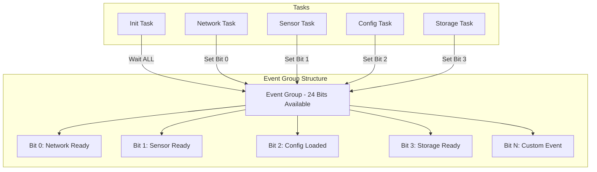

# Lab 1: Basic Event Groups (45 นาที)

## 🎯 วัตถุประสงค์
- เข้าใจหลักการทำงานของ FreeRTOS Event Groups
- เรียนรู้ APIs พื้นฐานสำหรับ Event Groups
- ฝึกการสร้างและจัดการ Event Bits
- เข้าใจเงื่อนไข ANY และ ALL ในการรอ Events
- สร้างระบบการเริ่มต้นระบบด้วย Event Synchronization

## 📝 ความรู้เบื้องต้น

**Event Groups** ใช้สำหรับ:
- การรอหลายเงื่อนไขพร้อมกัน (Multi-condition waiting)
- การประสานงานการเริ่มต้นระบบ (System initialization)
- การแจ้งเตือนแบบ Broadcasting (Event broadcasting)
- การซิงโครไนซ์ระหว่าง Tasks (Task synchronization)



## 🛠️ การเตรียมโปรเจค

### 1. สร้างโปรเจคใหม่
```bash
idf.py create-project basic_event_groups
cd basic_event_groups
```

### 2. แก้ไข main.c

```c
#include <stdio.h>
#include <stdint.h>
#include <string.h>
#include "freertos/FreeRTOS.h"
#include "freertos/task.h"
#include "freertos/event_groups.h"
#include "esp_log.h"
#include "esp_random.h"
#include "driver/gpio.h"

static const char *TAG = "EVENT_GROUPS";

// GPIO สำหรับแสดงสถานะ
#define LED_NETWORK_READY   GPIO_NUM_2   // Network initialization
#define LED_SENSOR_READY    GPIO_NUM_4   // Sensor initialization  
#define LED_CONFIG_READY    GPIO_NUM_5   // Configuration loaded
#define LED_STORAGE_READY   GPIO_NUM_18  // Storage initialization
#define LED_SYSTEM_READY    GPIO_NUM_19  // System fully ready

// Event Group และ Event Bits
EventGroupHandle_t system_events;

#define NETWORK_READY_BIT   (1 << 0)    // BIT0
#define SENSOR_READY_BIT    (1 << 1)    // BIT1  
#define CONFIG_READY_BIT    (1 << 2)    // BIT2
#define STORAGE_READY_BIT   (1 << 3)    // BIT3
#define SYSTEM_READY_BIT    (1 << 4)    // BIT4

// กลุ่ม Event Bits
#define BASIC_SYSTEM_BITS   (NETWORK_READY_BIT | CONFIG_READY_BIT)
#define ALL_SUBSYSTEM_BITS  (NETWORK_READY_BIT | SENSOR_READY_BIT | \
                            CONFIG_READY_BIT | STORAGE_READY_BIT)
#define FULL_SYSTEM_BITS    (ALL_SUBSYSTEM_BITS | SYSTEM_READY_BIT)

// สถิติระบบ
typedef struct {
    uint32_t network_init_time;
    uint32_t sensor_init_time;
    uint32_t config_init_time; 
    uint32_t storage_init_time;
    uint32_t total_init_time;
    uint32_t event_notifications;
} system_stats_t;

static system_stats_t stats = {0};

// Network initialization task
void network_init_task(void *pvParameters) {
    ESP_LOGI(TAG, "🌐 Network initialization started");
    
    uint32_t start_time = xTaskGetTickCount();
    
    // จำลองการเริ่มต้นเครือข่าย
    ESP_LOGI(TAG, "Initializing WiFi driver...");
    vTaskDelay(pdMS_TO_TICKS(800));
    
    ESP_LOGI(TAG, "Connecting to WiFi...");
    vTaskDelay(pdMS_TO_TICKS(2000));
    
    ESP_LOGI(TAG, "Getting IP address...");
    vTaskDelay(pdMS_TO_TICKS(1000));
    
    // คำนวณเวลาที่ใช้
    stats.network_init_time = (xTaskGetTickCount() - start_time) * portTICK_PERIOD_MS;
    
    // เปิด LED และส่งสัญญาณ
    gpio_set_level(LED_NETWORK_READY, 1);
    xEventGroupSetBits(system_events, NETWORK_READY_BIT);
    
    ESP_LOGI(TAG, "✅ Network ready! (took %lu ms)", stats.network_init_time);
    
    // จำลองการทำงานของ network
    while (1) {
        ESP_LOGI(TAG, "📡 Network heartbeat - checking connectivity");
        
        // จำลองการตรวจสอบเครือข่าย
        if ((esp_random() % 100) > 5) { // 95% uptime
            // เครือข่ายปกติ
            gpio_set_level(LED_NETWORK_READY, 1);
            if (!(xEventGroupGetBits(system_events) & NETWORK_READY_BIT)) {
                xEventGroupSetBits(system_events, NETWORK_READY_BIT);
                ESP_LOGI(TAG, "🟢 Network connection restored");
            }
        } else {
            // เครือข่ายขัดข้อง
            gpio_set_level(LED_NETWORK_READY, 0);
            xEventGroupClearBits(system_events, NETWORK_READY_BIT);
            ESP_LOGW(TAG, "🔴 Network connection lost");
        }
        
        vTaskDelay(pdMS_TO_TICKS(5000));
    }
}

// Sensor initialization task
void sensor_init_task(void *pvParameters) {
    ESP_LOGI(TAG, "🌡️ Sensor initialization started");
    
    uint32_t start_time = xTaskGetTickCount();
    
    // จำลองการเริ่มต้น sensors
    ESP_LOGI(TAG, "Initializing I2C bus...");
    vTaskDelay(pdMS_TO_TICKS(500));
    
    ESP_LOGI(TAG, "Detecting sensors...");
    vTaskDelay(pdMS_TO_TICKS(1200));
    
    ESP_LOGI(TAG, "Calibrating sensors...");
    vTaskDelay(pdMS_TO_TICKS(2000));
    
    ESP_LOGI(TAG, "Running self-tests...");
    vTaskDelay(pdMS_TO_TICKS(800));
    
    stats.sensor_init_time = (xTaskGetTickCount() - start_time) * portTICK_PERIOD_MS;
    
    gpio_set_level(LED_SENSOR_READY, 1);
    xEventGroupSetBits(system_events, SENSOR_READY_BIT);
    
    ESP_LOGI(TAG, "✅ Sensors ready! (took %lu ms)", stats.sensor_init_time);
    
    // จำลองการอ่านค่า sensor
    while (1) {
        float temperature = 25.0 + (esp_random() % 200) / 10.0; // 25-45°C
        float humidity = 40.0 + (esp_random() % 400) / 10.0;    // 40-80%
        
        ESP_LOGI(TAG, "🌡️ Sensor readings: %.1f°C, %.1f%% RH", temperature, humidity);
        
        // จำลองการตรวจสอบ sensor
        if (temperature > 50.0 || humidity > 90.0) {
            ESP_LOGW(TAG, "⚠️ Sensor values out of range!");
            gpio_set_level(LED_SENSOR_READY, 0);
            xEventGroupClearBits(system_events, SENSOR_READY_BIT);
            
            vTaskDelay(pdMS_TO_TICKS(2000)); // Recovery time
            
            gpio_set_level(LED_SENSOR_READY, 1);
            xEventGroupSetBits(system_events, SENSOR_READY_BIT);
            ESP_LOGI(TAG, "🟢 Sensor system recovered");
        }
        
        vTaskDelay(pdMS_TO_TICKS(3000));
    }
}

// Configuration loading task
void config_load_task(void *pvParameters) {
    ESP_LOGI(TAG, "⚙️ Configuration loading started");
    
    uint32_t start_time = xTaskGetTickCount();
    
    ESP_LOGI(TAG, "Reading device configuration...");
    vTaskDelay(pdMS_TO_TICKS(600));
    
    ESP_LOGI(TAG, "Loading network settings...");
    vTaskDelay(pdMS_TO_TICKS(400));
    
    ESP_LOGI(TAG, "Loading sensor parameters...");
    vTaskDelay(pdMS_TO_TICKS(300));
    
    ESP_LOGI(TAG, "Validating configuration...");
    vTaskDelay(pdMS_TO_TICKS(500));
    
    stats.config_init_time = (xTaskGetTickCount() - start_time) * portTICK_PERIOD_MS;
    
    gpio_set_level(LED_CONFIG_READY, 1);
    xEventGroupSetBits(system_events, CONFIG_READY_BIT);
    
    ESP_LOGI(TAG, "✅ Configuration loaded! (took %lu ms)", stats.config_init_time);
    
    // จำลองการเฝ้าดู configuration
    while (1) {
        ESP_LOGI(TAG, "⚙️ Configuration monitoring - checking integrity");
        
        // จำลองการตรวจสอบไฟล์ config
        if ((esp_random() % 100) > 2) { // 98% reliability
            gpio_set_level(LED_CONFIG_READY, 1);
        } else {
            ESP_LOGW(TAG, "⚠️ Configuration corruption detected, reloading...");
            gpio_set_level(LED_CONFIG_READY, 0);
            xEventGroupClearBits(system_events, CONFIG_READY_BIT);
            
            vTaskDelay(pdMS_TO_TICKS(1000));
            
            gpio_set_level(LED_CONFIG_READY, 1);
            xEventGroupSetBits(system_events, CONFIG_READY_BIT);
            ESP_LOGI(TAG, "🟢 Configuration reloaded successfully");
        }
        
        vTaskDelay(pdMS_TO_TICKS(8000));
    }
}

// Storage initialization task
void storage_init_task(void *pvParameters) {
    ESP_LOGI(TAG, "💾 Storage initialization started");
    
    uint32_t start_time = xTaskGetTickCount();
    
    ESP_LOGI(TAG, "Mounting filesystem...");
    vTaskDelay(pdMS_TO_TICKS(1000));
    
    ESP_LOGI(TAG, "Checking filesystem integrity...");
    vTaskDelay(pdMS_TO_TICKS(1500));
    
    ESP_LOGI(TAG, "Creating directories...");
    vTaskDelay(pdMS_TO_TICKS(300));
    
    ESP_LOGI(TAG, "Initializing database...");
    vTaskDelay(pdMS_TO_TICKS(800));
    
    stats.storage_init_time = (xTaskGetTickCount() - start_time) * portTICK_PERIOD_MS;
    
    gpio_set_level(LED_STORAGE_READY, 1);
    xEventGroupSetBits(system_events, STORAGE_READY_BIT);
    
    ESP_LOGI(TAG, "✅ Storage ready! (took %lu ms)", stats.storage_init_time);
    
    // จำลองการทำงานของ storage
    while (1) {
        ESP_LOGI(TAG, "💾 Storage maintenance - checking space and health");
        
        // จำลองการตรวจสอบ storage
        uint32_t free_space = 1000 + (esp_random() % 9000); // 1-10GB
        ESP_LOGI(TAG, "Storage free space: %lu MB", free_space);
        
        if (free_space < 500) { // Less than 500MB
            ESP_LOGW(TAG, "⚠️ Low storage space warning!");
        }
        
        vTaskDelay(pdMS_TO_TICKS(10000));
    }
}

// Main system coordinator task
void system_coordinator_task(void *pvParameters) {
    ESP_LOGI(TAG, "🎛️ System coordinator started - waiting for subsystems...");
    
    uint32_t total_start_time = xTaskGetTickCount();
    
    // Phase 1: รอ basic subsystems (Network + Config)
    ESP_LOGI(TAG, "📋 Phase 1: Waiting for basic subsystems (Network + Config)...");
    EventBits_t bits = xEventGroupWaitBits(
        system_events,
        BASIC_SYSTEM_BITS,
        pdFALSE,    // ไม่ล้าง bits
        pdTRUE,     // รอทุก bits (AND condition)
        pdMS_TO_TICKS(10000)  // Timeout 10 seconds
    );
    
    if ((bits & BASIC_SYSTEM_BITS) == BASIC_SYSTEM_BITS) {
        ESP_LOGI(TAG, "✅ Phase 1 complete - basic system ready!");
        stats.event_notifications++;
    } else {
        ESP_LOGW(TAG, "⚠️ Phase 1 timeout - missing: 0x%08X", 
                 BASIC_SYSTEM_BITS & ~bits);
    }
    
    // Phase 2: รอ subsystems ทั้งหมด
    ESP_LOGI(TAG, "📋 Phase 2: Waiting for all subsystems...");
    bits = xEventGroupWaitBits(
        system_events,
        ALL_SUBSYSTEM_BITS,
        pdFALSE,    // ไม่ล้าง bits
        pdTRUE,     // รอทุก bits (AND condition)
        pdMS_TO_TICKS(15000)  // Timeout 15 seconds
    );
    
    if ((bits & ALL_SUBSYSTEM_BITS) == ALL_SUBSYSTEM_BITS) {
        ESP_LOGI(TAG, "✅ Phase 2 complete - all subsystems ready!");
        
        // ตั้ง system ready bit
        xEventGroupSetBits(system_events, SYSTEM_READY_BIT);
        gpio_set_level(LED_SYSTEM_READY, 1);
        
        stats.total_init_time = (xTaskGetTickCount() - total_start_time) * portTICK_PERIOD_MS;
        stats.event_notifications++;
        
        ESP_LOGI(TAG, "🎉 SYSTEM FULLY OPERATIONAL! 🎉");
        ESP_LOGI(TAG, "═══ INITIALIZATION COMPLETE ═══");
        ESP_LOGI(TAG, "Total initialization time: %lu ms", stats.total_init_time);
        ESP_LOGI(TAG, "Network init:  %lu ms", stats.network_init_time);
        ESP_LOGI(TAG, "Sensor init:   %lu ms", stats.sensor_init_time);
        ESP_LOGI(TAG, "Config init:   %lu ms", stats.config_init_time);
        ESP_LOGI(TAG, "Storage init:  %lu ms", stats.storage_init_time);
        ESP_LOGI(TAG, "══════════════════════════════════");
        
    } else {
        ESP_LOGW(TAG, "⚠️ Phase 2 timeout - missing subsystems: 0x%08X", 
                 ALL_SUBSYSTEM_BITS & ~bits);
        ESP_LOGW(TAG, "Starting with limited functionality...");
    }
    
    // Phase 3: System monitoring และ event handling
    while (1) {
        ESP_LOGI(TAG, "🔄 System health check...");
        
        // ตรวจสอบสถานะระบบ
        EventBits_t current_bits = xEventGroupGetBits(system_events);
        
        ESP_LOGI(TAG, "Current system status: 0x%08X", current_bits);
        ESP_LOGI(TAG, "  Network:  %s", (current_bits & NETWORK_READY_BIT) ? "✅" : "❌");
        ESP_LOGI(TAG, "  Sensor:   %s", (current_bits & SENSOR_READY_BIT) ? "✅" : "❌");
        ESP_LOGI(TAG, "  Config:   %s", (current_bits & CONFIG_READY_BIT) ? "✅" : "❌");
        ESP_LOGI(TAG, "  Storage:  %s", (current_bits & STORAGE_READY_BIT) ? "✅" : "❌");
        ESP_LOGI(TAG, "  System:   %s", (current_bits & SYSTEM_READY_BIT) ? "✅" : "❌");
        
        // ตรวจสอบว่าระบบยังพร้อมใช้งานหรือไม่
        if ((current_bits & ALL_SUBSYSTEM_BITS) != ALL_SUBSYSTEM_BITS) {
            ESP_LOGW(TAG, "⚠️ System degraded - some subsystems offline");
            gpio_set_level(LED_SYSTEM_READY, 0);
            xEventGroupClearBits(system_events, SYSTEM_READY_BIT);
        } else if (!(current_bits & SYSTEM_READY_BIT)) {
            ESP_LOGI(TAG, "🟢 All subsystems back online - system ready");
            gpio_set_level(LED_SYSTEM_READY, 1);
            xEventGroupSetBits(system_events, SYSTEM_READY_BIT);
        }
        
        vTaskDelay(pdMS_TO_TICKS(5000));
    }
}

// Event monitor task - demonstrates different wait conditions
void event_monitor_task(void *pvParameters) {
    ESP_LOGI(TAG, "👁️ Event monitor started");
    
    while (1) {
        ESP_LOGI(TAG, "🔍 Monitoring events...");
        
        // ทดสอบการรอแบบ ANY condition
        ESP_LOGI(TAG, "Waiting for ANY subsystem event (5 second timeout)...");
        EventBits_t bits = xEventGroupWaitBits(
            system_events,
            ALL_SUBSYSTEM_BITS,
            pdFALSE,    // ไม่ล้าง bits
            pdFALSE,    // รอ ANY bit (OR condition)
            pdMS_TO_TICKS(5000)
        );
        
        if (bits != 0) {
            ESP_LOGI(TAG, "📢 Event detected: 0x%08X", bits);
            
            // ตรวจสอบ individual events
            if (bits & NETWORK_READY_BIT) ESP_LOGI(TAG, "  🌐 Network event active");
            if (bits & SENSOR_READY_BIT)  ESP_LOGI(TAG, "  🌡️ Sensor event active");
            if (bits & CONFIG_READY_BIT)  ESP_LOGI(TAG, "  ⚙️ Config event active");
            if (bits & STORAGE_READY_BIT) ESP_LOGI(TAG, "  💾 Storage event active");
            
            stats.event_notifications++;
        } else {
            ESP_LOGI(TAG, "⏰ No events within timeout period");
        }
        
        // ทดสอบการรอ full system ready
        if (!(bits & SYSTEM_READY_BIT)) {
            ESP_LOGI(TAG, "Waiting for FULL system ready...");
            bits = xEventGroupWaitBits(
                system_events,
                FULL_SYSTEM_BITS,
                pdFALSE,
                pdTRUE,     // รอทุก bits (AND condition)
                pdMS_TO_TICKS(2000)
            );
            
            if ((bits & FULL_SYSTEM_BITS) == FULL_SYSTEM_BITS) {
                ESP_LOGI(TAG, "🎉 Full system ready detected!");
            }
        }
        
        vTaskDelay(pdMS_TO_TICKS(8000));
    }
}

void app_main(void) {
    ESP_LOGI(TAG, "🚀 Basic Event Groups Lab Starting...");
    
    // กำหนด GPIO pins
    gpio_set_direction(LED_NETWORK_READY, GPIO_MODE_OUTPUT);
    gpio_set_direction(LED_SENSOR_READY, GPIO_MODE_OUTPUT);
    gpio_set_direction(LED_CONFIG_READY, GPIO_MODE_OUTPUT);
    gpio_set_direction(LED_STORAGE_READY, GPIO_MODE_OUTPUT);
    gpio_set_direction(LED_SYSTEM_READY, GPIO_MODE_OUTPUT);
    
    // ปิด LEDs ทั้งหมดเริ่มต้น
    gpio_set_level(LED_NETWORK_READY, 0);
    gpio_set_level(LED_SENSOR_READY, 0);
    gpio_set_level(LED_CONFIG_READY, 0);
    gpio_set_level(LED_STORAGE_READY, 0);
    gpio_set_level(LED_SYSTEM_READY, 0);
    
    // สร้าง Event Group
    system_events = xEventGroupCreate();
    if (system_events == NULL) {
        ESP_LOGE(TAG, "Failed to create event group!");
        return;
    }
    
    ESP_LOGI(TAG, "Event group created successfully");
    
    // สร้าง initialization tasks
    xTaskCreate(network_init_task, "NetworkInit", 3072, NULL, 6, NULL);
    xTaskCreate(sensor_init_task, "SensorInit", 2048, NULL, 5, NULL);
    xTaskCreate(config_load_task, "ConfigLoad", 2048, NULL, 4, NULL);
    xTaskCreate(storage_init_task, "StorageInit", 2048, NULL, 4, NULL);
    
    // สร้าง system coordinator
    xTaskCreate(system_coordinator_task, "SysCoord", 3072, NULL, 8, NULL);
    
    // สร้าง event monitor
    xTaskCreate(event_monitor_task, "EventMon", 2048, NULL, 3, NULL);
    
    ESP_LOGI(TAG, "All tasks created successfully");
    ESP_LOGI(TAG, "\n🎯 LED Indicators:");
    ESP_LOGI(TAG, "  GPIO2  - Network Ready");
    ESP_LOGI(TAG, "  GPIO4  - Sensor Ready");
    ESP_LOGI(TAG, "  GPIO5  - Config Ready");
    ESP_LOGI(TAG, "  GPIO18 - Storage Ready");
    ESP_LOGI(TAG, "  GPIO19 - System Ready");
    ESP_LOGI(TAG, "\n🔄 Watch the serial output for event synchronization!");
    
    ESP_LOGI(TAG, "Basic Event Groups system operational!");
}
```

## 🧪 การทดลอง

### ทดลองที่ 1: System Initialization Sequence
1. Build และ Flash โปรแกรม
2. สังเกต LED indicators ที่เปิดตามลำดับ:
   - Network → Sensor → Config → Storage → System Ready
3. สังเกตข้อความใน Serial Monitor แสดงการรอและการ synchronization

### ทดลองที่ 2: Event Conditions Testing
ใน Serial Monitor จะเห็น:
- **Phase 1**: รอ Network + Config (ANY condition)
- **Phase 2**: รอทุก subsystems (ALL condition)
- **Event Monitor**: แสดงการตรวจสอบ events แบบต่างๆ

### ทดลองที่ 3: System Resilience
สังเกตการจำลอง system failures:
- Network connection losses
- Sensor out-of-range conditions  
- Configuration corruption
- Storage space warnings

### ทดลองที่ 4: Timing Analysis
แก้ไข delay times เพื่อทดสอบ:
```c
// ลองเปลี่ยน initialization times
vTaskDelay(pdMS_TO_TICKS(5000)); // เพิ่มเป็น 5 วินาที
// สังเกต timeout behaviors
```

## 📊 การวิเคราะห์ Event Patterns

### เพิ่ม Event Statistics:
```c
void print_event_statistics(void) {
    ESP_LOGI(TAG, "\n📈 EVENT STATISTICS");
    ESP_LOGI(TAG, "Total notifications: %lu", stats.event_notifications);
    ESP_LOGI(TAG, "System uptime: %lu ms", xTaskGetTickCount() * portTICK_PERIOD_MS);
    ESP_LOGI(TAG, "Event rate: %.2f events/min", 
             (float)stats.event_notifications * 60000.0 / 
             (xTaskGetTickCount() * portTICK_PERIOD_MS));
}
```

### การ Debug Event States:
```c
void debug_event_bits(EventBits_t bits, const char* context) {
    ESP_LOGI(TAG, "🐛 DEBUG %s - Event bits: 0x%08X", context, bits);
    ESP_LOGI(TAG, "  Network: %s", (bits & NETWORK_READY_BIT) ? "SET" : "CLEAR");
    ESP_LOGI(TAG, "  Sensor:  %s", (bits & SENSOR_READY_BIT) ? "SET" : "CLEAR");
    ESP_LOGI(TAG, "  Config:  %s", (bits & CONFIG_READY_BIT) ? "SET" : "CLEAR");
    ESP_LOGI(TAG, "  Storage: %s", (bits & STORAGE_READY_BIT) ? "SET" : "CLEAR");
    ESP_LOGI(TAG, "  System:  %s", (bits & SYSTEM_READY_BIT) ? "SET" : "CLEAR");
}
```

## 📋 สรุปผลการทดลอง

### APIs ที่เรียนรู้:
- [ ] `xEventGroupCreate()` - สร้าง Event Group
- [ ] `xEventGroupSetBits()` - ตั้งค่า Event Bits
- [ ] `xEventGroupClearBits()` - ล้าง Event Bits
- [ ] `xEventGroupWaitBits()` - รอ Event Bits ตามเงื่อนไข
- [ ] `xEventGroupGetBits()` - อ่านค่า Event Bits ปัจจุบัน

### Concepts ที่เข้าใจ:
- [ ] Event Bits และการจัดกลุ่ม
- [ ] ANY vs ALL conditions ในการรอ
- [ ] Event broadcasting และ synchronization
- [ ] System initialization patterns
- [ ] Event-driven system monitoring

### Event Patterns:
- [ ] **Initialization Sequence**: รอให้ subsystems พร้อม
- [ ] **Health Monitoring**: ตรวจสอบสถานะระบบ
- [ ] **Event Broadcasting**: แจ้งเตือนหลาย tasks
- [ ] **Conditional Processing**: ประมวลผลตามเงื่อนไข

## 🚀 ความท้าทายเพิ่มเติม

1. **Priority Events**: เพิ่ม event priorities
2. **Event Logging**: บันทึก event history
3. **Dynamic Events**: สร้าง events แบบ dynamic
4. **Event Correlation**: วิเคราะห์ความสัมพันธ์ของ events
5. **Performance Optimization**: ปรับแต่ง event handling

## 🔧 Advanced Features

### Event Group Utilities:
```c
// Utility function สำหรับรอ events พร้อม timeout handling
EventBits_t wait_for_events_with_retry(EventGroupHandle_t group, 
                                      EventBits_t bits_to_wait,
                                      bool wait_all, 
                                      TickType_t timeout,
                                      int max_retries) {
    for (int retry = 0; retry < max_retries; retry++) {
        EventBits_t result = xEventGroupWaitBits(group, bits_to_wait, 
                                                pdFALSE, wait_all, timeout);
        
        if (wait_all) {
            if ((result & bits_to_wait) == bits_to_wait) return result;
        } else {
            if (result & bits_to_wait) return result;
        }
        
        ESP_LOGW(TAG, "Event wait retry %d/%d", retry + 1, max_retries);
        vTaskDelay(pdMS_TO_TICKS(100));
    }
    
    return 0; // Failed after all retries
}
```

### Event Bit Mapping:
```c
typedef struct {
    EventBits_t bit;
    const char* name;
    const char* description;
    bool is_critical;
} event_bit_info_t;

static const event_bit_info_t event_map[] = {
    {NETWORK_READY_BIT, "Network", "Network connectivity", true},
    {SENSOR_READY_BIT, "Sensor", "Sensor subsystem", false},
    {CONFIG_READY_BIT, "Config", "Configuration loaded", true},
    {STORAGE_READY_BIT, "Storage", "Storage system", false},
    {SYSTEM_READY_BIT, "System", "Full system ready", true}
};
```

## 📚 เอกสารอ้างอิง

- [FreeRTOS Event Groups](https://www.freertos.org/FreeRTOS-Event-Groups.html)
- [Event Group APIs](https://www.freertos.org/a00114.html)
- [Synchronization Primitives](https://www.freertos.org/RTOS-task-synchronisation.html)