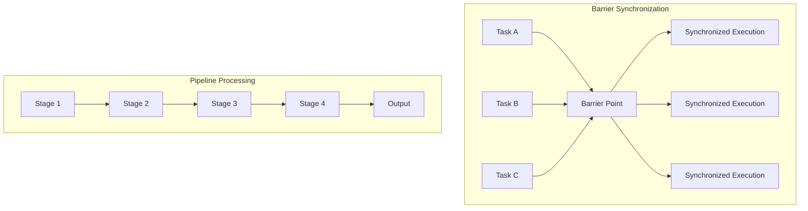

# Lab 2: Event Synchronization (45 นาที)

## 🎯 วัตถุประสงค์
- เรียนรู้การใช้ Event Groups สำหรับ Task Synchronization ขั้นสูง
- ฝึกการสร้าง Barrier Synchronization Pattern
- เข้าใจการใช้ Event Groups กับ Producer-Consumer Pattern
- สร้างระบบ Multi-Stage Processing Pipeline
- เรียนรู้การจัดการ Event Dependencies และ Workflows

## 📝 ความรู้เบื้องต้น

**Advanced Event Synchronization**:
- **Barrier Synchronization**: รอให้ทุก tasks ถึงจุดเดียวกัน
- **Pipeline Processing**: ประมวลผลแบบ pipeline
- **Workflow Management**: จัดการลำดับการทำงาน
- **Event Dependencies**: การพึ่งพาอาศัยระหว่าง events



## 🛠️ การเตรียมโปรเจค

### 1. สร้างโปรเจคใหม่
```bash
idf.py create-project event_synchronization
cd event_synchronization
```

### 2. แก้ไช main.c

```c
#include <stdio.h>
#include <stdint.h>
#include <string.h>
#include <math.h>
#include "freertos/FreeRTOS.h"
#include "freertos/task.h"
#include "freertos/event_groups.h"
#include "freertos/semphr.h"
#include "freertos/queue.h"
#include "esp_log.h"
#include "esp_random.h"
#include "esp_timer.h"
#include "driver/gpio.h"

static const char *TAG = "EVENT_SYNC";

// GPIO สำหรับแสดงสถานะ
#define LED_BARRIER_SYNC    GPIO_NUM_2   // Barrier synchronization indicator
#define LED_PIPELINE_STAGE1 GPIO_NUM_4   // Pipeline stage 1
#define LED_PIPELINE_STAGE2 GPIO_NUM_5   // Pipeline stage 2  
#define LED_PIPELINE_STAGE3 GPIO_NUM_18  // Pipeline stage 3
#define LED_WORKFLOW_ACTIVE GPIO_NUM_19  // Workflow processing

// Event Groups สำหรับการ synchronization
EventGroupHandle_t barrier_events;
EventGroupHandle_t pipeline_events;
EventGroupHandle_t workflow_events;

// Barrier Synchronization Events
#define WORKER_A_READY_BIT  (1 << 0)
#define WORKER_B_READY_BIT  (1 << 1)
#define WORKER_C_READY_BIT  (1 << 2)
#define WORKER_D_READY_BIT  (1 << 3)
#define ALL_WORKERS_READY   (WORKER_A_READY_BIT | WORKER_B_READY_BIT | \
                            WORKER_C_READY_BIT | WORKER_D_READY_BIT)

// Pipeline Processing Events
#define STAGE1_COMPLETE_BIT (1 << 0)
#define STAGE2_COMPLETE_BIT (1 << 1)
#define STAGE3_COMPLETE_BIT (1 << 2)
#define STAGE4_COMPLETE_BIT (1 << 3)
#define DATA_AVAILABLE_BIT  (1 << 4)
#define PIPELINE_RESET_BIT  (1 << 5)

// Workflow Management Events
#define WORKFLOW_START_BIT  (1 << 0)
#define APPROVAL_READY_BIT  (1 << 1)
#define RESOURCES_FREE_BIT  (1 << 2)
#define QUALITY_OK_BIT      (1 << 3)
#define WORKFLOW_DONE_BIT   (1 << 4)

// Data structures
typedef struct {
    uint32_t worker_id;
    uint32_t cycle_number;
    uint32_t work_duration;
    uint64_t timestamp;
} worker_data_t;

typedef struct {
    uint32_t pipeline_id;
    uint32_t stage;
    float processing_data[4];
    uint32_t quality_score;
    uint64_t stage_timestamps[4];
} pipeline_data_t;

typedef struct {
    uint32_t workflow_id;
    char description[32];
    uint32_t priority;
    uint32_t estimated_duration;
    bool requires_approval;
} workflow_item_t;

// Queues สำหรับ data passing
QueueHandle_t pipeline_queue;
QueueHandle_t workflow_queue;

// Statistics
typedef struct {
    uint32_t barrier_cycles;
    uint32_t pipeline_completions;
    uint32_t workflow_completions;
    uint32_t synchronization_time_max;
    uint32_t synchronization_time_avg;
    uint64_t total_processing_time;
} sync_stats_t;

static sync_stats_t stats = {0};

// Barrier Synchronization Tasks
void barrier_worker_task(void *pvParameters) {
    uint32_t worker_id = (uint32_t)pvParameters;
    EventBits_t my_ready_bit = (1 << worker_id);
    uint32_t cycle = 0;
    
    ESP_LOGI(TAG, "🏃 Barrier Worker %lu started", worker_id);
    
    while (1) {
        cycle++;
        
        // Phase 1: Independent work
        uint32_t work_duration = 1000 + (esp_random() % 3000); // 1-4 seconds
        ESP_LOGI(TAG, "👷 Worker %lu: Cycle %lu - Independent work (%lu ms)", 
                 worker_id, cycle, work_duration);
        
        vTaskDelay(pdMS_TO_TICKS(work_duration));
        
        // Phase 2: Signal ready for barrier
        uint64_t barrier_start = esp_timer_get_time();
        ESP_LOGI(TAG, "🚧 Worker %lu: Ready for barrier (cycle %lu)", worker_id, cycle);
        xEventGroupSetBits(barrier_events, my_ready_bit);
        
        // Phase 3: Wait at barrier for all workers
        EventBits_t bits = xEventGroupWaitBits(
            barrier_events,
            ALL_WORKERS_READY,
            pdTRUE,     // Clear bits after wait
            pdTRUE,     // Wait for ALL bits
            pdMS_TO_TICKS(10000) // 10 second timeout
        );
        
        uint64_t barrier_end = esp_timer_get_time();
        uint32_t barrier_time = (barrier_end - barrier_start) / 1000; // Convert to ms
        
        if ((bits & ALL_WORKERS_READY) == ALL_WORKERS_READY) {
            ESP_LOGI(TAG, "🎯 Worker %lu: Barrier passed! (waited %lu ms)", 
                     worker_id, barrier_time);
            
            // Update statistics
            if (barrier_time > stats.synchronization_time_max) {
                stats.synchronization_time_max = barrier_time;
            }
            stats.synchronization_time_avg = 
                (stats.synchronization_time_avg + barrier_time) / 2;
            
            if (worker_id == 0) { // Only count once per barrier
                stats.barrier_cycles++;
                gpio_set_level(LED_BARRIER_SYNC, 1);
                vTaskDelay(pdMS_TO_TICKS(200));
                gpio_set_level(LED_BARRIER_SYNC, 0);
            }
            
            // Phase 4: Synchronized work
            ESP_LOGI(TAG, "🤝 Worker %lu: Synchronized work phase", worker_id);
            vTaskDelay(pdMS_TO_TICKS(500 + (esp_random() % 500)));
            
        } else {
            ESP_LOGW(TAG, "⏰ Worker %lu: Barrier timeout!", worker_id);
        }
        
        // Cool down period
        vTaskDelay(pdMS_TO_TICKS(2000));
    }
}

// Pipeline Processing Tasks  
void pipeline_stage_task(void *pvParameters) {
    uint32_t stage_id = (uint32_t)pvParameters;
    EventBits_t stage_complete_bit = (1 << stage_id);
    EventBits_t prev_stage_bit = (stage_id > 0) ? (1 << (stage_id - 1)) : DATA_AVAILABLE_BIT;
    
    const char* stage_names[] = {"Input", "Processing", "Filtering", "Output"};
    gpio_num_t stage_leds[] = {LED_PIPELINE_STAGE1, LED_PIPELINE_STAGE2, 
                              LED_PIPELINE_STAGE3, LED_WORKFLOW_ACTIVE};
    
    ESP_LOGI(TAG, "🏭 Pipeline Stage %lu (%s) started", stage_id, stage_names[stage_id]);
    
    while (1) {
        // Wait for previous stage or data
        ESP_LOGI(TAG, "⏳ Stage %lu: Waiting for input...", stage_id);
        EventBits_t bits = xEventGroupWaitBits(
            pipeline_events,
            prev_stage_bit,
            pdTRUE,     // Clear bit after receiving
            pdTRUE,     // Wait for the specific bit
            portMAX_DELAY
        );
        
        if (bits & prev_stage_bit) {
            gpio_set_level(stage_leds[stage_id], 1);
            
            pipeline_data_t pipeline_data;
            
            // Get data from queue if available
            if (xQueueReceive(pipeline_queue, &pipeline_data, pdMS_TO_TICKS(100)) == pdTRUE) {
                ESP_LOGI(TAG, "📦 Stage %lu: Processing pipeline ID %lu", 
                         stage_id, pipeline_data.pipeline_id);
                
                // Record processing start time
                pipeline_data.stage_timestamps[stage_id] = esp_timer_get_time();
                pipeline_data.stage = stage_id;
                
                // Simulate stage-specific processing
                uint32_t processing_time = 500 + (esp_random() % 1000);
                
                switch (stage_id) {
                    case 0: // Input stage
                        ESP_LOGI(TAG, "📥 Stage %lu: Data input and validation", stage_id);
                        for (int i = 0; i < 4; i++) {
                            pipeline_data.processing_data[i] = (esp_random() % 1000) / 10.0;
                        }
                        pipeline_data.quality_score = 70 + (esp_random() % 30);
                        break;
                        
                    case 1: // Processing stage
                        ESP_LOGI(TAG, "⚙️ Stage %lu: Data processing and transformation", stage_id);
                        for (int i = 0; i < 4; i++) {
                            pipeline_data.processing_data[i] *= 1.1; // Apply processing
                        }
                        pipeline_data.quality_score += (esp_random() % 20) - 10; // ±10
                        break;
                        
                    case 2: // Filtering stage
                        ESP_LOGI(TAG, "🔍 Stage %lu: Data filtering and validation", stage_id);
                        float avg = 0;
                        for (int i = 0; i < 4; i++) {
                            avg += pipeline_data.processing_data[i];
                        }
                        avg /= 4.0;
                        ESP_LOGI(TAG, "Average value: %.2f, Quality: %lu", 
                                avg, pipeline_data.quality_score);
                        break;
                        
                    case 3: // Output stage
                        ESP_LOGI(TAG, "📤 Stage %lu: Data output and delivery", stage_id);
                        stats.pipeline_completions++;
                        
                        uint64_t total_time = esp_timer_get_time() - 
                                            pipeline_data.stage_timestamps[0];
                        stats.total_processing_time += total_time;
                        
                        ESP_LOGI(TAG, "✅ Pipeline %lu completed in %llu ms (Quality: %lu)", 
                                pipeline_data.pipeline_id, total_time / 1000, 
                                pipeline_data.quality_score);
                        break;
                }
                
                vTaskDelay(pdMS_TO_TICKS(processing_time));
                
                // Pass data to next stage
                if (stage_id < 3) {
                    if (xQueueSend(pipeline_queue, &pipeline_data, pdMS_TO_TICKS(100)) == pdTRUE) {
                        xEventGroupSetBits(pipeline_events, stage_complete_bit);
                        ESP_LOGI(TAG, "➡️ Stage %lu: Data passed to next stage", stage_id);
                    } else {
                        ESP_LOGW(TAG, "⚠️ Stage %lu: Queue full, data lost", stage_id);
                    }
                }
                
            } else {
                ESP_LOGW(TAG, "⚠️ Stage %lu: No data in queue", stage_id);
            }
            
            gpio_set_level(stage_leds[stage_id], 0);
        }
        
        // Check for pipeline reset
        EventBits_t reset_bits = xEventGroupGetBits(pipeline_events);
        if (reset_bits & PIPELINE_RESET_BIT) {
            ESP_LOGI(TAG, "🔄 Stage %lu: Pipeline reset detected", stage_id);
            xEventGroupClearBits(pipeline_events, PIPELINE_RESET_BIT);
            // Clear any remaining data
            pipeline_data_t dummy;
            while (xQueueReceive(pipeline_queue, &dummy, 0) == pdTRUE);
        }
    }
}

// Pipeline data generator
void pipeline_data_generator_task(void *pvParameters) {
    uint32_t pipeline_id = 0;
    
    ESP_LOGI(TAG, "🏭 Pipeline data generator started");
    
    while (1) {
        pipeline_data_t data = {0};
        data.pipeline_id = ++pipeline_id;
        data.stage = 0;
        data.stage_timestamps[0] = esp_timer_get_time();
        
        ESP_LOGI(TAG, "🚀 Generating pipeline data ID: %lu", pipeline_id);
        
        if (xQueueSend(pipeline_queue, &data, pdMS_TO_TICKS(1000)) == pdTRUE) {
            xEventGroupSetBits(pipeline_events, DATA_AVAILABLE_BIT);
            ESP_LOGI(TAG, "✅ Pipeline data %lu injected", pipeline_id);
        } else {
            ESP_LOGW(TAG, "⚠️ Pipeline queue full, data %lu dropped", pipeline_id);
        }
        
        // Generate data at random intervals
        uint32_t interval = 3000 + (esp_random() % 4000); // 3-7 seconds
        vTaskDelay(pdMS_TO_TICKS(interval));
    }
}

// Workflow Management Tasks
void workflow_manager_task(void *pvParameters) {
    ESP_LOGI(TAG, "📋 Workflow manager started");
    
    while (1) {
        workflow_item_t workflow;
        
        // Wait for workflow requests
        if (xQueueReceive(workflow_queue, &workflow, portMAX_DELAY) == pdTRUE) {
            ESP_LOGI(TAG, "📝 New workflow: ID %lu - %s (Priority: %lu)", 
                     workflow.workflow_id, workflow.description, workflow.priority);
            
            // Set workflow start event
            xEventGroupSetBits(workflow_events, WORKFLOW_START_BIT);
            gpio_set_level(LED_WORKFLOW_ACTIVE, 1);
            
            // Check workflow requirements
            EventBits_t required_events = RESOURCES_FREE_BIT;
            
            if (workflow.requires_approval) {
                required_events |= APPROVAL_READY_BIT;
                ESP_LOGI(TAG, "📋 Workflow %lu requires approval", workflow.workflow_id);
            }
            
            // Wait for requirements
            ESP_LOGI(TAG, "⏳ Waiting for workflow requirements (0x%08X)...", required_events);
            EventBits_t bits = xEventGroupWaitBits(
                workflow_events,
                required_events,
                pdFALSE,    // Don't clear bits
                pdTRUE,     // Wait for ALL required bits
                pdMS_TO_TICKS(workflow.estimated_duration * 2) // Dynamic timeout
            );
            
            if ((bits & required_events) == required_events) {
                ESP_LOGI(TAG, "✅ Workflow %lu: Requirements met, starting execution", 
                         workflow.workflow_id);
                
                // Execute workflow
                uint32_t execution_time = workflow.estimated_duration + 
                                        (esp_random() % 1000); // Add some randomness
                
                ESP_LOGI(TAG, "⚙️ Executing workflow %lu (%lu ms estimated)", 
                         workflow.workflow_id, execution_time);
                
                vTaskDelay(pdMS_TO_TICKS(execution_time));
                
                // Simulate quality check
                uint32_t quality = 60 + (esp_random() % 40); // 60-100%
                
                if (quality > 80) {
                    xEventGroupSetBits(workflow_events, QUALITY_OK_BIT);
                    ESP_LOGI(TAG, "✅ Workflow %lu completed successfully (Quality: %lu%%)", 
                             workflow.workflow_id, quality);
                    
                    xEventGroupSetBits(workflow_events, WORKFLOW_DONE_BIT);
                    stats.workflow_completions++;
                    
                } else {
                    ESP_LOGW(TAG, "⚠️ Workflow %lu quality check failed (%lu%%), retrying...", 
                             workflow.workflow_id, quality);
                    
                    // Re-queue for retry
                    if (xQueueSend(workflow_queue, &workflow, 0) != pdTRUE) {
                        ESP_LOGE(TAG, "❌ Failed to re-queue workflow %lu", workflow.workflow_id);
                    }
                }
                
            } else {
                ESP_LOGW(TAG, "⏰ Workflow %lu timeout - requirements not met", 
                         workflow.workflow_id);
            }
            
            gpio_set_level(LED_WORKFLOW_ACTIVE, 0);
            
            // Clear workflow events for next iteration
            xEventGroupClearBits(workflow_events, 
                               WORKFLOW_START_BIT | WORKFLOW_DONE_BIT | QUALITY_OK_BIT);
        }
    }
}

// Approval task (simulates approval process)
void approval_task(void *pvParameters) {
    ESP_LOGI(TAG, "👨‍💼 Approval task started");
    
    while (1) {
        // Wait for workflow start
        xEventGroupWaitBits(workflow_events, WORKFLOW_START_BIT, 
                           pdFALSE, pdTRUE, portMAX_DELAY);
        
        ESP_LOGI(TAG, "📋 Approval process initiated...");
        
        // Simulate approval time
        uint32_t approval_time = 1000 + (esp_random() % 2000); // 1-3 seconds
        vTaskDelay(pdMS_TO_TICKS(approval_time));
        
        // Random approval decision
        bool approved = (esp_random() % 100) > 20; // 80% approval rate
        
        if (approved) {
            ESP_LOGI(TAG, "✅ Approval granted (took %lu ms)", approval_time);
            xEventGroupSetBits(workflow_events, APPROVAL_READY_BIT);
        } else {
            ESP_LOGW(TAG, "❌ Approval denied");
            xEventGroupClearBits(workflow_events, APPROVAL_READY_BIT);
        }
        
        // Keep approval valid for a while
        vTaskDelay(pdMS_TO_TICKS(5000));
        xEventGroupClearBits(workflow_events, APPROVAL_READY_BIT);
    }
}

// Resource manager task
void resource_manager_task(void *pvParameters) {
    ESP_LOGI(TAG, "🏗️ Resource manager started");
    
    bool resources_available = true;
    
    while (1) {
        if (resources_available) {
            xEventGroupSetBits(workflow_events, RESOURCES_FREE_BIT);
            ESP_LOGI(TAG, "🟢 Resources available");
            
            // Simulate resource usage
            uint32_t usage_time = 2000 + (esp_random() % 8000); // 2-10 seconds
            vTaskDelay(pdMS_TO_TICKS(usage_time));
            
            // Randomly make resources unavailable
            if ((esp_random() % 100) > 70) { // 30% chance
                resources_available = false;
                xEventGroupClearBits(workflow_events, RESOURCES_FREE_BIT);
                ESP_LOGI(TAG, "🔴 Resources temporarily unavailable");
            }
            
        } else {
            ESP_LOGI(TAG, "⏳ Waiting for resources to become available...");
            
            // Simulate resource recovery time
            uint32_t recovery_time = 3000 + (esp_random() % 5000); // 3-8 seconds
            vTaskDelay(pdMS_TO_TICKS(recovery_time));
            
            resources_available = true;
            ESP_LOGI(TAG, "🟢 Resources recovered and available");
        }
    }
}

// Workflow generator task
void workflow_generator_task(void *pvParameters) {
    uint32_t workflow_counter = 0;
    
    ESP_LOGI(TAG, "📋 Workflow generator started");
    
    while (1) {
        workflow_item_t workflow = {0};
        workflow.workflow_id = ++workflow_counter;
        workflow.priority = 1 + (esp_random() % 5); // Priority 1-5
        workflow.estimated_duration = 2000 + (esp_random() % 4000); // 2-6 seconds
        workflow.requires_approval = (esp_random() % 100) > 60; // 40% need approval
        
        // Generate workflow description
        const char* workflow_types[] = {
            "Data Processing", "Report Generation", "System Backup",
            "Quality Analysis", "Performance Test", "Security Scan"
        };
        
        strcpy(workflow.description, workflow_types[esp_random() % 6]);
        
        ESP_LOGI(TAG, "🚀 Generated workflow: %s (ID: %lu, Priority: %lu, Approval: %s)", 
                 workflow.description, workflow.workflow_id, workflow.priority,
                 workflow.requires_approval ? "Required" : "Not Required");
        
        if (xQueueSend(workflow_queue, &workflow, pdMS_TO_TICKS(1000)) != pdTRUE) {
            ESP_LOGW(TAG, "⚠️ Workflow queue full, dropping workflow %lu", workflow.workflow_id);
        }
        
        // Generate workflows at random intervals
        uint32_t interval = 4000 + (esp_random() % 6000); // 4-10 seconds
        vTaskDelay(pdMS_TO_TICKS(interval));
    }
}

// Statistics and monitoring task
void statistics_monitor_task(void *pvParameters) {
    ESP_LOGI(TAG, "📊 Statistics monitor started");
    
    while (1) {
        vTaskDelay(pdMS_TO_TICKS(15000)); // Report every 15 seconds
        
        ESP_LOGI(TAG, "\n📈 ═══ SYNCHRONIZATION STATISTICS ═══");
        ESP_LOGI(TAG, "Barrier cycles:        %lu", stats.barrier_cycles);
        ESP_LOGI(TAG, "Pipeline completions:  %lu", stats.pipeline_completions);
        ESP_LOGI(TAG, "Workflow completions:  %lu", stats.workflow_completions);
        ESP_LOGI(TAG, "Max sync time:         %lu ms", stats.synchronization_time_max);
        ESP_LOGI(TAG, "Avg sync time:         %lu ms", stats.synchronization_time_avg);
        
        if (stats.pipeline_completions > 0) {
            uint32_t avg_pipeline_time = (stats.total_processing_time / 1000) / 
                                       stats.pipeline_completions;
            ESP_LOGI(TAG, "Avg pipeline time:     %lu ms", avg_pipeline_time);
        }
        
        ESP_LOGI(TAG, "Free heap:             %d bytes", esp_get_free_heap_size());
        ESP_LOGI(TAG, "System uptime:         %llu ms", esp_timer_get_time() / 1000);
        ESP_LOGI(TAG, "═══════════════════════════════════════\n");
        
        // Event group status
        ESP_LOGI(TAG, "📊 Event Group Status:");
        ESP_LOGI(TAG, "  Barrier events:   0x%08X", xEventGroupGetBits(barrier_events));
        ESP_LOGI(TAG, "  Pipeline events:  0x%08X", xEventGroupGetBits(pipeline_events));
        ESP_LOGI(TAG, "  Workflow events:  0x%08X", xEventGroupGetBits(workflow_events));
    }
}

void app_main(void) {
    ESP_LOGI(TAG, "🚀 Event Synchronization Lab Starting...");
    
    // Configure GPIO
    gpio_set_direction(LED_BARRIER_SYNC, GPIO_MODE_OUTPUT);
    gpio_set_direction(LED_PIPELINE_STAGE1, GPIO_MODE_OUTPUT);
    gpio_set_direction(LED_PIPELINE_STAGE2, GPIO_MODE_OUTPUT);
    gpio_set_direction(LED_PIPELINE_STAGE3, GPIO_MODE_OUTPUT);
    gpio_set_direction(LED_WORKFLOW_ACTIVE, GPIO_MODE_OUTPUT);
    
    // Initialize all LEDs off
    gpio_set_level(LED_BARRIER_SYNC, 0);
    gpio_set_level(LED_PIPELINE_STAGE1, 0);
    gpio_set_level(LED_PIPELINE_STAGE2, 0);
    gpio_set_level(LED_PIPELINE_STAGE3, 0);
    gpio_set_level(LED_WORKFLOW_ACTIVE, 0);
    
    // Create Event Groups
    barrier_events = xEventGroupCreate();
    pipeline_events = xEventGroupCreate();
    workflow_events = xEventGroupCreate();
    
    if (!barrier_events || !pipeline_events || !workflow_events) {
        ESP_LOGE(TAG, "Failed to create event groups!");
        return;
    }
    
    // Create Queues
    pipeline_queue = xQueueCreate(5, sizeof(pipeline_data_t));
    workflow_queue = xQueueCreate(8, sizeof(workflow_item_t));
    
    if (!pipeline_queue || !workflow_queue) {
        ESP_LOGE(TAG, "Failed to create queues!");
        return;
    }
    
    ESP_LOGI(TAG, "Event groups and queues created successfully");
    
    // Create Barrier Synchronization Tasks
    ESP_LOGI(TAG, "Creating barrier synchronization tasks...");
    for (int i = 0; i < 4; i++) {
        char task_name[16];
        sprintf(task_name, "BarrierWork%d", i);
        xTaskCreate(barrier_worker_task, task_name, 2048, (void*)i, 5, NULL);
    }
    
    // Create Pipeline Processing Tasks
    ESP_LOGI(TAG, "Creating pipeline processing tasks...");
    for (int i = 0; i < 4; i++) {
        char task_name[16];
        sprintf(task_name, "PipeStage%d", i);
        xTaskCreate(pipeline_stage_task, task_name, 3072, (void*)i, 6, NULL);
    }
    
    xTaskCreate(pipeline_data_generator_task, "PipeGen", 2048, NULL, 4, NULL);
    
    // Create Workflow Management Tasks
    ESP_LOGI(TAG, "Creating workflow management tasks...");
    xTaskCreate(workflow_manager_task, "WorkflowMgr", 3072, NULL, 7, NULL);
    xTaskCreate(approval_task, "Approval", 2048, NULL, 6, NULL);
    xTaskCreate(resource_manager_task, "ResourceMgr", 2048, NULL, 6, NULL);
    xTaskCreate(workflow_generator_task, "WorkflowGen", 2048, NULL, 4, NULL);
    
    // Create monitoring task
    xTaskCreate(statistics_monitor_task, "StatsMon", 3072, NULL, 3, NULL);
    
    ESP_LOGI(TAG, "All tasks created successfully");
    ESP_LOGI(TAG, "\n🎯 LED Indicators:");
    ESP_LOGI(TAG, "  GPIO2  - Barrier Synchronization");
    ESP_LOGI(TAG, "  GPIO4  - Pipeline Stage 1");
    ESP_LOGI(TAG, "  GPIO5  - Pipeline Stage 2");
    ESP_LOGI(TAG, "  GPIO18 - Pipeline Stage 3");
    ESP_LOGI(TAG, "  GPIO19 - Workflow Active");
    
    ESP_LOGI(TAG, "\n🔄 System Features:");
    ESP_LOGI(TAG, "  • Barrier Synchronization (4 workers)");
    ESP_LOGI(TAG, "  • Pipeline Processing (4 stages)");
    ESP_LOGI(TAG, "  • Workflow Management (approval & resources)");
    ESP_LOGI(TAG, "  • Real-time Statistics Monitoring");
    
    ESP_LOGI(TAG, "Event Synchronization System operational!");
}
```

## 🧪 การทดลอง

### ทดลองที่ 1: Barrier Synchronization
1. สังเกต LED_BARRIER_SYNC กะพริบเมื่อ workers ทั้งหมดผ่าน barrier
2. ใน Serial Monitor ดู synchronization times
3. สังเกตการรอคอยของ workers ที่มาถึง barrier เร็วกว่า

### ทดลองที่ 2: Pipeline Processing  
1. สังเกต LEDs ของแต่ละ stage เปิดตามลำดับ
2. ติดตาม pipeline data flow ใน Serial Monitor
3. สังเกต throughput และ processing times

### ทดลองที่ 3: Workflow Management
1. สังเกต LED_WORKFLOW_ACTIVE เมื่อมี workflow ทำงาน
2. ติดตาม approval process และ resource availability
3. สังเกต workflow queuing และ retry mechanisms

### ทดลองที่ 4: System Performance
1. ดูสถิติการ synchronization ทุก 15 วินาที
2. วิเคราะห์ event group states
3. ติดตาม memory usage และ system health

## 📊 การวิเคราะห์ Synchronization Patterns

### เพิ่ม Advanced Monitoring:
```c
void analyze_synchronization_patterns(void) {
    static uint32_t last_barrier_time = 0;
    static uint32_t barrier_intervals[10] = {0};
    static int interval_index = 0;
    
    uint32_t current_time = xTaskGetTickCount() * portTICK_PERIOD_MS;
    
    if (last_barrier_time > 0) {
        uint32_t interval = current_time - last_barrier_time;
        barrier_intervals[interval_index] = interval;
        interval_index = (interval_index + 1) % 10;
        
        // Calculate average interval
        uint32_t avg_interval = 0;
        for (int i = 0; i < 10; i++) {
            avg_interval += barrier_intervals[i];
        }
        avg_interval /= 10;
        
        ESP_LOGI(TAG, "📊 Barrier interval: %lu ms (avg: %lu ms)", 
                 interval, avg_interval);
    }
    
    last_barrier_time = current_time;
}
```

### Performance Tuning:
```c
// ปรับแต่ง task priorities สำหรับ optimal performance
#define BARRIER_WORKER_PRIORITY   5
#define PIPELINE_STAGE_PRIORITY   6  
#define WORKFLOW_MANAGER_PRIORITY 7
#define APPROVAL_PRIORITY         6
#define RESOURCE_MANAGER_PRIORITY 6
```

## 📋 สรุปผลการทดลอง

### Advanced Synchronization Concepts:
- [ ] **Barrier Synchronization**: การรอให้ทุก tasks ถึงจุดเดียวกัน
- [ ] **Pipeline Processing**: การประมวลผลแบบขั้นตอน
- [ ] **Workflow Dependencies**: การจัดการ dependencies ระหว่างงาน
- [ ] **Resource Coordination**: การประสานงานการใช้ทรัพยากร
- [ ] **Multi-stage Events**: การจัดการ events หลายระดับ

### Synchronization Patterns:
- [ ] **Producer-Consumer with Events**: ใช้ events ควบคุม production/consumption
- [ ] **Multi-phase Initialization**: การเริ่มต้นระบบหลายเฟส
- [ ] **Conditional Workflow**: workflow ตามเงื่อนไข
- [ ] **Event-driven State Machine**: state machine ควบคุมด้วย events

## 🚀 ความท้าทายเพิ่มเติม

1. **Dynamic Barrier Size**: เปลี่ยนจำนวน workers แบบ runtime
2. **Priority-based Pipeline**: จัดลำดับ pipeline ตาม priority
3. **Fault-tolerant Synchronization**: จัดการ task failures
4. **Load-balanced Processing**: กระจายโหลดแบบ dynamic
5. **Cross-group Synchronization**: synchronization ระหว่าง event groups

## 🔧 Advanced Configurations

### Event Group Optimization:
```c
// Custom event bit management
typedef struct {
    EventGroupHandle_t group;
    EventBits_t active_bits;
    EventBits_t pending_bits;
    uint32_t wait_count;
    const char* name;
} managed_event_group_t;

managed_event_group_t* create_managed_event_group(const char* name) {
    managed_event_group_t* meg = malloc(sizeof(managed_event_group_t));
    if (meg) {
        meg->group = xEventGroupCreate();
        meg->active_bits = 0;
        meg->pending_bits = 0;
        meg->wait_count = 0;
        meg->name = name;
    }
    return meg;
}
```

### Synchronization Metrics:
```c
typedef struct {
    uint32_t total_waits;
    uint32_t successful_waits;
    uint32_t timeout_waits;
    uint32_t min_wait_time;
    uint32_t max_wait_time;
    uint32_t avg_wait_time;
} sync_metrics_t;

void update_sync_metrics(sync_metrics_t* metrics, uint32_t wait_time, bool success) {
    metrics->total_waits++;
    
    if (success) {
        metrics->successful_waits++;
        
        if (wait_time < metrics->min_wait_time || metrics->min_wait_time == 0) {
            metrics->min_wait_time = wait_time;
        }
        
        if (wait_time > metrics->max_wait_time) {
            metrics->max_wait_time = wait_time;
        }
        
        metrics->avg_wait_time = (metrics->avg_wait_time + wait_time) / 2;
    } else {
        metrics->timeout_waits++;
    }
}
```

## 📚 เอกสารอ้างอิง

- [FreeRTOS Event Groups Advanced](https://www.freertos.org/FreeRTOS-Event-Groups.html)
- [Barrier Synchronization Patterns](https://www.freertos.org/RTOS-task-synchronisation.html)
- [Pipeline Processing with RTOS](https://www.freertos.org/a00114.html)