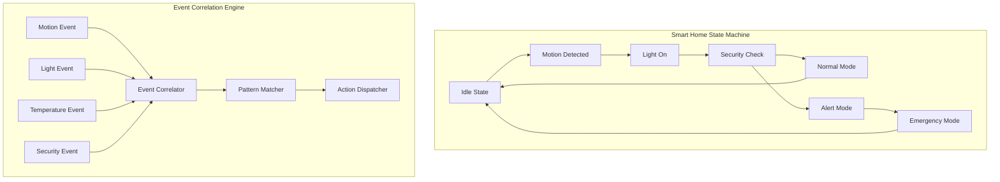

# Lab 3: Complex Event Patterns (30 นาที)

## 🎯 วัตถุประสงค์
- เรียนรู้การสร้าง Event-driven State Machine
- ฝึกการใช้ Event Groups กับ Adaptive Event Systems
- เข้าใจ Complex Event Patterns และ Event Correlation
- สร้างระบบ Smart Home Automation จริง
- เรียนรู้ Event Pattern Recognition และ Response

## 📝 ความรู้เบื้องต้น

**Complex Event Patterns**:
- **State Machine Control**: ควบคุม state machine ด้วย events
- **Event Correlation**: การเชื่อมโยง events หลายตัวเข้าด้วยกัน
- **Adaptive Behavior**: ปรับพฤติกรรมตาม event patterns
- **Pattern Recognition**: จดจำ patterns ของ events



## 🛠️ การเตรียมโปรเจค

### 1. สร้างโปรเจคใหม่
```bash
idf.py create-project complex_event_patterns
cd complex_event_patterns
```

### 2. แก้ไช main.c

```c
#include <stdio.h>
#include <stdint.h>
#include <string.h>
#include <math.h>
#include "freertos/FreeRTOS.h"
#include "freertos/task.h"
#include "freertos/event_groups.h"
#include "freertos/semphr.h"
#include "freertos/queue.h"
#include "freertos/timers.h"
#include "esp_log.h"
#include "esp_random.h"
#include "esp_timer.h"
#include "driver/gpio.h"

static const char *TAG = "COMPLEX_EVENTS";

// GPIO สำหรับ Smart Home System
#define LED_LIVING_ROOM    GPIO_NUM_2   // Living room light
#define LED_KITCHEN        GPIO_NUM_4   // Kitchen light  
#define LED_BEDROOM        GPIO_NUM_5   // Bedroom light
#define LED_SECURITY       GPIO_NUM_18  // Security system
#define LED_EMERGENCY      GPIO_NUM_19  // Emergency indicator
#define MOTION_SENSOR      GPIO_NUM_21  // Motion sensor input
#define DOOR_SENSOR        GPIO_NUM_22  // Door sensor input

// Smart Home State Machine States
typedef enum {
    HOME_STATE_IDLE = 0,
    HOME_STATE_OCCUPIED,
    HOME_STATE_AWAY,
    HOME_STATE_SLEEP,
    HOME_STATE_SECURITY_ARMED,
    HOME_STATE_EMERGENCY,
    HOME_STATE_MAINTENANCE
} home_state_t;

// Event Groups และ Event Bits
EventGroupHandle_t sensor_events;
EventGroupHandle_t system_events;
EventGroupHandle_t pattern_events;

// Sensor Events
#define MOTION_DETECTED_BIT     (1 << 0)
#define DOOR_OPENED_BIT         (1 << 1)
#define DOOR_CLOSED_BIT         (1 << 2)
#define LIGHT_ON_BIT            (1 << 3)
#define LIGHT_OFF_BIT           (1 << 4)
#define TEMPERATURE_HIGH_BIT    (1 << 5)
#define TEMPERATURE_LOW_BIT     (1 << 6)
#define SOUND_DETECTED_BIT      (1 << 7)
#define PRESENCE_CONFIRMED_BIT  (1 << 8)

// System Events
#define SYSTEM_INIT_BIT         (1 << 0)
#define USER_HOME_BIT           (1 << 1)
#define USER_AWAY_BIT           (1 << 2)
#define SLEEP_MODE_BIT          (1 << 3)
#define SECURITY_ARMED_BIT      (1 << 4)
#define EMERGENCY_MODE_BIT      (1 << 5)
#define MAINTENANCE_MODE_BIT    (1 << 6)

// Pattern Events
#define PATTERN_NORMAL_ENTRY_BIT    (1 << 0)
#define PATTERN_BREAK_IN_BIT        (1 << 1)
#define PATTERN_EMERGENCY_BIT       (1 << 2)
#define PATTERN_GOODNIGHT_BIT       (1 << 3)
#define PATTERN_WAKE_UP_BIT         (1 << 4)
#define PATTERN_LEAVING_BIT         (1 << 5)
#define PATTERN_RETURNING_BIT       (1 << 6)

// Event และ State Management
static home_state_t current_home_state = HOME_STATE_IDLE;
static SemaphoreHandle_t state_mutex;

// Event History สำหรับ Pattern Recognition
#define EVENT_HISTORY_SIZE 20
typedef struct {
    EventBits_t event_bits;
    uint64_t timestamp;
    home_state_t state_at_time;
} event_record_t;

static event_record_t event_history[EVENT_HISTORY_SIZE];
static int history_index = 0;

// Pattern Recognition Data
typedef struct {
    const char* name;
    EventBits_t required_events[4];  // Up to 4 events in sequence
    uint32_t time_window_ms;         // Max time between events
    EventBits_t result_event;        // Event to set when pattern matches
    void (*action_callback)(void);   // Optional callback function
} event_pattern_t;

// Adaptive System Parameters
typedef struct {
    float motion_sensitivity;
    uint32_t auto_light_timeout;
    uint32_t security_delay;
    bool learning_mode;
    uint32_t pattern_confidence[10];
} adaptive_params_t;

static adaptive_params_t adaptive_params = {
    .motion_sensitivity = 0.7,
    .auto_light_timeout = 300000,  // 5 minutes
    .security_delay = 30000,       // 30 seconds
    .learning_mode = true,
    .pattern_confidence = {0}
};

// Smart Devices Control
typedef struct {
    bool living_room_light;
    bool kitchen_light;
    bool bedroom_light;
    bool security_system;
    bool emergency_mode;
    uint32_t temperature_celsius;
    uint32_t light_level_percent;
} smart_home_status_t;

static smart_home_status_t home_status = {0};

// Pattern Action Callbacks
void normal_entry_action(void) {
    ESP_LOGI(TAG, "🏠 Normal entry pattern detected - Welcome home!");
    home_status.living_room_light = true;
    gpio_set_level(LED_LIVING_ROOM, 1);
    xEventGroupSetBits(system_events, USER_HOME_BIT);
}

void break_in_action(void) {
    ESP_LOGW(TAG, "🚨 Break-in pattern detected - Security alert!");
    home_status.security_system = true;
    home_status.emergency_mode = true;
    gpio_set_level(LED_SECURITY, 1);
    gpio_set_level(LED_EMERGENCY, 1);
    xEventGroupSetBits(system_events, EMERGENCY_MODE_BIT);
}

void goodnight_action(void) {
    ESP_LOGI(TAG, "🌙 Goodnight pattern detected - Sleep mode activated");
    home_status.living_room_light = false;
    home_status.kitchen_light = false;
    gpio_set_level(LED_LIVING_ROOM, 0);
    gpio_set_level(LED_KITCHEN, 0);
    gpio_set_level(LED_BEDROOM, 1);  // Keep bedroom light dim
    xEventGroupSetBits(system_events, SLEEP_MODE_BIT);
}

void wake_up_action(void) {
    ESP_LOGI(TAG, "☀️ Wake-up pattern detected - Good morning!");
    home_status.bedroom_light = true;
    home_status.kitchen_light = true;
    gpio_set_level(LED_BEDROOM, 1);
    gpio_set_level(LED_KITCHEN, 1);
    xEventGroupClearBits(system_events, SLEEP_MODE_BIT);
}

void leaving_action(void) {
    ESP_LOGI(TAG, "🚪 Leaving pattern detected - Securing home");
    home_status.living_room_light = false;
    home_status.kitchen_light = false;
    home_status.bedroom_light = false;
    home_status.security_system = true;
    
    gpio_set_level(LED_LIVING_ROOM, 0);
    gpio_set_level(LED_KITCHEN, 0);
    gpio_set_level(LED_BEDROOM, 0);
    gpio_set_level(LED_SECURITY, 1);
    
    xEventGroupSetBits(system_events, USER_AWAY_BIT | SECURITY_ARMED_BIT);
}

void returning_action(void) {
    ESP_LOGI(TAG, "🔓 Returning pattern detected - Disabling security");
    home_status.security_system = false;
    gpio_set_level(LED_SECURITY, 0);
    xEventGroupClearBits(system_events, USER_AWAY_BIT | SECURITY_ARMED_BIT);
}

// Event Patterns Definition
static event_pattern_t event_patterns[] = {
    {
        .name = "Normal Entry",
        .required_events = {DOOR_OPENED_BIT, MOTION_DETECTED_BIT, DOOR_CLOSED_BIT, 0},
        .time_window_ms = 10000,  // 10 seconds
        .result_event = PATTERN_NORMAL_ENTRY_BIT,
        .action_callback = normal_entry_action
    },
    {
        .name = "Break-in Attempt", 
        .required_events = {DOOR_OPENED_BIT, MOTION_DETECTED_BIT, 0, 0},
        .time_window_ms = 5000,   // 5 seconds (when security armed)
        .result_event = PATTERN_BREAK_IN_BIT,
        .action_callback = break_in_action
    },
    {
        .name = "Goodnight Routine",
        .required_events = {LIGHT_OFF_BIT, MOTION_DETECTED_BIT, LIGHT_OFF_BIT, 0},
        .time_window_ms = 30000,  // 30 seconds
        .result_event = PATTERN_GOODNIGHT_BIT,
        .action_callback = goodnight_action
    },
    {
        .name = "Wake-up Routine",
        .required_events = {MOTION_DETECTED_BIT, LIGHT_ON_BIT, 0, 0},
        .time_window_ms = 5000,   // 5 seconds (during sleep mode)
        .result_event = PATTERN_WAKE_UP_BIT,
        .action_callback = wake_up_action
    },
    {
        .name = "Leaving Home",
        .required_events = {LIGHT_OFF_BIT, DOOR_OPENED_BIT, DOOR_CLOSED_BIT, 0},
        .time_window_ms = 15000,  // 15 seconds
        .result_event = PATTERN_LEAVING_BIT,
        .action_callback = leaving_action
    },
    {
        .name = "Returning Home",
        .required_events = {DOOR_OPENED_BIT, MOTION_DETECTED_BIT, DOOR_CLOSED_BIT, 0},
        .time_window_ms = 8000,   // 8 seconds (when security armed)
        .result_event = PATTERN_RETURNING_BIT,
        .action_callback = returning_action
    }
};

#define NUM_PATTERNS (sizeof(event_patterns) / sizeof(event_pattern_t))

// State Machine Functions
const char* get_state_name(home_state_t state) {
    switch (state) {
        case HOME_STATE_IDLE: return "Idle";
        case HOME_STATE_OCCUPIED: return "Occupied";
        case HOME_STATE_AWAY: return "Away";
        case HOME_STATE_SLEEP: return "Sleep";
        case HOME_STATE_SECURITY_ARMED: return "Security Armed";
        case HOME_STATE_EMERGENCY: return "Emergency";
        case HOME_STATE_MAINTENANCE: return "Maintenance";
        default: return "Unknown";
    }
}

void change_home_state(home_state_t new_state) {
    if (xSemaphoreTake(state_mutex, pdMS_TO_TICKS(1000)) == pdTRUE) {
        home_state_t old_state = current_home_state;
        current_home_state = new_state;
        
        ESP_LOGI(TAG, "🏠 State changed: %s → %s", 
                 get_state_name(old_state), get_state_name(new_state));
        
        xSemaphoreGive(state_mutex);
    }
}

// Event History Management
void add_event_to_history(EventBits_t event_bits) {
    event_history[history_index].event_bits = event_bits;
    event_history[history_index].timestamp = esp_timer_get_time();
    event_history[history_index].state_at_time = current_home_state;
    
    history_index = (history_index + 1) % EVENT_HISTORY_SIZE;
}

// Pattern Recognition Engine
void pattern_recognition_task(void *pvParameters) {
    ESP_LOGI(TAG, "🧠 Pattern recognition engine started");
    
    while (1) {
        // Wait for any sensor event
        EventBits_t sensor_bits = xEventGroupWaitBits(
            sensor_events,
            0xFFFFFF,    // Wait for any bit
            pdFALSE,     // Don't clear bits
            pdFALSE,     // Wait for any bit (OR condition)
            portMAX_DELAY
        );
        
        if (sensor_bits != 0) {
            ESP_LOGI(TAG, "🔍 Sensor event detected: 0x%08X", sensor_bits);
            
            // Add to history
            add_event_to_history(sensor_bits);
            
            // Check each pattern
            for (int p = 0; p < NUM_PATTERNS; p++) {
                event_pattern_t* pattern = &event_patterns[p];
                
                // Check if pattern is applicable in current state
                bool state_applicable = true;
                
                if (strcmp(pattern->name, "Break-in Attempt") == 0) {
                    state_applicable = (current_home_state == HOME_STATE_SECURITY_ARMED);
                } else if (strcmp(pattern->name, "Wake-up Routine") == 0) {
                    state_applicable = (current_home_state == HOME_STATE_SLEEP);
                } else if (strcmp(pattern->name, "Returning Home") == 0) {
                    state_applicable = (current_home_state == HOME_STATE_AWAY);
                }
                
                if (!state_applicable) continue;
                
                // Look for pattern in recent history
                bool pattern_matched = true;
                uint64_t current_time = esp_timer_get_time();
                int event_index = 0;
                
                // Check required events in reverse chronological order
                for (int h = 0; h < EVENT_HISTORY_SIZE && pattern->required_events[event_index] != 0; h++) {
                    int hist_idx = (history_index - 1 - h + EVENT_HISTORY_SIZE) % EVENT_HISTORY_SIZE;
                    event_record_t* record = &event_history[hist_idx];
                    
                    // Check if event is within time window
                    if ((current_time - record->timestamp) > (pattern->time_window_ms * 1000)) {
                        break; // Too old
                    }
                    
                    // Check if this record contains the required event
                    if (record->event_bits & pattern->required_events[event_index]) {
                        event_index++;
                        ESP_LOGI(TAG, "✅ Pattern '%s': Found event %d/x (0x%08X)", 
                                pattern->name, event_index, pattern->required_events[event_index-1]);
                        
                        if (pattern->required_events[event_index] == 0) {
                            // All events found!
                            break;
                        }
                    }
                }
                
                // Check if all required events were found
                if (pattern->required_events[event_index] == 0) {
                    ESP_LOGI(TAG, "🎯 Pattern matched: %s", pattern->name);
                    
                    // Set pattern event
                    xEventGroupSetBits(pattern_events, pattern->result_event);
                    
                    // Execute callback if available
                    if (pattern->action_callback) {
                        pattern->action_callback();
                    }
                    
                    // Update pattern confidence (learning)
                    if (p < 10) {
                        adaptive_params.pattern_confidence[p]++;
                    }
                    
                    // Clear sensor events after successful pattern match
                    xEventGroupClearBits(sensor_events, 0xFFFFFF);
                    break; // Don't check other patterns
                }
            }
        }
        
        vTaskDelay(pdMS_TO_TICKS(100)); // Small delay to prevent flooding
    }
}

// Sensor Simulation Tasks
void motion_sensor_task(void *pvParameters) {
    ESP_LOGI(TAG, "🏃 Motion sensor simulation started");
    
    while (1) {
        // Simulate motion detection
        if ((esp_random() % 100) < 15) { // 15% chance per cycle
            ESP_LOGI(TAG, "👥 Motion detected!");
            xEventGroupSetBits(sensor_events, MOTION_DETECTED_BIT);
            
            // Simulate presence confirmation after multiple motions
            vTaskDelay(pdMS_TO_TICKS(1000 + (esp_random() % 2000)));
            
            if ((esp_random() % 100) < 60) { // 60% chance of presence confirmation
                ESP_LOGI(TAG, "✅ Presence confirmed");
                xEventGroupSetBits(sensor_events, PRESENCE_CONFIRMED_BIT);
            }
        }
        
        vTaskDelay(pdMS_TO_TICKS(3000 + (esp_random() % 5000))); // 3-8 seconds
    }
}

void door_sensor_task(void *pvParameters) {
    ESP_LOGI(TAG, "🚪 Door sensor simulation started");
    
    bool door_open = false;
    
    while (1) {
        // Simulate door operations
        if ((esp_random() % 100) < 8) { // 8% chance per cycle
            if (!door_open) {
                ESP_LOGI(TAG, "🔓 Door opened");
                xEventGroupSetBits(sensor_events, DOOR_OPENED_BIT);
                door_open = true;
                
                // Door usually closes after some time
                vTaskDelay(pdMS_TO_TICKS(2000 + (esp_random() % 8000))); // 2-10 seconds
                
                if ((esp_random() % 100) < 85) { // 85% chance door closes
                    ESP_LOGI(TAG, "🔒 Door closed");
                    xEventGroupSetBits(sensor_events, DOOR_CLOSED_BIT);
                    door_open = false;
                }
            } else {
                ESP_LOGI(TAG, "🔒 Door closed");
                xEventGroupSetBits(sensor_events, DOOR_CLOSED_BIT);
                door_open = false;
            }
        }
        
        vTaskDelay(pdMS_TO_TICKS(5000 + (esp_random() % 10000))); // 5-15 seconds
    }
}

void light_control_task(void *pvParameters) {
    ESP_LOGI(TAG, "💡 Light control system started");
    
    while (1) {
        // Simulate manual light operations
        if ((esp_random() % 100) < 12) { // 12% chance per cycle
            bool light_action = (esp_random() % 2);
            
            if (light_action) {
                ESP_LOGI(TAG, "💡 Light turned ON");
                xEventGroupSetBits(sensor_events, LIGHT_ON_BIT);
                
                // Randomly choose which light
                int light_choice = esp_random() % 3;
                switch (light_choice) {
                    case 0: 
                        home_status.living_room_light = true;
                        gpio_set_level(LED_LIVING_ROOM, 1);
                        break;
                    case 1:
                        home_status.kitchen_light = true;
                        gpio_set_level(LED_KITCHEN, 1);
                        break;
                    case 2:
                        home_status.bedroom_light = true;
                        gpio_set_level(LED_BEDROOM, 1);
                        break;
                }
            } else {
                ESP_LOGI(TAG, "💡 Light turned OFF");
                xEventGroupSetBits(sensor_events, LIGHT_OFF_BIT);
                
                // Turn off a random light
                int light_choice = esp_random() % 3;
                switch (light_choice) {
                    case 0:
                        home_status.living_room_light = false;
                        gpio_set_level(LED_LIVING_ROOM, 0);
                        break;
                    case 1:
                        home_status.kitchen_light = false;
                        gpio_set_level(LED_KITCHEN, 0);
                        break;
                    case 2:
                        home_status.bedroom_light = false;
                        gpio_set_level(LED_BEDROOM, 0);
                        break;
                }
            }
        }
        
        vTaskDelay(pdMS_TO_TICKS(4000 + (esp_random() % 8000))); // 4-12 seconds
    }
}

void environmental_sensor_task(void *pvParameters) {
    ESP_LOGI(TAG, "🌡️ Environmental sensors started");
    
    while (1) {
        // Simulate temperature changes
        home_status.temperature_celsius = 20 + (esp_random() % 15); // 20-35°C
        
        if (home_status.temperature_celsius > 28) {
            ESP_LOGI(TAG, "🔥 High temperature detected: %d°C", home_status.temperature_celsius);
            xEventGroupSetBits(sensor_events, TEMPERATURE_HIGH_BIT);
        } else if (home_status.temperature_celsius < 22) {
            ESP_LOGI(TAG, "🧊 Low temperature detected: %d°C", home_status.temperature_celsius);
            xEventGroupSetBits(sensor_events, TEMPERATURE_LOW_BIT);
        }
        
        // Simulate sound detection
        if ((esp_random() % 100) < 5) { // 5% chance
            ESP_LOGI(TAG, "🔊 Sound detected");
            xEventGroupSetBits(sensor_events, SOUND_DETECTED_BIT);
        }
        
        // Update light level
        home_status.light_level_percent = esp_random() % 100;
        
        vTaskDelay(pdMS_TO_TICKS(8000 + (esp_random() % 7000))); // 8-15 seconds
    }
}

// State Machine Task
void state_machine_task(void *pvParameters) {
    ESP_LOGI(TAG, "🏠 Home state machine started");
    
    while (1) {
        // Wait for system events
        EventBits_t system_bits = xEventGroupWaitBits(
            system_events,
            0xFFFFFF,
            pdTRUE,      // Clear bits after reading
            pdFALSE,     // Wait for any bit
            pdMS_TO_TICKS(5000) // 5 second timeout
        );
        
        if (system_bits != 0) {
            ESP_LOGI(TAG, "🔄 System event: 0x%08X", system_bits);
            
            // State transitions based on events
            if (system_bits & USER_HOME_BIT) {
                if (current_home_state == HOME_STATE_AWAY || 
                    current_home_state == HOME_STATE_IDLE) {
                    change_home_state(HOME_STATE_OCCUPIED);
                }
            }
            
            if (system_bits & USER_AWAY_BIT) {
                change_home_state(HOME_STATE_AWAY);
            }
            
            if (system_bits & SLEEP_MODE_BIT) {
                if (current_home_state == HOME_STATE_OCCUPIED) {
                    change_home_state(HOME_STATE_SLEEP);
                }
            }
            
            if (system_bits & SECURITY_ARMED_BIT) {
                if (current_home_state == HOME_STATE_AWAY) {
                    change_home_state(HOME_STATE_SECURITY_ARMED);
                }
            }
            
            if (system_bits & EMERGENCY_MODE_BIT) {
                change_home_state(HOME_STATE_EMERGENCY);
            }
            
            if (system_bits & MAINTENANCE_MODE_BIT) {
                change_home_state(HOME_STATE_MAINTENANCE);
            }
        }
        
        // Autonomous state transitions
        switch (current_home_state) {
            case HOME_STATE_EMERGENCY:
                // Auto-clear emergency after some time (for demo)
                vTaskDelay(pdMS_TO_TICKS(10000)); // 10 seconds emergency
                ESP_LOGI(TAG, "🆘 Emergency cleared - returning to normal");
                home_status.emergency_mode = false;
                gpio_set_level(LED_EMERGENCY, 0);
                change_home_state(HOME_STATE_OCCUPIED);
                break;
                
            case HOME_STATE_IDLE:
                // Check for any activity to move to occupied
                EventBits_t sensor_activity = xEventGroupGetBits(sensor_events);
                if (sensor_activity & (MOTION_DETECTED_BIT | PRESENCE_CONFIRMED_BIT)) {
                    change_home_state(HOME_STATE_OCCUPIED);
                }
                break;
                
            default:
                break;
        }
    }
}

// Adaptive Learning Task
void adaptive_learning_task(void *pvParameters) {
    ESP_LOGI(TAG, "🧠 Adaptive learning system started");
    
    while (1) {
        vTaskDelay(pdMS_TO_TICKS(30000)); // Update every 30 seconds
        
        if (adaptive_params.learning_mode) {
            ESP_LOGI(TAG, "📊 Learning from patterns...");
            
            // Analyze pattern confidence and adjust parameters
            for (int i = 0; i < NUM_PATTERNS; i++) {
                if (adaptive_params.pattern_confidence[i] > 5) {
                    // High confidence patterns - reduce sensitivity
                    if (i < 10) { // Boundary check
                        ESP_LOGI(TAG, "📈 Pattern %d confidence high (%lu) - optimizing", 
                                i, adaptive_params.pattern_confidence[i]);
                    }
                } 
            }
            
            // Adaptive motion sensitivity
            uint32_t recent_motion_events = 0;
            uint64_t current_time = esp_timer_get_time();
            
            for (int h = 0; h < EVENT_HISTORY_SIZE; h++) {
                int hist_idx = (history_index - 1 - h + EVENT_HISTORY_SIZE) % EVENT_HISTORY_SIZE;
                event_record_t* record = &event_history[hist_idx];
                
                if ((current_time - record->timestamp) < 300000000) { // Last 5 minutes
                    if (record->event_bits & MOTION_DETECTED_BIT) {
                        recent_motion_events++;
                    }
                } else {
                    break;
                }
            }
            
            // Adjust sensitivity based on recent activity
            if (recent_motion_events > 10) {
                adaptive_params.motion_sensitivity *= 0.95; // Reduce sensitivity
                ESP_LOGI(TAG, "🔧 High motion activity - reducing sensitivity to %.2f", 
                        adaptive_params.motion_sensitivity);
            } else if (recent_motion_events < 2) {
                adaptive_params.motion_sensitivity *= 1.05; // Increase sensitivity
                ESP_LOGI(TAG, "🔧 Low motion activity - increasing sensitivity to %.2f", 
                        adaptive_params.motion_sensitivity);
            }
            
            // Keep sensitivity in reasonable bounds
            if (adaptive_params.motion_sensitivity > 1.0) {
                adaptive_params.motion_sensitivity = 1.0;
            } else if (adaptive_params.motion_sensitivity < 0.3) {
                adaptive_params.motion_sensitivity = 0.3;
            }
        }
    }
}

// System Status and Monitoring
void status_monitor_task(void *pvParameters) {
    ESP_LOGI(TAG, "📊 Status monitor started");
    
    while (1) {
        vTaskDelay(pdMS_TO_TICKS(20000)); // Report every 20 seconds
        
        ESP_LOGI(TAG, "\n🏠 ═══ SMART HOME STATUS ═══");
        ESP_LOGI(TAG, "Current State:     %s", get_state_name(current_home_state));
        ESP_LOGI(TAG, "Living Room:       %s", home_status.living_room_light ? "ON" : "OFF");
        ESP_LOGI(TAG, "Kitchen:           %s", home_status.kitchen_light ? "ON" : "OFF");
        ESP_LOGI(TAG, "Bedroom:           %s", home_status.bedroom_light ? "ON" : "OFF");
        ESP_LOGI(TAG, "Security:          %s", home_status.security_system ? "ARMED" : "DISARMED");
        ESP_LOGI(TAG, "Emergency:         %s", home_status.emergency_mode ? "ACTIVE" : "NORMAL");
        ESP_LOGI(TAG, "Temperature:       %d°C", home_status.temperature_celsius);
        ESP_LOGI(TAG, "Light Level:       %d%%", home_status.light_level_percent);
        
        ESP_LOGI(TAG, "\n📊 Event Group Status:");
        ESP_LOGI(TAG, "Sensor Events:     0x%08X", xEventGroupGetBits(sensor_events));
        ESP_LOGI(TAG, "System Events:     0x%08X", xEventGroupGetBits(system_events));
        ESP_LOGI(TAG, "Pattern Events:    0x%08X", xEventGroupGetBits(pattern_events));
        
        ESP_LOGI(TAG, "\n🧠 Adaptive Parameters:");
        ESP_LOGI(TAG, "Motion Sensitivity: %.2f", adaptive_params.motion_sensitivity);
        ESP_LOGI(TAG, "Light Timeout:      %lu ms", adaptive_params.auto_light_timeout);
        ESP_LOGI(TAG, "Security Delay:     %lu ms", adaptive_params.security_delay);
        ESP_LOGI(TAG, "Learning Mode:      %s", adaptive_params.learning_mode ? "ON" : "OFF");
        
        ESP_LOGI(TAG, "\n📈 Pattern Confidence:");
        for (int i = 0; i < NUM_PATTERNS; i++) {
            if (adaptive_params.pattern_confidence[i] > 0) {
                ESP_LOGI(TAG, "  %s: %lu", event_patterns[i].name, 
                        adaptive_params.pattern_confidence[i]);
            }
        }
        
        ESP_LOGI(TAG, "Free Heap:         %d bytes", esp_get_free_heap_size());
        ESP_LOGI(TAG, "════════════════════════════════════════\n");
    }
}

void app_main(void) {
    ESP_LOGI(TAG, "🚀 Complex Event Patterns - Smart Home System Starting...");
    
    // Configure GPIO
    gpio_set_direction(LED_LIVING_ROOM, GPIO_MODE_OUTPUT);
    gpio_set_direction(LED_KITCHEN, GPIO_MODE_OUTPUT);
    gpio_set_direction(LED_BEDROOM, GPIO_MODE_OUTPUT);
    gpio_set_direction(LED_SECURITY, GPIO_MODE_OUTPUT);
    gpio_set_direction(LED_EMERGENCY, GPIO_MODE_OUTPUT);
    
    // Initialize all LEDs off
    gpio_set_level(LED_LIVING_ROOM, 0);
    gpio_set_level(LED_KITCHEN, 0);
    gpio_set_level(LED_BEDROOM, 0);
    gpio_set_level(LED_SECURITY, 0);
    gpio_set_level(LED_EMERGENCY, 0);
    
    // Create mutex for state management
    state_mutex = xSemaphoreCreateMutex();
    if (!state_mutex) {
        ESP_LOGE(TAG, "Failed to create state mutex!");
        return;
    }
    
    // Create Event Groups
    sensor_events = xEventGroupCreate();
    system_events = xEventGroupCreate();
    pattern_events = xEventGroupCreate();
    
    if (!sensor_events || !system_events || !pattern_events) {
        ESP_LOGE(TAG, "Failed to create event groups!");
        return;
    }
    
    ESP_LOGI(TAG, "Event groups created successfully");
    
    // Initialize system
    xEventGroupSetBits(system_events, SYSTEM_INIT_BIT);
    change_home_state(HOME_STATE_IDLE);
    
    // Create tasks
    ESP_LOGI(TAG, "Creating system tasks...");
    
    // Core system tasks
    xTaskCreate(pattern_recognition_task, "PatternEngine", 4096, NULL, 8, NULL);
    xTaskCreate(state_machine_task, "StateMachine", 3072, NULL, 7, NULL);
    xTaskCreate(adaptive_learning_task, "Learning", 3072, NULL, 5, NULL);
    xTaskCreate(status_monitor_task, "Monitor", 3072, NULL, 3, NULL);
    
    // Sensor simulation tasks
    xTaskCreate(motion_sensor_task, "MotionSensor", 2048, NULL, 6, NULL);
    xTaskCreate(door_sensor_task, "DoorSensor", 2048, NULL, 6, NULL);
    xTaskCreate(light_control_task, "LightControl", 2048, NULL, 6, NULL);
    xTaskCreate(environmental_sensor_task, "EnvSensors", 2048, NULL, 5, NULL);
    
    ESP_LOGI(TAG, "All tasks created successfully");
    
    ESP_LOGI(TAG, "\n🎯 Smart Home LED Indicators:");
    ESP_LOGI(TAG, "  GPIO2  - Living Room Light");
    ESP_LOGI(TAG, "  GPIO4  - Kitchen Light");
    ESP_LOGI(TAG, "  GPIO5  - Bedroom Light");
    ESP_LOGI(TAG, "  GPIO18 - Security System");
    ESP_LOGI(TAG, "  GPIO19 - Emergency Mode");
    
    ESP_LOGI(TAG, "\n🤖 System Features:");
    ESP_LOGI(TAG, "  • Event-driven State Machine");
    ESP_LOGI(TAG, "  • Pattern Recognition Engine");
    ESP_LOGI(TAG, "  • Adaptive Learning System");
    ESP_LOGI(TAG, "  • Smart Home Automation");
    ESP_LOGI(TAG, "  • Complex Event Correlation");
    
    ESP_LOGI(TAG, "\n🔍 Monitored Patterns:");
    for (int i = 0; i < NUM_PATTERNS; i++) {
        ESP_LOGI(TAG, "  • %s", event_patterns[i].name);
    }
    
    ESP_LOGI(TAG, "Complex Event Pattern System operational!");
}
```

## 🧪 การทดลอง

### ทดลองที่ 1: Pattern Recognition
1. สังเกต Serial Monitor เมื่อ patterns ถูกจดจำ
2. ติดตาม LED changes ตาม detected patterns
3. วิเคราะห์ event correlation และ timing

### ทดลองที่ 2: State Machine Behavior
1. สังเกตการเปลี่ยน home states
2. ติดตาม state transitions ใน logs
3. ทดสอบ emergency mode activation

### ทดลองที่ 3: Adaptive Learning
1. สังเกตการปรับ motion sensitivity
2. ติดตาม pattern confidence changes
3. วิเคราะห์ learning behavior ในระยะยาว

### ทดลองที่ 4: Real-world Scenarios
1. จำลอง "leaving home" scenario
2. ทดสอบ "break-in detection"
3. สังเกต "goodnight routine" automation

## 📊 Advanced Event Analysis

### เพิ่ม Event Correlation Metrics:
```c
typedef struct {
    uint32_t total_patterns_detected;
    uint32_t false_positives;
    uint32_t pattern_accuracy[NUM_PATTERNS];
    float correlation_strength[NUM_PATTERNS];
    uint32_t adaptive_adjustments;
} pattern_analytics_t;

static pattern_analytics_t analytics = {0};

void analyze_pattern_performance(void) {
    ESP_LOGI(TAG, "\n📈 Pattern Analytics:");
    for (int i = 0; i < NUM_PATTERNS; i++) {
        if (analytics.pattern_accuracy[i] > 0) {
            float accuracy = (float)analytics.pattern_accuracy[i] / 
                           adaptive_params.pattern_confidence[i] * 100.0;
            ESP_LOGI(TAG, "  %s: %.1f%% accuracy (%.2f correlation)", 
                    event_patterns[i].name, accuracy, 
                    analytics.correlation_strength[i]);
        }
    }
}
```

### Event Sequence Visualization:
```c
void print_event_sequence(void) {
    ESP_LOGI(TAG, "\n🕒 Recent Event Sequence:");
    uint64_t current_time = esp_timer_get_time();
    
    for (int h = 0; h < 10; h++) { // Show last 10 events
        int hist_idx = (history_index - 1 - h + EVENT_HISTORY_SIZE) % EVENT_HISTORY_SIZE;
        event_record_t* record = &event_history[hist_idx];
        
        if (record->timestamp > 0) {
            uint32_t age_ms = (current_time - record->timestamp) / 1000;
            ESP_LOGI(TAG, "  [-%3lu ms] State: %s, Events: 0x%08X", 
                    age_ms, get_state_name(record->state_at_time), 
                    record->event_bits);
        }
    }
}
```

## 📋 สรุปผลการทดลอง

### Complex Event Concepts:
- [ ] **Event-driven State Machine**: การควบคุม state machine ด้วย events
- [ ] **Pattern Recognition**: การจดจำ patterns ของ events
- [ ] **Event Correlation**: การเชื่อมโยง events หลายตัว
- [ ] **Adaptive Behavior**: การปรับพฤติกรรมตาม patterns
- [ ] **Real-time Analysis**: การวิเคราะห์ events แบบ real-time

### Smart Home Patterns:
- [ ] **Normal Entry**: การเข้าบ้านปกติ
- [ ] **Security Breach**: การตรวจจับผู้บุกรุก
- [ ] **Daily Routines**: การจดจำ routines ประจำวัน
- [ ] **Environmental Response**: การตอบสนองต่อสิ่งแวดล้อม
- [ ] **Emergency Handling**: การจัดการเหตุฉุกเฉิน

## 🚀 ความท้าทายเพิ่มเติม

1. **Machine Learning Integration**: เพิ่ม basic ML algorithms
2. **Voice Pattern Recognition**: จดจำ voice commands
3. **Mobile App Integration**: เชื่อมต่อกับ mobile app
4. **Cloud Analytics**: ส่งข้อมูลไป cloud สำหรับวิเคราะห์
5. **Multi-home Coordination**: ประสานงานระหว่างหลายบ้าน

## 🎯 Real-world Applications

### Industrial Automation:
- **Production Line Monitoring**: ติดตาม production patterns
- **Quality Control**: ตรวจจับ quality issues แบบ real-time
- **Predictive Maintenance**: ทำนาย maintenance needs

### Healthcare Systems:
- **Patient Monitoring**: ติดตาม patient vital signs patterns
- **Emergency Detection**: ตรวจจับเหตุฉุกเฉิน
- **Treatment Compliance**: ติดตาม treatment adherence

### Smart Cities:
- **Traffic Flow Optimization**: ปรับแต่ง traffic lights
- **Energy Management**: จัดการการใช้พลังงาน
- **Public Safety**: ระบบความปลอดภัยสาธารณะ

## 📚 เอกสารอ้างอิง

- [Complex Event Processing](https://www.freertos.org/RTOS-event-groups.html)
- [State Machine Design Patterns](https://www.freertos.org/RTOS-software-design.html)
- [IoT Event Correlation](https://docs.espressif.com/projects/esp-idf/en/latest/esp32/api-reference/system/esp_event.html)