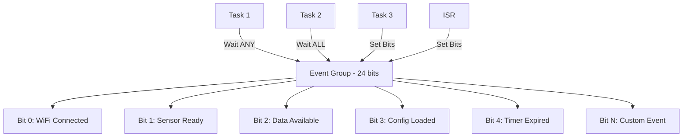
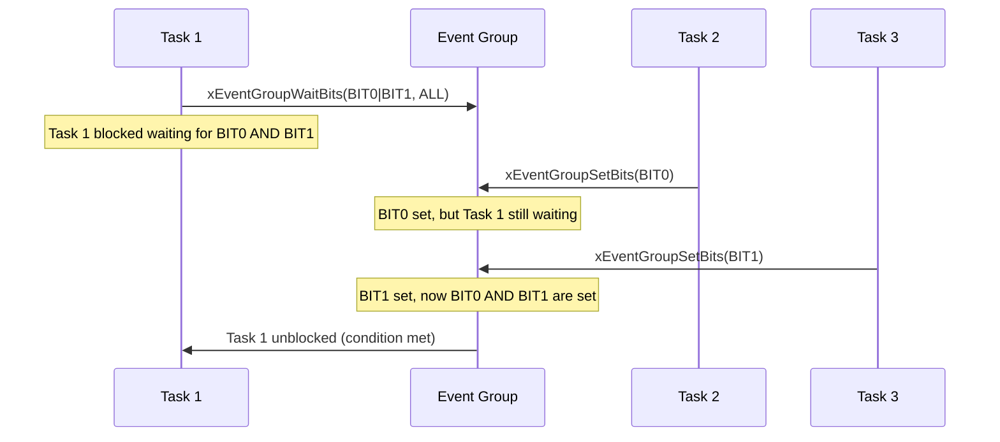

# Event Groups - ทฤษฎี

## 📖 ภาพรวม Event Groups

**Event Groups** เป็นกลไกการสื่อสารและการซิงโครไนซ์ใน FreeRTOS ที่ช่วยให้ Task สามารถรออีเวนต์หลายตัวพร้อมกันได้ โดยแต่ละบิตใน Event Group จะแทนอีเวนต์หนึ่งตัว

### 🎯 จุดประสงค์หลัก
- **Multi-Event Synchronization**: รอหลายอีเวนต์พร้อมกัน
- **Flexible Conditions**: รอแบบ ANY หรือ ALL
- **Broadcasting**: อีเวนต์หนึ่งตัวสามารถปลุก Task หลายตัวได้
- **Atomic Operations**: การตั้งค่าและล้างบิตแบบ atomic

## 🏗️ โครงสร้างและหลักการทำงาน

### Event Bits


### การทำงานของ Event Groups


## 🔧 Event Groups APIs

### การสร้างและจัดการ
| Function | Description |
|----------|-------------|
| `xEventGroupCreate()` | สร้าง Event Group |
| `xEventGroupCreateStatic()` | สร้าง Event Group แบบ static |
| `vEventGroupDelete()` | ลบ Event Group |

### การตั้งค่าและล้าง Event Bits
| Function | Description |
|----------|-------------|
| `xEventGroupSetBits()` | ตั้งค่า event bits |
| `xEventGroupSetBitsFromISR()` | ตั้งค่า bits จาก ISR |
| `xEventGroupClearBits()` | ล้าง event bits |
| `xEventGroupClearBitsFromISR()` | ล้าง bits จาก ISR |

### การรอ Event Bits
| Function | Description |
|----------|-------------|
| `xEventGroupWaitBits()` | รอ event bits ตามเงื่อนไข |
| `xEventGroupGetBits()` | อ่านค่า bits ปัจจุบัน |
| `xEventGroupGetBitsFromISR()` | อ่านค่า bits จาก ISR |

## 📊 รูปแบบการใช้งาน

### 1. System Initialization Synchronization
```c
#define WIFI_READY_BIT     BIT0
#define CONFIG_READY_BIT   BIT1
#define SENSOR_READY_BIT   BIT2
#define ALL_READY_BITS     (WIFI_READY_BIT | CONFIG_READY_BIT | SENSOR_READY_BIT)

void main_task(void *pvParameters) {
    // รอให้ระบบทั้งหมดพร้อม
    EventBits_t bits = xEventGroupWaitBits(
        system_events,
        ALL_READY_BITS,
        pdFALSE,    // ไม่ล้าง bits
        pdTRUE,     // รอทุก bits (AND)
        portMAX_DELAY
    );
    
    if ((bits & ALL_READY_BITS) == ALL_READY_BITS) {
        ESP_LOGI(TAG, "System fully initialized!");
        start_application();
    }
}
```

### 2. Multi-Condition Processing
```c
#define DATA_READY_BIT      BIT0
#define PROCESSING_IDLE_BIT BIT1
#define MEMORY_AVAILABLE_BIT BIT2

void data_processor_task(void *pvParameters) {
    while (1) {
        // รอเงื่อนไขการประมวลผล
        EventBits_t bits = xEventGroupWaitBits(
            processing_events,
            DATA_READY_BIT | PROCESSING_IDLE_BIT | MEMORY_AVAILABLE_BIT,
            pdTRUE,     // ล้าง bits หลังรอ
            pdTRUE,     // รอทุกเงื่อนไข (AND)
            pdMS_TO_TICKS(5000)
        );
        
        if (bits != 0) {
            process_data();
        }
    }
}
```

### 3. Event Broadcasting
```c
void sensor_interrupt_handler(void) {
    BaseType_t xHigherPriorityTaskWoken = pdFALSE;
    
    // ส่งสัญญาณให้ทุก Task ที่รออีเวนต์นี้
    xEventGroupSetBitsFromISR(
        sensor_events,
        SENSOR_DATA_READY_BIT,
        &xHigherPriorityTaskWoken
    );
    
    portYIELD_FROM_ISR(xHigherPriorityTaskWoken);
}

// หลาย Tasks สามารถรออีเวนต์เดียวกันได้
void task_a(void *pvParameters) {
    while (1) {
        xEventGroupWaitBits(sensor_events, SENSOR_DATA_READY_BIT, 
                           pdTRUE, pdTRUE, portMAX_DELAY);
        process_sensor_data_a();
    }
}

void task_b(void *pvParameters) {
    while (1) {
        xEventGroupWaitBits(sensor_events, SENSOR_DATA_READY_BIT, 
                           pdTRUE, pdTRUE, portMAX_DELAY);
        process_sensor_data_b();
    }
}
```

## 🔄 Event Groups vs อื่นๆ

### เปรียบเทียบกับ Synchronization Mechanisms อื่น

| Feature | Event Groups | Binary Semaphore | Queue | Mutex |
|---------|--------------|------------------|-------|-------|
| **Multi-condition** | ✅ รอหลายเงื่อนไข | ❌ เงื่อนไขเดียว | ❌ ข้อมูลเดียว | ❌ ทรัพยากรเดียว |
| **Broadcasting** | ✅ ปลุกหลาย Tasks | ✅ ปลุกหนึ่ง Task | ❌ FIFO order | ❌ Ownership |
| **Data Transfer** | ❌ ไม่ถือข้อมูล | ❌ ไม่ถือข้อมูล | ✅ ถือข้อมูล | ❌ ไม่ถือข้อมูล |
| **Memory Usage** | 🟡 ปานกลาง | 🟢 น้อย | 🔴 มาก | 🟢 น้อย |
| **Complexity** | 🟡 ปานกลาง | 🟢 ง่าย | 🟡 ปานกลาง | 🟡 ปานกลาง |

## ⚡ ข้อดีและข้อจำกัด

### ข้อดี
- **Flexible Synchronization**: รอหลายเงื่อนไขได้
- **Efficient Broadcasting**: ปลุก Tasks หลายตัวพร้อมกัน
- **Atomic Operations**: การดำเนินการแบบ atomic
- **Low Overhead**: ใช้หน่วยความจำน้อย
- **ISR Safe**: ใช้งานใน ISR ได้

### ข้อจำกัด
- **Limited Bits**: มีเพียง 24 bits ใช้งานได้
- **No Data Payload**: ไม่สามารถส่งข้อมูลได้
- **No Priority**: ไม่มีระบบ priority สำหรับ events
- **Memory Overhead**: ต่อ Event Group instance

## 🎯 Best Practices

### 1. การตั้งชื่อ Event Bits
```c
// ใช้ชื่อที่บอกความหมายชัดเจน
#define WIFI_CONNECTED_BIT          BIT0
#define MQTT_CONNECTED_BIT          BIT1
#define SENSOR_CALIBRATED_BIT       BIT2
#define CONFIG_LOADED_BIT           BIT3
#define SYSTEM_READY_BIT            BIT4

// จัดกลุ่มตามหน้าที่
#define NETWORK_READY_BITS  (WIFI_CONNECTED_BIT | MQTT_CONNECTED_BIT)
#define SYSTEM_INIT_BITS    (SENSOR_CALIBRATED_BIT | CONFIG_LOADED_BIT)
#define ALL_READY_BITS      (NETWORK_READY_BITS | SYSTEM_INIT_BITS | SYSTEM_READY_BIT)
```

### 2. การจัดการ Timeout
```c
EventBits_t wait_for_system_ready(TickType_t timeout) {
    EventBits_t bits = xEventGroupWaitBits(
        system_events,
        ALL_READY_BITS,
        pdFALSE,    // ไม่ล้าง bits
        pdTRUE,     // รอทุก bits
        timeout
    );
    
    if ((bits & ALL_READY_BITS) == ALL_READY_BITS) {
        ESP_LOGI(TAG, "System ready!");
        return bits;
    } else {
        ESP_LOGW(TAG, "System ready timeout. Missing bits: 0x%08X", 
                 ALL_READY_BITS & ~bits);
        return 0;
    }
}
```

### 3. การใช้งานใน ISR
```c
void IRAM_ATTR gpio_interrupt_handler(void* arg) {
    BaseType_t xHigherPriorityTaskWoken = pdFALSE;
    
    // อ่านสถานะ GPIO
    uint32_t gpio_status = gpio_get_level(BUTTON_GPIO);
    
    if (gpio_status) {
        // ตั้ง event bit จาก ISR
        xEventGroupSetBitsFromISR(
            button_events,
            BUTTON_PRESSED_BIT,
            &xHigherPriorityTaskWoken
        );
    }
    
    // Context switch ถ้าจำเป็น
    portYIELD_FROM_ISR(xHigherPriorityTaskWoken);
}
```

## 🏛️ Design Patterns

### 1. Barrier Synchronization Pattern
```c
#define TASK_A_READY_BIT  BIT0
#define TASK_B_READY_BIT  BIT1  
#define TASK_C_READY_BIT  BIT2
#define ALL_TASKS_READY   (TASK_A_READY_BIT | TASK_B_READY_BIT | TASK_C_READY_BIT)

void barrier_sync_task(void *pvParameters) {
    int task_id = (int)pvParameters;
    EventBits_t my_bit = (1 << task_id);
    
    while (1) {
        // ทำงานของแต่ละ task
        do_task_work();
        
        // สัญญาณว่าพร้อมสำหรับ synchronization
        xEventGroupSetBits(barrier_events, my_bit);
        ESP_LOGI(TAG, "Task %d ready for barrier", task_id);
        
        // รอให้ tasks อื่นพร้อม
        xEventGroupWaitBits(barrier_events, ALL_TASKS_READY, 
                           pdTRUE, pdTRUE, portMAX_DELAY);
        
        ESP_LOGI(TAG, "Task %d passed barrier", task_id);
        
        // ทำงานที่ต้อง sync กัน
        synchronized_work();
    }
}
```

### 2. Producer-Consumer with Conditions
```c
#define BUFFER_NOT_FULL_BIT   BIT0
#define BUFFER_NOT_EMPTY_BIT  BIT1
#define CONSUMER_READY_BIT    BIT2

void producer_task(void *pvParameters) {
    while (1) {
        // รอให้ buffer ไม่เต็มและ consumer พร้อม
        EventBits_t bits = xEventGroupWaitBits(
            buffer_events,
            BUFFER_NOT_FULL_BIT | CONSUMER_READY_BIT,
            pdFALSE,  // ไม่ล้าง bits
            pdTRUE,   // รอทุกเงื่อนไข
            portMAX_DELAY
        );
        
        if ((bits & (BUFFER_NOT_FULL_BIT | CONSUMER_READY_BIT)) == 
            (BUFFER_NOT_FULL_BIT | CONSUMER_READY_BIT)) {
            
            produce_data();
            xEventGroupSetBits(buffer_events, BUFFER_NOT_EMPTY_BIT);
            
            if (is_buffer_full()) {
                xEventGroupClearBits(buffer_events, BUFFER_NOT_FULL_BIT);
            }
        }
    }
}
```

## 🐛 การ Debug และ Troubleshooting

### การตรวจสอบสถานะ Event Group
```c
void debug_event_group_status(EventGroupHandle_t xEventGroup, const char* name) {
    EventBits_t current_bits = xEventGroupGetBits(xEventGroup);
    
    ESP_LOGI(TAG, "Event Group [%s] Status: 0x%08X", name, current_bits);
    
    // แสดงรายละเอียดแต่ละ bit
    for (int i = 0; i < 24; i++) {
        if (current_bits & (1 << i)) {
            ESP_LOGI(TAG, "  Bit %d: SET", i);
        }
    }
}
```

### ปัญหาที่เจอบ่อยและการแก้ไข

#### 1. Task ค้างรอ Event ไม่สิ้นสุด
```c
// ❌ ปัญหา: รอแบบไม่มี timeout
xEventGroupWaitBits(events, MY_BIT, pdTRUE, pdTRUE, portMAX_DELAY);

// ✅ แก้ไข: ใช้ timeout
EventBits_t bits = xEventGroupWaitBits(events, MY_BIT, pdTRUE, pdTRUE, 
                                      pdMS_TO_TICKS(5000));
if (bits == 0) {
    ESP_LOGW(TAG, "Event wait timeout!");
    handle_timeout();
}
```

#### 2. Race Condition ในการล้าง Bits
```c
// ❌ ปัญหา: อาจพลาด event ที่เกิดขึ้นระหว่างการประมวลผล
EventBits_t bits = xEventGroupWaitBits(events, EVENT_BIT, pdTRUE, pdTRUE, timeout);
// ช่วงนี้อาจมี event ใหม่เกิดขึ้น
process_event();

// ✅ แก้ไข: ใช้การล้าง bits แยก
EventBits_t bits = xEventGroupWaitBits(events, EVENT_BIT, pdFALSE, pdTRUE, timeout);
if (bits & EVENT_BIT) {
    xEventGroupClearBits(events, EVENT_BIT);
    process_event();
}
```

## 📈 Performance Considerations

### Memory Usage
- **Event Group Handle**: ~16-20 bytes
- **Per Waiting Task**: เพิ่ม memory ใน TCB
- **Total 24 bits**: ใช้หน่วยความจำคงที่

### CPU Overhead
- **Set/Clear Operations**: O(1) - รวดเร็ว
- **Wait Operations**: O(n) - ขึ้นกับจำนวน waiting tasks
- **Context Switching**: เกิดขึ้นเมื่อมี task ถูกปลุก

### Optimization Tips
```c
// ใช้ local variable เพื่อลด function calls
EventBits_t current_bits = xEventGroupGetBits(events);

// ตรวจสอบเงื่อนไขก่อนรอ
if ((current_bits & REQUIRED_BITS) != REQUIRED_BITS) {
    xEventGroupWaitBits(events, REQUIRED_BITS, pdFALSE, pdTRUE, timeout);
}

// ใช้ appropriate timeout values
#define SHORT_TIMEOUT   pdMS_TO_TICKS(100)
#define MEDIUM_TIMEOUT  pdMS_TO_TICKS(1000)
#define LONG_TIMEOUT    pdMS_TO_TICKS(10000)
```

## 🚀 ตัวอย่างการประยุกต์ใช้งานจริง

### IoT Device Initialization
```c
typedef enum {
    INIT_HARDWARE_BIT    = BIT0,
    INIT_WIFI_BIT        = BIT1,
    INIT_TIME_BIT        = BIT2,
    INIT_SENSORS_BIT     = BIT3,
    INIT_STORAGE_BIT     = BIT4,
    INIT_COMPLETE_BIT    = BIT5
} init_events_t;

#define ALL_INIT_BITS (INIT_HARDWARE_BIT | INIT_WIFI_BIT | INIT_TIME_BIT | \
                       INIT_SENSORS_BIT | INIT_STORAGE_BIT)

void iot_device_startup(void) {
    EventGroupHandle_t init_events = xEventGroupCreate();
    
    // สร้าง initialization tasks
    xTaskCreate(hardware_init_task, "HwInit", 2048, init_events, 8, NULL);
    xTaskCreate(wifi_init_task, "WiFiInit", 4096, init_events, 7, NULL);
    xTaskCreate(time_sync_task, "TimeSync", 2048, init_events, 6, NULL);
    xTaskCreate(sensor_init_task, "SensorInit", 3072, init_events, 5, NULL);
    xTaskCreate(storage_init_task, "StorageInit", 2048, init_events, 4, NULL);
    
    // รอให้การเตรียมพร้อมเสร็จสิ้น
    EventBits_t bits = xEventGroupWaitBits(
        init_events,
        ALL_INIT_BITS,
        pdFALSE,
        pdTRUE,
        pdMS_TO_TICKS(30000)  // 30 second timeout
    );
    
    if ((bits & ALL_INIT_BITS) == ALL_INIT_BITS) {
        xEventGroupSetBits(init_events, INIT_COMPLETE_BIT);
        start_main_application();
    } else {
        handle_initialization_failure(bits);
    }
}
```

Event Groups เป็นเครื่องมือที่ทรงพลังสำหรับการจัดการการซิงโครไนซ์ที่ซับซ้อน ช่วยให้สามารถสร้างระบบที่มีความยืดหยุ่นและมีประสิทธิภาพได้ 🎯