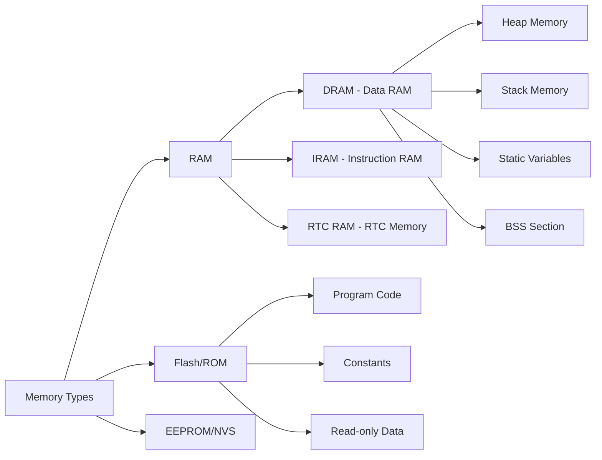
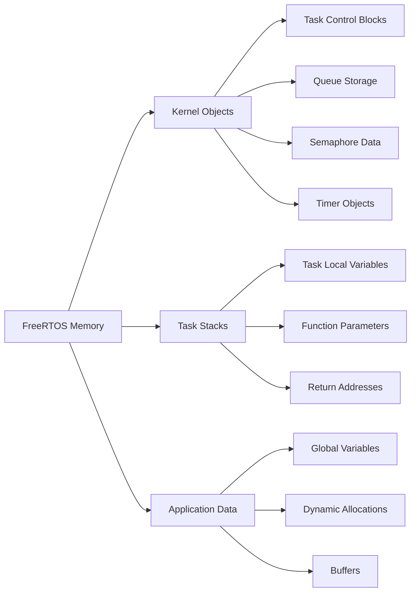
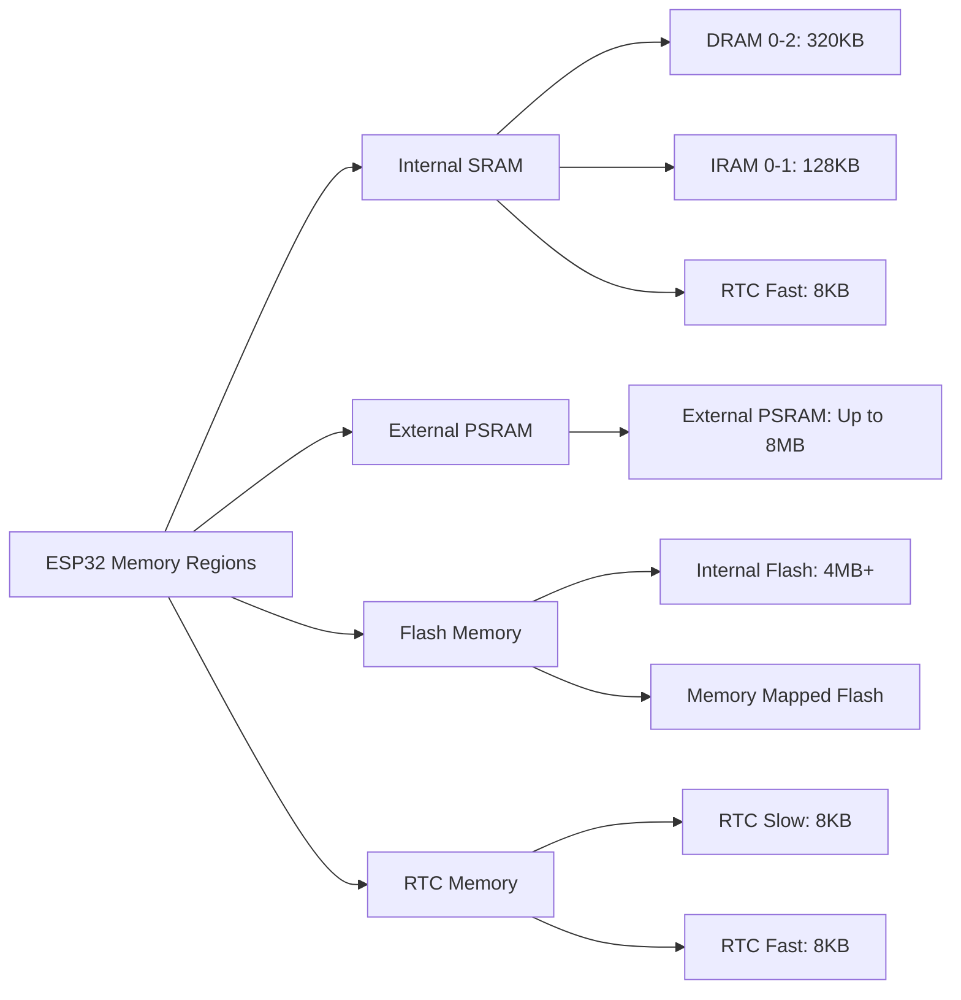

# FreeRTOS Memory Management

## Table of Contents
1. [Memory Management Fundamentals](#memory-management-fundamentals)
2. [FreeRTOS Heap Schemes](#freertos-heap-schemes)
3. [ESP32 Memory Architecture](#esp32-memory-architecture)
4. [Dynamic Memory Allocation](#dynamic-memory-allocation)
5. [Static Memory Allocation](#static-memory-allocation)
6. [Memory Pools and Management](#memory-pools-and-management)
7. [Memory Monitoring and Debugging](#memory-monitoring-and-debugging)
8. [Best Practices](#best-practices)
9. [Exercises](#exercises)

## Memory Management Fundamentals

Memory management in FreeRTOS involves allocating and deallocating memory for tasks, queues, semaphores, and other kernel objects. Understanding memory management is crucial for reliable embedded systems.

### Key Concepts:
- **Heap Memory**: Dynamic allocation for kernel objects
- **Stack Memory**: Task-specific memory for function calls
- **Static Allocation**: Compile-time memory allocation
- **Memory Fragmentation**: Inefficient memory usage over time
- **Memory Leaks**: Allocated memory not properly freed

### Memory Types in Embedded Systems:



### FreeRTOS Memory Usage:



## FreeRTOS Heap Schemes

FreeRTOS provides several heap implementation schemes. ESP-IDF uses a custom heap implementation optimized for ESP32.

### Heap Scheme Comparison:

| Scheme | Features | Pros | Cons |
|--------|----------|------|------|
| **heap_1** | Simple, no free | Fast, deterministic | No deallocation |
| **heap_2** | Basic free support | Simple | Fragmentation issues |
| **heap_3** | Uses malloc/free | Standard C library | Not thread-safe |
| **heap_4** | Coalescence algorithm | Good fragmentation handling | More complex |
| **heap_5** | Multiple memory regions | Flexible memory layout | Most complex |
| **ESP-IDF** | Multi-heap, capabilities | Optimized for ESP32 | ESP32-specific |

### ESP-IDF Heap Configuration:

```c
// In menuconfig or sdkconfig:
CONFIG_FREERTOS_HEAP_TASK_TRACKING=y          // Track heap usage per task
CONFIG_HEAP_POISONING_COMPREHENSIVE=y         // Enable heap poisoning
CONFIG_HEAP_TRACING_DEST=HEAP_TRACING_STANDALONE  // Enable heap tracing
CONFIG_HEAP_CHECK_INTEGRITY=y                 // Heap integrity checks
```

### Basic Memory APIs:

| Function | Description |
|----------|-------------|
| `pvPortMalloc()` | Allocate memory from FreeRTOS heap |
| `vPortFree()` | Free memory back to heap |
| `xPortGetFreeHeapSize()` | Get available heap size |
| `xPortGetMinimumEverFreeHeapSize()` | Get minimum heap size ever |
| `heap_caps_malloc()` | ESP-IDF capability-based allocation |
| `heap_caps_free()` | ESP-IDF capability-based free |

## ESP32 Memory Architecture

The ESP32 has a complex memory architecture with different memory regions and capabilities.

### ESP32 Memory Layout:



### Memory Capabilities:

```c
#include "esp_heap_caps.h"

// Memory capability flags
#define MALLOC_CAP_EXEC       (1<<0)   // Memory can execute code
#define MALLOC_CAP_32BIT      (1<<1)   // 32-bit aligned
#define MALLOC_CAP_8BIT       (1<<2)   // 8-bit access allowed  
#define MALLOC_CAP_DMA        (1<<3)   // DMA capable
#define MALLOC_CAP_PID2       (1<<4)   // PID2 memory
#define MALLOC_CAP_PID3       (1<<5)   // PID3 memory
#define MALLOC_CAP_PID4       (1<<6)   // PID4 memory
#define MALLOC_CAP_PID5       (1<<7)   // PID5 memory
#define MALLOC_CAP_PID6       (1<<8)   // PID6 memory
#define MALLOC_CAP_PID7       (1<<9)   // PID7 memory
#define MALLOC_CAP_SPIRAM     (1<<10)  // External SPIRAM
#define MALLOC_CAP_INTERNAL   (1<<11)  // Internal memory
#define MALLOC_CAP_DEFAULT    (1<<12)  // Default allocation

// Convenience combinations
#define MALLOC_CAP_IRAM_8BIT  (MALLOC_CAP_EXEC | MALLOC_CAP_8BIT)
#define MALLOC_CAP_DMA_32BIT  (MALLOC_CAP_DMA | MALLOC_CAP_32BIT)
```

### Memory Capability Example:

```c
#include "esp_heap_caps.h"
#include "esp_log.h"

static const char *TAG = "MEMORY_CAPS";

void memory_capabilities_demo(void)
{
    // Allocate DMA-capable memory
    void *dma_buffer = heap_caps_malloc(1024, MALLOC_CAP_DMA);
    if (dma_buffer) {
        ESP_LOGI(TAG, "DMA buffer allocated at %p", dma_buffer);
        heap_caps_free(dma_buffer);
    } else {
        ESP_LOGE(TAG, "Failed to allocate DMA buffer");
    }
    
    // Allocate executable memory (IRAM)
    void *exec_buffer = heap_caps_malloc(512, MALLOC_CAP_EXEC);
    if (exec_buffer) {
        ESP_LOGI(TAG, "Executable buffer allocated at %p", exec_buffer);
        heap_caps_free(exec_buffer);
    }
    
    // Allocate from external SPIRAM
    void *spiram_buffer = heap_caps_malloc(2048, MALLOC_CAP_SPIRAM);
    if (spiram_buffer) {
        ESP_LOGI(TAG, "SPIRAM buffer allocated at %p", spiram_buffer);
        heap_caps_free(spiram_buffer);
    }
    
    // Allocate 32-bit aligned memory
    void *aligned_buffer = heap_caps_aligned_alloc(32, 1024, MALLOC_CAP_32BIT);
    if (aligned_buffer) {
        ESP_LOGI(TAG, "32-bit aligned buffer allocated at %p", aligned_buffer);
        heap_caps_aligned_free(aligned_buffer);
    }
}
```

## Dynamic Memory Allocation

Dynamic memory allocation allows runtime allocation and deallocation of memory.

### FreeRTOS Dynamic Allocation:

```c
#include "freertos/FreeRTOS.h"
#include "freertos/task.h"
#include "esp_log.h"

static const char *TAG = "DYNAMIC_MEMORY";

void dynamic_allocation_example(void)
{
    ESP_LOGI(TAG, "Initial free heap: %d bytes", xPortGetFreeHeapSize());
    
    // Allocate memory for data buffer
    size_t buffer_size = 1024;
    uint8_t *data_buffer = (uint8_t*)pvPortMalloc(buffer_size);
    
    if (data_buffer != NULL) {
        ESP_LOGI(TAG, "Allocated %d bytes at %p", buffer_size, data_buffer);
        ESP_LOGI(TAG, "Free heap after allocation: %d bytes", xPortGetFreeHeapSize());
        
        // Use the buffer
        memset(data_buffer, 0xAA, buffer_size);
        ESP_LOGI(TAG, "Buffer initialized with pattern");
        
        // Free the memory
        vPortFree(data_buffer);
        ESP_LOGI(TAG, "Memory freed");
        ESP_LOGI(TAG, "Free heap after free: %d bytes", xPortGetFreeHeapSize());
        
        data_buffer = NULL; // Prevent accidental reuse
    } else {
        ESP_LOGE(TAG, "Failed to allocate %d bytes", buffer_size);
    }
    
    ESP_LOGI(TAG, "Minimum free heap size ever: %d bytes", 
             xPortGetMinimumEverFreeHeapSize());
}

// Dynamic task creation example
void create_dynamic_task(void)
{
    TaskHandle_t dynamic_task_handle;
    
    // Create task with dynamic allocation
    BaseType_t result = xTaskCreate(
        dynamic_worker_task,    // Task function
        "DynamicWorker",        // Task name
        2048,                   // Stack size
        NULL,                   // Parameters
        5,                      // Priority
        &dynamic_task_handle    // Task handle
    );
    
    if (result == pdPASS) {
        ESP_LOGI(TAG, "Dynamic task created successfully");
        ESP_LOGI(TAG, "Free heap after task creation: %d bytes", xPortGetFreeHeapSize());
        
        // Let task run for a while
        vTaskDelay(pdMS_TO_TICKS(5000));
        
        // Delete the task
        vTaskDelete(dynamic_task_handle);
        ESP_LOGI(TAG, "Dynamic task deleted");
        ESP_LOGI(TAG, "Free heap after task deletion: %d bytes", xPortGetFreeHeapSize());
    } else {
        ESP_LOGE(TAG, "Failed to create dynamic task");
    }
}

void dynamic_worker_task(void *parameter)
{
    int counter = 0;
    
    while (1) {
        ESP_LOGI(TAG, "Dynamic task running: %d", counter++);
        vTaskDelay(pdMS_TO_TICKS(1000));
    }
}
```

### Dynamic Queue and Semaphore Creation:

```c
void dynamic_objects_example(void)
{
    ESP_LOGI(TAG, "Creating dynamic FreeRTOS objects");
    
    // Create dynamic queue
    QueueHandle_t dynamic_queue = xQueueCreate(10, sizeof(int));
    if (dynamic_queue != NULL) {
        ESP_LOGI(TAG, "Dynamic queue created");
        
        // Use queue
        int test_data = 42;
        xQueueSend(dynamic_queue, &test_data, 0);
        
        int received_data;
        xQueueReceive(dynamic_queue, &received_data, 0);
        ESP_LOGI(TAG, "Queue test data: %d", received_data);
        
        // Delete queue
        vQueueDelete(dynamic_queue);
        ESP_LOGI(TAG, "Dynamic queue deleted");
    }
    
    // Create dynamic semaphore
    SemaphoreHandle_t dynamic_semaphore = xSemaphoreCreateBinary();
    if (dynamic_semaphore != NULL) {
        ESP_LOGI(TAG, "Dynamic semaphore created");
        
        // Use semaphore
        xSemaphoreGive(dynamic_semaphore);
        xSemaphoreTake(dynamic_semaphore, 0);
        
        // Delete semaphore
        vSemaphoreDelete(dynamic_semaphore);
        ESP_LOGI(TAG, "Dynamic semaphore deleted");
    }
    
    ESP_LOGI(TAG, "Final free heap: %d bytes", xPortGetFreeHeapSize());
}
```

## Static Memory Allocation

Static allocation uses compile-time allocated memory, providing deterministic memory usage.

### Static Task Creation:

```c
#include "freertos/FreeRTOS.h"
#include "freertos/task.h"

// Static memory for task
#define STATIC_TASK_STACK_SIZE 2048
static StackType_t static_task_stack[STATIC_TASK_STACK_SIZE];
static StaticTask_t static_task_tcb;

void static_allocation_example(void)
{
    ESP_LOGI(TAG, "Creating static task");
    ESP_LOGI(TAG, "Free heap before static task: %d bytes", xPortGetFreeHeapSize());
    
    // Create task with static allocation
    TaskHandle_t static_task_handle = xTaskCreateStatic(
        static_worker_task,         // Task function
        "StaticWorker",             // Task name
        STATIC_TASK_STACK_SIZE,     // Stack size
        NULL,                       // Parameters
        5,                          // Priority
        static_task_stack,          // Stack memory
        &static_task_tcb            // Task control block
    );
    
    if (static_task_handle != NULL) {
        ESP_LOGI(TAG, "Static task created successfully");
        ESP_LOGI(TAG, "Free heap after static task: %d bytes", xPortGetFreeHeapSize());
        ESP_LOGI(TAG, "Note: No heap memory used for static task");
    } else {
        ESP_LOGE(TAG, "Failed to create static task");
    }
}

void static_worker_task(void *parameter)
{
    int counter = 0;
    
    while (1) {
        ESP_LOGI(TAG, "Static task running: %d", counter++);
        vTaskDelay(pdMS_TO_TICKS(2000));
    }
}
```

### Static Queue and Semaphore Creation:

```c
// Static queue memory
#define STATIC_QUEUE_LENGTH 10
static uint8_t static_queue_storage[STATIC_QUEUE_LENGTH * sizeof(int)];
static StaticQueue_t static_queue_struct;

// Static semaphore memory
static StaticSemaphore_t static_semaphore_struct;

void static_objects_example(void)
{
    ESP_LOGI(TAG, "Creating static FreeRTOS objects");
    ESP_LOGI(TAG, "Free heap before static objects: %d bytes", xPortGetFreeHeapSize());
    
    // Create static queue
    QueueHandle_t static_queue = xQueueCreateStatic(
        STATIC_QUEUE_LENGTH,        // Queue length
        sizeof(int),                // Item size
        static_queue_storage,       // Storage buffer
        &static_queue_struct        // Queue struct
    );
    
    if (static_queue != NULL) {
        ESP_LOGI(TAG, "Static queue created");
        
        // Test queue
        int test_data = 123;
        xQueueSend(static_queue, &test_data, 0);
        
        int received_data;
        xQueueReceive(static_queue, &received_data, 0);
        ESP_LOGI(TAG, "Static queue test data: %d", received_data);
    }
    
    // Create static binary semaphore
    SemaphoreHandle_t static_semaphore = xSemaphoreCreateBinaryStatic(&static_semaphore_struct);
    if (static_semaphore != NULL) {
        ESP_LOGI(TAG, "Static semaphore created");
        
        // Test semaphore
        xSemaphoreGive(static_semaphore);
        if (xSemaphoreTake(static_semaphore, 0) == pdTRUE) {
            ESP_LOGI(TAG, "Static semaphore test passed");
        }
    }
    
    ESP_LOGI(TAG, "Free heap after static objects: %d bytes", xPortGetFreeHeapSize());
    ESP_LOGI(TAG, "Note: No heap memory used for static objects");
}
```

### Hybrid Approach - Configurable Allocation:

```c
// Configuration for allocation method
#define USE_STATIC_ALLOCATION 1

#if USE_STATIC_ALLOCATION
    // Static allocation definitions
    #define WORKER_TASK_STACK_SIZE 2048
    static StackType_t worker_task_stack[WORKER_TASK_STACK_SIZE];
    static StaticTask_t worker_task_tcb;
    
    static uint8_t worker_queue_storage[5 * sizeof(int)];
    static StaticQueue_t worker_queue_struct;
#endif

void create_worker_system(void)
{
    TaskHandle_t worker_task_handle;
    QueueHandle_t worker_queue;
    
#if USE_STATIC_ALLOCATION
    ESP_LOGI(TAG, "Using static allocation");
    
    // Create static task
    worker_task_handle = xTaskCreateStatic(
        worker_task_function, "Worker", WORKER_TASK_STACK_SIZE, NULL, 5,
        worker_task_stack, &worker_task_tcb
    );
    
    // Create static queue
    worker_queue = xQueueCreateStatic(5, sizeof(int), worker_queue_storage, &worker_queue_struct);
    
#else
    ESP_LOGI(TAG, "Using dynamic allocation");
    
    // Create dynamic task
    xTaskCreate(worker_task_function, "Worker", 2048, NULL, 5, &worker_task_handle);
    
    // Create dynamic queue
    worker_queue = xQueueCreate(5, sizeof(int));
#endif
    
    if (worker_task_handle && worker_queue) {
        ESP_LOGI(TAG, "Worker system created successfully");
        ESP_LOGI(TAG, "Free heap: %d bytes", xPortGetFreeHeapSize());
    } else {
        ESP_LOGE(TAG, "Failed to create worker system");
    }
}
```

## Memory Pools and Management

Custom memory pools can provide better control over memory allocation patterns.

### Simple Memory Pool Implementation:

```c
typedef struct {
    void *pool_start;
    size_t pool_size;
    size_t block_size;
    size_t num_blocks;
    uint8_t *allocation_map;
    SemaphoreHandle_t pool_mutex;
} memory_pool_t;

memory_pool_t* create_memory_pool(size_t block_size, size_t num_blocks)
{
    memory_pool_t *pool = (memory_pool_t*)pvPortMalloc(sizeof(memory_pool_t));
    if (!pool) return NULL;
    
    // Allocate pool memory
    pool->pool_size = block_size * num_blocks;
    pool->pool_start = pvPortMalloc(pool->pool_size);
    if (!pool->pool_start) {
        vPortFree(pool);
        return NULL;
    }
    
    // Allocate allocation bitmap
    size_t map_size = (num_blocks + 7) / 8; // Bits to bytes
    pool->allocation_map = (uint8_t*)pvPortMalloc(map_size);
    if (!pool->allocation_map) {
        vPortFree(pool->pool_start);
        vPortFree(pool);
        return NULL;
    }
    
    // Initialize pool
    pool->block_size = block_size;
    pool->num_blocks = num_blocks;
    memset(pool->allocation_map, 0, map_size);
    
    // Create mutex for thread safety
    pool->pool_mutex = xSemaphoreCreateMutex();
    if (!pool->pool_mutex) {
        vPortFree(pool->allocation_map);
        vPortFree(pool->pool_start);
        vPortFree(pool);
        return NULL;
    }
    
    ESP_LOGI(TAG, "Memory pool created: %d blocks of %d bytes", num_blocks, block_size);
    return pool;
}

void* pool_malloc(memory_pool_t *pool)
{
    if (!pool) return NULL;
    
    if (xSemaphoreTake(pool->pool_mutex, pdMS_TO_TICKS(1000)) != pdTRUE) {
        return NULL;
    }
    
    // Find free block
    for (size_t i = 0; i < pool->num_blocks; i++) {
        size_t byte_index = i / 8;
        size_t bit_index = i % 8;
        
        if (!(pool->allocation_map[byte_index] & (1 << bit_index))) {
            // Mark as allocated
            pool->allocation_map[byte_index] |= (1 << bit_index);
            
            void *block = (uint8_t*)pool->pool_start + (i * pool->block_size);
            
            xSemaphoreGive(pool->pool_mutex);
            ESP_LOGI(TAG, "Pool allocated block %d at %p", i, block);
            return block;
        }
    }
    
    xSemaphoreGive(pool->pool_mutex);
    ESP_LOGW(TAG, "Pool allocation failed - no free blocks");
    return NULL;
}

void pool_free(memory_pool_t *pool, void *ptr)
{
    if (!pool || !ptr) return;
    
    if (xSemaphoreTake(pool->pool_mutex, pdMS_TO_TICKS(1000)) != pdTRUE) {
        return;
    }
    
    // Calculate block index
    ptrdiff_t offset = (uint8_t*)ptr - (uint8_t*)pool->pool_start;
    if (offset < 0 || offset >= pool->pool_size) {
        ESP_LOGE(TAG, "Invalid pointer for pool free: %p", ptr);
        xSemaphoreGive(pool->pool_mutex);
        return;
    }
    
    size_t block_index = offset / pool->block_size;
    if (block_index >= pool->num_blocks) {
        ESP_LOGE(TAG, "Block index out of range: %d", block_index);
        xSemaphoreGive(pool->pool_mutex);
        return;
    }
    
    // Mark as free
    size_t byte_index = block_index / 8;
    size_t bit_index = block_index % 8;
    pool->allocation_map[byte_index] &= ~(1 << bit_index);
    
    ESP_LOGI(TAG, "Pool freed block %d at %p", block_index, ptr);
    
    xSemaphoreGive(pool->pool_mutex);
}

void pool_status(memory_pool_t *pool)
{
    if (!pool) return;
    
    if (xSemaphoreTake(pool->pool_mutex, pdMS_TO_TICKS(1000)) != pdTRUE) {
        return;
    }
    
    size_t allocated_blocks = 0;
    for (size_t i = 0; i < pool->num_blocks; i++) {
        size_t byte_index = i / 8;
        size_t bit_index = i % 8;
        if (pool->allocation_map[byte_index] & (1 << bit_index)) {
            allocated_blocks++;
        }
    }
    
    ESP_LOGI(TAG, "Pool status: %d/%d blocks allocated (%.1f%%)",
             allocated_blocks, pool->num_blocks,
             (float)allocated_blocks * 100.0 / pool->num_blocks);
    
    xSemaphoreGive(pool->pool_mutex);
}
```

### Memory Pool Usage Example:

```c
void memory_pool_demo(void)
{
    ESP_LOGI(TAG, "Memory pool demonstration");
    
    // Create pool for 64-byte blocks
    memory_pool_t *pool = create_memory_pool(64, 10);
    if (!pool) {
        ESP_LOGE(TAG, "Failed to create memory pool");
        return;
    }
    
    // Allocate some blocks
    void *blocks[5];
    for (int i = 0; i < 5; i++) {
        blocks[i] = pool_malloc(pool);
        if (blocks[i]) {
            ESP_LOGI(TAG, "Allocated block %d: %p", i, blocks[i]);
            
            // Use the block
            sprintf((char*)blocks[i], "Block %d data", i);
        }
    }
    
    pool_status(pool);
    
    // Free some blocks
    pool_free(pool, blocks[1]);
    pool_free(pool, blocks[3]);
    
    pool_status(pool);
    
    // Allocate more blocks
    void *new_block = pool_malloc(pool);
    if (new_block) {
        ESP_LOGI(TAG, "New block allocated: %p", new_block);
        strcpy((char*)new_block, "Reused block");
    }
    
    pool_status(pool);
}
```

## Memory Monitoring and Debugging

Monitoring memory usage is crucial for detecting leaks and optimizing memory usage.

### Basic Memory Monitoring:

```c
void memory_monitor_task(void *parameter)
{
    const TickType_t monitor_interval = pdMS_TO_TICKS(10000); // 10 seconds
    
    while (1) {
        // Get current heap information
        size_t free_heap = xPortGetFreeHeapSize();
        size_t min_free_heap = xPortGetMinimumEverFreeHeapSize();
        
        ESP_LOGI(TAG, "=== MEMORY STATUS ===");
        ESP_LOGI(TAG, "Free heap: %d bytes", free_heap);
        ESP_LOGI(TAG, "Minimum free heap ever: %d bytes", min_free_heap);
        ESP_LOGI(TAG, "Heap used: %d bytes", 
                 configTOTAL_HEAP_SIZE - free_heap);
        
        // ESP-IDF specific heap info
        multi_heap_info_t heap_info;
        heap_caps_get_info(&heap_info, MALLOC_CAP_DEFAULT);
        
        ESP_LOGI(TAG, "Total free: %d bytes", heap_info.total_free_bytes);
        ESP_LOGI(TAG, "Largest free block: %d bytes", heap_info.largest_free_block);
        ESP_LOGI(TAG, "Allocated blocks: %d", heap_info.allocated_blocks);
        ESP_LOGI(TAG, "Free blocks: %d", heap_info.free_blocks);
        ESP_LOGI(TAG, "====================");
        
        // Check for potential memory issues
        if (free_heap < 10000) { // Less than 10KB free
            ESP_LOGW(TAG, "⚠️  Low memory warning: %d bytes free", free_heap);
        }
        
        if (min_free_heap < 5000) { // Minimum ever was less than 5KB
            ESP_LOGW(TAG, "⚠️  Critical minimum heap detected: %d bytes", min_free_heap);
        }
        
        vTaskDelay(monitor_interval);
    }
}

void setup_memory_monitoring(void)
{
    xTaskCreate(memory_monitor_task, "MemMonitor", 2048, NULL, 2, NULL);
    ESP_LOGI(TAG, "Memory monitoring started");
}
```

### Memory Leak Detection:

```c
typedef struct memory_allocation {
    void *ptr;
    size_t size;
    const char *file;
    int line;
    uint32_t timestamp;
    struct memory_allocation *next;
} memory_allocation_t;

static memory_allocation_t *allocation_list = NULL;
static SemaphoreHandle_t allocation_mutex = NULL;

// Debug malloc wrapper
void* debug_malloc(size_t size, const char *file, int line)
{
    void *ptr = pvPortMalloc(size);
    if (!ptr) return NULL;
    
    if (!allocation_mutex) {
        allocation_mutex = xSemaphoreCreateMutex();
    }
    
    if (xSemaphoreTake(allocation_mutex, pdMS_TO_TICKS(1000)) == pdTRUE) {
        memory_allocation_t *alloc = (memory_allocation_t*)pvPortMalloc(sizeof(memory_allocation_t));
        if (alloc) {
            alloc->ptr = ptr;
            alloc->size = size;
            alloc->file = file;
            alloc->line = line;
            alloc->timestamp = xTaskGetTickCount();
            alloc->next = allocation_list;
            allocation_list = alloc;
            
            ESP_LOGI(TAG, "MALLOC: %p (%d bytes) at %s:%d", ptr, size, file, line);
        }
        xSemaphoreGive(allocation_mutex);
    }
    
    return ptr;
}

// Debug free wrapper
void debug_free(void *ptr, const char *file, int line)
{
    if (!ptr) return;
    
    if (xSemaphoreTake(allocation_mutex, pdMS_TO_TICKS(1000)) == pdTRUE) {
        memory_allocation_t **current = &allocation_list;
        while (*current) {
            if ((*current)->ptr == ptr) {
                memory_allocation_t *to_free = *current;
                *current = (*current)->next;
                
                ESP_LOGI(TAG, "FREE: %p (%d bytes) at %s:%d (allocated at %s:%d)", 
                         ptr, to_free->size, file, line, to_free->file, to_free->line);
                
                vPortFree(to_free);
                break;
            }
            current = &(*current)->next;
        }
        xSemaphoreGive(allocation_mutex);
    }
    
    vPortFree(ptr);
}

// Macros for debug malloc/free
#define DEBUG_MALLOC(size) debug_malloc(size, __FILE__, __LINE__)
#define DEBUG_FREE(ptr) debug_free(ptr, __FILE__, __LINE__)

void check_memory_leaks(void)
{
    if (xSemaphoreTake(allocation_mutex, pdMS_TO_TICKS(1000)) == pdTRUE) {
        ESP_LOGI(TAG, "=== MEMORY LEAK CHECK ===");
        
        memory_allocation_t *current = allocation_list;
        int leak_count = 0;
        size_t total_leaked = 0;
        
        while (current) {
            ESP_LOGW(TAG, "LEAK: %p (%d bytes) allocated at %s:%d (age: %d ticks)",
                     current->ptr, current->size, current->file, current->line,
                     xTaskGetTickCount() - current->timestamp);
            
            leak_count++;
            total_leaked += current->size;
            current = current->next;
        }
        
        if (leak_count == 0) {
            ESP_LOGI(TAG, "✅ No memory leaks detected");
        } else {
            ESP_LOGW(TAG, "⚠️  %d memory leaks detected, %d bytes total", 
                     leak_count, total_leaked);
        }
        
        ESP_LOGI(TAG, "========================");
        xSemaphoreGive(allocation_mutex);
    }
}
```

### Stack Usage Monitoring:

```c
void monitor_task_stacks(void)
{
    ESP_LOGI(TAG, "=== TASK STACK USAGE ===");
    
    // Get task list
    UBaseType_t task_count = uxTaskGetNumberOfTasks();
    TaskStatus_t *task_status_array = pvPortMalloc(task_count * sizeof(TaskStatus_t));
    
    if (task_status_array) {
        UBaseType_t returned_tasks = uxTaskGetSystemState(task_status_array, task_count, NULL);
        
        for (UBaseType_t i = 0; i < returned_tasks; i++) {
            TaskStatus_t *task = &task_status_array[i];
            
            // Get stack high water mark
            UBaseType_t stack_remaining = uxTaskGetStackHighWaterMark(task->xHandle);
            UBaseType_t stack_used = task->usStackHighWaterMark - stack_remaining;
            float stack_usage_percent = (float)stack_used * 100.0 / task->usStackHighWaterMark;
            
            ESP_LOGI(TAG, "Task: %-12s Stack: %4d/%4d (%5.1f%%) Remaining: %4d",
                     task->pcTaskName,
                     stack_used,
                     task->usStackHighWaterMark,
                     stack_usage_percent,
                     stack_remaining);
            
            // Warn about high stack usage
            if (stack_usage_percent > 80.0) {
                ESP_LOGW(TAG, "⚠️  High stack usage for task %s: %.1f%%", 
                         task->pcTaskName, stack_usage_percent);
            }
            
            if (stack_remaining < 200) {
                ESP_LOGE(TAG, "🚨 Critical stack usage for task %s: %d bytes remaining", 
                         task->pcTaskName, stack_remaining);
            }
        }
        
        vPortFree(task_status_array);
    }
    
    ESP_LOGI(TAG, "========================");
}
```

## Best Practices

### 1. Choose Appropriate Allocation Method:

```c
void allocation_strategy_examples(void)
{
    // Use static allocation for:
    // - Known, fixed-size objects
    // - Critical systems where dynamic allocation is forbidden
    // - Better determinism and debugging
    
    // Static task for critical real-time processing
    static StackType_t critical_task_stack[1024];
    static StaticTask_t critical_task_tcb;
    
    xTaskCreateStatic(critical_realtime_task, "Critical", 1024, NULL, 25,
                     critical_task_stack, &critical_task_tcb);
    
    // Use dynamic allocation for:
    // - Variable-sized objects
    // - Temporary objects
    // - When memory requirements are unknown at compile time
    
    // Dynamic allocation for variable-size buffer
    size_t buffer_size = calculate_required_buffer_size();
    uint8_t *dynamic_buffer = pvPortMalloc(buffer_size);
    
    if (dynamic_buffer) {
        process_data(dynamic_buffer, buffer_size);
        vPortFree(dynamic_buffer);
    }
}
```

### 2. Implement Proper Error Handling:

```c
void robust_memory_allocation(void)
{
    size_t buffer_size = 1024;
    uint8_t *buffer = NULL;
    
    // Check available memory before allocation
    if (xPortGetFreeHeapSize() < buffer_size + 1000) { // Keep 1KB margin
        ESP_LOGW(TAG, "Insufficient memory for allocation");
        return;
    }
    
    buffer = pvPortMalloc(buffer_size);
    if (buffer == NULL) {
        ESP_LOGE(TAG, "Memory allocation failed");
        
        // Try smaller allocation
        buffer_size /= 2;
        buffer = pvPortMalloc(buffer_size);
        
        if (buffer == NULL) {
            ESP_LOGE(TAG, "Even smaller allocation failed");
            return;
        }
        
        ESP_LOGW(TAG, "Using reduced buffer size: %d bytes", buffer_size);
    }
    
    // Use buffer safely
    if (buffer) {
        memset(buffer, 0, buffer_size); // Initialize memory
        
        // Do work with buffer
        process_buffer(buffer, buffer_size);
        
        // Always free memory
        vPortFree(buffer);
        buffer = NULL; // Prevent accidental reuse
    }
}
```

### 3. Monitor Memory Usage:

```c
void memory_usage_monitoring(void)
{
    // Regular monitoring
    static uint32_t last_check_time = 0;
    uint32_t current_time = xTaskGetTickCount();
    
    if (current_time - last_check_time > pdMS_TO_TICKS(60000)) { // Every minute
        size_t free_heap = xPortGetFreeHeapSize();
        size_t min_free = xPortGetMinimumEverFreeHeapSize();
        
        ESP_LOGI(TAG, "Memory check - Free: %d, Min: %d", free_heap, min_free);
        
        // Log memory trends
        static size_t previous_free = 0;
        if (previous_free > 0) {
            int32_t change = free_heap - previous_free;
            if (change < -1000) { // Decreased by more than 1KB
                ESP_LOGW(TAG, "Memory usage increased by %d bytes", -change);
            }
        }
        previous_free = free_heap;
        
        last_check_time = current_time;
    }
}
```

### 4. Use Memory Pools for Frequent Allocations:

```c
// Example: Message buffer pool
static memory_pool_t *message_pool = NULL;

void init_message_system(void)
{
    // Create pool for message buffers
    message_pool = create_memory_pool(256, 20); // 256-byte messages, 20 pool
    if (!message_pool) {
        ESP_LOGE(TAG, "Failed to create message pool");
    }
}

typedef struct {
    uint32_t id;
    uint32_t timestamp;
    char data[244]; // Total 256 bytes with header
} message_t;

message_t* allocate_message(void)
{
    message_t *msg = (message_t*)pool_malloc(message_pool);
    if (msg) {
        memset(msg, 0, sizeof(message_t));
        msg->timestamp = xTaskGetTickCount();
    }
    return msg;
}

void free_message(message_t *msg)
{
    if (msg) {
        pool_free(message_pool, msg);
    }
}
```

## Exercises

### Exercise 1: Memory Allocation Comparison

**Objective**: Compare static vs dynamic allocation performance and memory usage.

**Requirements**:
1. Create identical functionality using static and dynamic allocation
2. Measure memory usage and creation time
3. Create multiple tasks, queues, and semaphores
4. Compare heap usage and fragmentation
5. Implement error handling for allocation failures

### Exercise 2: Memory Pool Implementation

**Objective**: Implement and test a custom memory pool system.

**Requirements**:
1. Create memory pool for fixed-size blocks
2. Implement allocation, deallocation, and status functions
3. Add thread safety with mutexes
4. Create test scenarios with allocation patterns
5. Monitor pool utilization and fragmentation

### Exercise 3: Memory Leak Detection System

**Objective**: Build a memory leak detection and monitoring system.

**Requirements**:
1. Wrap malloc/free functions with tracking
2. Maintain allocation database with metadata
3. Implement periodic leak detection
4. Create test scenarios with intentional leaks
5. Generate detailed leak reports

### Exercise 4: Advanced Memory Monitoring

**Objective**: Create comprehensive memory monitoring dashboard.

**Requirements**:
1. Monitor heap usage trends over time
2. Track stack usage for all tasks
3. Detect memory fragmentation issues
4. Implement alert system for critical conditions
5. Create memory usage optimization recommendations

### Build and Test Commands:

```bash
# For each exercise:

# 1. Create project
idf.py create-project memory_exercise_1

# 2. Configure memory settings in menuconfig
idf.py menuconfig
# Component config -> FreeRTOS -> Memory Management
# Component config -> Heap memory debugging

# 3. Edit main/main.c with exercise code

# 4. Build and test
idf.py build flash monitor

# 5. Test scenarios:
# - Normal operation
# - Memory stress tests
# - Allocation failures
# - Memory leaks

# 6. Monitor behavior:
# - Heap usage patterns
# - Allocation/deallocation timing
# - Memory fragmentation
# - System stability under memory pressure
```

### Expected Outputs:

**Exercise 1**:
```
I (1000) MEMORY: Static allocation test
I (1000) MEMORY: Free heap before: 290000 bytes
I (1000) MEMORY: Static task created
I (1000) MEMORY: Free heap after static: 290000 bytes
I (2000) MEMORY: Dynamic allocation test  
I (2000) MEMORY: Free heap before: 290000 bytes
I (2000) MEMORY: Dynamic task created
I (2000) MEMORY: Free heap after dynamic: 287000 bytes
```

**Exercise 2**:
```
I (1000) POOL: Memory pool created: 10 blocks of 64 bytes
I (1000) POOL: Pool allocated block 0 at 0x3ffb2000
I (1000) POOL: Pool allocated block 1 at 0x3ffb2040
I (1000) POOL: Pool status: 2/10 blocks allocated (20.0%)
I (2000) POOL: Pool freed block 0 at 0x3ffb2000
I (2000) POOL: Pool status: 1/10 blocks allocated (10.0%)
```

## Next Module

Continue to [08-esp-idf-specific.md](08-esp-idf-specific.md) to learn about ESP32-specific FreeRTOS features and ESP-IDF integration.

---
**Key Takeaways**:
- Choose between static and dynamic allocation based on requirements
- ESP32 has complex memory architecture with different capabilities
- Memory pools provide better control for frequent allocations
- Monitoring memory usage is crucial for reliable systems
- Implement proper error handling for allocation failures
- Static allocation provides better determinism for critical systems