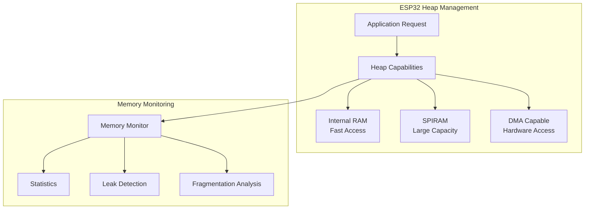

# Lab 1: Heap Management (45 นาที)

## 🎯 วัตถุประสงค์
- เรียนรู้การใช้งาน Dynamic Memory Allocation ใน FreeRTOS
- ฝึกการใช้งาน ESP32 Heap Capabilities API
- เข้าใจ Memory Layout และ Memory Types
- สร้างระบบ Memory Monitoring และ Leak Detection
- เรียนรู้การ Debug Memory Issues

## 📝 ความรู้เบื้องต้น

**ESP32 Memory Types**:
- **Internal RAM**: เร็วแต่จำกัด (~300KB)
- **PSRAM/SPIRAM**: ช้ากว่าแต่มีเยอะ (ถ้ามี)
- **DMA-capable**: สำหรับ DMA operations
- **Executable**: สำหรับ code execution



## 🛠️ การเตรียมโปรเจค

### 1. สร้างโปรเจคใหม่
```bash
idf.py create-project heap_management
cd heap_management
```

### 2. แก้ไข main.c

```c
#include <stdio.h>
#include <stdint.h>
#include <string.h>
#include <math.h>
#include "freertos/FreeRTOS.h"
#include "freertos/task.h"
#include "freertos/semphr.h"
#include "freertos/queue.h"
#include "esp_log.h"
#include "esp_heap_caps.h"
#include "esp_timer.h"
#include "esp_system.h"
#include "driver/gpio.h"

static const char *TAG = "HEAP_MGMT";

// GPIO สำหรับแสดงสถานะ
#define LED_MEMORY_OK       GPIO_NUM_2   // Memory system OK
#define LED_LOW_MEMORY      GPIO_NUM_4   // Low memory warning
#define LED_MEMORY_ERROR    GPIO_NUM_5   // Memory error/leak
#define LED_FRAGMENTATION   GPIO_NUM_18  // High fragmentation
#define LED_SPIRAM_ACTIVE   GPIO_NUM_19  // SPIRAM usage

// Memory thresholds
#define LOW_MEMORY_THRESHOLD    50000    // 50KB
#define CRITICAL_MEMORY_THRESHOLD 20000  // 20KB
#define FRAGMENTATION_THRESHOLD 0.3      // 30% fragmentation
#define MAX_ALLOCATIONS         100

// Memory allocation tracking
typedef struct {
    void* ptr;
    size_t size;
    uint32_t caps;
    const char* description;
    uint64_t timestamp;
    bool is_active;
} memory_allocation_t;

// Memory statistics
typedef struct {
    uint32_t total_allocations;
    uint32_t total_deallocations;
    uint32_t current_allocations;
    uint64_t total_bytes_allocated;
    uint64_t total_bytes_deallocated;
    uint64_t peak_usage;
    uint32_t allocation_failures;
    uint32_t fragmentation_events;
    uint32_t low_memory_events;
} memory_stats_t;

// Global variables
static memory_allocation_t allocations[MAX_ALLOCATIONS];
static memory_stats_t stats = {0};
static SemaphoreHandle_t memory_mutex;
static bool memory_monitoring_enabled = true;

// Memory monitoring functions
int find_free_allocation_slot(void) {
    for (int i = 0; i < MAX_ALLOCATIONS; i++) {
        if (!allocations[i].is_active) {
            return i;
        }
    }
    return -1;
}

int find_allocation_by_ptr(void* ptr) {
    for (int i = 0; i < MAX_ALLOCATIONS; i++) {
        if (allocations[i].is_active && allocations[i].ptr == ptr) {
            return i;
        }
    }
    return -1;
}

void* tracked_malloc(size_t size, uint32_t caps, const char* description) {
    void* ptr = heap_caps_malloc(size, caps);
    
    if (memory_monitoring_enabled && memory_mutex) {
        if (xSemaphoreTake(memory_mutex, pdMS_TO_TICKS(100)) == pdTRUE) {
            if (ptr) {
                int slot = find_free_allocation_slot();
                if (slot >= 0) {
                    allocations[slot].ptr = ptr;
                    allocations[slot].size = size;
                    allocations[slot].caps = caps;
                    allocations[slot].description = description;
                    allocations[slot].timestamp = esp_timer_get_time();
                    allocations[slot].is_active = true;
                    
                    stats.total_allocations++;
                    stats.current_allocations++;
                    stats.total_bytes_allocated += size;
                    
                    // Update peak usage
                    size_t current_usage = stats.total_bytes_allocated - stats.total_bytes_deallocated;
                    if (current_usage > stats.peak_usage) {
                        stats.peak_usage = current_usage;
                    }
                    
                    ESP_LOGI(TAG, "✅ Allocated %d bytes at %p (%s) - Slot %d", 
                             size, ptr, description, slot);
                } else {
                    ESP_LOGW(TAG, "⚠️ Allocation tracking full!");
                }
            } else {
                stats.allocation_failures++;
                ESP_LOGE(TAG, "❌ Failed to allocate %d bytes (%s)", size, description);
            }
            
            xSemaphoreGive(memory_mutex);
        }
    }
    
    return ptr;
}

void tracked_free(void* ptr, const char* description) {
    if (!ptr) return;
    
    if (memory_monitoring_enabled && memory_mutex) {
        if (xSemaphoreTake(memory_mutex, pdMS_TO_TICKS(100)) == pdTRUE) {
            int slot = find_allocation_by_ptr(ptr);
            if (slot >= 0) {
                allocations[slot].is_active = false;
                stats.total_deallocations++;
                stats.current_allocations--;
                stats.total_bytes_deallocated += allocations[slot].size;
                
                ESP_LOGI(TAG, "🗑️ Freed %d bytes at %p (%s) - Slot %d", 
                         allocations[slot].size, ptr, description, slot);
            } else {
                ESP_LOGW(TAG, "⚠️ Freeing untracked pointer %p (%s)", ptr, description);
            }
            
            xSemaphoreGive(memory_mutex);
        }
    }
    
    heap_caps_free(ptr);
}

// Memory analysis functions
void analyze_memory_status(void) {
    size_t internal_free = heap_caps_get_free_size(MALLOC_CAP_INTERNAL);
    size_t internal_largest = heap_caps_get_largest_free_block(MALLOC_CAP_INTERNAL);
    size_t spiram_free = heap_caps_get_free_size(MALLOC_CAP_SPIRAM);
    size_t total_free = esp_get_free_heap_size();
    
    // Calculate fragmentation
    float internal_fragmentation = 0.0;
    if (internal_free > 0) {
        internal_fragmentation = 1.0 - ((float)internal_largest / (float)internal_free);
    }
    
    ESP_LOGI(TAG, "\n📊 ═══ MEMORY STATUS ═══");
    ESP_LOGI(TAG, "Internal RAM Free:    %d bytes", internal_free);
    ESP_LOGI(TAG, "Largest Free Block:   %d bytes", internal_largest);
    ESP_LOGI(TAG, "SPIRAM Free:          %d bytes", spiram_free);
    ESP_LOGI(TAG, "Total Free:           %d bytes", total_free);
    ESP_LOGI(TAG, "Minimum Ever Free:    %d bytes", esp_get_minimum_free_heap_size());
    ESP_LOGI(TAG, "Internal Fragmentation: %.1f%%", internal_fragmentation * 100);
    
    // Update LEDs based on status
    if (internal_free < CRITICAL_MEMORY_THRESHOLD) {
        gpio_set_level(LED_MEMORY_ERROR, 1);
        gpio_set_level(LED_LOW_MEMORY, 1);
        gpio_set_level(LED_MEMORY_OK, 0);
        stats.low_memory_events++;
        ESP_LOGW(TAG, "🚨 CRITICAL: Very low memory!");
    } else if (internal_free < LOW_MEMORY_THRESHOLD) {
        gpio_set_level(LED_LOW_MEMORY, 1);
        gpio_set_level(LED_MEMORY_ERROR, 0);
        gpio_set_level(LED_MEMORY_OK, 0);
        stats.low_memory_events++;
        ESP_LOGW(TAG, "⚠️ WARNING: Low memory");
    } else {
        gpio_set_level(LED_MEMORY_OK, 1);
        gpio_set_level(LED_LOW_MEMORY, 0);
        gpio_set_level(LED_MEMORY_ERROR, 0);
    }
    
    if (internal_fragmentation > FRAGMENTATION_THRESHOLD) {
        gpio_set_level(LED_FRAGMENTATION, 1);
        stats.fragmentation_events++;
        ESP_LOGW(TAG, "⚠️ High fragmentation detected!");
    } else {
        gpio_set_level(LED_FRAGMENTATION, 0);
    }
    
    if (spiram_free > 0) {
        gpio_set_level(LED_SPIRAM_ACTIVE, 1);
    } else {
        gpio_set_level(LED_SPIRAM_ACTIVE, 0);
    }
    
    ESP_LOGI(TAG, "═══════════════════════════════");
}

void print_allocation_summary(void) {
    if (!memory_mutex) return;
    
    if (xSemaphoreTake(memory_mutex, pdMS_TO_TICKS(1000)) == pdTRUE) {
        ESP_LOGI(TAG, "\n📈 ═══ ALLOCATION STATISTICS ═══");
        ESP_LOGI(TAG, "Total Allocations:    %lu", stats.total_allocations);
        ESP_LOGI(TAG, "Total Deallocations:  %lu", stats.total_deallocations);
        ESP_LOGI(TAG, "Current Allocations:  %lu", stats.current_allocations);
        ESP_LOGI(TAG, "Total Allocated:      %llu bytes", stats.total_bytes_allocated);
        ESP_LOGI(TAG, "Total Deallocated:    %llu bytes", stats.total_bytes_deallocated);
        ESP_LOGI(TAG, "Peak Usage:           %llu bytes", stats.peak_usage);
        ESP_LOGI(TAG, "Allocation Failures:  %lu", stats.allocation_failures);
        ESP_LOGI(TAG, "Fragmentation Events: %lu", stats.fragmentation_events);
        ESP_LOGI(TAG, "Low Memory Events:    %lu", stats.low_memory_events);
        
        if (stats.current_allocations > 0) {
            ESP_LOGI(TAG, "\n🔍 ═══ ACTIVE ALLOCATIONS ═══");
            for (int i = 0; i < MAX_ALLOCATIONS; i++) {
                if (allocations[i].is_active) {
                    uint64_t age_ms = (esp_timer_get_time() - allocations[i].timestamp) / 1000;
                    ESP_LOGI(TAG, "Slot %d: %d bytes at %p (%s) - Age: %llu ms",
                             i, allocations[i].size, allocations[i].ptr,
                             allocations[i].description, age_ms);
                }
            }
        }
        
        xSemaphoreGive(memory_mutex);
    }
}

void detect_memory_leaks(void) {
    if (!memory_mutex) return;
    
    if (xSemaphoreTake(memory_mutex, pdMS_TO_TICKS(1000)) == pdTRUE) {
        uint64_t current_time = esp_timer_get_time();
        int leak_count = 0;
        size_t leaked_bytes = 0;
        
        ESP_LOGI(TAG, "\n🔍 ═══ MEMORY LEAK DETECTION ═══");
        
        for (int i = 0; i < MAX_ALLOCATIONS; i++) {
            if (allocations[i].is_active) {
                uint64_t age_ms = (current_time - allocations[i].timestamp) / 1000;
                
                // Consider allocations older than 30 seconds as potential leaks
                if (age_ms > 30000) {
                    ESP_LOGW(TAG, "POTENTIAL LEAK: %d bytes at %p (%s) - Age: %llu ms",
                             allocations[i].size, allocations[i].ptr,
                             allocations[i].description, age_ms);
                    leak_count++;
                    leaked_bytes += allocations[i].size;
                }
            }
        }
        
        if (leak_count > 0) {
            ESP_LOGW(TAG, "Found %d potential leaks totaling %d bytes", leak_count, leaked_bytes);
            gpio_set_level(LED_MEMORY_ERROR, 1);
        } else {
            ESP_LOGI(TAG, "No memory leaks detected");
            gpio_set_level(LED_MEMORY_ERROR, 0);
        }
        
        xSemaphoreGive(memory_mutex);
    }
}

// Test tasks
void memory_stress_test_task(void *pvParameters) {
    ESP_LOGI(TAG, "🧪 Memory stress test started");
    
    void* test_ptrs[20] = {NULL};
    int allocation_count = 0;
    
    while (1) {
        // Random allocation/deallocation
        int action = esp_random() % 3;
        
        if (action == 0 && allocation_count < 20) {
            // Allocate memory
            size_t size = 100 + (esp_random() % 2000); // 100-2100 bytes
            uint32_t caps = (esp_random() % 2) ? MALLOC_CAP_INTERNAL : MALLOC_CAP_DEFAULT;
            
            test_ptrs[allocation_count] = tracked_malloc(size, caps, "StressTest");
            if (test_ptrs[allocation_count]) {
                // Write some data to test memory
                memset(test_ptrs[allocation_count], 0xAA, size);
                allocation_count++;
                ESP_LOGI(TAG, "🔧 Stress test: allocated %d bytes (%d/20)", size, allocation_count);
            }
            
        } else if (action == 1 && allocation_count > 0) {
            // Deallocate memory
            int index = esp_random() % allocation_count;
            if (test_ptrs[index]) {
                tracked_free(test_ptrs[index], "StressTest");
                
                // Shift array
                for (int i = index; i < allocation_count - 1; i++) {
                    test_ptrs[i] = test_ptrs[i + 1];
                }
                allocation_count--;
                ESP_LOGI(TAG, "🗑️ Stress test: freed memory (%d/20)", allocation_count);
            }
            
        } else if (action == 2) {
            // Memory status check
            analyze_memory_status();
        }
        
        vTaskDelay(pdMS_TO_TICKS(1000 + (esp_random() % 2000))); // 1-3 seconds
    }
}

void memory_pool_test_task(void *pvParameters) {
    ESP_LOGI(TAG, "🏊 Memory pool test started");
    
    // Create different sized allocations to test fragmentation
    const size_t pool_sizes[] = {64, 128, 256, 512, 1024};
    const int num_pools = sizeof(pool_sizes) / sizeof(pool_sizes[0]);
    void* pools[5][10] = {NULL}; // 5 sizes, 10 allocations each
    
    while (1) {
        // Allocate pools
        ESP_LOGI(TAG, "🏊 Allocating memory pools...");
        for (int size_idx = 0; size_idx < num_pools; size_idx++) {
            for (int i = 0; i < 10; i++) {
                char desc[32];
                snprintf(desc, sizeof(desc), "Pool%d_%d", size_idx, i);
                pools[size_idx][i] = tracked_malloc(pool_sizes[size_idx], 
                                                   MALLOC_CAP_INTERNAL, desc);
                if (pools[size_idx][i]) {
                    // Initialize with pattern
                    memset(pools[size_idx][i], 0x55 + size_idx, pool_sizes[size_idx]);
                }
            }
        }
        
        vTaskDelay(pdMS_TO_TICKS(5000)); // Keep for 5 seconds
        
        // Free pools in reverse order to create fragmentation
        ESP_LOGI(TAG, "🏊 Freeing memory pools (reverse order)...");
        for (int size_idx = num_pools - 1; size_idx >= 0; size_idx--) {
            for (int i = 9; i >= 0; i--) {
                if (pools[size_idx][i]) {
                    tracked_free(pools[size_idx][i], "Pool");
                    pools[size_idx][i] = NULL;
                }
            }
        }
        
        analyze_memory_status();
        vTaskDelay(pdMS_TO_TICKS(8000)); // Wait 8 seconds before next cycle
    }
}

void large_allocation_test_task(void *pvParameters) {
    ESP_LOGI(TAG, "🐘 Large allocation test started");
    
    while (1) {
        // Try to allocate large chunks
        size_t large_size = 50000 + (esp_random() % 100000); // 50KB-150KB
        
        ESP_LOGI(TAG, "🐘 Attempting large allocation: %d bytes", large_size);
        
        // Try internal RAM first, then SPIRAM
        void* large_ptr = tracked_malloc(large_size, MALLOC_CAP_INTERNAL, "LargeInternal");
        
        if (!large_ptr) {
            ESP_LOGW(TAG, "🐘 Internal RAM failed, trying SPIRAM...");
            large_ptr = tracked_malloc(large_size, MALLOC_CAP_SPIRAM, "LargeSPIRAM");
        }
        
        if (large_ptr) {
            ESP_LOGI(TAG, "🐘 Large allocation successful: %p", large_ptr);
            
            // Test memory access performance
            uint64_t start_time = esp_timer_get_time();
            memset(large_ptr, 0xFF, large_size);
            uint64_t end_time = esp_timer_get_time();
            
            uint32_t access_time_ms = (end_time - start_time) / 1000;
            ESP_LOGI(TAG, "🐘 Memory access time: %lu ms", access_time_ms);
            
            // Keep allocation for a while
            vTaskDelay(pdMS_TO_TICKS(10000)); // 10 seconds
            
            tracked_free(large_ptr, "Large");
            
        } else {
            ESP_LOGE(TAG, "🐘 Large allocation failed!");
            analyze_memory_status();
        }
        
        vTaskDelay(pdMS_TO_TICKS(15000)); // Wait 15 seconds before next attempt
    }
}

void memory_monitor_task(void *pvParameters) {
    ESP_LOGI(TAG, "📊 Memory monitor started");
    
    while (1) {
        vTaskDelay(pdMS_TO_TICKS(10000)); // Check every 10 seconds
        
        analyze_memory_status();
        print_allocation_summary();
        detect_memory_leaks();
        
        // Check heap integrity
        if (!heap_caps_check_integrity_all(true)) {
            ESP_LOGE(TAG, "🚨 HEAP CORRUPTION DETECTED!");
            gpio_set_level(LED_MEMORY_ERROR, 1);
        }
        
        ESP_LOGI(TAG, "Free heap: %d bytes", esp_get_free_heap_size());
        ESP_LOGI(TAG, "System uptime: %llu ms\n", esp_timer_get_time() / 1000);
    }
}

void heap_integrity_test_task(void *pvParameters) {
    ESP_LOGI(TAG, "🔍 Heap integrity test started");
    
    while (1) {
        vTaskDelay(pdMS_TO_TICKS(30000)); // Check every 30 seconds
        
        ESP_LOGI(TAG, "🔍 Running heap integrity check...");
        
        bool integrity_ok = heap_caps_check_integrity_all(false);
        
        if (integrity_ok) {
            ESP_LOGI(TAG, "✅ Heap integrity OK");
        } else {
            ESP_LOGE(TAG, "❌ Heap integrity check FAILED!");
            gpio_set_level(LED_MEMORY_ERROR, 1);
            
            // Print detailed heap info
            heap_caps_print_heap_info(MALLOC_CAP_INTERNAL);
            if (heap_caps_get_free_size(MALLOC_CAP_SPIRAM) > 0) {
                heap_caps_print_heap_info(MALLOC_CAP_SPIRAM);
            }
        }
        
        // Memory performance test
        ESP_LOGI(TAG, "🔍 Running memory performance test...");
        
        const size_t test_size = 4096;
        void* test_buf = tracked_malloc(test_size, MALLOC_CAP_INTERNAL, "PerfTest");
        
        if (test_buf) {
            uint64_t start = esp_timer_get_time();
            
            // Sequential write test
            for (int i = 0; i < 100; i++) {
                memset(test_buf, i & 0xFF, test_size);
            }
            
            uint64_t write_time = esp_timer_get_time() - start;
            start = esp_timer_get_time();
            
            // Sequential read test
            volatile uint8_t checksum = 0;
            for (int i = 0; i < 100; i++) {
                uint8_t* buf = (uint8_t*)test_buf;
                for (size_t j = 0; j < test_size; j++) {
                    checksum += buf[j];
                }
            }
            
            uint64_t read_time = esp_timer_get_time() - start;
            
            ESP_LOGI(TAG, "🔍 Performance: Write %llu μs, Read %llu μs", 
                     write_time, read_time);
            
            tracked_free(test_buf, "PerfTest");
        }
    }
}

void app_main(void) {
    ESP_LOGI(TAG, "🚀 Heap Management Lab Starting...");
    
    // Configure GPIO
    gpio_set_direction(LED_MEMORY_OK, GPIO_MODE_OUTPUT);
    gpio_set_direction(LED_LOW_MEMORY, GPIO_MODE_OUTPUT);
    gpio_set_direction(LED_MEMORY_ERROR, GPIO_MODE_OUTPUT);
    gpio_set_direction(LED_FRAGMENTATION, GPIO_MODE_OUTPUT);
    gpio_set_direction(LED_SPIRAM_ACTIVE, GPIO_MODE_OUTPUT);
    
    // Initialize all LEDs off
    gpio_set_level(LED_MEMORY_OK, 0);
    gpio_set_level(LED_LOW_MEMORY, 0);
    gpio_set_level(LED_MEMORY_ERROR, 0);
    gpio_set_level(LED_FRAGMENTATION, 0);
    gpio_set_level(LED_SPIRAM_ACTIVE, 0);
    
    // Create mutex for memory tracking
    memory_mutex = xSemaphoreCreateMutex();
    if (!memory_mutex) {
        ESP_LOGE(TAG, "Failed to create memory mutex!");
        return;
    }
    
    // Initialize allocation tracking
    memset(allocations, 0, sizeof(allocations));
    
    ESP_LOGI(TAG, "Memory tracking system initialized");
    
    // Initial memory analysis
    analyze_memory_status();
    
    // Print initial heap info
    ESP_LOGI(TAG, "\n🏗️ ═══ INITIAL HEAP INFORMATION ═══");
    heap_caps_print_heap_info(MALLOC_CAP_INTERNAL);
    
    if (heap_caps_get_free_size(MALLOC_CAP_SPIRAM) > 0) {
        ESP_LOGI(TAG, "\n🏗️ ═══ SPIRAM INFORMATION ═══");
        heap_caps_print_heap_info(MALLOC_CAP_SPIRAM);
    }
    
    // Create test tasks
    ESP_LOGI(TAG, "Creating memory test tasks...");
    
    xTaskCreate(memory_monitor_task, "MemMonitor", 4096, NULL, 6, NULL);
    xTaskCreate(memory_stress_test_task, "StressTest", 3072, NULL, 5, NULL);
    xTaskCreate(memory_pool_test_task, "PoolTest", 3072, NULL, 5, NULL);
    xTaskCreate(large_allocation_test_task, "LargeAlloc", 2048, NULL, 4, NULL);
    xTaskCreate(heap_integrity_test_task, "IntegrityTest", 3072, NULL, 3, NULL);
    
    ESP_LOGI(TAG, "All tasks created successfully");
    
    ESP_LOGI(TAG, "\n🎯 LED Indicators:");
    ESP_LOGI(TAG, "  GPIO2  - Memory System OK (Green)");
    ESP_LOGI(TAG, "  GPIO4  - Low Memory Warning (Yellow)");
    ESP_LOGI(TAG, "  GPIO5  - Memory Error/Leak (Red)");
    ESP_LOGI(TAG, "  GPIO18 - High Fragmentation (Orange)");
    ESP_LOGI(TAG, "  GPIO19 - SPIRAM Active (Blue)");
    
    ESP_LOGI(TAG, "\n🔬 Test Features:");
    ESP_LOGI(TAG, "  • Dynamic Memory Allocation Tracking");
    ESP_LOGI(TAG, "  • Real-time Memory Status Monitoring");
    ESP_LOGI(TAG, "  • Memory Leak Detection");
    ESP_LOGI(TAG, "  • Fragmentation Analysis");
    ESP_LOGI(TAG, "  • Heap Integrity Checking");
    ESP_LOGI(TAG, "  • Memory Performance Testing");
    
    ESP_LOGI(TAG, "Heap Management System operational!");
}
```

## 🧪 การทดลอง

### ทดลองที่ 1: Memory Allocation Types
1. สังเกต LEDs แสดงสถานะ memory
2. ติดตาม internal RAM vs SPIRAM usage
3. วิเคราะห์ performance differences

### ทดลองที่ 2: Memory Monitoring
1. ดู memory statistics ใน Serial Monitor
2. ติดตาม allocation/deallocation patterns
3. สังเกต peak memory usage

### ทดลองที่ 3: Fragmentation Analysis
1. สังเกต LED_FRAGMENTATION เมื่อมี fragmentation สูง
2. วิเคราะห์ fragmentation patterns
3. ดูผลกระทบต่อ largest free block

### ทดลองที่ 4: Memory Leak Detection
1. ติดตาม potential memory leaks
2. สังเกต LED_MEMORY_ERROR เมื่อมี leaks
3. วิเคราะห์ allocation ages

## 📊 การวิเคราะห์ผลลัพธ์

### Memory Usage Patterns:
```c
// เพิ่มการวิเคราะห์ memory patterns
void analyze_allocation_patterns(void) {
    if (!memory_mutex) return;
    
    if (xSemaphoreTake(memory_mutex, pdMS_TO_TICKS(1000)) == pdTRUE) {
        size_t internal_usage = 0;
        size_t spiram_usage = 0;
        size_t dma_usage = 0;
        int internal_count = 0;
        int spiram_count = 0;
        int dma_count = 0;
        
        for (int i = 0; i < MAX_ALLOCATIONS; i++) {
            if (allocations[i].is_active) {
                if (allocations[i].caps & MALLOC_CAP_INTERNAL) {
                    internal_usage += allocations[i].size;
                    internal_count++;
                } else if (allocations[i].caps & MALLOC_CAP_SPIRAM) {
                    spiram_usage += allocations[i].size;
                    spiram_count++;
                }
                
                if (allocations[i].caps & MALLOC_CAP_DMA) {
                    dma_usage += allocations[i].size;
                    dma_count++;
                }
            }
        }
        
        ESP_LOGI(TAG, "\n📊 Allocation Patterns:");
        ESP_LOGI(TAG, "Internal: %d bytes in %d allocations", internal_usage, internal_count);
        ESP_LOGI(TAG, "SPIRAM: %d bytes in %d allocations", spiram_usage, spiram_count);
        ESP_LOGI(TAG, "DMA: %d bytes in %d allocations", dma_usage, dma_count);
        
        xSemaphoreGive(memory_mutex);
    }
}
```

## 🔧 Advanced Memory Operations

### การจัดการ Memory แบบ Batch:
```c
// Batch allocation for related data
typedef struct {
    void* ptrs[10];
    size_t sizes[10];
    int count;
    const char* batch_name;
} memory_batch_t;

memory_batch_t* create_memory_batch(const char* name) {
    memory_batch_t* batch = tracked_malloc(sizeof(memory_batch_t), 
                                          MALLOC_CAP_INTERNAL, "BatchStruct");
    if (batch) {
        memset(batch, 0, sizeof(memory_batch_t));
        batch->batch_name = name;
    }
    return batch;
}

bool batch_allocate(memory_batch_t* batch, size_t size, uint32_t caps) {
    if (!batch || batch->count >= 10) return false;
    
    batch->ptrs[batch->count] = tracked_malloc(size, caps, batch->batch_name);
    if (batch->ptrs[batch->count]) {
        batch->sizes[batch->count] = size;
        batch->count++;
        return true;
    }
    
    return false;
}

void batch_free(memory_batch_t* batch) {
    if (!batch) return;
    
    for (int i = 0; i < batch->count; i++) {
        if (batch->ptrs[i]) {
            tracked_free(batch->ptrs[i], batch->batch_name);
            batch->ptrs[i] = NULL;
        }
    }
    
    tracked_free(batch, "BatchStruct");
}
```

## 📋 สรุปผลการทดลอง

### Heap Management Concepts:
- [ ] **Dynamic Allocation**: การใช้ malloc/free และ heap_caps APIs
- [ ] **Memory Types**: Internal RAM, SPIRAM, DMA-capable memory
- [ ] **Memory Monitoring**: การติดตาม memory usage แบบ real-time
- [ ] **Leak Detection**: การหา memory leaks และ unfreed allocations
- [ ] **Fragmentation Analysis**: การวิเคราะห์และป้องกัน fragmentation

### Memory Management Skills:
- [ ] **Allocation Strategies**: การเลือก memory type ที่เหมาะสม
- [ ] **Performance Analysis**: การวัด memory access performance
- [ ] **Debugging Techniques**: การใช้เครื่องมือ debug memory issues
- [ ] **Resource Tracking**: การติดตาม memory resources
- [ ] **Error Handling**: การจัดการกับ allocation failures

## 🚀 ความท้าทายเพิ่มเติม

1. **Custom Memory Allocator**: สร้าง custom allocator สำหรับ specific use cases
2. **Memory Compression**: ทดลองใช้ compression สำหรับ large data
3. **Shared Memory**: สร้างระบบ shared memory ระหว่าง tasks
4. **Memory Encryption**: เพิ่ม encryption สำหรับ sensitive data
5. **Dynamic Memory Pools**: สร้าง memory pools ที่ปรับขนาดได้

## 🎯 Tips สำหรับการใช้งานจริง

### Memory Allocation Best Practices:
```c
// Safe allocation patterns
#define SAFE_MALLOC(size, caps, desc) ({ \
    void* ptr = tracked_malloc(size, caps, desc); \
    if (!ptr) { \
        ESP_LOGE(TAG, "Critical: Failed to allocate memory!"); \
        analyze_memory_status(); \
    } \
    ptr; \
})

#define SAFE_FREE(ptr, desc) do { \
    if (ptr) { \
        tracked_free(ptr, desc); \
        ptr = NULL; \
    } \
} while(0)

// Memory usage guidelines
void memory_usage_guidelines(void) {
    ESP_LOGI(TAG, "\n💡 Memory Usage Guidelines:");
    ESP_LOGI(TAG, "• Use SPIRAM for large buffers (>4KB)");
    ESP_LOGI(TAG, "• Use internal RAM for frequently accessed data");
    ESP_LOGI(TAG, "• Always check allocation return values");
    ESP_LOGI(TAG, "• Free memory in reverse allocation order when possible");
    ESP_LOGI(TAG, "• Monitor fragmentation regularly");
    ESP_LOGI(TAG, "• Use static allocation for critical systems");
    ESP_LOGI(TAG, "• Implement proper error handling");
}
```

## 📚 เอกสารอ้างอิง

- [ESP32 Memory Layout](https://docs.espressif.com/projects/esp-idf/en/latest/esp32/api-guides/memory-types.html)
- [Heap Memory Debugging](https://docs.espressif.com/projects/esp-idf/en/latest/esp32/api-reference/system/heap_debug.html)
- [FreeRTOS Memory Management](https://www.freertos.org/a00111.html)