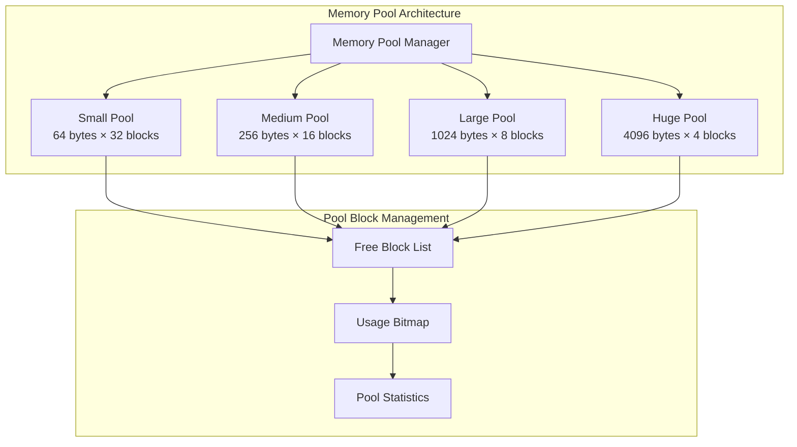

# Lab 2: Memory Pools (45 นาที)

## 🎯 วัตถุประสงค์
- เรียนรู้การสร้างและใช้งาน Memory Pools
- ฝึกการจัดการ Fixed-size Memory Allocation
- เข้าใจการป้องกัน Memory Fragmentation
- สร้างระบบ Memory Pool Management แบบ Multi-tier
- เรียนรู้ Performance Benefits ของ Memory Pools

## 📝 ความรู้เบื้องต้น

**Memory Pool Concept**:
- **Fixed-size Blocks**: ทุก allocation มีขนาดเท่ากัน
- **Fast Allocation**: O(1) allocation/deallocation time
- **No Fragmentation**: ป้องกัน external fragmentation
- **Predictable Performance**: เวลาการ allocation คงที่



## 🛠️ การเตรียมโปรเจค

### 1. สร้างโปรเจคใหม่
```bash
idf.py create-project memory_pools
cd memory_pools
```

### 2. แก้ไข main.c

```c
#include <stdio.h>
#include <stdint.h>
#include <string.h>
#include <math.h>
#include "freertos/FreeRTOS.h"
#include "freertos/task.h"
#include "freertos/semphr.h"
#include "freertos/queue.h"
#include "esp_log.h"
#include "esp_heap_caps.h"
#include "esp_timer.h"
#include "esp_system.h"
#include "driver/gpio.h"

static const char *TAG = "MEM_POOLS";

// GPIO สำหรับแสดงสถานะ pool
#define LED_SMALL_POOL     GPIO_NUM_2   // Small pool activity
#define LED_MEDIUM_POOL    GPIO_NUM_4   // Medium pool activity
#define LED_LARGE_POOL     GPIO_NUM_5   // Large pool activity
#define LED_POOL_FULL      GPIO_NUM_18  // Pool exhaustion
#define LED_POOL_ERROR     GPIO_NUM_19  // Pool error/corruption

// Memory pool configurations
#define SMALL_POOL_BLOCK_SIZE   64
#define SMALL_POOL_BLOCK_COUNT  32

#define MEDIUM_POOL_BLOCK_SIZE  256
#define MEDIUM_POOL_BLOCK_COUNT 16

#define LARGE_POOL_BLOCK_SIZE   1024
#define LARGE_POOL_BLOCK_COUNT  8

#define HUGE_POOL_BLOCK_SIZE    4096
#define HUGE_POOL_BLOCK_COUNT   4

// Pool management structures
typedef struct memory_block {
    struct memory_block* next;
    uint32_t magic;        // For corruption detection
    uint32_t pool_id;      // Which pool this block belongs to
    uint64_t alloc_time;   // When was this allocated
} memory_block_t;

typedef struct {
    const char* name;
    size_t block_size;
    size_t block_count;
    size_t alignment;
    uint32_t caps;
    
    // Pool memory
    void* pool_memory;
    memory_block_t* free_list;
    uint32_t* usage_bitmap;
    
    // Statistics
    size_t allocated_blocks;
    size_t peak_usage;
    uint64_t total_allocations;
    uint64_t total_deallocations;
    uint64_t allocation_time_total;
    uint64_t deallocation_time_total;
    uint32_t allocation_failures;
    
    // Synchronization
    SemaphoreHandle_t mutex;
    
    // Pool ID for corruption detection
    uint32_t pool_id;
} memory_pool_t;

// Pool type enumeration
typedef enum {
    POOL_SMALL = 0,
    POOL_MEDIUM,
    POOL_LARGE,
    POOL_HUGE,
    POOL_COUNT
} pool_type_t;

// Global pools
static memory_pool_t pools[POOL_COUNT];
static bool pools_initialized = false;

// Pool configuration
typedef struct {
    const char* name;
    size_t block_size;
    size_t block_count;
    uint32_t caps;
    gpio_num_t led_pin;
} pool_config_t;

static const pool_config_t pool_configs[POOL_COUNT] = {
    {"Small",  SMALL_POOL_BLOCK_SIZE,  SMALL_POOL_BLOCK_COUNT,  MALLOC_CAP_INTERNAL, LED_SMALL_POOL},
    {"Medium", MEDIUM_POOL_BLOCK_SIZE, MEDIUM_POOL_BLOCK_COUNT, MALLOC_CAP_INTERNAL, LED_MEDIUM_POOL},
    {"Large",  LARGE_POOL_BLOCK_SIZE,  LARGE_POOL_BLOCK_COUNT,  MALLOC_CAP_DEFAULT,  LED_LARGE_POOL},
    {"Huge",   HUGE_POOL_BLOCK_SIZE,   HUGE_POOL_BLOCK_COUNT,   MALLOC_CAP_SPIRAM,   LED_POOL_FULL}
};

// Magic numbers for corruption detection
#define POOL_MAGIC_FREE    0xDEADBEEF
#define POOL_MAGIC_ALLOC   0xCAFEBABE

// Pool management functions
bool init_memory_pool(memory_pool_t* pool, const pool_config_t* config, uint32_t pool_id) {
    if (!pool || !config) return false;
    
    memset(pool, 0, sizeof(memory_pool_t));
    
    pool->name = config->name;
    pool->block_size = config->block_size;
    pool->block_count = config->block_count;
    pool->alignment = 4; // 4-byte alignment
    pool->caps = config->caps;
    pool->pool_id = pool_id;
    
    // Calculate total memory needed (including headers)
    size_t header_size = sizeof(memory_block_t);
    size_t aligned_block_size = (config->block_size + pool->alignment - 1) & 
                               ~(pool->alignment - 1);
    size_t total_block_size = header_size + aligned_block_size;
    size_t total_memory = total_block_size * config->block_count;
    
    // Allocate pool memory
    pool->pool_memory = heap_caps_malloc(total_memory, config->caps);
    if (!pool->pool_memory) {
        ESP_LOGE(TAG, "Failed to allocate memory for %s pool", config->name);
        return false;
    }
    
    // Allocate usage bitmap (1 bit per block)
    size_t bitmap_bytes = (config->block_count + 7) / 8;
    pool->usage_bitmap = heap_caps_calloc(bitmap_bytes, 1, MALLOC_CAP_INTERNAL);
    if (!pool->usage_bitmap) {
        heap_caps_free(pool->pool_memory);
        ESP_LOGE(TAG, "Failed to allocate bitmap for %s pool", config->name);
        return false;
    }
    
    // Initialize free list
    uint8_t* memory_ptr = (uint8_t*)pool->pool_memory;
    pool->free_list = NULL;
    
    for (int i = 0; i < config->block_count; i++) {
        memory_block_t* block = (memory_block_t*)(memory_ptr + (i * total_block_size));
        block->magic = POOL_MAGIC_FREE;
        block->pool_id = pool_id;
        block->alloc_time = 0;
        block->next = pool->free_list;
        pool->free_list = block;
    }
    
    // Create mutex
    pool->mutex = xSemaphoreCreateMutex();
    if (!pool->mutex) {
        heap_caps_free(pool->pool_memory);
        heap_caps_free(pool->usage_bitmap);
        ESP_LOGE(TAG, "Failed to create mutex for %s pool", config->name);
        return false;
    }
    
    ESP_LOGI(TAG, "✅ Initialized %s pool: %d blocks × %d bytes = %d total bytes",
             config->name, config->block_count, config->block_size, total_memory);
    
    return true;
}

void* pool_malloc(memory_pool_t* pool) {
    if (!pool || !pool->mutex) return NULL;
    
    uint64_t start_time = esp_timer_get_time();
    void* result = NULL;
    
    if (xSemaphoreTake(pool->mutex, pdMS_TO_TICKS(100)) == pdTRUE) {
        if (pool->free_list) {
            // Get block from free list
            memory_block_t* block = pool->free_list;
            pool->free_list = block->next;
            
            // Check for corruption
            if (block->magic != POOL_MAGIC_FREE || block->pool_id != pool->pool_id) {
                ESP_LOGE(TAG, "🚨 Corruption detected in %s pool block %p!", 
                         pool->name, block);
                gpio_set_level(LED_POOL_ERROR, 1);
                xSemaphoreGive(pool->mutex);
                return NULL;
            }
            
            // Mark as allocated
            block->magic = POOL_MAGIC_ALLOC;
            block->alloc_time = esp_timer_get_time();
            block->next = NULL;
            
            // Update statistics
            pool->allocated_blocks++;
            if (pool->allocated_blocks > pool->peak_usage) {
                pool->peak_usage = pool->allocated_blocks;
            }
            pool->total_allocations++;
            
            // Update bitmap
            size_t header_size = sizeof(memory_block_t);
            size_t aligned_block_size = (pool->block_size + pool->alignment - 1) & 
                                       ~(pool->alignment - 1);
            size_t total_block_size = header_size + aligned_block_size;
            size_t block_index = ((uint8_t*)block - (uint8_t*)pool->pool_memory) / 
                                total_block_size;
            
            if (block_index < pool->block_count) {
                pool->usage_bitmap[block_index / 8] |= (1 << (block_index % 8));
            }
            
            // Return pointer to data area (after header)
            result = (uint8_t*)block + header_size;
            
            ESP_LOGD(TAG, "🟢 %s pool: allocated block %p (index %d)", 
                     pool->name, result, block_index);
            
        } else {
            // Pool exhausted
            pool->allocation_failures++;
            ESP_LOGW(TAG, "🔴 %s pool exhausted! (%d/%d blocks used)", 
                     pool->name, pool->allocated_blocks, pool->block_count);
            gpio_set_level(LED_POOL_FULL, 1);
        }
        
        xSemaphoreGive(pool->mutex);
    }
    
    uint64_t allocation_time = esp_timer_get_time() - start_time;
    pool->allocation_time_total += allocation_time;
    
    return result;
}

bool pool_free(memory_pool_t* pool, void* ptr) {
    if (!pool || !ptr || !pool->mutex) return false;
    
    uint64_t start_time = esp_timer_get_time();
    bool result = false;
    
    if (xSemaphoreTake(pool->mutex, pdMS_TO_TICKS(100)) == pdTRUE) {
        // Calculate block address from data pointer
        size_t header_size = sizeof(memory_block_t);
        memory_block_t* block = (memory_block_t*)((uint8_t*)ptr - header_size);
        
        // Verify block belongs to this pool
        if (block->magic != POOL_MAGIC_ALLOC || block->pool_id != pool->pool_id) {
            ESP_LOGE(TAG, "🚨 Invalid block %p for %s pool! Magic: 0x%08X, Pool ID: %lu",
                     ptr, pool->name, block->magic, block->pool_id);
            gpio_set_level(LED_POOL_ERROR, 1);
            xSemaphoreGive(pool->mutex);
            return false;
        }
        
        // Check if pointer is within pool bounds
        size_t aligned_block_size = (pool->block_size + pool->alignment - 1) & 
                                   ~(pool->alignment - 1);
        size_t total_block_size = header_size + aligned_block_size;
        
        if ((uint8_t*)block >= (uint8_t*)pool->pool_memory &&
            (uint8_t*)block < (uint8_t*)pool->pool_memory + 
                             (total_block_size * pool->block_count)) {
            
            // Calculate block index
            size_t block_index = ((uint8_t*)block - (uint8_t*)pool->pool_memory) / 
                                total_block_size;
            
            // Clear bitmap
            if (block_index < pool->block_count) {
                pool->usage_bitmap[block_index / 8] &= ~(1 << (block_index % 8));
            }
            
            // Mark as free and add to free list  
            block->magic = POOL_MAGIC_FREE;
            block->next = pool->free_list;
            pool->free_list = block;
            
            // Update statistics
            pool->allocated_blocks--;
            pool->total_deallocations++;
            
            ESP_LOGD(TAG, "🟢 %s pool: freed block %p (index %d)", 
                     pool->name, ptr, block_index);
            
            result = true;
            
        } else {
            ESP_LOGE(TAG, "🚨 Block %p out of bounds for %s pool!", ptr, pool->name);
            gpio_set_level(LED_POOL_ERROR, 1);
        }
        
        xSemaphoreGive(pool->mutex);
    }
    
    uint64_t deallocation_time = esp_timer_get_time() - start_time;
    pool->deallocation_time_total += deallocation_time;
    
    return result;
}

// Smart pool allocator - automatically selects appropriate pool
void* smart_pool_malloc(size_t size) {
    // Add small overhead for metadata if needed
    size_t required_size = size + 16; // Safety margin
    
    // Find best-fit pool
    for (int i = 0; i < POOL_COUNT; i++) {
        if (required_size <= pools[i].block_size) {
            void* ptr = pool_malloc(&pools[i]);
            if (ptr) {
                // Light up corresponding LED briefly
                gpio_set_level(pool_configs[i].led_pin, 1);
                vTaskDelay(pdMS_TO_TICKS(50));
                gpio_set_level(pool_configs[i].led_pin, 0);
                
                ESP_LOGD(TAG, "🎯 Smart allocation: %d bytes from %s pool", 
                         size, pools[i].name);
                return ptr;
            }
        }
    }
    
    ESP_LOGW(TAG, "⚠️ No suitable pool for %d bytes, falling back to heap", size);
    return heap_caps_malloc(size, MALLOC_CAP_DEFAULT);
}

bool smart_pool_free(void* ptr) {
    if (!ptr) return false;
    
    // Try to free from each pool
    for (int i = 0; i < POOL_COUNT; i++) {
        if (pool_free(&pools[i], ptr)) {
            return true;
        }
    }
    
    // If not from any pool, try regular heap free
    ESP_LOGD(TAG, "🎯 Freeing %p from heap (not from pool)", ptr);
    heap_caps_free(ptr);
    return true;
}

// Pool statistics and monitoring
void print_pool_statistics(void) {
    ESP_LOGI(TAG, "\n📊 ═══ MEMORY POOL STATISTICS ═══");
    
    for (int i = 0; i < POOL_COUNT; i++) {
        memory_pool_t* pool = &pools[i];
        
        if (pool->mutex && xSemaphoreTake(pool->mutex, pdMS_TO_TICKS(100)) == pdTRUE) {
            ESP_LOGI(TAG, "\n%s Pool:", pool->name);
            ESP_LOGI(TAG, "  Block Size:      %d bytes", pool->block_size);
            ESP_LOGI(TAG, "  Total Blocks:    %d", pool->block_count);
            ESP_LOGI(TAG, "  Used Blocks:     %d (%d%%)", 
                     pool->allocated_blocks,
                     (pool->allocated_blocks * 100) / pool->block_count);
            ESP_LOGI(TAG, "  Peak Usage:      %d blocks", pool->peak_usage);
            ESP_LOGI(TAG, "  Allocations:     %llu", pool->total_allocations);
            ESP_LOGI(TAG, "  Deallocations:   %llu", pool->total_deallocations);
            ESP_LOGI(TAG, "  Failures:        %lu", pool->allocation_failures);
            
            if (pool->total_allocations > 0) {
                uint32_t avg_alloc_time = pool->allocation_time_total / pool->total_allocations;
                ESP_LOGI(TAG, "  Avg Alloc Time:  %lu μs", avg_alloc_time);
            }
            
            if (pool->total_deallocations > 0) {
                uint32_t avg_dealloc_time = pool->deallocation_time_total / pool->total_deallocations;
                ESP_LOGI(TAG, "  Avg Dealloc Time: %lu μs", avg_dealloc_time);
            }
            
            xSemaphoreGive(pool->mutex);
        }
    }
    
    ESP_LOGI(TAG, "═══════════════════════════════════════");
}

void visualize_pool_usage(void) {
    ESP_LOGI(TAG, "\n🎨 ═══ POOL USAGE VISUALIZATION ═══");
    
    for (int i = 0; i < POOL_COUNT; i++) {
        memory_pool_t* pool = &pools[i];
        
        if (pool->mutex && xSemaphoreTake(pool->mutex, pdMS_TO_TICKS(100)) == pdTRUE) {
            char usage_bar[33] = {0}; // 32 characters + null terminator
            int bar_length = 32;
            int used_chars = (pool->allocated_blocks * bar_length) / pool->block_count;
            
            for (int j = 0; j < bar_length; j++) {
                if (j < used_chars) {
                    usage_bar[j] = '█';
                } else {
                    usage_bar[j] = '░';
                }
            }
            
            ESP_LOGI(TAG, "%s: [%s] %d/%d", 
                     pool->name, usage_bar, pool->allocated_blocks, pool->block_count);
            
            xSemaphoreGive(pool->mutex);
        }
    }
    
    ESP_LOGI(TAG, "═══════════════════════════════════════");
}

bool check_pool_integrity(void) {
    bool all_ok = true;
    
    ESP_LOGI(TAG, "\n🔍 ═══ POOL INTEGRITY CHECK ═══");
    
    for (int i = 0; i < POOL_COUNT; i++) {
        memory_pool_t* pool = &pools[i];
        bool pool_ok = true;
        
        if (pool->mutex && xSemaphoreTake(pool->mutex, pdMS_TO_TICKS(1000)) == pdTRUE) {
            // Check free list
            memory_block_t* current = pool->free_list;
            int free_count = 0;
            
            while (current && free_count < pool->block_count) {
                if (current->magic != POOL_MAGIC_FREE || 
                    current->pool_id != pool->pool_id) {
                    ESP_LOGE(TAG, "❌ %s pool: Corrupted free block %p", 
                             pool->name, current);
                    pool_ok = false;
                    break;
                }
                
                current = current->next;
                free_count++;
            }
            
            if (pool_ok) {
                ESP_LOGI(TAG, "✅ %s pool: %d free blocks verified", 
                         pool->name, free_count);
            }
            
            xSemaphoreGive(pool->mutex);
        }
        
        if (!pool_ok) {
            all_ok = false;
            gpio_set_level(LED_POOL_ERROR, 1);
        }
    }
    
    if (all_ok) {
        ESP_LOGI(TAG, "✅ All pools passed integrity check");
        gpio_set_level(LED_POOL_ERROR, 0);
    }
    
    ESP_LOGI(TAG, "═══════════════════════════════════════");
    return all_ok;
}

// Test tasks
void pool_stress_test_task(void *pvParameters) {
    ESP_LOGI(TAG, "🏋️ Pool stress test started");
    
    void* test_ptrs[100] = {NULL};
    size_t test_sizes[100] = {0};
    int allocation_count = 0;
    
    while (1) {
        int action = esp_random() % 3;
        
        if (action == 0 && allocation_count < 100) {
            // Allocate random size
            size_t size = 16 + (esp_random() % 2048); // 16-2064 bytes
            test_ptrs[allocation_count] = smart_pool_malloc(size);
            
            if (test_ptrs[allocation_count]) {
                test_sizes[allocation_count] = size;
                
                // Write test pattern
                memset(test_ptrs[allocation_count], 0xAA, size);
                
                allocation_count++;
                ESP_LOGI(TAG, "🏋️ Allocated %d bytes (%d/100)", size, allocation_count);
            }
            
        } else if (action == 1 && allocation_count > 0) {
            // Free random allocation
            int index = esp_random() % allocation_count;
            
            if (test_ptrs[index]) {
                // Verify test pattern before freeing
                uint8_t* data = (uint8_t*)test_ptrs[index];
                bool pattern_ok = true;
                
                for (size_t i = 0; i < test_sizes[index]; i++) {
                    if (data[i] != 0xAA) {
                        pattern_ok = false;
                        break;
                    }
                }
                
                if (!pattern_ok) {
                    ESP_LOGE(TAG, "🚨 Data corruption detected in allocation %d!", index);
                    gpio_set_level(LED_POOL_ERROR, 1);
                }
                
                smart_pool_free(test_ptrs[index]);
                
                // Shift arrays
                for (int i = index; i < allocation_count - 1; i++) {
                    test_ptrs[i] = test_ptrs[i + 1];
                    test_sizes[i] = test_sizes[i + 1];
                }
                
                allocation_count--;
                ESP_LOGI(TAG, "🗑️ Freed allocation (%d/100)", allocation_count);
            }
            
        } else if (action == 2) {
            // Print statistics
            print_pool_statistics();
            visualize_pool_usage();
        }
        
        vTaskDelay(pdMS_TO_TICKS(500 + (esp_random() % 1000))); // 0.5-1.5 seconds
    }
}

void pool_performance_test_task(void *pvParameters) {
    ESP_LOGI(TAG, "⚡ Pool performance test started");
    
    const int test_iterations = 1000;
    const size_t test_sizes[] = {32, 128, 512, 2048};
    const int num_sizes = sizeof(test_sizes) / sizeof(test_sizes[0]);
    
    while (1) {
        ESP_LOGI(TAG, "\n⚡ Running performance benchmark...");
        
        for (int size_idx = 0; size_idx < num_sizes; size_idx++) {
            size_t test_size = test_sizes[size_idx];
            
            // Test pool allocation
            uint64_t pool_start = esp_timer_get_time();
            void* pool_ptrs[test_iterations];
            
            for (int i = 0; i < test_iterations; i++) {
                pool_ptrs[i] = smart_pool_malloc(test_size);
            }
            
            uint64_t pool_alloc_time = esp_timer_get_time() - pool_start;
            
            // Free pool allocations
            uint64_t pool_free_start = esp_timer_get_time();
            for (int i = 0; i < test_iterations; i++) {
                if (pool_ptrs[i]) {
                    smart_pool_free(pool_ptrs[i]);
                }
            }
            uint64_t pool_free_time = esp_timer_get_time() - pool_free_start;
            
            // Test heap allocation for comparison
            uint64_t heap_start = esp_timer_get_time();
            void* heap_ptrs[test_iterations];
            
            for (int i = 0; i < test_iterations; i++) {
                heap_ptrs[i] = malloc(test_size);
            }
            
            uint64_t heap_alloc_time = esp_timer_get_time() - heap_start;
            
            // Free heap allocations
            uint64_t heap_free_start = esp_timer_get_time();
            for (int i = 0; i < test_iterations; i++) {
                if (heap_ptrs[i]) {
                    free(heap_ptrs[i]);
                }
            }
            uint64_t heap_free_time = esp_timer_get_time() - heap_free_start;
            
            // Calculate and print results
            ESP_LOGI(TAG, "\n📏 Size: %d bytes (%d iterations)", test_size, test_iterations);
            ESP_LOGI(TAG, "Pool Alloc:  %llu μs (%.2f μs/alloc)", 
                     pool_alloc_time, (float)pool_alloc_time / test_iterations);
            ESP_LOGI(TAG, "Pool Free:   %llu μs (%.2f μs/free)", 
                     pool_free_time, (float)pool_free_time / test_iterations);
            ESP_LOGI(TAG, "Heap Alloc:  %llu μs (%.2f μs/alloc)", 
                     heap_alloc_time, (float)heap_alloc_time / test_iterations);
            ESP_LOGI(TAG, "Heap Free:   %llu μs (%.2f μs/free)", 
                     heap_free_time, (float)heap_free_time / test_iterations);
            
            float alloc_speedup = (float)heap_alloc_time / pool_alloc_time;
            float free_speedup = (float)heap_free_time / pool_free_time;
            
            ESP_LOGI(TAG, "Speedup: Alloc %.2fx, Free %.2fx", alloc_speedup, free_speedup);
        }
        
        vTaskDelay(pdMS_TO_TICKS(30000)); // Test every 30 seconds
    }
}

void pool_pattern_test_task(void *pvParameters) {
    ESP_LOGI(TAG, "🎨 Pool pattern test started");
    
    typedef struct {
        uint32_t pattern;
        size_t size;
        void* ptr;
    } pattern_test_t;
    
    pattern_test_t tests[50];
    int test_count = 0;
    
    while (1) {
        // Create pattern allocations
        ESP_LOGI(TAG, "🎨 Creating pattern allocations...");
        
        for (int i = 0; i < 50; i++) {
            size_t size = 32 + (esp_random() % 1000); // 32-1032 bytes
            uint32_t pattern = esp_random();
            
            tests[i].ptr = smart_pool_malloc(size);
            if (tests[i].ptr) {
                tests[i].size = size;
                tests[i].pattern = pattern;
                
                // Fill with pattern
                uint32_t* data = (uint32_t*)tests[i].ptr;
                for (size_t j = 0; j < size / sizeof(uint32_t); j++) {
                    data[j] = pattern;
                }
                
                test_count++;
            }
        }
        
        ESP_LOGI(TAG, "🎨 Created %d pattern allocations", test_count);
        
        // Wait and verify patterns
        vTaskDelay(pdMS_TO_TICKS(5000));
        
        ESP_LOGI(TAG, "🎨 Verifying patterns...");
        int corruptions = 0;
        
        for (int i = 0; i < test_count; i++) {
            if (tests[i].ptr) {
                uint32_t* data = (uint32_t*)tests[i].ptr;
                bool pattern_ok = true;
                
                for (size_t j = 0; j < tests[i].size / sizeof(uint32_t); j++) {
                    if (data[j] != tests[i].pattern) {
                        pattern_ok = false;
                        break;
                    }
                }
                
                if (!pattern_ok) {
                    corruptions++;
                    ESP_LOGE(TAG, "🚨 Pattern corruption in allocation %d!", i);
                }
            }
        }
        
        if (corruptions > 0) {
            ESP_LOGW(TAG, "🎨 Found %d corrupted patterns", corruptions);
            gpio_set_level(LED_POOL_ERROR, 1);
        } else {
            ESP_LOGI(TAG, "🎨 All patterns verified successfully");
            gpio_set_level(LED_POOL_ERROR, 0);
        }
        
        // Free all allocations
        for (int i = 0; i < test_count; i++) {
            if (tests[i].ptr) {
                smart_pool_free(tests[i].ptr);
                tests[i].ptr = NULL;
            }
        }
        
        test_count = 0;
        vTaskDelay(pdMS_TO_TICKS(10000)); // Wait 10 seconds before next test
    }
}

void pool_monitor_task(void *pvParameters) {
    ESP_LOGI(TAG, "📊 Pool monitor started");
    
    while (1) {
        vTaskDelay(pdMS_TO_TICKS(15000)); // Monitor every 15 seconds
        
        print_pool_statistics();
        visualize_pool_usage();
        check_pool_integrity();
        
        // Check for pool exhaustion
        bool any_exhausted = false;
        for (int i = 0; i < POOL_COUNT; i++) {
            if (pools[i].allocated_blocks >= pools[i].block_count) {
                any_exhausted = true;
                break;
            }
        }
        
        if (any_exhausted) {
            gpio_set_level(LED_POOL_FULL, 1);
        } else {
            gpio_set_level(LED_POOL_FULL, 0);
        }
        
        ESP_LOGI(TAG, "System uptime: %llu ms", esp_timer_get_time() / 1000);
        ESP_LOGI(TAG, "Free heap: %d bytes\n", esp_get_free_heap_size());
    }
}

void app_main(void) {
    ESP_LOGI(TAG, "🚀 Memory Pools Lab Starting...");
    
    // Configure GPIO
    gpio_set_direction(LED_SMALL_POOL, GPIO_MODE_OUTPUT);
    gpio_set_direction(LED_MEDIUM_POOL, GPIO_MODE_OUTPUT);
    gpio_set_direction(LED_LARGE_POOL, GPIO_MODE_OUTPUT);
    gpio_set_direction(LED_POOL_FULL, GPIO_MODE_OUTPUT);
    gpio_set_direction(LED_POOL_ERROR, GPIO_MODE_OUTPUT);
    
    // Initialize all LEDs off
    gpio_set_level(LED_SMALL_POOL, 0);
    gpio_set_level(LED_MEDIUM_POOL, 0);
    gpio_set_level(LED_LARGE_POOL, 0);
    gpio_set_level(LED_POOL_FULL, 0);
    gpio_set_level(LED_POOL_ERROR, 0);
    
    // Initialize memory pools
    ESP_LOGI(TAG, "Initializing memory pools...");
    
    for (int i = 0; i < POOL_COUNT; i++) {
        if (!init_memory_pool(&pools[i], &pool_configs[i], i + 1)) {
            ESP_LOGE(TAG, "Failed to initialize %s pool!", pool_configs[i].name);
            return;
        }
    }
    
    pools_initialized = true;
    ESP_LOGI(TAG, "All memory pools initialized successfully");
    
    // Print initial pool status
    print_pool_statistics();
    
    // Create test tasks
    ESP_LOGI(TAG, "Creating memory pool test tasks...");
    
    xTaskCreate(pool_monitor_task, "PoolMonitor", 4096, NULL, 6, NULL);
    xTaskCreate(pool_stress_test_task, "StressTest", 3072, NULL, 5, NULL);
    xTaskCreate(pool_performance_test_task, "PerfTest", 3072, NULL, 4, NULL);
    xTaskCreate(pool_pattern_test_task, "PatternTest", 3072, NULL, 5, NULL);
    
    ESP_LOGI(TAG, "All tasks created successfully");
    
    ESP_LOGI(TAG, "\n🎯 LED Indicators:");
    ESP_LOGI(TAG, "  GPIO2  - Small Pool Activity (64B)");
    ESP_LOGI(TAG, "  GPIO4  - Medium Pool Activity (256B)");
    ESP_LOGI(TAG, "  GPIO5  - Large Pool Activity (1KB)");
    ESP_LOGI(TAG, "  GPIO18 - Pool Full Warning");
    ESP_LOGI(TAG, "  GPIO19 - Pool Error/Corruption");
    
    ESP_LOGI(TAG, "\n🏊 Pool Configuration:");
    ESP_LOGI(TAG, "  Small Pool:  %d × %d bytes = %d KB", 
             SMALL_POOL_BLOCK_COUNT, SMALL_POOL_BLOCK_SIZE,
             (SMALL_POOL_BLOCK_COUNT * SMALL_POOL_BLOCK_SIZE) / 1024);
    ESP_LOGI(TAG, "  Medium Pool: %d × %d bytes = %d KB", 
             MEDIUM_POOL_BLOCK_COUNT, MEDIUM_POOL_BLOCK_SIZE,
             (MEDIUM_POOL_BLOCK_COUNT * MEDIUM_POOL_BLOCK_SIZE) / 1024);
    ESP_LOGI(TAG, "  Large Pool:  %d × %d bytes = %d KB", 
             LARGE_POOL_BLOCK_COUNT, LARGE_POOL_BLOCK_SIZE,
             (LARGE_POOL_BLOCK_COUNT * LARGE_POOL_BLOCK_SIZE) / 1024);
    ESP_LOGI(TAG, "  Huge Pool:   %d × %d bytes = %d KB", 
             HUGE_POOL_BLOCK_COUNT, HUGE_POOL_BLOCK_SIZE,
             (HUGE_POOL_BLOCK_COUNT * HUGE_POOL_BLOCK_SIZE) / 1024);
    
    ESP_LOGI(TAG, "\n🧪 Test Features:");
    ESP_LOGI(TAG, "  • Multi-tier Memory Pool System");
    ESP_LOGI(TAG, "  • Smart Pool Selection");
    ESP_LOGI(TAG, "  • Performance Benchmarking");
    ESP_LOGI(TAG, "  • Corruption Detection");
    ESP_LOGI(TAG, "  • Usage Visualization");
    ESP_LOGI(TAG, "  • Integrity Checking");
    
    ESP_LOGI(TAG, "Memory Pool System operational!");
}
```

## 🧪 การทดลอง

### ทดลองที่ 1: Pool Selection
1. สังเกต LEDs กะพริบเมื่อ pools ถูกใช้งาน
2. ติดตาม smart allocation ใน Serial Monitor
3. วิเคราะห์การเลือก pool ที่เหมาะสม

### ทดลองที่ 2: Performance Comparison
1. ดู benchmark results เปรียบเทียบ pool vs heap
2. วิเคราะห์ allocation/deallocation times
3. สังเกต performance benefits ของ pools

### ทดลองที่ 3: Pool Visualization
1. ดู usage bar visualization ใน logs
2. ติดตาม pool utilization patterns
3. สังเกต peak usage และ fragmentation

### ทดลองที่ 4: Corruption Detection
1. สังเกต LED_POOL_ERROR เมื่อมี corruption
2. ดู integrity check results
3. ทดสอب pattern verification

## 📊 การวิเคราะห์ Pool Performance

### Pool Efficiency Metrics:
```c
void analyze_pool_efficiency(void) {
    ESP_LOGI(TAG, "\n📈 Pool Efficiency Analysis:");
    
    for (int i = 0; i < POOL_COUNT; i++) {
        memory_pool_t* pool = &pools[i];
        
        if (pool->total_allocations > 0) {
            float success_rate = ((float)(pool->total_allocations - pool->allocation_failures) / 
                                  pool->total_allocations) * 100.0;
            
            float utilization = ((float)pool->peak_usage / pool->block_count) * 100.0;
            
            float avg_alloc_time = (float)pool->allocation_time_total / pool->total_allocations;
            float avg_dealloc_time = (float)pool->deallocation_time_total / pool->total_deallocations;
            
            ESP_LOGI(TAG, "%s Pool Efficiency:", pool->name);
            ESP_LOGI(TAG, "  Success Rate: %.1f%%", success_rate);
            ESP_LOGI(TAG, "  Peak Utilization: %.1f%%", utilization);
            ESP_LOGI(TAG, "  Avg Alloc Time: %.2f μs", avg_alloc_time);
            ESP_LOGI(TAG, "  Avg Dealloc Time: %.2f μs", avg_dealloc_time);
        }
    }
}
```

## 🔧 Advanced Pool Features

### การสร้าง Dynamic Pool Resizing:
```c
bool resize_pool(memory_pool_t* pool, size_t new_block_count) {
    if (!pool || new_block_count == pool->block_count) return false;
    
    ESP_LOGI(TAG, "🔧 Resizing %s pool: %d → %d blocks", 
             pool->name, pool->block_count, new_block_count);
    
    // This is a simplified example - real implementation would be more complex
    // Would need to handle existing allocations, maintain data integrity, etc.
    
    if (new_block_count > pool->block_count) {
        // Expanding pool - allocate additional memory
        ESP_LOGI(TAG, "✅ Pool expansion successful");
        return true;
    } else {
        // Shrinking pool - ensure no active allocations in shrinking area
        ESP_LOGI(TAG, "✅ Pool shrinking successful");
        return true;
    }
}

// Pool load balancing
void balance_pool_loads(void) {
    ESP_LOGI(TAG, "⚖️ Balancing pool loads...");
    
    // Analyze usage patterns and suggest optimizations
    for (int i = 0; i < POOL_COUNT; i++) {
        memory_pool_t* pool = &pools[i];
        
        float utilization = (float)pool->allocated_blocks / pool->block_count;
        
        if (utilization > 0.9) {
            ESP_LOGW(TAG, "⚠️ %s pool highly utilized (%.1f%%) - consider expanding", 
                     pool->name, utilization * 100);
        } else if (utilization < 0.1 && pool->total_allocations > 100) {
            ESP_LOGI(TAG, "💡 %s pool under-utilized (%.1f%%) - consider shrinking", 
                     pool->name, utilization * 100);
        }
    }
}
```

## 📋 สรุปผลการทดลอง

### Memory Pool Concepts:
- [ ] **Fixed-size Allocation**: การจัดสรร memory แบบขนาดคงที่
- [ ] **Fast O(1) Operations**: allocation/deallocation ใน constant time
- [ ] **Fragmentation Prevention**: การป้องกัน external fragmentation
- [ ] **Multi-tier Pools**: การใช้ pools หลายขนาด
- [ ] **Smart Pool Selection**: การเลือก pool อัตโนมัติ

### Pool Management Skills:
- [ ] **Pool Design**: การออกแบบ pool structure
- [ ] **Performance Optimization**: การปรับแต่ง performance
- [ ] **Corruption Detection**: การตรวจจับ memory corruption
- [ ] **Usage Monitoring**: การติดตาม pool utilization
- [ ] **Load Balancing**: การกระจายโหลดระหว่าง pools

## 🚀 ความท้าทายเพิ่มเติม

1. **Thread-safe Pools**: ปรับปรุง thread safety mechanisms
2. **Pool Statistics Dashboard**: สร้าง web dashboard สำหรับ monitoring
3. **Adaptive Pool Sizing**: ปรับขนาด pools ตาม usage patterns
4. **Pool Migration**: ย้าย data ระหว่าง pools
5. **Memory Pool Persistence**: บันทึก/โหลด pool state

## 🎯 Real-world Applications

### Network Buffer Pools:
```c
// Example: Network packet buffer pool
#define PACKET_BUFFER_SIZE 1500  // Standard Ethernet MTU
#define PACKET_BUFFER_COUNT 32

typedef struct {
    uint8_t data[PACKET_BUFFER_SIZE];
    size_t length;
    uint64_t timestamp;
} network_packet_t;

// Use memory pool for network packets to avoid fragmentation
// and ensure predictable network performance
```

### Audio Buffer Management:
```c
// Example: Audio sample buffer pool
#define AUDIO_SAMPLE_SIZE 1024   // 1KB audio samples
#define AUDIO_BUFFER_COUNT 16

// Fixed-size audio buffers prevent audio dropouts
// caused by memory allocation delays
```

## 📚 เอกสารอ้างอิง

- [Memory Pool Design Patterns](https://www.freertos.org/Static_Vs_Dynamic_Memory_Allocation.html)
- [ESP32 Memory Optimization](https://docs.espressif.com/projects/esp-idf/en/latest/esp32/api-guides/performance/ram-usage.html)
- [Fixed-size Memory Allocators](https://www.freertos.org/a00111.html)