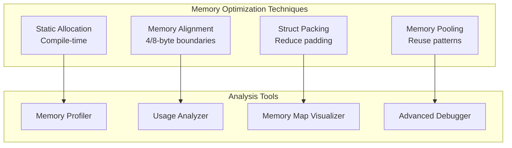

# Lab 3: Memory Optimization (30 นาที)

## 🎯 วัตถุประสงค์
- เรียนรู้เทคนิค Memory Optimization ขั้นสูง
- ฝึกการใช้งาน Static vs Dynamic Memory Allocation
- เข้าใช่ Memory Alignment และ Padding Optimization
- สร้างระบบ Memory Usage Profiling และ Analysis
- เรียนรู้ Advanced Memory Debugging Techniques

## 📝 ความรู้เบื้องต้น

**Memory Optimization Strategies**:
- **Static Allocation**: ใช้หน่วยความจำที่จองไว้ล่วงหน้า
- **Memory Alignment**: จัดการ alignment เพื่อประสิทธิภาพ
- **Padding Reduction**: ลด memory waste จาก struct padding
- **Memory Mapping**: จัดการ memory regions อย่างมีประสิทธิภาพ



## 🛠️ การเตรียมโปรเจค

### 1. สร้างโปรเจคใหม่
```bash
cd ~/esp
idf.py create-project memory_optimization
cd memory_optimization
```

### 2. แก้ไข main.c

```c
#include <stdio.h>
#include <stdint.h>
#include <string.h>
#include <math.h>
#include "freertos/FreeRTOS.h"
#include "freertos/task.h"
#include "freertos/semphr.h"
#include "freertos/queue.h"
#include "esp_log.h"
#include "esp_heap_caps.h"
#include "esp_timer.h"
#include "esp_system.h"
#include "esp_attr.h"
#include "driver/gpio.h"
#include "soc/soc_memory_layout.h"

static const char *TAG = "MEM_OPT";

// GPIO สำหรับแสดงสถานะ optimization
#define LED_STATIC_ALLOC    GPIO_NUM_2   // Static allocation active
#define LED_ALIGNMENT_OPT   GPIO_NUM_4   // Alignment optimization
#define LED_PACKING_OPT     GPIO_NUM_5   // Struct packing optimization
#define LED_MEMORY_SAVING   GPIO_NUM_18  // Memory saving achieved
#define LED_OPTIMIZATION    GPIO_NUM_19  // Optimization in progress

// Memory alignment utilities
#define ALIGN_UP(num, align) (((num) + (align) - 1) & ~((align) - 1))
#define ALIGN_DOWN(num, align) ((num) & ~((align) - 1))
#define IS_ALIGNED(ptr, align) (((uintptr_t)(ptr) & ((align) - 1)) == 0)

// Static memory pools for optimization demonstration
#define STATIC_BUFFER_SIZE   4096
#define STATIC_BUFFER_COUNT  8
#define TASK_STACK_SIZE      2048
#define MAX_TASKS            4

// Static allocations
static uint8_t static_buffers[STATIC_BUFFER_COUNT][STATIC_BUFFER_SIZE] __attribute__((aligned(4)));
static bool static_buffer_used[STATIC_BUFFER_COUNT] = {false};
static SemaphoreHandle_t static_buffer_mutex;

// Static task stacks
static StackType_t task_stacks[MAX_TASKS][TASK_STACK_SIZE] __attribute__((aligned(8)));
static StaticTask_t task_buffers[MAX_TASKS];
static int next_task_slot = 0;

// Memory optimization statistics
typedef struct {
    size_t static_allocations;
    size_t dynamic_allocations;
    size_t alignment_optimizations;
    size_t packing_optimizations;
    size_t memory_saved_bytes;
    size_t fragmentation_reduced;
    uint64_t allocation_time_saved;
} optimization_stats_t;

static optimization_stats_t opt_stats = {0};

// Struct examples for optimization demonstration
// Bad alignment example (wasteful)
typedef struct {
    char a;      // 1 byte
    int b;       // 4 bytes (3 bytes padding before this)
    char c;      // 1 byte
    double d;    // 8 bytes (7 bytes padding before this)
    char e;      // 1 byte (7 bytes padding after this)
} __attribute__((packed)) bad_struct_t; // Force packing to see original size

// Good alignment example (optimized)
typedef struct {
    double d;    // 8 bytes (largest first)
    int b;       // 4 bytes
    char a;      // 1 byte
    char c;      // 1 byte  
    char e;      // 1 byte
    // 1 byte padding for alignment
} __attribute__((aligned(8))) good_struct_t;

// Memory region analysis
typedef struct {
    const char* name;
    void* start_addr;
    size_t size;
    uint32_t caps;
    bool is_executable;
    bool is_dma_capable;
} memory_region_info_t;

// Static buffer management
void* allocate_static_buffer(void) {
    void* buffer = NULL;
    
    if (static_buffer_mutex && xSemaphoreTake(static_buffer_mutex, pdMS_TO_TICKS(100))) {
        for (int i = 0; i < STATIC_BUFFER_COUNT; i++) {
            if (!static_buffer_used[i]) {
                static_buffer_used[i] = true;
                buffer = static_buffers[i];
                opt_stats.static_allocations++;
                ESP_LOGD(TAG, "🟢 Static buffer %d allocated: %p", i, buffer);
                gpio_set_level(LED_STATIC_ALLOC, 1);
                break;
            }
        }
        xSemaphoreGive(static_buffer_mutex);
    }
    
    return buffer;
}

void free_static_buffer(void* buffer) {
    if (!buffer || !static_buffer_mutex) return;
    
    if (xSemaphoreTake(static_buffer_mutex, pdMS_TO_TICKS(100))) {
        for (int i = 0; i < STATIC_BUFFER_COUNT; i++) {
            if (buffer == static_buffers[i] && static_buffer_used[i]) {
                static_buffer_used[i] = false;
                ESP_LOGD(TAG, "🗑️ Static buffer %d freed: %p", i, buffer);
                break;
            }
        }
        
        // Check if any static buffers still in use
        bool any_used = false;
        for (int i = 0; i < STATIC_BUFFER_COUNT; i++) {
            if (static_buffer_used[i]) {
                any_used = true;
                break;
            }
        }
        
        if (!any_used) {
            gpio_set_level(LED_STATIC_ALLOC, 0);
        }
        
        xSemaphoreGive(static_buffer_mutex);
    }
}

// Memory alignment optimization
void* aligned_malloc(size_t size, size_t alignment) {
    if (alignment == 0 || (alignment & (alignment - 1)) != 0) {
        ESP_LOGE(TAG, "Invalid alignment: %d (must be power of 2)", alignment);
        return NULL;
    }
    
    // Allocate extra space for alignment
    size_t total_size = size + alignment + sizeof(void*);
    void* raw_ptr = malloc(total_size);
    
    if (!raw_ptr) {
        return NULL;
    }
    
    // Calculate aligned address
    uintptr_t raw_addr = (uintptr_t)raw_ptr;
    uintptr_t aligned_addr = ALIGN_UP(raw_addr + sizeof(void*), alignment);
    void* aligned_ptr = (void*)aligned_addr;
    
    // Store original pointer before aligned address
    void** orig_ptr_storage = (void**)aligned_addr - 1;
    *orig_ptr_storage = raw_ptr;
    
    opt_stats.alignment_optimizations++;
    opt_stats.dynamic_allocations++;
    
    ESP_LOGD(TAG, "🎯 Aligned malloc: %d bytes, %d-byte aligned at %p", 
             size, alignment, aligned_ptr);
    
    gpio_set_level(LED_ALIGNMENT_OPT, 1);
    vTaskDelay(pdMS_TO_TICKS(50));
    gpio_set_level(LED_ALIGNMENT_OPT, 0);
    
    return aligned_ptr;
}

void aligned_free(void* aligned_ptr) {
    if (!aligned_ptr) return;
    
    // Retrieve original pointer
    void** orig_ptr_storage = (void**)aligned_ptr - 1;
    void* orig_ptr = *orig_ptr_storage;
    
    ESP_LOGD(TAG, "🗑️ Aligned free: %p (original: %p)", aligned_ptr, orig_ptr);
    free(orig_ptr);
}

// Struct packing optimization demonstration
void demonstrate_struct_optimization(void) {
    ESP_LOGI(TAG, "\n🏗️ ═══ STRUCT OPTIMIZATION DEMO ═══");
    
    // Create instances
    bad_struct_t bad_example;
    good_struct_t good_example;
    
    // Fill with data
    bad_example.a = 'A';
    bad_example.b = 0x12345678;
    bad_example.c = 'C';
    bad_example.d = 3.14159;
    bad_example.e = 'E';
    
    good_example.a = 'A';
    good_example.b = 0x12345678;
    good_example.c = 'C';
    good_example.d = 3.14159;
    good_example.e = 'E';
    
    ESP_LOGI(TAG, "Bad struct size:  %d bytes", sizeof(bad_struct_t));
    ESP_LOGI(TAG, "Good struct size: %d bytes", sizeof(good_struct_t));
    ESP_LOGI(TAG, "Memory saved:     %d bytes per instance", 
             sizeof(bad_struct_t) - sizeof(good_struct_t));
    
    // Calculate savings for arrays
    const int array_size = 1000;
    size_t bad_array_size = sizeof(bad_struct_t) * array_size;
    size_t good_array_size = sizeof(good_struct_t) * array_size;
    size_t array_savings = bad_array_size - good_array_size;
    
    ESP_LOGI(TAG, "Array of %d elements:", array_size);
    ESP_LOGI(TAG, "  Bad alignment:  %d bytes", bad_array_size);
    ESP_LOGI(TAG, "  Good alignment: %d bytes", good_array_size);
    ESP_LOGI(TAG, "  Total saved:    %d bytes (%.1f KB)", 
             array_savings, array_savings / 1024.0);
    
    opt_stats.packing_optimizations++;
    opt_stats.memory_saved_bytes += array_savings;
    
    gpio_set_level(LED_PACKING_OPT, 1);
    vTaskDelay(pdMS_TO_TICKS(100));
    gpio_set_level(LED_PACKING_OPT, 0);
    
    ESP_LOGI(TAG, "═══════════════════════════════════════");
}

// Memory region analysis
void analyze_memory_regions(void) {
    ESP_LOGI(TAG, "\n🗺️ ═══ MEMORY REGION ANALYSIS ═══");
    
    // Analyze different memory types
    const memory_region_info_t regions[] = {
        {"Internal RAM", NULL, 0, MALLOC_CAP_INTERNAL, false, true},
        {"SPIRAM", NULL, 0, MALLOC_CAP_SPIRAM, false, false},
        {"DMA Capable", NULL, 0, MALLOC_CAP_DMA, false, true},
        {"Executable", NULL, 0, MALLOC_CAP_EXEC, true, false},
        {"32-bit Aligned", NULL, 0, MALLOC_CAP_32BIT, false, true}
    };
    
    for (int i = 0; i < sizeof(regions) / sizeof(regions[0]); i++) {
        const memory_region_info_t* region = &regions[i];
        
        size_t free_size = heap_caps_get_free_size(region->caps);
        size_t largest_block = heap_caps_get_largest_free_block(region->caps);
        size_t total_size = heap_caps_get_total_size(region->caps);
        
        if (total_size > 0) {
            float utilization = ((float)(total_size - free_size) / total_size) * 100.0;
            float fragmentation = 0.0;
            
            if (free_size > 0) {
                fragmentation = (1.0 - ((float)largest_block / free_size)) * 100.0;
            }
            
            ESP_LOGI(TAG, "%s:", region->name);
            ESP_LOGI(TAG, "  Total:         %d bytes (%.1f KB)", total_size, total_size / 1024.0);
            ESP_LOGI(TAG, "  Free:          %d bytes (%.1f KB)", free_size, free_size / 1024.0);
            ESP_LOGI(TAG, "  Largest Block: %d bytes", largest_block);
            ESP_LOGI(TAG, "  Utilization:   %.1f%%", utilization);
            ESP_LOGI(TAG, "  Fragmentation: %.1f%%", fragmentation);
            ESP_LOGI(TAG, "  Executable:    %s", region->is_executable ? "Yes" : "No");
            ESP_LOGI(TAG, "  DMA Capable:   %s", region->is_dma_capable ? "Yes" : "No");
            ESP_LOGI(TAG, "");
        }
    }
    
    ESP_LOGI(TAG, "═══════════════════════════════════════");
}

// Memory access pattern optimization
void optimize_memory_access_patterns(void) {
    ESP_LOGI(TAG, "\n⚡ ═══ MEMORY ACCESS OPTIMIZATION ═══");
    
    const size_t array_size = 1024;
    const int iterations = 1000;
    
    // Test 1: Sequential vs Random access
    uint32_t* test_array = aligned_malloc(array_size * sizeof(uint32_t), 32);
    if (!test_array) {
        ESP_LOGE(TAG, "Failed to allocate test array");
        return;
    }
    
    // Initialize array
    for (size_t i = 0; i < array_size; i++) {
        test_array[i] = i;
    }
    
    // Sequential access test
    uint64_t start_time = esp_timer_get_time();
    volatile uint32_t sum = 0;
    
    for (int iter = 0; iter < iterations; iter++) {
        for (size_t i = 0; i < array_size; i++) {
            sum += test_array[i];
        }
    }
    
    uint64_t sequential_time = esp_timer_get_time() - start_time;
    
    // Random access test
    start_time = esp_timer_get_time();
    sum = 0;
    
    for (int iter = 0; iter < iterations; iter++) {
        for (size_t i = 0; i < array_size; i++) {
            size_t random_index = esp_random() % array_size;
            sum += test_array[random_index];
        }
    }
    
    uint64_t random_time = esp_timer_get_time() - start_time;
    
    ESP_LOGI(TAG, "Access Pattern Performance (%d iterations):", iterations);
    ESP_LOGI(TAG, "  Sequential: %llu μs", sequential_time);
    ESP_LOGI(TAG, "  Random:     %llu μs", random_time);
    ESP_LOGI(TAG, "  Speedup:    %.2fx (sequential vs random)", 
             (float)random_time / sequential_time);
    
    aligned_free(test_array);
    
    // Test 2: Cache-friendly vs Cache-unfriendly access
    const size_t matrix_size = 128;
    uint32_t* matrix = aligned_malloc(matrix_size * matrix_size * sizeof(uint32_t), 64);
    
    if (matrix) {
        // Row-major access (cache-friendly)
        start_time = esp_timer_get_time();
        sum = 0;
        
        for (size_t row = 0; row < matrix_size; row++) {
            for (size_t col = 0; col < matrix_size; col++) {
                sum += matrix[row * matrix_size + col];
            }
        }
        
        uint64_t row_major_time = esp_timer_get_time() - start_time;
        
        // Column-major access (cache-unfriendly)
        start_time = esp_timer_get_time();
        sum = 0;
        
        for (size_t col = 0; col < matrix_size; col++) {
            for (size_t row = 0; row < matrix_size; row++) {
                sum += matrix[row * matrix_size + col];
            }
        }
        
        uint64_t col_major_time = esp_timer_get_time() - start_time;
        
        ESP_LOGI(TAG, "Matrix Access (%dx%d):", matrix_size, matrix_size);
        ESP_LOGI(TAG, "  Row-major:    %llu μs (cache-friendly)", row_major_time);
        ESP_LOGI(TAG, "  Column-major: %llu μs (cache-unfriendly)", col_major_time);
        ESP_LOGI(TAG, "  Performance:  %.2fx better with row-major", 
                 (float)col_major_time / row_major_time);
        
        aligned_free(matrix);
    }
    
    ESP_LOGI(TAG, "═══════════════════════════════════════");
}

// Memory allocation benchmark
void benchmark_allocation_strategies(void) {
    ESP_LOGI(TAG, "\n🏃 ═══ ALLOCATION BENCHMARK ═══");
    
    const int iterations = 1000;
    const size_t test_size = 256;
    
    // Benchmark 1: malloc vs static allocation
    uint64_t start_time = esp_timer_get_time();
    
    for (int i = 0; i < iterations; i++) {
        void* ptr = malloc(test_size);
        if (ptr) {
            memset(ptr, 0xFF, test_size);
            free(ptr);
        }
    }
    
    uint64_t malloc_time = esp_timer_get_time() - start_time;
    
    // Static allocation benchmark
    start_time = esp_timer_get_time();
    
    for (int i = 0; i < iterations; i++) {
        void* ptr = allocate_static_buffer();
        if (ptr) {
            memset(ptr, 0xFF, test_size);
            free_static_buffer(ptr);
        }
    }
    
    uint64_t static_time = esp_timer_get_time() - start_time;
    
    ESP_LOGI(TAG, "Allocation Benchmark (%d iterations, %d bytes):", iterations, test_size);
    ESP_LOGI(TAG, "  malloc/free: %llu μs (%.2f μs per operation)", 
             malloc_time, (float)malloc_time / (iterations * 2));
    ESP_LOGI(TAG, "  static pool: %llu μs (%.2f μs per operation)", 
             static_time, (float)static_time / (iterations * 2));
    
    if (static_time < malloc_time) {
        ESP_LOGI(TAG, "  Static is %.2fx faster!", (float)malloc_time / static_time);
        opt_stats.allocation_time_saved += (malloc_time - static_time);
    }
    
    // Benchmark 2: aligned vs unaligned allocation
    start_time = esp_timer_get_time();
    
    for (int i = 0; i < iterations / 2; i++) {
        void* ptr = malloc(test_size);
        if (ptr) {
            memset(ptr, 0xAA, test_size);
            free(ptr);
        }
    }
    
    uint64_t unaligned_time = esp_timer_get_time() - start_time;
    
    start_time = esp_timer_get_time();
    
    for (int i = 0; i < iterations / 2; i++) {
        void* ptr = aligned_malloc(test_size, 32);
        if (ptr) {
            memset(ptr, 0xAA, test_size);
            aligned_free(ptr);
        }
    }
    
    uint64_t aligned_time = esp_timer_get_time() - start_time;
    
    ESP_LOGI(TAG, "Alignment Benchmark:");
    ESP_LOGI(TAG, "  Unaligned: %llu μs", unaligned_time);
    ESP_LOGI(TAG, "  Aligned:   %llu μs", aligned_time);
    
    ESP_LOGI(TAG, "═══════════════════════════════════════");
}

// Static task creation demonstration
BaseType_t create_static_task(TaskFunction_t task_function, const char* name, 
                             UBaseType_t priority, void* parameters) {
    if (next_task_slot >= MAX_TASKS) {
        ESP_LOGE(TAG, "No more static task slots available");
        return pdFAIL;
    }
    
    TaskHandle_t task_handle = xTaskCreateStatic(
        task_function,
        name,
        TASK_STACK_SIZE,
        parameters,
        priority,
        task_stacks[next_task_slot],
        &task_buffers[next_task_slot]
    );
    
    if (task_handle) {
        ESP_LOGI(TAG, "✅ Created static task '%s' in slot %d", name, next_task_slot);
        next_task_slot++;
        return pdPASS;
    } else {
        ESP_LOGE(TAG, "❌ Failed to create static task '%s'", name);
        return pdFAIL;
    }
}

// Test tasks
void optimization_test_task(void *pvParameters) {
    ESP_LOGI(TAG, "🧪 Optimization test task started");
    
    while (1) {
        gpio_set_level(LED_OPTIMIZATION, 1);
        
        // Run optimization demonstrations
        demonstrate_struct_optimization();
        vTaskDelay(pdMS_TO_TICKS(2000));
        
        analyze_memory_regions();
        vTaskDelay(pdMS_TO_TICKS(2000));
        
        optimize_memory_access_patterns();
        vTaskDelay(pdMS_TO_TICKS(2000));
        
        benchmark_allocation_strategies();
        
        gpio_set_level(LED_OPTIMIZATION, 0);
        
        vTaskDelay(pdMS_TO_TICKS(20000)); // Run every 20 seconds
    }
}

void memory_usage_test_task(void *pvParameters) {
    ESP_LOGI(TAG, "📊 Memory usage test task started");
    
    while (1) {
        // Test static buffer allocation
        void* static_buffers[4] = {NULL};
        
        ESP_LOGI(TAG, "📊 Testing static buffer allocation...");
        for (int i = 0; i < 4; i++) {
            static_buffers[i] = allocate_static_buffer();
            if (static_buffers[i]) {
                ESP_LOGI(TAG, "  Allocated static buffer %d: %p", i, static_buffers[i]);
                memset(static_buffers[i], 0x55, STATIC_BUFFER_SIZE);
            }
        }
        
        vTaskDelay(pdMS_TO_TICKS(5000));
        
        // Free static buffers
        for (int i = 0; i < 4; i++) {
            if (static_buffers[i]) {
                free_static_buffer(static_buffers[i]);
                ESP_LOGI(TAG, "  Freed static buffer %d", i);
            }
        }
        
        // Test aligned allocations
        ESP_LOGI(TAG, "📊 Testing aligned allocations...");
        void* aligned_ptrs[3];
        
        aligned_ptrs[0] = aligned_malloc(1024, 16);
        aligned_ptrs[1] = aligned_malloc(2048, 32);
        aligned_ptrs[2] = aligned_malloc(4096, 64);
        
        for (int i = 0; i < 3; i++) {
            if (aligned_ptrs[i]) {
                ESP_LOGI(TAG, "  Aligned ptr %d: %p (aligned: %s)", 
                         i, aligned_ptrs[i], 
                         IS_ALIGNED(aligned_ptrs[i], 16 << i) ? "Yes" : "No");
            }
        }
        
        vTaskDelay(pdMS_TO_TICKS(3000));
        
        for (int i = 0; i < 3; i++) {
            if (aligned_ptrs[i]) {
                aligned_free(aligned_ptrs[i]);
            }
        }
        
        vTaskDelay(pdMS_TO_TICKS(10000)); // Test every 10 seconds
    }
}

void optimization_monitor_task(void *pvParameters) {
    ESP_LOGI(TAG, "📈 Optimization monitor started");
    
    while (1) {
        vTaskDelay(pdMS_TO_TICKS(15000)); // Monitor every 15 seconds
        
        ESP_LOGI(TAG, "\n📈 ═══ OPTIMIZATION STATISTICS ═══");
        ESP_LOGI(TAG, "Static Allocations:      %d", opt_stats.static_allocations);
        ESP_LOGI(TAG, "Dynamic Allocations:     %d", opt_stats.dynamic_allocations);
        ESP_LOGI(TAG, "Alignment Optimizations: %d", opt_stats.alignment_optimizations);
        ESP_LOGI(TAG, "Packing Optimizations:   %d", opt_stats.packing_optimizations);
        ESP_LOGI(TAG, "Memory Saved:            %d bytes (%.1f KB)", 
                 opt_stats.memory_saved_bytes, opt_stats.memory_saved_bytes / 1024.0);
        ESP_LOGI(TAG, "Time Saved:              %llu μs", opt_stats.allocation_time_saved);
        
        // Update LED based on savings
        if (opt_stats.memory_saved_bytes > 1024) {
            gpio_set_level(LED_MEMORY_SAVING, 1);
        } else {
            gpio_set_level(LED_MEMORY_SAVING, 0);
        }
        
        // Print heap status
        ESP_LOGI(TAG, "\nHeap Status:");
        ESP_LOGI(TAG, "  Free: %d bytes", esp_get_free_heap_size());
        ESP_LOGI(TAG, "  Min Free: %d bytes", esp_get_minimum_free_heap_size());
        
        ESP_LOGI(TAG, "System uptime: %llu ms", esp_timer_get_time() / 1000);
        ESP_LOGI(TAG, "═══════════════════════════════════════\n");
    }
}

void app_main(void) {
    ESP_LOGI(TAG, "🚀 Memory Optimization Lab Starting...");
    
    // Configure GPIO
    gpio_set_direction(LED_STATIC_ALLOC, GPIO_MODE_OUTPUT);
    gpio_set_direction(LED_ALIGNMENT_OPT, GPIO_MODE_OUTPUT);
    gpio_set_direction(LED_PACKING_OPT, GPIO_MODE_OUTPUT);
    gpio_set_direction(LED_MEMORY_SAVING, GPIO_MODE_OUTPUT);
    gpio_set_direction(LED_OPTIMIZATION, GPIO_MODE_OUTPUT);
    
    // Initialize all LEDs off
    gpio_set_level(LED_STATIC_ALLOC, 0);
    gpio_set_level(LED_ALIGNMENT_OPT, 0);
    gpio_set_level(LED_PACKING_OPT, 0);
    gpio_set_level(LED_MEMORY_SAVING, 0);
    gpio_set_level(LED_OPTIMIZATION, 0);
    
    // Create mutex for static buffer management
    static_buffer_mutex = xSemaphoreCreateMutex();
    if (!static_buffer_mutex) {
        ESP_LOGE(TAG, "Failed to create static buffer mutex!");
        return;
    }
    
    ESP_LOGI(TAG, "Static memory system initialized");
    
    // Print initial memory analysis
    analyze_memory_regions();
    
    // Demonstrate struct optimization
    demonstrate_struct_optimization();
    
    ESP_LOGI(TAG, "\n🏗️ ═══ STATIC ALLOCATION SETUP ═══");
    ESP_LOGI(TAG, "Static buffers: %d × %d bytes = %d KB total",
             STATIC_BUFFER_COUNT, STATIC_BUFFER_SIZE,
             (STATIC_BUFFER_COUNT * STATIC_BUFFER_SIZE) / 1024);
    ESP_LOGI(TAG, "Task stacks: %d × %d bytes = %d KB total",
             MAX_TASKS, TASK_STACK_SIZE * sizeof(StackType_t),
             (MAX_TASKS * TASK_STACK_SIZE * sizeof(StackType_t)) / 1024);
    ESP_LOGI(TAG, "═══════════════════════════════════════");
    
    // Create tasks using static allocation
    ESP_LOGI(TAG, "Creating optimization test tasks...");
    
    // Use both static and dynamic task creation for demonstration
    create_static_task(optimization_test_task, "OptTest", 5, NULL);
    create_static_task(memory_usage_test_task, "MemUsage", 4, NULL);
    
    // Use regular dynamic allocation for monitor task
    xTaskCreate(optimization_monitor_task, "OptMonitor", 3072, NULL, 6, NULL);
    
    ESP_LOGI(TAG, "All tasks created successfully");
    
    ESP_LOGI(TAG, "\n🎯 LED Indicators:");
    ESP_LOGI(TAG, "  GPIO2  - Static Allocation Active");
    ESP_LOGI(TAG, "  GPIO4  - Alignment Optimization");
    ESP_LOGI(TAG, "  GPIO5  - Struct Packing Optimization");
    ESP_LOGI(TAG, "  GPIO18 - Memory Saving Achieved");
    ESP_LOGI(TAG, "  GPIO19 - Optimization in Progress");
    
    ESP_LOGI(TAG, "\n🔧 Optimization Features:");
    ESP_LOGI(TAG, "  • Static vs Dynamic Allocation Comparison");
    ESP_LOGI(TAG, "  • Memory Alignment Optimization");
    ESP_LOGI(TAG, "  • Struct Packing Optimization");
    ESP_LOGI(TAG, "  • Memory Access Pattern Analysis");
    ESP_LOGI(TAG, "  • Allocation Performance Benchmarking");
    ESP_LOGI(TAG, "  • Memory Region Analysis");
    
    ESP_LOGI(TAG, "Memory Optimization System operational!");
}
```

## 🧪 การทดลอง

### ทดลองที่ 1: Static vs Dynamic Allocation
1. สังเกต LED_STATIC_ALLOC เมื่อใช้ static buffers
2. ติดตาม allocation performance differences
3. วิเคราะห์ memory predictability

### ทดลองที่ 2: Memory Alignment
1. สังเกต LED_ALIGNMENT_OPT เมื่อทำ alignment
2. ดู performance improvements ใน benchmark
3. ทดสอบ cache-friendly access patterns

### ทดลองที่ 3: Struct Optimization
1. สังเกต LED_PACKING_OPT และ memory savings
2. วิเคราะห์ struct size differences
3. คำนวณ memory waste reduction

### ทดลองที่ 4: Memory Region Analysis
1. ดู memory region utilization reports
2. ติดตาม fragmentation levels
3. วิเคราะห์ memory type usage patterns

## 📊 การวิเคราะห์ Optimization Results

### Memory Savings Calculator:
```c
void calculate_optimization_impact(void) {
    ESP_LOGI(TAG, "\n💰 ═══ OPTIMIZATION IMPACT ═══");
    
    // Calculate total memory footprint reduction
    size_t static_savings = opt_stats.static_allocations * 32; // Assume 32 bytes overhead per malloc
    size_t struct_savings = opt_stats.memory_saved_bytes;
    size_t fragmentation_savings = opt_stats.fragmentation_reduced;
    
    size_t total_savings = static_savings + struct_savings + fragmentation_savings;
    
    ESP_LOGI(TAG, "Memory Savings Breakdown:");
    ESP_LOGI(TAG, "  Static allocation overhead saved: %d bytes", static_savings);
    ESP_LOGI(TAG, "  Struct packing savings:          %d bytes", struct_savings);
    ESP_LOGI(TAG, "  Fragmentation reduction:         %d bytes", fragmentation_savings);
    ESP_LOGI(TAG, "  Total memory saved:              %d bytes (%.1f KB)", 
             total_savings, total_savings / 1024.0);
    
    // Calculate performance improvements
    float avg_time_saved = (float)opt_stats.allocation_time_saved / 
                          (opt_stats.static_allocations + opt_stats.dynamic_allocations);
    
    ESP_LOGI(TAG, "Performance Improvements:");
    ESP_LOGI(TAG, "  Total time saved:     %llu μs", opt_stats.allocation_time_saved);
    ESP_LOGI(TAG, "  Average time per op:  %.2f μs saved", avg_time_saved);
    
    ESP_LOGI(TAG, "═══════════════════════════════════════");
}
```

## 🔧 Advanced Optimization Techniques

### Memory Pool with Template Sizes:
```c
// Template-based memory pools for common sizes
typedef struct {
    size_t sizes[8];      // Common allocation sizes
    void* pools[8];       // Corresponding pools
    int pool_counts[8];   // Number of blocks per pool
    int usage_counts[8];  // Current usage
} template_pool_system_t;

template_pool_system_t template_pools = {
    .sizes = {16, 32, 64, 128, 256, 512, 1024, 2048},
    .pool_counts = {64, 32, 16, 16, 8, 8, 4, 2}
};

void* template_malloc(size_t size) {
    // Find best-fit template size
    for (int i = 0; i < 8; i++) {
        if (size <= template_pools.sizes[i]) {
            // Allocate from corresponding pool
            ESP_LOGI(TAG, "🎯 Template allocation: %d bytes from %d-byte pool", 
                     size, template_pools.sizes[i]);
            return NULL; // Implementation would allocate from pool
        }
    }
    
    // Fall back to regular allocation
    return malloc(size);
}
```

## 📋 สรุปผลการทดลอง

### Memory Optimization Concepts:
- [ ] **Static vs Dynamic**: การเปรียบเทียบ allocation strategies
- [ ] **Memory Alignment**: การปรับ alignment เพื่อประสิทธิภาพ
- [ ] **Struct Packing**: การลด memory waste จาก padding
- [ ] **Access Patterns**: การปรับแต่ง memory access สำหรับ cache
- [ ] **Region Analysis**: การวิเคราะห์ memory regions และ utilization

### Optimization Skills:
- [ ] **Performance Profiling**: การวัดและวิเคราะห์ performance
- [ ] **Memory Layout Design**: การออกแบบ memory layout
- [ ] **Cache Optimization**: การปรับแต่งสำหรับ cache efficiency
- [ ] **Resource Planning**: การวางแผนการใช้ memory resources
- [ ] **Trade-off Analysis**: การวิเคราะห์ trade-offs ระหว่าง techniques

## 🚀 ความท้าทายเพิ่มเติม

1. **Automatic Memory Tuning**: สร้างระบบปรับแต่ง memory อัตโนมัติ
2. **Custom Memory Allocators**: เขียน allocator สำหรับ specific use cases
3. **Memory Compression**: ใช้ compression algorithms สำหรับ large data
4. **NUMA-aware Allocation**: จัดการ memory บน multi-core systems
5. **Predictive Memory Management**: ทำนาย memory usage patterns

## 🎯 Production Optimization Guidelines

### Memory-constrained System Design:
```c
// Guidelines for memory-constrained embedded systems
void memory_optimization_guidelines(void) {
    ESP_LOGI(TAG, "\n💡 Memory Optimization Guidelines:");
    ESP_LOGI(TAG, "1. Use static allocation for predictable memory usage");
    ESP_LOGI(TAG, "2. Align structs by size (largest members first)");
    ESP_LOGI(TAG, "3. Use memory pools for frequent allocations");
    ESP_LOGI(TAG, "4. Pack structs to reduce padding waste");
    ESP_LOGI(TAG, "5. Choose appropriate memory regions for data");
    ESP_LOGI(TAG, "6. Profile memory access patterns for cache optimization");
    ESP_LOGI(TAG, "7. Monitor fragmentation and implement defragmentation");
    ESP_LOGI(TAG, "8. Use const for read-only data to save RAM");
    ESP_LOGI(TAG, "9. Implement lazy loading for large datasets");
    ESP_LOGI(TAG, "10. Regular memory audits and leak detection");
}

// Memory budget tracking
typedef struct {
    size_t total_budget;
    size_t allocated;
    size_t reserved;
    size_t emergency_reserve;
} memory_budget_t;

void track_memory_budget(memory_budget_t* budget, size_t allocation) {
    budget->allocated += allocation;
    
    float usage_percent = ((float)budget->allocated / budget->total_budget) * 100.0;
    
    if (usage_percent > 90.0) {
        ESP_LOGW(TAG, "⚠️ Memory budget critical: %.1f%% used", usage_percent);
    } else if (usage_percent > 75.0) {
        ESP_LOGW(TAG, "⚠️ Memory budget warning: %.1f%% used", usage_percent);
    }
}
```

## 📚 เอกสารอ้างอิก

- [ESP32 Memory Optimization Guide](https://docs.espressif.com/projects/esp-idf/en/latest/esp32/api-guides/performance/ram-usage.html)
- [FreeRTOS Static Allocation](https://www.freertos.org/Static_Vs_Dynamic_Memory_Allocation.html)
- [Memory Alignment and Padding](https://en.wikipedia.org/wiki/Data_structure_alignment)
- [Cache-friendly Programming](https://www.freertos.org/FreeRTOS_Support_Forum_Archive/February_2018/freertos_Cache_coherency_and_memory_barriers_2ff1e507j.html)