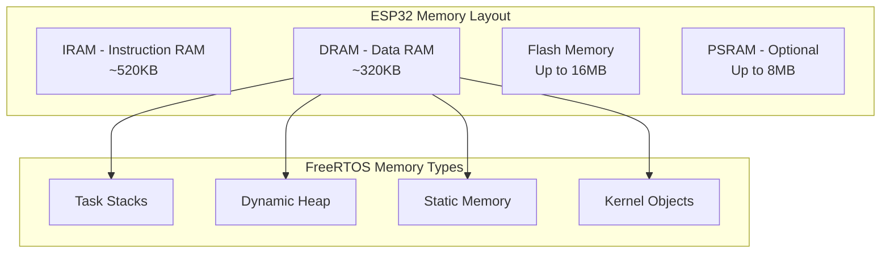
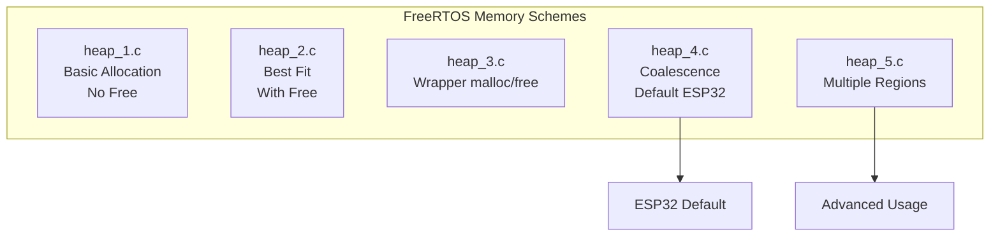
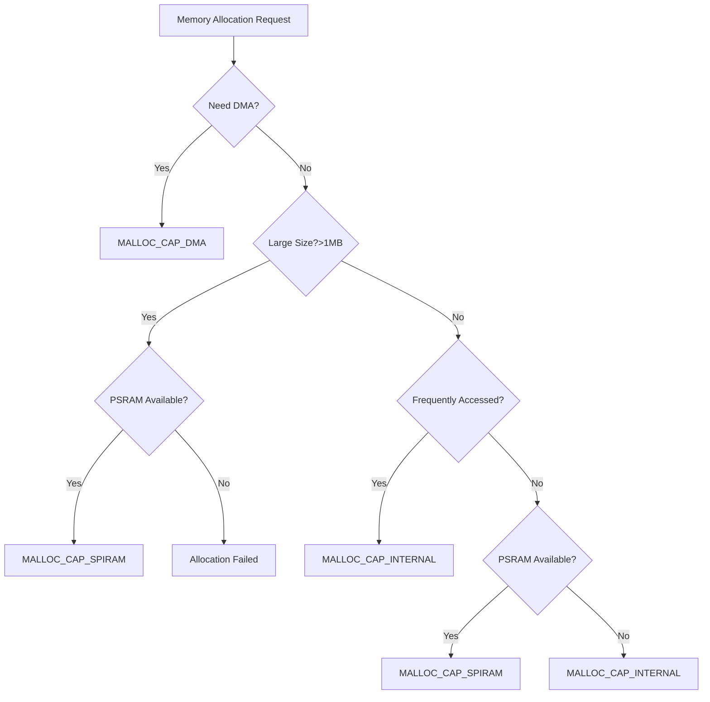

# Memory Management ใน FreeRTOS

## 🎯 ภาพรวม

Memory Management เป็นหัวข้อที่สำคัญมากใน embedded systems เพราะ microcontrollers มีหน่วยความจำจำกัด การจัดการหน่วยความจำอย่างมีประสิทธิภาพจะช่วยให้ระบบทำงานได้เสถียรและใช้ทรัพยากรอย่างคุ้มค่า



## 🧠 หลักการ Memory Management

### 1. Memory Layout ใน ESP32

ESP32 มี memory architecture ที่ซับซ้อน:

```c
// Memory regions ใน ESP32
/*
┌─────────────────────┬──────────────┬─────────────────┐
│ Memory Region       │ Address      │ Size            │
├─────────────────────┼──────────────┼─────────────────┤
│ IRAM0               │ 0x40080000   │ ~128KB          │
│ IRAM1               │ 0x400A0000   │ ~128KB          │
│ DRAM0               │ 0x3FFB0000   │ ~176KB          │
│ DRAM1               │ 0x3FFE0000   │ ~144KB          │
│ RTC_SLOW            │ 0x50000000   │ 8KB             │
│ RTC_FAST            │ 0x3FF80000   │ 8KB             │
│ External PSRAM      │ 0x3F800000   │ Up to 8MB       │
└─────────────────────┴──────────────┴─────────────────┘
*/

// ตัวอย่างการตรวจสอบ memory regions
void print_memory_layout(void) {
    ESP_LOGI(TAG, "Memory Layout Information:");
    ESP_LOGI(TAG, "IRAM Free: %d bytes", heap_caps_get_free_size(MALLOC_CAP_EXEC));
    ESP_LOGI(TAG, "DRAM Free: %d bytes", heap_caps_get_free_size(MALLOC_CAP_8BIT));
    ESP_LOGI(TAG, "PSRAM Free: %d bytes", heap_caps_get_free_size(MALLOC_CAP_SPIRAM));
    ESP_LOGI(TAG, "Total Free: %d bytes", esp_get_free_heap_size());
}
```

### 2. FreeRTOS Memory Allocation Schemes

FreeRTOS รองรับ memory allocation หลายแบบ:



## 📚 Memory Management APIs

### 1. Dynamic Memory Allocation

```c
#include "freertos/FreeRTOS.h"
#include "esp_heap_caps.h"

// FreeRTOS standard allocation
void* pvPortMalloc(size_t xWantedSize);
void vPortFree(void* pv);

// ESP32 heap capabilities allocation
void* heap_caps_malloc(size_t size, uint32_t caps);
void* heap_caps_calloc(size_t n, size_t size, uint32_t caps);
void* heap_caps_realloc(void* ptr, size_t size, uint32_t caps);
void heap_caps_free(void* ptr);

// Memory capability flags
#define MALLOC_CAP_EXEC         (1 << 0)   // Memory can execute code
#define MALLOC_CAP_32BIT        (1 << 1)   // 32-bit aligned
#define MALLOC_CAP_8BIT         (1 << 2)   // 8-bit aligned (normal RAM)
#define MALLOC_CAP_DMA          (1 << 3)   // DMA capable
#define MALLOC_CAP_SPIRAM       (1 << 10)  // PSRAM
#define MALLOC_CAP_INTERNAL     (1 << 11)  // Internal RAM only
#define MALLOC_CAP_DEFAULT      (MALLOC_CAP_8BIT)
```

### 2. Memory Information APIs

```c
// Memory status functions
size_t esp_get_free_heap_size(void);
size_t esp_get_minimum_free_heap_size(void);
size_t heap_caps_get_free_size(uint32_t caps);
size_t heap_caps_get_largest_free_block(uint32_t caps);

// Memory debugging
void heap_caps_print_heap_info(uint32_t caps);
bool heap_caps_check_integrity_all(bool print_errors);

// ตัวอย่างการใช้งาน
void print_memory_info(void) {
    ESP_LOGI(TAG, "=== Memory Information ===");
    ESP_LOGI(TAG, "Free heap: %d bytes", esp_get_free_heap_size());
    ESP_LOGI(TAG, "Min free heap: %d bytes", esp_get_minimum_free_heap_size());
    ESP_LOGI(TAG, "Largest free block: %d bytes", 
             heap_caps_get_largest_free_block(MALLOC_CAP_DEFAULT));
    
    // Print detailed heap info
    heap_caps_print_heap_info(MALLOC_CAP_DEFAULT);
}
```

### 3. Task Stack Management

```c
// Task creation with custom stack
TaskHandle_t xTaskCreateStatic(
    TaskFunction_t pxTaskCode,
    const char * pcName,
    uint32_t ulStackDepth,
    void * pvParameters,
    UBaseType_t uxPriority,
    StackType_t * puxStackBuffer,    // Static stack buffer
    StaticTask_t * pxTaskBuffer      // Static task control block
);

// Task stack monitoring
UBaseType_t uxTaskGetStackHighWaterMark(TaskHandle_t xTask);

// ตัวอย่างการใช้ static allocation
#define TASK_STACK_SIZE 2048
static StackType_t task_stack[TASK_STACK_SIZE];
static StaticTask_t task_buffer;

void create_static_task(void) {
    TaskHandle_t task_handle = xTaskCreateStatic(
        my_task_function,
        "StaticTask",
        TASK_STACK_SIZE,
        NULL,
        5,
        task_stack,
        &task_buffer
    );
    
    if (task_handle == NULL) {
        ESP_LOGE(TAG, "Failed to create static task");
    }
}
```

## 🔧 Memory Pool Management

### Memory Pool Pattern

```c
// Memory pool structure
typedef struct {
    void* pool_start;
    size_t block_size;
    size_t num_blocks;
    uint8_t* free_map;
    SemaphoreHandle_t mutex;
} memory_pool_t;

// Memory pool implementation
memory_pool_t* create_memory_pool(size_t block_size, size_t num_blocks) {
    memory_pool_t* pool = malloc(sizeof(memory_pool_t));
    if (!pool) return NULL;
    
    // Allocate pool memory
    pool->pool_start = heap_caps_malloc(block_size * num_blocks, MALLOC_CAP_8BIT);
    if (!pool->pool_start) {
        free(pool);
        return NULL;
    }
    
    // Allocate free map
    pool->free_map = calloc(num_blocks, sizeof(uint8_t));
    if (!pool->free_map) {
        heap_caps_free(pool->pool_start);
        free(pool);
        return NULL;
    }
    
    pool->block_size = block_size;
    pool->num_blocks = num_blocks;
    pool->mutex = xSemaphoreCreateMutex();
    
    return pool;
}

void* pool_malloc(memory_pool_t* pool) {
    if (!pool || !pool->mutex) return NULL;
    
    if (xSemaphoreTake(pool->mutex, pdMS_TO_TICKS(1000)) == pdTRUE) {
        // Find free block
        for (size_t i = 0; i < pool->num_blocks; i++) {
            if (pool->free_map[i] == 0) {
                pool->free_map[i] = 1;
                void* block = (uint8_t*)pool->pool_start + (i * pool->block_size);
                xSemaphoreGive(pool->mutex);
                return block;
            }
        }
        xSemaphoreGive(pool->mutex);
    }
    
    return NULL; // No free blocks
}

void pool_free(memory_pool_t* pool, void* ptr) {
    if (!pool || !ptr || !pool->mutex) return;
    
    if (xSemaphoreTake(pool->mutex, pdMS_TO_TICKS(1000)) == pdTRUE) {
        // Calculate block index
        size_t offset = (uint8_t*)ptr - (uint8_t*)pool->pool_start;
        size_t block_index = offset / pool->block_size;
        
        if (block_index < pool->num_blocks) {
            pool->free_map[block_index] = 0;
        }
        
        xSemaphoreGive(pool->mutex);
    }
}
```

## ⚡ Memory Optimization Strategies

### 1. Stack Size Optimization

```c
// Stack monitoring utility
void monitor_task_stacks(void) {
    TaskStatus_t* task_array;
    UBaseType_t task_count = uxTaskGetNumberOfTasks();
    
    task_array = pvPortMalloc(task_count * sizeof(TaskStatus_t));
    if (task_array) {
        task_count = uxTaskGetSystemState(task_array, task_count, NULL);
        
        ESP_LOGI(TAG, "=== Task Stack Usage ===");
        for (UBaseType_t i = 0; i < task_count; i++) {
            uint32_t stack_high_water = uxTaskGetStackHighWaterMark(task_array[i].xHandle);
            uint32_t stack_used = task_array[i].usStackHighWaterMark - stack_high_water;
            uint32_t stack_utilization = (stack_used * 100) / task_array[i].usStackHighWaterMark;
            
            ESP_LOGI(TAG, "Task: %s, Stack: %lu/%lu (%lu%%)", 
                     task_array[i].pcTaskName,
                     stack_used,
                     task_array[i].usStackHighWaterMark,
                     stack_utilization);
                     
            if (stack_utilization > 80) {
                ESP_LOGW(TAG, "WARNING: %s stack usage high!", task_array[i].pcTaskName);
            }
        }
        
        vPortFree(task_array);
    }
}
```

### 2. Heap Fragmentation Analysis

```c
// Heap fragmentation analyzer
typedef struct {
    size_t total_free;
    size_t largest_block;
    size_t block_count;
    float fragmentation_ratio;
} heap_analysis_t;

heap_analysis_t analyze_heap_fragmentation(uint32_t caps) {
    heap_analysis_t analysis = {0};
    
    analysis.total_free = heap_caps_get_free_size(caps);
    analysis.largest_block = heap_caps_get_largest_free_block(caps);
    
    if (analysis.total_free > 0) {
        analysis.fragmentation_ratio = 1.0 - 
            ((float)analysis.largest_block / (float)analysis.total_free);
    }
    
    // Estimate block count (simplified)
    if (analysis.largest_block > 0) {
        analysis.block_count = analysis.total_free / analysis.largest_block;
    }
    
    return analysis;
}

void print_fragmentation_report(void) {
    heap_analysis_t internal = analyze_heap_fragmentation(MALLOC_CAP_INTERNAL);
    heap_analysis_t spiram = analyze_heap_fragmentation(MALLOC_CAP_SPIRAM);
    
    ESP_LOGI(TAG, "=== Heap Fragmentation Analysis ===");
    ESP_LOGI(TAG, "Internal RAM:");
    ESP_LOGI(TAG, "  Total Free: %d bytes", internal.total_free);
    ESP_LOGI(TAG, "  Largest Block: %d bytes", internal.largest_block);
    ESP_LOGI(TAG, "  Fragmentation: %.1f%%", internal.fragmentation_ratio * 100);
    
    if (spiram.total_free > 0) {
        ESP_LOGI(TAG, "SPIRAM:");
        ESP_LOGI(TAG, "  Total Free: %d bytes", spiram.total_free);
        ESP_LOGI(TAG, "  Largest Block: %d bytes", spiram.largest_block);
        ESP_LOGI(TAG, "  Fragmentation: %.1f%%", spiram.fragmentation_ratio * 100);
    }
}
```

### 3. Memory Leak Detection

```c
// Memory leak detector
typedef struct memory_record {
    void* ptr;
    size_t size;
    const char* file;
    int line;
    uint64_t timestamp;
    struct memory_record* next;
} memory_record_t;

static memory_record_t* memory_records = NULL;
static SemaphoreHandle_t memory_mutex = NULL;

// Wrapper functions for debugging
#define DEBUG_MALLOC(size) debug_malloc(size, __FILE__, __LINE__)
#define DEBUG_FREE(ptr) debug_free(ptr, __FILE__, __LINE__)

void* debug_malloc(size_t size, const char* file, int line) {
    void* ptr = malloc(size);
    if (ptr && memory_mutex) {
        if (xSemaphoreTake(memory_mutex, pdMS_TO_TICKS(1000)) == pdTRUE) {
            memory_record_t* record = malloc(sizeof(memory_record_t));
            if (record) {
                record->ptr = ptr;
                record->size = size;
                record->file = file;
                record->line = line;
                record->timestamp = esp_timer_get_time();
                record->next = memory_records;
                memory_records = record;
            }
            xSemaphoreGive(memory_mutex);
        }
    }
    return ptr;
}

void debug_free(void* ptr, const char* file, int line) {
    if (ptr && memory_mutex) {
        if (xSemaphoreTake(memory_mutex, pdMS_TO_TICKS(1000)) == pdTRUE) {
            memory_record_t** current = &memory_records;
            while (*current) {
                if ((*current)->ptr == ptr) {
                    memory_record_t* to_remove = *current;
                    *current = (*current)->next;
                    free(to_remove);
                    break;
                }
                current = &(*current)->next;
            }
            xSemaphoreGive(memory_mutex);
        }
    }
    free(ptr);
}

void print_memory_leaks(void) {
    if (!memory_mutex) return;
    
    if (xSemaphoreTake(memory_mutex, pdMS_TO_TICKS(1000)) == pdTRUE) {
        ESP_LOGI(TAG, "=== Memory Leak Report ===");
        memory_record_t* current = memory_records;
        size_t total_leaked = 0;
        int leak_count = 0;
        
        while (current) {
            ESP_LOGW(TAG, "LEAK: %d bytes at %p (%s:%d) - Age: %llu ms",
                     current->size, current->ptr, current->file, current->line,
                     (esp_timer_get_time() - current->timestamp) / 1000);
            total_leaked += current->size;
            leak_count++;
            current = current->next;
        }
        
        if (leak_count > 0) {
            ESP_LOGW(TAG, "Total leaks: %d allocations, %d bytes", leak_count, total_leaked);
        } else {
            ESP_LOGI(TAG, "No memory leaks detected");
        }
        
        xSemaphoreGive(memory_mutex);
    }
}
```

## 🎯 Memory Allocation Strategies

### 1. การเลือก Memory Type



### 2. Memory Allocation Guidelines

```c
// Memory allocation strategy
typedef enum {
    MEM_STRATEGY_PERFORMANCE,    // Prioritize speed (internal RAM)
    MEM_STRATEGY_CAPACITY,       // Prioritize size (PSRAM first)
    MEM_STRATEGY_BALANCED,       // Balance between speed and size
    MEM_STRATEGY_DMA_CAPABLE     // DMA-capable memory only
} memory_strategy_t;

void* smart_malloc(size_t size, memory_strategy_t strategy) {
    void* ptr = NULL;
    
    switch (strategy) {
        case MEM_STRATEGY_PERFORMANCE:
            // Try internal RAM first, then PSRAM
            ptr = heap_caps_malloc(size, MALLOC_CAP_INTERNAL);
            if (!ptr) {
                ptr = heap_caps_malloc(size, MALLOC_CAP_SPIRAM);
            }
            break;
            
        case MEM_STRATEGY_CAPACITY:
            // Try PSRAM first for large allocations
            if (size > 4096) {
                ptr = heap_caps_malloc(size, MALLOC_CAP_SPIRAM);
            }
            if (!ptr) {
                ptr = heap_caps_malloc(size, MALLOC_CAP_INTERNAL);
            }
            break;
            
        case MEM_STRATEGY_BALANCED:
            // Use PSRAM for allocations > 1KB
            if (size > 1024) {
                ptr = heap_caps_malloc(size, MALLOC_CAP_SPIRAM);
            }
            if (!ptr) {
                ptr = heap_caps_malloc(size, MALLOC_CAP_INTERNAL);
            }
            break;
            
        case MEM_STRATEGY_DMA_CAPABLE:
            // DMA-capable memory only
            ptr = heap_caps_malloc(size, MALLOC_CAP_DMA);
            break;
    }
    
    if (ptr) {
        ESP_LOGD(TAG, "Allocated %d bytes at %p (strategy: %d)", size, ptr, strategy);
    } else {
        ESP_LOGE(TAG, "Failed to allocate %d bytes (strategy: %d)", size, strategy);
    }
    
    return ptr;
}
```

## 🐛 Memory Debugging และ Troubleshooting

### 1. Common Memory Issues

```c
// Memory corruption detector
bool detect_memory_corruption(void) {
    bool corruption_detected = false;
    
    // Check heap integrity
    if (!heap_caps_check_integrity_all(true)) {
        ESP_LOGE(TAG, "Heap corruption detected!");
        corruption_detected = true;
    }
    
    // Check for memory leaks
    size_t current_free = esp_get_free_heap_size();
    static size_t baseline_free = 0;
    
    if (baseline_free == 0) {
        baseline_free = current_free;
    } else if (current_free < (baseline_free * 0.9)) { // 10% decrease
        ESP_LOGW(TAG, "Potential memory leak: %d bytes lost", 
                 baseline_free - current_free);
    }
    
    return corruption_detected;
}

// Stack overflow detector  
void check_stack_overflow(void) {
    TaskHandle_t current_task = xTaskGetCurrentTaskHandle();
    UBaseType_t high_water_mark = uxTaskGetStackHighWaterMark(current_task);
    
    if (high_water_mark < 256) { // Less than 256 bytes free
        ESP_LOGW(TAG, "Stack overflow risk: only %lu bytes free", high_water_mark);
        
        // Print stack trace if available
        esp_backtrace_print(10);
    }
}
```

### 2. Memory Profiling

```c
// Memory profiler
typedef struct {
    size_t peak_usage;
    size_t current_usage;
    uint32_t allocation_count;
    uint32_t deallocation_count;
    uint64_t total_allocated;
    uint64_t total_deallocated;
} memory_profile_t;

static memory_profile_t mem_profile = {0};

void update_memory_profile(void) {
    size_t current_free = esp_get_free_heap_size();
    size_t total_heap = heap_caps_get_total_size(MALLOC_CAP_DEFAULT);
    
    mem_profile.current_usage = total_heap - current_free;
    
    if (mem_profile.current_usage > mem_profile.peak_usage) {
        mem_profile.peak_usage = mem_profile.current_usage;
    }
}

void print_memory_profile(void) {
    ESP_LOGI(TAG, "=== Memory Profile ===");
    ESP_LOGI(TAG, "Current Usage: %d bytes", mem_profile.current_usage);
    ESP_LOGI(TAG, "Peak Usage: %d bytes", mem_profile.peak_usage);
    ESP_LOGI(TAG, "Allocations: %lu", mem_profile.allocation_count);
    ESP_LOGI(TAG, "Deallocations: %lu", mem_profile.deallocation_count);
    ESP_LOGI(TAG, "Total Allocated: %llu bytes", mem_profile.total_allocated);
    ESP_LOGI(TAG, "Total Deallocated: %llu bytes", mem_profile.total_deallocated);
    
    if (mem_profile.allocation_count != mem_profile.deallocation_count) {
        ESP_LOGW(TAG, "Memory leak suspected: %lu unmatched allocations",
                 mem_profile.allocation_count - mem_profile.deallocation_count);
    }
}
```

## 🚀 Best Practices

### 1. Memory Management Guidelines

```c
// Best practices implementation
#define MEMORY_ALIGNMENT    4
#define MIN_BLOCK_SIZE     16
#define MAX_POOL_BLOCKS    64

// Safe memory operations
void* safe_malloc(size_t size) {
    if (size == 0) return NULL;
    
    // Align size to prevent memory waste
    size = (size + MEMORY_ALIGNMENT - 1) & ~(MEMORY_ALIGNMENT - 1);
    
    void* ptr = malloc(size);
    if (ptr) {
        // Initialize memory to prevent using uninitialized data
        memset(ptr, 0, size);
        ESP_LOGD(TAG, "Allocated %d bytes at %p", size, ptr);
    } else {
        ESP_LOGE(TAG, "Failed to allocate %d bytes", size);
        print_memory_info();
    }
    
    return ptr;
}

void safe_free(void** ptr) {
    if (ptr && *ptr) {
        free(*ptr);
        *ptr = NULL; // Prevent double-free
        ESP_LOGD(TAG, "Freed memory at %p", *ptr);
    }
}

// Memory pool for frequent allocations
typedef struct {
    void* blocks[MAX_POOL_BLOCKS];
    bool used[MAX_POOL_BLOCKS];
    size_t block_size;
    int free_count;
    SemaphoreHandle_t mutex;
} simple_pool_t;

simple_pool_t* create_simple_pool(size_t block_size, int num_blocks) {
    if (num_blocks > MAX_POOL_BLOCKS) num_blocks = MAX_POOL_BLOCKS;
    
    simple_pool_t* pool = malloc(sizeof(simple_pool_t));
    if (!pool) return NULL;
    
    pool->block_size = block_size;
    pool->free_count = num_blocks;
    pool->mutex = xSemaphoreCreateMutex();
    
    // Pre-allocate all blocks
    for (int i = 0; i < num_blocks; i++) {
        pool->blocks[i] = malloc(block_size);
        pool->used[i] = false;
        
        if (!pool->blocks[i]) {
            // Cleanup on failure
            for (int j = 0; j < i; j++) {
                free(pool->blocks[j]);
            }
            vSemaphoreDelete(pool->mutex);
            free(pool);
            return NULL;
        }
    }
    
    return pool;
}
```

### 2. Task-specific Memory Management

```c
// Task memory context
typedef struct {
    TaskHandle_t task_handle;
    void* task_memory[16];  // Track up to 16 allocations per task
    size_t memory_sizes[16];
    int allocation_count;
    SemaphoreHandle_t mutex;
} task_memory_context_t;

static task_memory_context_t* task_contexts[16] = {NULL};
static int context_count = 0;

task_memory_context_t* get_task_context(TaskHandle_t task) {
    // Find or create task context
    for (int i = 0; i < context_count; i++) {
        if (task_contexts[i] && task_contexts[i]->task_handle == task) {
            return task_contexts[i];
        }
    }
    
    // Create new context
    if (context_count < 16) {
        task_memory_context_t* ctx = malloc(sizeof(task_memory_context_t));
        if (ctx) {
            ctx->task_handle = task;
            ctx->allocation_count = 0;
            ctx->mutex = xSemaphoreCreateMutex();
            memset(ctx->task_memory, 0, sizeof(ctx->task_memory));
            memset(ctx->memory_sizes, 0, sizeof(ctx->memory_sizes));
            task_contexts[context_count++] = ctx;
            return ctx;
        }
    }
    
    return NULL;
}

void cleanup_task_memory(TaskHandle_t task) {
    task_memory_context_t* ctx = get_task_context(task);
    if (ctx && ctx->mutex) {
        if (xSemaphoreTake(ctx->mutex, pdMS_TO_TICKS(1000)) == pdTRUE) {
            ESP_LOGI(TAG, "Cleaning up memory for task %p", task);
            
            for (int i = 0; i < ctx->allocation_count; i++) {
                if (ctx->task_memory[i]) {
                    ESP_LOGW(TAG, "Freeing leaked memory: %d bytes at %p",
                             ctx->memory_sizes[i], ctx->task_memory[i]);
                    free(ctx->task_memory[i]);
                    ctx->task_memory[i] = NULL;
                }
            }
            
            xSemaphoreGive(ctx->mutex);
        }
    }
}
```

## 📈 Performance Considerations

### Memory Access Performance

```c
// Memory access benchmark
typedef struct {
    uint32_t internal_ram_time;
    uint32_t spiram_time;
    uint32_t flash_time;
} memory_benchmark_t;

memory_benchmark_t benchmark_memory_access(void) {
    memory_benchmark_t results = {0};
    const size_t test_size = 1024;
    const int iterations = 1000;
    
    // Test internal RAM
    void* internal_buf = heap_caps_malloc(test_size, MALLOC_CAP_INTERNAL);
    if (internal_buf) {
        uint64_t start = esp_timer_get_time();
        for (int i = 0; i < iterations; i++) {
            memset(internal_buf, i & 0xFF, test_size);
        }
        results.internal_ram_time = (esp_timer_get_time() - start) / 1000;
        heap_caps_free(internal_buf);
    }
    
    // Test SPIRAM (if available)
    void* spiram_buf = heap_caps_malloc(test_size, MALLOC_CAP_SPIRAM);
    if (spiram_buf) {
        uint64_t start = esp_timer_get_time();
        for (int i = 0; i < iterations; i++) {
            memset(spiram_buf, i & 0xFF, test_size);
        }
        results.spiram_time = (esp_timer_get_time() - start) / 1000;
        heap_caps_free(spiram_buf);
    }
    
    return results;
}

void print_benchmark_results(memory_benchmark_t* results) {
    ESP_LOGI(TAG, "=== Memory Access Benchmark ===");
    ESP_LOGI(TAG, "Internal RAM: %lu ms", results->internal_ram_time);
    if (results->spiram_time > 0) {
        ESP_LOGI(TAG, "SPIRAM: %lu ms", results->spiram_time);
        float speed_ratio = (float)results->spiram_time / results->internal_ram_time;
        ESP_LOGI(TAG, "SPIRAM is %.1fx slower than internal RAM", speed_ratio);
    }
}
```

## 🎯 สรุป

Memory Management ใน FreeRTOS และ ESP32 เป็นหัวข้อที่ซับซ้อนแต่สำคัญมาก การเข้าใจหลักการดังต่อไปนี้จะช่วยให้พัฒนาระบบที่มีประสิทธิภาพ:

### Key Takeaways:
1. **Memory Layout**: เข้าใจ memory regions และการใช้งาน
2. **Allocation Strategies**: เลือกวิธี allocation ที่เหมาะสม
3. **Memory Pools**: ใช้ memory pools สำหรับ frequent allocations
4. **Leak Detection**: ติดตามและป้องกัน memory leaks
5. **Performance**: พิจารณา trade-offs ระหว่าง speed และ capacity
6. **Debugging**: ใช้เครื่องมือ debugging ที่มีอยู่
7. **Best Practices**: ปฏิบัติตาม coding standards และ guidelines

การจัดการหน่วยความจำที่ดีจะช่วยให้ระบบทำงานได้เสถียรและมีประสิทธิภาพในระยะยาว ซึ่งเป็นสิ่งสำคัญมากสำหรับ embedded systems ที่มีทรัพยากรจำกัด