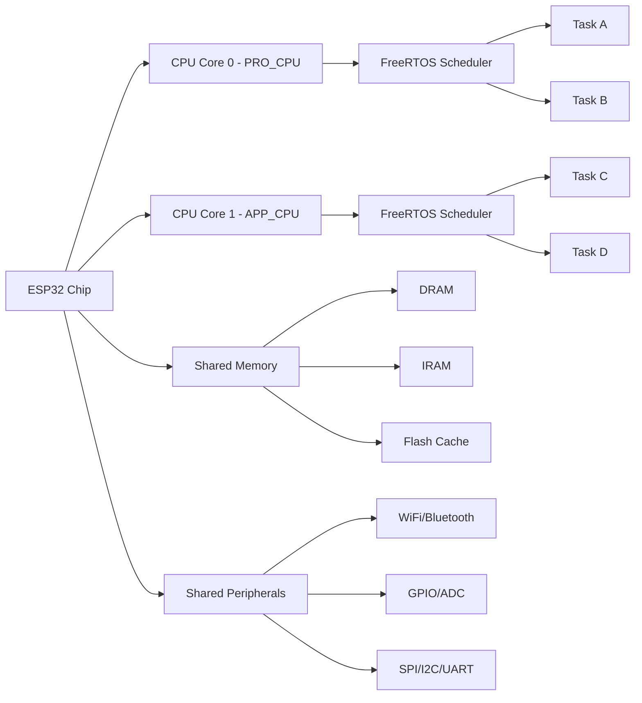
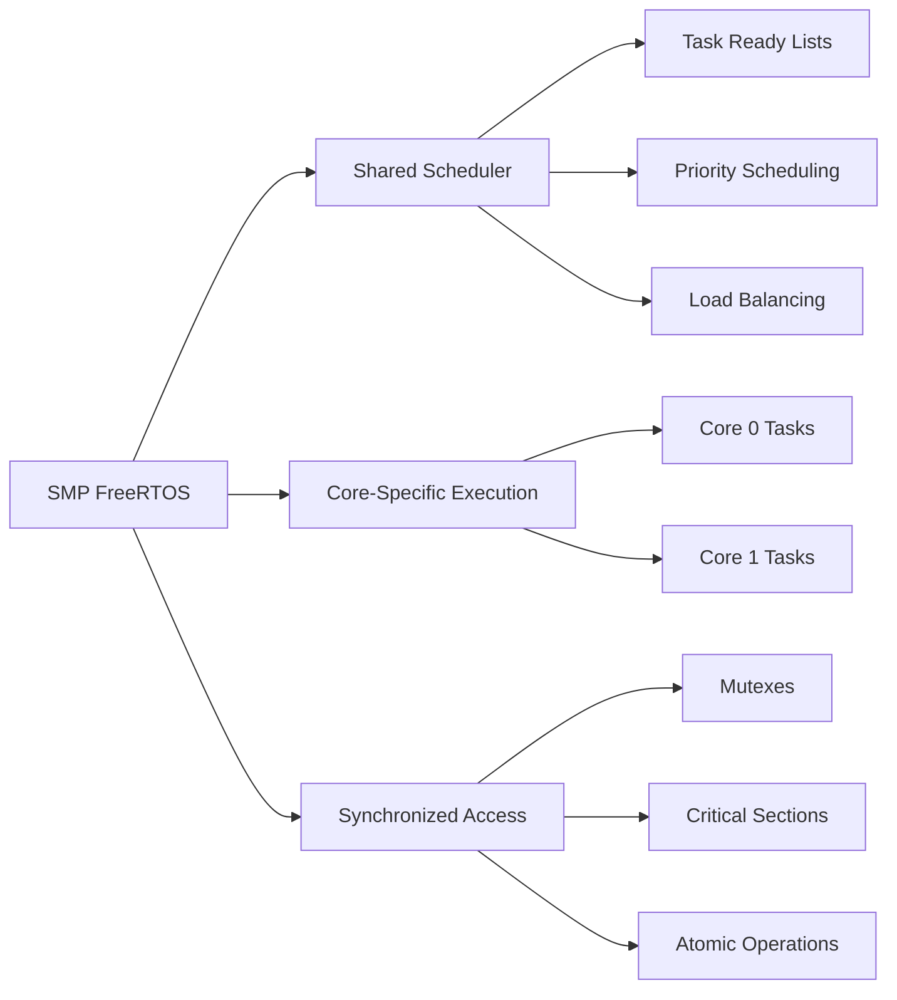

# ESP-IDF Specific FreeRTOS Features

## Table of Contents
1. [ESP-IDF FreeRTOS Overview](#esp-idf-freertos-overview)
2. [Dual-Core SMP Support](#dual-core-smp-support)
3. [ESP32 Task Affinity](#esp32-task-affinity)
4. [Inter-Processor Communication](#inter-processor-communication)
5. [ESP-IDF Development Workflow](#esp-idf-development-workflow)
6. [Performance Optimization](#performance-optimization)
7. [Debugging and Monitoring](#debugging-and-monitoring)
8. [Integration with ESP32 Peripherals](#integration-with-esp32-peripherals)
9. [Best Practices](#best-practices)
10. [Exercises](#exercises)

## ESP-IDF FreeRTOS Overview

ESP-IDF includes a customized version of FreeRTOS with ESP32-specific enhancements, particularly for dual-core (SMP - Symmetric Multi-Processing) support.

### Key ESP-IDF Modifications:
- **Dual-Core Support**: SMP FreeRTOS for ESP32's two cores
- **Task Affinity**: Ability to pin tasks to specific cores
- **IPC (Inter-Processor Communication)**: Communication between cores
- **Memory Management**: ESP32-specific heap management
- **Hardware Integration**: Native support for ESP32 peripherals

### ESP32 Architecture Overview:



### ESP-IDF Configuration:

```bash
# Configure ESP-IDF FreeRTOS settings
idf.py menuconfig

# Key configuration options:
# Component config -> FreeRTOS
# - Run FreeRTOS only on first core (disable for SMP)
# - Tick rate (Hz)
# - Task watchdog timeout
# - Idle task watchdog timeout
# - Enable task stack overflow detection
```

## Dual-Core SMP Support

ESP32's dual-core architecture allows true parallel execution of tasks across two CPU cores.

### Core Identification:

```c
#include "freertos/FreeRTOS.h"
#include "freertos/task.h"
#include "esp_system.h"
#include "esp_log.h"

static const char *TAG = "DUAL_CORE";

void core_info_task(void *parameter)
{
    int core_id = xPortGetCoreID();
    const char* core_name = (core_id == 0) ? "PRO_CPU" : "APP_CPU";
    
    ESP_LOGI(TAG, "Task running on Core %d (%s)", core_id, core_name);
    
    while (1) {
        ESP_LOGI(TAG, "Core %d: Task executing", core_id);
        vTaskDelay(pdMS_TO_TICKS(2000));
    }
}

void app_main(void)
{
    ESP_LOGI(TAG, "ESP32 Dual-Core FreeRTOS Demo");
    ESP_LOGI(TAG, "Main task running on Core %d", xPortGetCoreID());
    
    // Create tasks without affinity (can run on either core)
    xTaskCreate(core_info_task, "CoreTask1", 2048, NULL, 5, NULL);
    xTaskCreate(core_info_task, "CoreTask2", 2048, NULL, 5, NULL);
    xTaskCreate(core_info_task, "CoreTask3", 2048, NULL, 5, NULL);
    xTaskCreate(core_info_task, "CoreTask4", 2048, NULL, 5, NULL);
    
    ESP_LOGI(TAG, "Tasks created - they will distribute across cores");
}
```

### SMP Considerations:



## ESP32 Task Affinity

Task affinity allows you to pin tasks to specific cores for performance optimization or real-time requirements.

### Task Affinity APIs:

| Function | Description |
|----------|-------------|
| `xTaskCreatePinnedToCore()` | Create task pinned to specific core |
| `xTaskCreateStaticPinnedToCore()` | Create static task pinned to core |
| `vTaskCoreAffinitySet()` | Change task's core affinity |
| `vTaskCoreAffinityGet()` | Get task's core affinity |

### Core Affinity Constants:

```c
// Core affinity definitions
#define tskNO_AFFINITY      0x7FFFFFFF  // Task can run on any core
#define PRO_CPU_NUM         0           // Core 0 (Protocol CPU)
#define APP_CPU_NUM         1           // Core 1 (Application CPU)
```

### Task Affinity Examples:

```c
void core_pinned_tasks_example(void)
{
    ESP_LOGI(TAG, "Creating core-pinned tasks");
    
    // Task pinned to Core 0 (PRO_CPU)
    xTaskCreatePinnedToCore(
        realtime_task,          // Task function
        "RealtimeTask",         // Task name
        2048,                   // Stack size
        NULL,                   // Parameters
        20,                     // High priority
        NULL,                   // Task handle
        PRO_CPU_NUM             // Pin to Core 0
    );
    
    // Task pinned to Core 1 (APP_CPU)
    xTaskCreatePinnedToCore(
        communication_task,     // Task function
        "CommTask",             // Task name
        4096,                   // Stack size
        NULL,                   // Parameters
        15,                     // Medium priority
        NULL,                   // Task handle
        APP_CPU_NUM             // Pin to Core 1
    );
    
    // Task with no affinity (can run on either core)
    xTaskCreate(
        background_task,        // Task function
        "BackgroundTask",       // Task name
        2048,                   // Stack size
        NULL,                   // Parameters
        5,                      // Low priority
        NULL                    // Task handle
        // No core specification = tskNO_AFFINITY
    );
}

void realtime_task(void *parameter)
{
    ESP_LOGI(TAG, "Real-time task on Core %d", xPortGetCoreID());
    
    while (1) {
        // Time-critical operations
        ESP_LOGI(TAG, "Real-time processing on Core %d", xPortGetCoreID());
        
        // Precise timing operations
        precise_timing_operation();
        
        vTaskDelay(pdMS_TO_TICKS(100));
    }
}

void communication_task(void *parameter)
{
    ESP_LOGI(TAG, "Communication task on Core %d", xPortGetCoreID());
    
    while (1) {
        // Network and communication operations
        ESP_LOGI(TAG, "Communication processing on Core %d", xPortGetCoreID());
        
        // WiFi/Bluetooth operations
        network_operations();
        
        vTaskDelay(pdMS_TO_TICKS(500));
    }
}

void background_task(void *parameter)
{
    while (1) {
        int current_core = xPortGetCoreID();
        ESP_LOGI(TAG, "Background task currently on Core %d", current_core);
        
        // This task can migrate between cores as needed
        background_processing();
        
        vTaskDelay(pdMS_TO_TICKS(1000));
    }
}
```

### Dynamic Affinity Management:

```c
void dynamic_affinity_example(void)
{
    TaskHandle_t flexible_task_handle;
    
    // Create task without initial affinity
    xTaskCreate(flexible_worker_task, "FlexibleWorker", 2048, NULL, 10, &flexible_task_handle);
    
    // Let it run for a while
    vTaskDelay(pdMS_TO_TICKS(5000));
    
    // Pin to Core 0 for performance-critical phase
    ESP_LOGI(TAG, "Pinning task to Core 0 for performance phase");
    vTaskCoreAffinitySet(flexible_task_handle, (1 << PRO_CPU_NUM));
    
    vTaskDelay(pdMS_TO_TICKS(5000));
    
    // Pin to Core 1 for different workload
    ESP_LOGI(TAG, "Moving task to Core 1 for communication phase");
    vTaskCoreAffinitySet(flexible_task_handle, (1 << APP_CPU_NUM));
    
    vTaskDelay(pdMS_TO_TICKS(5000));
    
    // Remove affinity - allow scheduling on any core
    ESP_LOGI(TAG, "Removing affinity - task can run on any core");
    vTaskCoreAffinitySet(flexible_task_handle, tskNO_AFFINITY);
}

void flexible_worker_task(void *parameter)
{
    int phase = 0;
    
    while (1) {
        int current_core = xPortGetCoreID();
        ESP_LOGI(TAG, "Flexible task phase %d on Core %d", phase, current_core);
        
        switch (phase % 3) {
            case 0:
                // Compute-intensive work
                compute_intensive_work();
                break;
            case 1:
                // I/O operations
                io_operations();
                break;
            case 2:
                // Network operations
                network_operations();
                break;
        }
        
        phase++;
        vTaskDelay(pdMS_TO_TICKS(1000));
    }
}
```

## Inter-Processor Communication

ESP-IDF provides IPC (Inter-Processor Communication) mechanisms for communication between cores.

### IPC Functions:

| Function | Description |
|----------|-------------|
| `esp_ipc_call()` | Execute function on specific core (blocking) |
| `esp_ipc_call_blocking()` | Execute function on specific core (blocking) |

### IPC Usage Example:

```c
#include "esp_ipc.h"

// Function to execute on remote core
void remote_core_function(void *arg)
{
    int *data = (int*)arg;
    int core_id = xPortGetCoreID();
    
    ESP_LOGI(TAG, "IPC function executing on Core %d with data: %d", core_id, *data);
    
    // Perform core-specific operation
    *data = *data * 2; // Example operation
    
    ESP_LOGI(TAG, "IPC function completed on Core %d, result: %d", core_id, *data);
}

void ipc_communication_example(void)
{
    int current_core = xPortGetCoreID();
    int target_core = (current_core == 0) ? 1 : 0;
    
    ESP_LOGI(TAG, "Running on Core %d, calling function on Core %d", current_core, target_core);
    
    int shared_data = 42;
    
    // Call function on remote core
    esp_err_t result = esp_ipc_call_blocking(target_core, remote_core_function, &shared_data);
    
    if (result == ESP_OK) {
        ESP_LOGI(TAG, "IPC call successful, shared_data is now: %d", shared_data);
    } else {
        ESP_LOGE(TAG, "IPC call failed: %s", esp_err_to_name(result));
    }
}
```

### Core-Specific Resource Management:

```c
// Core-specific data structures
typedef struct {
    int core_id;
    QueueHandle_t input_queue;
    QueueHandle_t output_queue;
    SemaphoreHandle_t processing_semaphore;
    TaskHandle_t worker_task;
} core_context_t;

static core_context_t core_contexts[2];

void setup_core_specific_resources(void)
{
    for (int core = 0; core < 2; core++) {
        core_contexts[core].core_id = core;
        core_contexts[core].input_queue = xQueueCreate(10, sizeof(int));
        core_contexts[core].output_queue = xQueueCreate(10, sizeof(int));
        core_contexts[core].processing_semaphore = xSemaphoreCreateBinary();
        
        // Create worker task pinned to specific core
        char task_name[20];
        sprintf(task_name, "CoreWorker%d", core);
        
        xTaskCreatePinnedToCore(
            core_worker_task,
            task_name,
            2048,
            &core_contexts[core],
            10,
            &core_contexts[core].worker_task,
            core
        );
        
        ESP_LOGI(TAG, "Setup resources for Core %d", core);
    }
}

void core_worker_task(void *parameter)
{
    core_context_t *ctx = (core_context_t*)parameter;
    int data;
    
    ESP_LOGI(TAG, "Core %d worker task started", ctx->core_id);
    
    while (1) {
        // Wait for work
        if (xQueueReceive(ctx->input_queue, &data, portMAX_DELAY) == pdTRUE) {
            ESP_LOGI(TAG, "Core %d processing data: %d", ctx->core_id, data);
            
            // Process data (core-specific algorithm)
            int result = data * ctx->core_id + 100;
            
            // Simulate processing time
            vTaskDelay(pdMS_TO_TICKS(100));
            
            // Send result
            xQueueSend(ctx->output_queue, &result, 0);
            
            ESP_LOGI(TAG, "Core %d completed processing: %d -> %d", 
                     ctx->core_id, data, result);
        }
    }
}

void distribute_work_to_cores(void)
{
    ESP_LOGI(TAG, "Distributing work to both cores");
    
    // Send work to both cores
    for (int work_item = 1; work_item <= 10; work_item++) {
        int target_core = work_item % 2; // Alternate between cores
        
        if (xQueueSend(core_contexts[target_core].input_queue, &work_item, 
                      pdMS_TO_TICKS(1000)) == pdTRUE) {
            ESP_LOGI(TAG, "Sent work item %d to Core %d", work_item, target_core);
        }
    }
    
    // Collect results
    for (int core = 0; core < 2; core++) {
        int result;
        int items_received = 0;
        
        ESP_LOGI(TAG, "Collecting results from Core %d", core);
        
        while (xQueueReceive(core_contexts[core].output_queue, &result, 
                           pdMS_TO_TICKS(2000)) == pdTRUE) {
            ESP_LOGI(TAG, "Received result from Core %d: %d", core, result);
            items_received++;
            
            if (items_received >= 5) break; // Expect 5 items per core
        }
    }
}
```

## ESP-IDF Development Workflow

### Project Structure and Build System:

```bash
# ESP-IDF project structure
my_freertos_project/
├── CMakeLists.txt              # Main CMake file
├── sdkconfig                   # Project configuration
├── main/
│   ├── CMakeLists.txt         # Main component CMake
│   ├── main.c                 # Application entry point
│   └── Kconfig.projbuild      # Project-specific config
├── components/                # Custom components
│   └── my_component/
│       ├── CMakeLists.txt
│       ├── include/
│       └── src/
└── build/                     # Build output (auto-generated)
```

### Essential idf.py Commands:

```bash
# Project creation and setup
idf.py create-project my_freertos_app
cd my_freertos_app

# Configuration
idf.py menuconfig              # Open configuration menu
idf.py set-target esp32        # Set target chip
idf.py reconfigure            # Reconfigure after changes

# Building
idf.py build                  # Build project
idf.py clean                  # Clean build files
idf.py fullclean             # Full clean including config

# Flashing and monitoring
idf.py -p COM3 flash          # Flash to device on COM3
idf.py -p COM3 monitor        # Open serial monitor
idf.py -p COM3 flash monitor  # Flash and monitor
idf.py -p COM3 erase-flash    # Erase entire flash

# Analysis and debugging
idf.py size                   # Analyze binary size
idf.py size-components        # Component size analysis
idf.py size-files            # File size analysis
idf.py app-flash             # Flash only app partition

# Advanced commands
idf.py partition-table       # Show partition table
idf.py encrypted-flash       # Flash with encryption
idf.py openocd              # Start OpenOCD debug server
```

### Configuration Management:

```bash
# Key configuration areas in menuconfig:

# Serial flasher config
# - Flash size, mode, frequency
# - Baudrate for flashing/monitoring

# Partition Table
# - Single factory app
# - Factory app, two OTA definitions
# - Custom partition table CSV

# Component config -> FreeRTOS
# - Kernel configuration
# - Memory management
# - Task scheduling options
# - Tick rate configuration

# Component config -> ESP32-specific
# - CPU frequency
# - Memory allocation strategy
# - Watchdog configuration
# - Sleep mode options
```

### Custom Component Example:

```c
// components/sensor_manager/include/sensor_manager.h
#pragma once

#include "freertos/FreeRTOS.h"
#include "freertos/task.h"
#include "freertos/queue.h"

typedef struct {
    float temperature;
    float humidity;
    uint32_t timestamp;
} sensor_data_t;

esp_err_t sensor_manager_init(void);
esp_err_t sensor_manager_start(void);
QueueHandle_t sensor_manager_get_data_queue(void);
void sensor_manager_stop(void);
```

```c
// components/sensor_manager/src/sensor_manager.c
#include "sensor_manager.h"
#include "esp_log.h"

static const char *TAG = "SENSOR_MGR";
static QueueHandle_t sensor_data_queue;
static TaskHandle_t sensor_task_handle;

void sensor_task(void *parameter)
{
    sensor_data_t data;
    
    while (1) {
        // Read sensors
        data.temperature = 25.0 + (rand() % 200) / 10.0;
        data.humidity = 40.0 + (rand() % 500) / 10.0;
        data.timestamp = xTaskGetTickCount();
        
        // Send to queue
        if (xQueueSend(sensor_data_queue, &data, pdMS_TO_TICKS(100)) != pdTRUE) {
            ESP_LOGW(TAG, "Sensor data queue full");
        }
        
        vTaskDelay(pdMS_TO_TICKS(1000));
    }
}

esp_err_t sensor_manager_init(void)
{
    sensor_data_queue = xQueueCreate(10, sizeof(sensor_data_t));
    if (sensor_data_queue == NULL) {
        ESP_LOGE(TAG, "Failed to create sensor data queue");
        return ESP_ERR_NO_MEM;
    }
    
    ESP_LOGI(TAG, "Sensor manager initialized");
    return ESP_OK;
}

esp_err_t sensor_manager_start(void)
{
    BaseType_t result = xTaskCreatePinnedToCore(
        sensor_task,
        "SensorTask",
        2048,
        NULL,
        5,
        &sensor_task_handle,
        APP_CPU_NUM  // Run on Core 1
    );
    
    if (result != pdPASS) {
        ESP_LOGE(TAG, "Failed to create sensor task");
        return ESP_FAIL;
    }
    
    ESP_LOGI(TAG, "Sensor manager started");
    return ESP_OK;
}

QueueHandle_t sensor_manager_get_data_queue(void)
{
    return sensor_data_queue;
}
```

```cmake
# components/sensor_manager/CMakeLists.txt
idf_component_register(
    SRCS "src/sensor_manager.c"
    INCLUDE_DIRS "include"
    REQUIRES freertos
)
```

## Performance Optimization

### Core-Specific Optimization Strategies:

```c
void performance_optimization_example(void)
{
    ESP_LOGI(TAG, "Performance optimization strategies");
    
    // Strategy 1: Pin time-critical tasks to specific cores
    xTaskCreatePinnedToCore(
        high_frequency_task,    // Time-critical task
        "HighFreq",
        2048,
        NULL,
        25,                     // Highest priority
        NULL,
        PRO_CPU_NUM            // Pin to Core 0
    );
    
    // Strategy 2: Pin communication tasks to APP_CPU
    xTaskCreatePinnedToCore(
        wifi_communication_task,
        "WiFiComm",
        4096,
        NULL,
        15,
        NULL,
        APP_CPU_NUM            // Pin to Core 1
    );
    
    // Strategy 3: Use no affinity for flexible tasks
    xTaskCreate(
        background_processing_task,
        "Background",
        2048,
        NULL,
        5,                     // Low priority
        NULL                   // No core affinity
    );
}

void high_frequency_task(void *parameter)
{
    const TickType_t frequency = pdMS_TO_TICKS(10); // 100Hz
    TickType_t last_wake_time = xTaskGetTickCount();
    
    while (1) {
        // Time-critical operations
        high_precision_control_loop();
        
        // Use vTaskDelayUntil for precise timing
        vTaskDelayUntil(&last_wake_time, frequency);
    }
}

// Memory allocation optimization
void memory_optimization_example(void)
{
    // Use specific memory types for performance
    
    // DMA-capable memory for hardware operations
    uint8_t *dma_buffer = heap_caps_malloc(1024, MALLOC_CAP_DMA);
    
    // IRAM memory for time-critical code
    void *iram_buffer = heap_caps_malloc(512, MALLOC_CAP_EXEC);
    
    // External SPIRAM for large buffers
    void *large_buffer = heap_caps_malloc(64*1024, MALLOC_CAP_SPIRAM);
    
    // Use appropriate memory and clean up
    if (dma_buffer) {
        perform_dma_operation(dma_buffer);
        heap_caps_free(dma_buffer);
    }
    
    if (iram_buffer) {
        heap_caps_free(iram_buffer);
    }
    
    if (large_buffer) {
        heap_caps_free(large_buffer);
    }
}
```

### Cache and Memory Performance:

```c
#include "esp_cache.h"
#include "soc/cpu.h"

void cache_optimization_example(void)
{
    // Align data structures for better cache performance
    typedef struct __attribute__((aligned(32))) {
        float data[8];  // 32-byte aligned structure
        uint32_t timestamp;
        uint32_t status;
    } cache_optimized_data_t;
    
    // Allocate aligned memory
    cache_optimized_data_t *aligned_data = heap_caps_aligned_alloc(
        32,                         // Alignment
        sizeof(cache_optimized_data_t),
        MALLOC_CAP_DEFAULT
    );
    
    if (aligned_data) {
        ESP_LOGI(TAG, "Allocated cache-aligned data at %p", aligned_data);
        
        // Use the aligned data
        for (int i = 0; i < 8; i++) {
            aligned_data->data[i] = i * 1.5f;
        }
        aligned_data->timestamp = xTaskGetTickCount();
        aligned_data->status = 0x12345678;
        
        heap_caps_aligned_free(aligned_data);
    }
}
```

## Debugging and Monitoring

### ESP-IDF Debugging Tools:

```c
#include "esp_system.h"
#include "esp_task_wdt.h"
#include "esp_heap_caps.h"

void setup_system_monitoring(void)
{
    ESP_LOGI(TAG, "Setting up system monitoring");
    
    // Enable task watchdog for critical tasks
    esp_task_wdt_init(5, true);  // 5-second timeout, panic on timeout
    
    // Add current task to watchdog
    esp_task_wdt_add(NULL);
    
    // Create monitoring task
    xTaskCreate(system_monitor_task, "SysMonitor", 3072, NULL, 3, NULL);
}

void system_monitor_task(void *parameter)
{
    while (1) {
        // Reset watchdog
        esp_task_wdt_reset();
        
        // System information
        ESP_LOGI(TAG, "=== SYSTEM STATUS ===");
        
        // Core information
        ESP_LOGI(TAG, "Running on Core %d", xPortGetCoreID());
        
        // Memory information
        size_t free_heap = esp_get_free_heap_size();
        size_t min_free_heap = esp_get_minimum_free_heap_size();
        ESP_LOGI(TAG, "Heap - Free: %d, Min: %d", free_heap, min_free_heap);
        
        // Memory by capability
        ESP_LOGI(TAG, "Internal RAM: %d bytes", 
                 heap_caps_get_free_size(MALLOC_CAP_INTERNAL));
        ESP_LOGI(TAG, "SPIRAM: %d bytes", 
                 heap_caps_get_free_size(MALLOC_CAP_SPIRAM));
        ESP_LOGI(TAG, "DMA capable: %d bytes", 
                 heap_caps_get_free_size(MALLOC_CAP_DMA));
        
        // Task information
        UBaseType_t task_count = uxTaskGetNumberOfTasks();
        ESP_LOGI(TAG, "Active tasks: %d", task_count);
        
        // Runtime statistics
        char *task_list_buffer = pvPortMalloc(40 * task_count);
        if (task_list_buffer) {
            vTaskList(task_list_buffer);
            ESP_LOGI(TAG, "Task List:\n%s", task_list_buffer);
            vPortFree(task_list_buffer);
        }
        
        ESP_LOGI(TAG, "====================");
        
        vTaskDelay(pdMS_TO_TICKS(10000)); // Monitor every 10 seconds
    }
}
```

### Performance Profiling:

```c
#include "esp_timer.h"

void performance_profiling_example(void)
{
    ESP_LOGI(TAG, "Performance profiling example");
    
    // Measure function execution time
    int64_t start_time = esp_timer_get_time();
    
    // Function to profile
    complex_computation();
    
    int64_t end_time = esp_timer_get_time();
    int64_t execution_time = end_time - start_time;
    
    ESP_LOGI(TAG, "Function execution time: %lld microseconds", execution_time);
    
    // Core-specific performance measurement
    measure_core_performance();
}

void measure_core_performance(void)
{
    // Create tasks on specific cores and measure performance
    TaskHandle_t core0_task, core1_task;
    
    xTaskCreatePinnedToCore(benchmark_task, "Bench0", 2048, (void*)0, 10, &core0_task, 0);
    xTaskCreatePinnedToCore(benchmark_task, "Bench1", 2048, (void*)1, 10, &core1_task, 1);
    
    // Let benchmarks run
    vTaskDelay(pdMS_TO_TICKS(5000));
    
    // Clean up
    vTaskDelete(core0_task);
    vTaskDelete(core1_task);
}

void benchmark_task(void *parameter)
{
    int core_id = (int)parameter;
    int iterations = 0;
    
    int64_t start_time = esp_timer_get_time();
    int64_t benchmark_duration = 3000000; // 3 seconds in microseconds
    
    while ((esp_timer_get_time() - start_time) < benchmark_duration) {
        // Simple computational benchmark
        volatile float result = 0;
        for (int i = 0; i < 1000; i++) {
            result += sqrtf(i * 3.14159f);
        }
        iterations++;
    }
    
    int64_t actual_duration = esp_timer_get_time() - start_time;
    float performance = (float)iterations * 1000000.0f / actual_duration; // iterations per second
    
    ESP_LOGI(TAG, "Core %d: %d iterations in %lld µs (%.2f iter/sec)", 
             core_id, iterations, actual_duration, performance);
}
```

## Integration with ESP32 Peripherals

### WiFi Integration with FreeRTOS:

```c
#include "esp_wifi.h"
#include "esp_event.h"
#include "nvs_flash.h"

EventGroupHandle_t wifi_event_group;
const int WIFI_CONNECTED_BIT = BIT0;

void wifi_event_handler(void* arg, esp_event_base_t event_base,
                       int32_t event_id, void* event_data)
{
    if (event_base == WIFI_EVENT && event_id == WIFI_EVENT_STA_START) {
        esp_wifi_connect();
    } else if (event_base == WIFI_EVENT && event_id == WIFI_EVENT_STA_DISCONNECTED) {
        esp_wifi_connect();
        ESP_LOGI(TAG, "Retrying connection...");
    } else if (event_base == IP_EVENT && event_id == IP_EVENT_STA_GOT_IP) {
        ip_event_got_ip_t* event = (ip_event_got_ip_t*) event_data;
        ESP_LOGI(TAG, "Got IP: " IPSTR, IP2STR(&event->ip_info.ip));
        xEventGroupSetBits(wifi_event_group, WIFI_CONNECTED_BIT);
    }
}

void wifi_init_task(void *parameter)
{
    // Initialize NVS
    esp_err_t ret = nvs_flash_init();
    if (ret == ESP_ERR_NVS_NO_FREE_PAGES || ret == ESP_ERR_NVS_NEW_VERSION_FOUND) {
        ESP_ERROR_CHECK(nvs_flash_erase());
        ret = nvs_flash_init();
    }
    ESP_ERROR_CHECK(ret);
    
    wifi_event_group = xEventGroupCreate();
    
    ESP_ERROR_CHECK(esp_netif_init());
    ESP_ERROR_CHECK(esp_event_loop_create_default());
    esp_netif_create_default_wifi_sta();
    
    wifi_init_config_t cfg = WIFI_INIT_CONFIG_DEFAULT();
    ESP_ERROR_CHECK(esp_wifi_init(&cfg));
    
    ESP_ERROR_CHECK(esp_event_handler_register(WIFI_EVENT, ESP_EVENT_ANY_ID, &wifi_event_handler, NULL));
    ESP_ERROR_CHECK(esp_event_handler_register(IP_EVENT, IP_EVENT_STA_GOT_IP, &wifi_event_handler, NULL));
    
    wifi_config_t wifi_config = {
        .sta = {
            .ssid = "YourSSID",
            .password = "YourPassword",
            .threshold.authmode = WIFI_AUTH_WPA2_PSK,
        },
    };
    
    ESP_ERROR_CHECK(esp_wifi_set_mode(WIFI_MODE_STA));
    ESP_ERROR_CHECK(esp_wifi_set_config(WIFI_IF_STA, &wifi_config));
    ESP_ERROR_CHECK(esp_wifi_start());
    
    ESP_LOGI(TAG, "WiFi initialization finished.");
    
    // Wait for connection
    xEventGroupWaitBits(wifi_event_group, WIFI_CONNECTED_BIT, false, true, portMAX_DELAY);
    ESP_LOGI(TAG, "Connected to WiFi network");
    
    vTaskDelete(NULL);
}
```

### GPIO and Hardware Timer Integration:

```c
#include "driver/gpio.h"
#include "driver/gptimer.h"
#include "driver/ledc.h"

// Hardware timer callback
bool IRAM_ATTR timer_callback(gptimer_handle_t timer, const gptimer_alarm_event_data_t *edata, void *user_data)
{
    BaseType_t high_task_awoken = pdFALSE;
    SemaphoreHandle_t timer_semaphore = (SemaphoreHandle_t)user_data;
    
    // Signal task from ISR
    xSemaphoreGiveFromISR(timer_semaphore, &high_task_awoken);
    
    return high_task_awoken == pdTRUE;
}

void hardware_integration_example(void)
{
    ESP_LOGI(TAG, "Hardware integration with FreeRTOS");
    
    // Create semaphore for timer signaling
    SemaphoreHandle_t timer_semaphore = xSemaphoreCreateBinary();
    
    // Configure GPIO
    gpio_config_t io_conf = {
        .pin_bit_mask = (1ULL << GPIO_NUM_2),
        .mode = GPIO_MODE_OUTPUT,
        .pull_up_en = GPIO_PULLUP_DISABLE,
        .pull_down_en = GPIO_PULLDOWN_DISABLE,
        .intr_type = GPIO_INTR_DISABLE
    };
    gpio_config(&io_conf);
    
    // Configure hardware timer
    gptimer_handle_t gptimer = NULL;
    gptimer_config_t timer_config = {
        .clk_src = GPTIMER_CLK_SRC_DEFAULT,
        .direction = GPTIMER_COUNT_UP,
        .resolution_hz = 1000000, // 1MHz, 1 tick = 1µs
    };
    ESP_ERROR_CHECK(gptimer_new_timer(&timer_config, &gptimer));
    
    gptimer_alarm_config_t alarm_config = {
        .reload_count = 0,
        .alarm_count = 1000000, // 1 second
        .flags.auto_reload_on_alarm = true,
    };
    ESP_ERROR_CHECK(gptimer_set_alarm_action(gptimer, &alarm_config));
    
    gptimer_event_callbacks_t cbs = {
        .on_alarm = timer_callback,
    };
    ESP_ERROR_CHECK(gptimer_register_event_callbacks(gptimer, &cbs, timer_semaphore));
    
    ESP_ERROR_CHECK(gptimer_enable(gptimer));
    ESP_ERROR_CHECK(gptimer_start(gptimer));
    
    // Create task to handle timer events
    xTaskCreatePinnedToCore(
        hardware_event_task,
        "HardwareEvents",
        2048,
        timer_semaphore,
        15,
        NULL,
        PRO_CPU_NUM  // Pin to Core 0 for real-time response
    );
    
    ESP_LOGI(TAG, "Hardware timer and GPIO configured");
}

void hardware_event_task(void *parameter)
{
    SemaphoreHandle_t timer_semaphore = (SemaphoreHandle_t)parameter;
    bool led_state = false;
    
    while (1) {
        // Wait for timer interrupt
        if (xSemaphoreTake(timer_semaphore, portMAX_DELAY) == pdTRUE) {
            // Toggle LED
            led_state = !led_state;
            gpio_set_level(GPIO_NUM_2, led_state);
            
            ESP_LOGI(TAG, "Timer tick - LED %s on Core %d", 
                     led_state ? "ON" : "OFF", xPortGetCoreID());
        }
    }
}
```

## Best Practices

### 1. Core Affinity Strategy:

```c
void core_affinity_best_practices(void)
{
    // Core 0 (PRO_CPU) - Protocol and time-critical tasks
    xTaskCreatePinnedToCore(
        realtime_control_task,     // Real-time control
        "RTControl", 2048, NULL, 25, NULL, PRO_CPU_NUM
    );
    
    xTaskCreatePinnedToCore(
        interrupt_handler_task,    // Interrupt processing
        "IntHandler", 2048, NULL, 20, NULL, PRO_CPU_NUM
    );
    
    // Core 1 (APP_CPU) - Application and communication tasks
    xTaskCreatePinnedToCore(
        wifi_task,                 // WiFi operations
        "WiFi", 4096, NULL, 15, NULL, APP_CPU_NUM
    );
    
    xTaskCreatePinnedToCore(
        bluetooth_task,            // Bluetooth operations
        "BT", 4096, NULL, 15, NULL, APP_CPU_NUM
    );
    
    // No affinity - flexible tasks
    xTaskCreate(
        data_logging_task,         // Non-critical operations
        "DataLog", 2048, NULL, 5, NULL  // Can run on either core
    );
}
```

### 2. Memory Management Strategy:

```c
void memory_management_best_practices(void)
{
    // Use appropriate memory types
    
    // For DMA operations
    uint8_t *dma_buffer = heap_caps_malloc(1024, MALLOC_CAP_DMA);
    
    // For large data structures (use SPIRAM if available)
    void *large_buffer = heap_caps_malloc(64*1024, 
                                         MALLOC_CAP_SPIRAM | MALLOC_CAP_DEFAULT);
    
    // For time-critical code (IRAM)
    void *code_buffer = heap_caps_malloc(512, MALLOC_CAP_EXEC);
    
    // Always check allocation success
    if (!dma_buffer || !large_buffer || !code_buffer) {
        ESP_LOGE(TAG, "Memory allocation failed");
        // Handle error appropriately
    }
    
    // Clean up
    heap_caps_free(dma_buffer);
    heap_caps_free(large_buffer); 
    heap_caps_free(code_buffer);
}
```

### 3. Performance Monitoring:

```c
void performance_monitoring_setup(void)
{
    // Monitor system performance
    xTaskCreate(performance_monitor_task, "PerfMon", 3072, NULL, 3, NULL);
    
    // Enable task watchdog for critical tasks
    esp_task_wdt_init(10, true);  // 10 second timeout
    
    // Add critical tasks to watchdog
    esp_task_wdt_add(critical_task_handle);
}

void performance_monitor_task(void *parameter)
{
    while (1) {
        // Core utilization (simplified)
        TaskStatus_t *task_status_array;
        UBaseType_t task_count = uxTaskGetNumberOfTasks();
        
        task_status_array = pvPortMalloc(task_count * sizeof(TaskStatus_t));
        if (task_status_array) {
            uint32_t total_runtime;
            uxTaskGetSystemState(task_status_array, task_count, &total_runtime);
            
            ESP_LOGI(TAG, "System performance metrics:");
            
            for (UBaseType_t i = 0; i < task_count; i++) {
                float cpu_percent = (float)task_status_array[i].ulRunTimeCounter * 100.0 / total_runtime;
                ESP_LOGI(TAG, "Task: %-12s Core: %d CPU: %5.2f%%",
                         task_status_array[i].pcTaskName,
                         task_status_array[i].xCoreID,
                         cpu_percent);
            }
            
            vPortFree(task_status_array);
        }
        
        vTaskDelay(pdMS_TO_TICKS(30000)); // Every 30 seconds
    }
}
```

## Exercises

### Exercise 1: Dual-Core Task Distribution

**Objective**: Create a system that effectively uses both CPU cores.

**Requirements**:
1. Create compute-intensive tasks on Core 0
2. Create I/O and communication tasks on Core 1
3. Implement inter-core communication using queues
4. Monitor CPU utilization on both cores
5. Compare performance with single-core execution

### Exercise 2: Core-Pinned Real-Time System

**Objective**: Build a real-time system with deterministic behavior.

**Requirements**:
1. High-frequency control task pinned to Core 0 (1kHz)
2. Data acquisition task pinned to Core 0 (500Hz)
3. Communication task pinned to Core 1
4. Background processing with no affinity
5. Measure timing precision and jitter

### Exercise 3: ESP32 Peripheral Integration

**Objective**: Integrate FreeRTOS with ESP32 hardware peripherals.

**Requirements**:
1. WiFi connectivity with event-driven tasks
2. Hardware timer triggering periodic tasks
3. GPIO interrupt handling
4. SPI/I2C communication tasks
5. Proper resource sharing between cores

### Exercise 4: Performance Optimization and Monitoring

**Objective**: Optimize system performance and implement monitoring.

**Requirements**:
1. Implement comprehensive performance monitoring
2. Optimize memory allocation strategies
3. Measure and optimize task switching overhead
4. Implement watchdog and health monitoring
5. Create performance tuning recommendations

### Build and Test Commands:

```bash
# Create ESP-IDF project
idf.py create-project esp32_freertos_advanced
cd esp32_freertos_advanced

# Configure for dual-core
idf.py menuconfig
# Component config -> FreeRTOS
# Ensure "Run FreeRTOS only on first core" is DISABLED

# Set ESP32 target
idf.py set-target esp32

# Build and flash
idf.py build
idf.py -p COM3 flash monitor

# For performance analysis
idf.py size
idf.py size-components

# Monitor with task statistics
# Enable in menuconfig: Component config -> FreeRTOS -> Enable FreeRTOS trace facility
# Enable in menuconfig: Component config -> FreeRTOS -> Enable FreeRTOS stats formatting
```

### Expected Outputs:

**Exercise 1**:
```
I (1000) DUAL_CORE: Core 0 compute task: iteration 1000
I (1000) DUAL_CORE: Core 1 I/O task: processing data
I (1000) DUAL_CORE: Inter-core message: Core 0 -> Core 1
I (2000) DUAL_CORE: CPU utilization - Core 0: 75%, Core 1: 45%
```

**Exercise 2**:
```
I (1000) REALTIME: Control loop: 1000.0 Hz (jitter: ±0.5%)
I (2000) REALTIME: Data acquisition: 500.0 Hz (timing: ±2µs)
I (5000) REALTIME: Communication latency: 15ms average
```

### Troubleshooting Common Issues:

```bash
# If tasks don't distribute across cores:
# Check that SMP is enabled in menuconfig
# Verify task affinity settings

# If performance is poor:
# Check CPU frequency settings
# Monitor memory allocation patterns
# Verify cache alignment

# If system crashes:
# Enable stack overflow detection
# Check watchdog timeout settings
# Monitor memory usage
```

## Summary

This comprehensive ESP-IDF FreeRTOS tutorial covers:

1. **FreeRTOS Fundamentals** - Core concepts and architecture
2. **Task Management** - Creation, scheduling, and priorities
3. **Inter-Task Communication** - Queues for data passing
4. **Synchronization** - Semaphores and mutexes
5. **Timing** - Software timers and precise timing
6. **Event Coordination** - Event groups for complex synchronization
7. **Memory Management** - Dynamic and static allocation strategies
8. **ESP32 Features** - Dual-core, affinity, and hardware integration

### Key Takeaways:
- ESP32's dual-core architecture enables true parallel processing
- Task affinity allows optimization for specific cores
- Proper memory management is crucial for reliability
- Hardware integration requires careful consideration of timing and cores
- Performance monitoring helps optimize system behavior
- ESP-IDF provides powerful tools for embedded development

This tutorial provides a solid foundation for developing sophisticated FreeRTOS applications on ESP32 using ESP-IDF with terminal-based workflows.

---
**คู่มือนี้ครอบคลุมทุกแง่มุมของ FreeRTOS บน ESP-IDF พร้อมตัวอย่างที่ละเอียดและแบบฝึกหัดที่ใช้งานได้จริง เหมาะสำหรับการเรียนรู้และพัฒนาโปรเจกต์จริง**