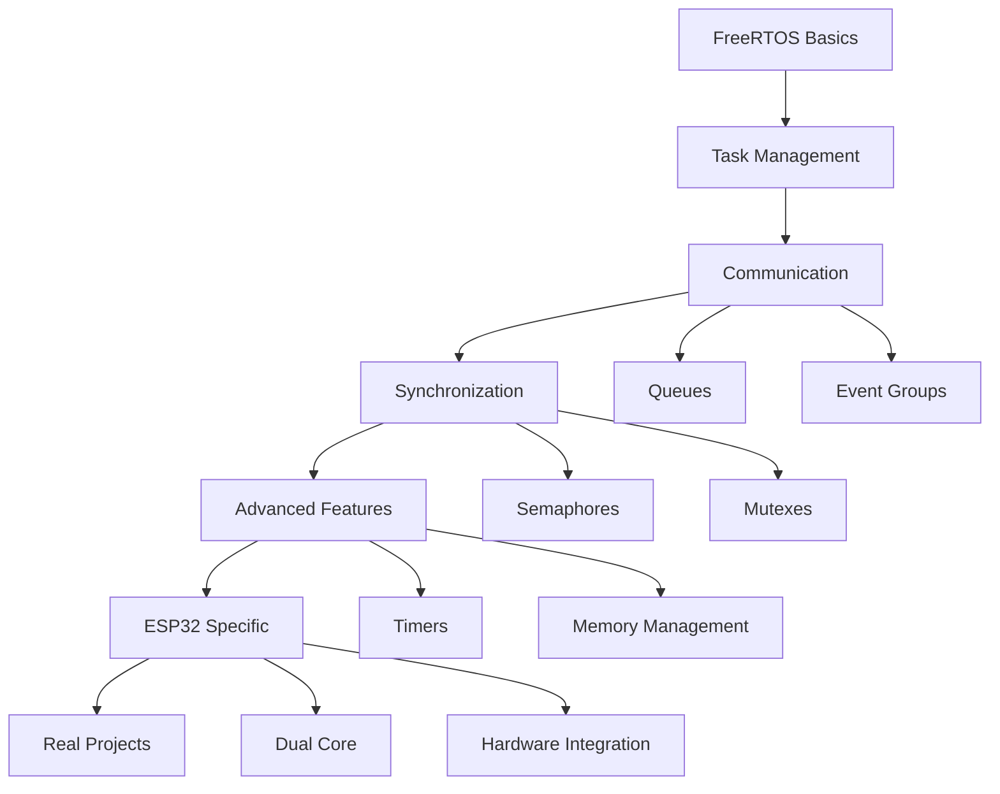

# FreeRTOS Learning Materials for ESP-IDF

เนื้อหาและใบงานการเรียนรู้ FreeRTOS สำหรับแพลตฟอร์ม ESP-IDF พัฒนาด้วย VS Code ผ่าน Terminal โดยใช้ `idf.py`

## 📚 เนื้อหาการเรียนรู้

### 0. [วิวัฒนาการของ Multitasking ในไมโครคอนโทรลเลอร์](00-multitasking-evolution/)
**⏱️ เวลา: 3 ชั่วโมง (ทฤษฎี 1 ชม. + ปฏิบัติ 2 ชม.)**
- ประวัติศาสตร์และวิวัฒนาการของ Multitasking
- ยุคเริ่มต้น: Single Task Real-time Systems
- การพัฒนาสู่ Time-Sharing Systems และผลกระทบที่เกิดขึ้น
- เทคนิคการทำ Multitasking: Cooperative, Preemptive, Round-Robin, Priority-based
- การเปรียบเทียบข้อดีข้อเสียของแต่ละเทคนิค
- การเกิดขึ้นของ RTOS และแนวทางแก้ไขปัญหา

### 1. [FreeRTOS Overview](01-freertos-overview/)
**⏱️ เวลา: 3 ชั่วโมง (ทฤษฎี 1 ชม. + ปฏิบัติ 2 ชม.)**
- ภาพรวมของ FreeRTOS และ ESP-IDF
- การติดตั้งและตั้งค่าสภาพแวดล้อมการพัฒนา
- โครงสร้างโปรเจกต์และคำสั่ง `idf.py` พื้นฐาน
- ตัวอย่างเบื้องต้นการสร้าง Task

### 2. [Tasks and Scheduling](02-tasks-and-scheduling/)
**⏱️ เวลา: 3 ชั่วโมง (ทฤษฎี 1 ชม. + ปฏิบัติ 2 ชม.)**
- การจัดการ Task และการกำหนด Priority
- อัลกอริทึมการจัดตารางเวลา (Scheduling)
- States ของ Task และการเปลี่ยนแปลง
- การจัดการ Stack Memory
- ตัวอย่างการสร้างและควบคุม Task หลายตัว

### 3. [Queues - Inter-Task Communication](03-queues/)
**⏱️ เวลา: 3 ชั่วโมง (ทฤษฎี 1 ชม. + ปฏิบัติ 2 ชม.)**
- การสื่อสารระหว่าง Task ด้วย Queue
- ประเภทของ Queue และการใช้งาน
- Blocking และ Non-blocking Operations
- ตัวอย่างระบบ Producer-Consumer
- การจัดการ Queue Sets

### 4. [Semaphores and Mutexes](04-semaphores/)
**⏱️ เวลา: 3 ชั่วโมง (ทฤษฎี 1 ชม. + ปฏิบัติ 2 ชม.)**
- Binary Semaphores สำหรับการ Synchronization
- Counting Semaphores สำหรับการจัดการทรัพยากร
- Mutexes สำหรับ Mutual Exclusion
- Priority Inheritance และการป้องกัน Priority Inversion
- ตัวอย่างการป้องกัน Race Conditions

### 5. [Software Timers](05-timers/)
**⏱️ เวลา: 3 ชั่วโมง (ทฤษฎี 1 ชม. + ปฏิบัติ 2 ชม.)**
- Software Timers และ Timer Service Task
- One-shot และ Periodic Timers
- การควบคุม Timers แบบ Dynamic
- ตัวอย่างระบบ Watchdog และ LED Pattern Controller
- Best Practices สำหรับ Timer Callbacks

### 6. [Event Groups](06-event-groups/)
**⏱️ เวลา: 3 ชั่วโมง (ทฤษฎี 1 ชม. + ปฏิบัติ 2 ชม.)**
- Event Groups สำหรับ Task Synchronization
- การรอ Event หลายตัวพร้อมกัน (ANY/ALL)
- Barrier Synchronization Pattern
- ตัวอย่างระบบ Startup Orchestration
- Multi-Sensor Data Fusion System

### 7. [Memory Management](07-memory-management/)
**⏱️ เวลา: 3 ชั่วโมง (ทฤษฎี 1 ชม. + ปฏิบัติ 2 ชม.)**
- การจัดการหน่วยความจำใน FreeRTOS
- Static vs Dynamic Memory Allocation
- ESP32 Memory Architecture และ Capabilities
- Memory Pools และการตรวจจับ Memory Leaks
- เทคนิคการ Monitor Memory Usage

### 8. [ESP-IDF Specific Features](08-esp-idf-specific/)
**⏱️ เวลา: 3 ชั่วโมง (ทฤษฎี 1 ชม. + ปฏิบัติ 2 ชม.)**
- Dual-Core SMP Support บน ESP32
- Task Affinity และการ Pin Task ไปยัง Core เฉพาะ
- Inter-Processor Communication (IPC)
- การผสานรวมกับ ESP32 Peripherals
- Performance Optimization และ Debugging

---

## ⏰ สรุปเวลาเรียนทั้งหมด

**รวมเวลาเรียนทั้งหมด: 27 ชั่วโมง**
- **ทฤษฎี**: 9 ชั่วโมง (9 หัวข้อ × 1 ชั่วโมง)
- **ปฏิบัติ**: 18 ชั่วโมง (9 หัวข้อ × 2 ชั่วโมง)

### แนะนำการจัดตารางเรียน
- **แบบ Intensive**: 9 วัน (วันละ 3 ชั่วโมง)
- **แบบ Weekly**: 9 สัดาห์ (สัปดาห์ละ 3 ชั่วโมง)
- **แบบ Bi-weekly**: 18 สัปดาห์ (สัปดาห์ละ 1.5 ชั่วโมง)

## 🛠️ การติดตั้งและตั้งค่า

### ข้อกำหนดเบื้องต้น
- ESP-IDF (version 4.4 หรือใหม่กว่า)
- Python 3.7+
- Git
- VS Code (ไม่จำเป็นต้องใช้ Extension)

### การติดตั้ง ESP-IDF
```bash
# 1. Clone ESP-IDF
git clone --recursive https://github.com/espressif/esp-idf.git

# 2. ติดตั้ง tools
cd esp-idf
./install.sh  # Linux/macOS
# หรือ install.bat สำหรับ Windows

# 3. ตั้งค่า environment
. ./export.sh  # Linux/macOS
# หรือ export.bat สำหรับ Windows
```

## 🚀 การเริ่มต้นใช้งาน

### การสร้างโปรเจกต์ใหม่
```bash
# สร้างโปรเจกต์
idf.py create-project my_freertos_project
cd my_freertos_project

# กำหนด target chip
idf.py set-target esp32

# ตั้งค่าโปรเจกต์
idf.py menuconfig

# Build
idf.py build

# Flash และ Monitor
idf.py flash monitor
```

### คำสั่ง idf.py ที่สำคัญ
```bash
# การ Build และ Flash
idf.py build                    # Build โปรเจกต์
idf.py clean                    # ลบไฟล์ build
idf.py fullclean               # ลบทั้งหมดรวมถึง config
idf.py flash                   # Flash firmware
idf.py monitor                 # เปิด serial monitor
idf.py flash monitor           # Flash และ monitor

# การตั้งค่า
idf.py menuconfig              # เปิดเมนูตั้งค่า
idf.py set-target esp32        # กำหนด target chip
idf.py reconfigure            # ตั้งค่าใหม่

# การวิเคราะห์
idf.py size                    # วิเคราะห์ขนาดไฟล์
idf.py size-components         # วิเคราะห์ขนาดตาม component
```

## 📖 โครงสร้างการเรียนรู้

### สำหรับผู้เริ่มต้น
1. เริ่มจาก [01-freertos-overview.md](01-freertos-overview.md)
2. ทำความเข้าใจ [02-tasks-and-scheduling.md](02-tasks-and-scheduling.md)
3. ศึกษา [03-queues.md](03-queues.md) สำหรับการสื่อสาร
4. เรียนรู้ [04-semaphores.md](04-semaphores.md) สำหรับ synchronization

### สำหรับผู้ที่มีพื้นฐาน
5. ศึกษา [05-timers.md](05-timers.md) สำหรับ timing operations
6. เรียนรู้ [06-event-groups.md](06-event-groups.md) สำหรับ complex synchronization
7. ทำความเข้าใจ [07-memory-management.md](07-memory-management.md)

### สำหรับผู้เชี่ยวชาญ
8. ศึกษา [08-esp-idf-specific.md](08-esp-idf-specific.md) สำหรับ ESP32 advanced features

## 🎯 แบบฝึกหัดและโปรเจกต์

แต่ละบทมีแบบฝึกหัดที่เป็นขั้นตอน:

### แบบฝึกหัดพื้นฐาน
- การสร้างและจัดการ Task
- การใช้ Queue สำหรับการส่งข้อมูล
- การใช้ Semaphore ป้องกัน Race Condition
- การสร้าง Timer สำหรับการควบคุมเวลา

### แบบฝึกหัดขั้นสูง
- ระบบ Multi-Sensor Data Fusion
- System Startup Orchestration
- Dual-Core Performance Optimization
- Memory Leak Detection System

### โปรเจกต์ตัวอย่าง
- IoT Data Logger
- Real-time Control System  
- Multi-Core Communication System
- Sensor Network Gateway

## 🔧 เครื่องมือพัฒนา

### VS Code Terminal Workflow
```bash
# เปิด Terminal ใน VS Code (Ctrl+`)
# ตั้งค่า ESP-IDF environment
. $HOME/esp/esp-idf/export.sh

# พัฒนาด้วยคำสั่งเหล่านี้
idf.py menuconfig  # ตั้งค่า
idf.py build       # Build
idf.py flash       # Flash
idf.py monitor     # Debug
```

### การ Debug และ Monitor
```bash
# Monitor พร้อม filter
idf.py monitor --print_filter="*:INFO"

# Monitor พร้อม timestamp
idf.py monitor --timestamps

# บันทึก output
idf.py monitor | tee output.log
```

## 📊 Diagrams และ Charts

เอกสารนี้รวม:
- **Mermaid Diagrams**: สำหรับ Architecture และ Flow Charts
- **State Diagrams**: สำหรับ Task States และ System States  
- **Sequence Diagrams**: สำหรับ Communication Flows
- **Gantt Charts**: สำหรับ Scheduling และ Timing Analysis

## 🔍 การแก้ปัญหา

### ปัญหาที่พบบ่อย
1. **Task Stack Overflow**: เพิ่มขนาด stack หรือเปิด stack monitoring
2. **Memory Leaks**: ใช้ heap monitoring และ debug tools
3. **Priority Inversion**: ใช้ mutex แทน binary semaphore
4. **Timing Issues**: ใช้ hardware timer แทน software delay

### Debug Tips
```c
// เปิด stack monitoring
CONFIG_FREERTOS_CHECK_STACKOVERFLOW_CANARY=y

// เปิด heap monitoring  
CONFIG_HEAP_POISONING_COMPREHENSIVE=y

// เปิด task monitoring
CONFIG_FREERTOS_USE_TRACE_FACILITY=y
CONFIG_FREERTOS_GENERATE_RUN_TIME_STATS=y
```

## 📚 เอกสารอ้างอิง

- [ESP-IDF Programming Guide](https://docs.espressif.com/projects/esp-idf/en/latest/)
- [FreeRTOS Documentation](https://www.freertos.org/Documentation/RTOS_book.html)
- [ESP32 Technical Reference](https://www.espressif.com/sites/default/files/documentation/esp32_technical_reference_manual_en.pdf)

## 🤝 การมีส่วนร่วม

หากพบข้อผิดพลาดหรือต้องการปรับปรุง:
1. เปิด Issue
2. เสนอ Pull Request
3. แชร์ตัวอย่างการใช้งาน

## 📝 License

เนื้อหานี้เผยแพร่ภายใต้ MIT License สามารถนำไปใช้เพื่อการศึกษาและพัฒนาได้อย่างอิสระ

---

## 🎓 การเรียนรู้เพิ่มเติม

### Roadmap การเรียนรู้


### Next Steps
หลังจากเรียนจบหลักสูตรนี้แล้ว แนะนำให้:
1. สร้างโปรเจกต์จริงที่ใช้หลายๆ feature รวมกัน
2. ศึกษา ESP32 advanced features เช่น Deep Sleep, OTA Update
3. เรียนรู้ IoT protocols เช่น MQTT, HTTP, WebSocket
4. พัฒนา Custom Components สำหรับใช้ซ้ำ

**Happy Learning! 🚀**